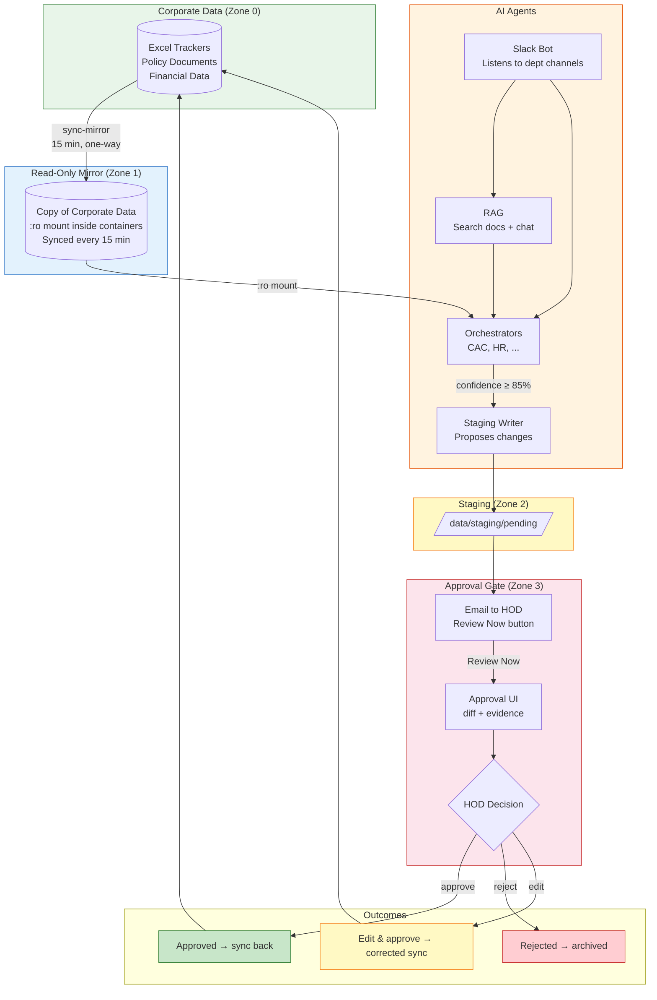
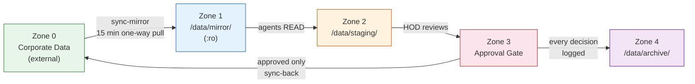
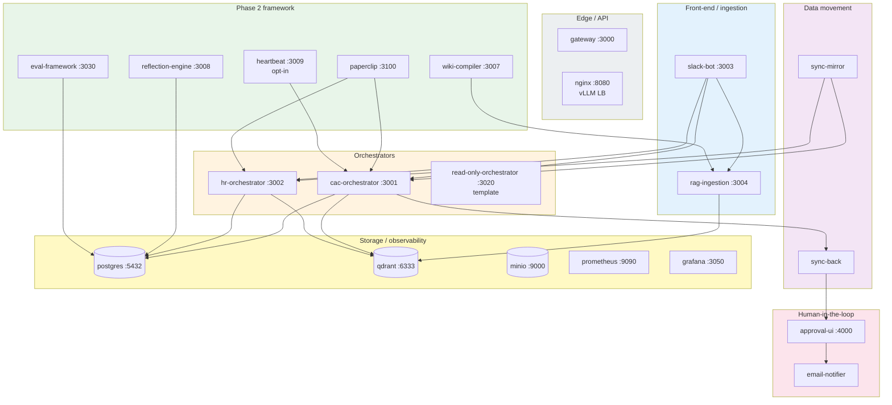

# Corporate AI Agent System

Multi-agent AI system for Brooker Group committee operations. **Phase 1** delivers the Capital Allocation & ALCO Committee (CAC) end-to-end loop and HR. **Phase 2** rolls out 9 more departments (Finance, Risk, Legal, IT, Comms, IC, CIO, VCC, IB) on a shared onboarding framework.

> **Status (2026-05-13):** Phase 1 Stages 1–9 complete · Phase 1 closeout (UAT + go-live) pending · Phase 2 framework (Stage 10) live · Stages 11–19 scaffolded.
>
> See [`docs/Implementation.md`](docs/Implementation.md) for the canonical progress checklist and [`docs/superpowers/specs/2026-03-25-architecture-design.md`](docs/superpowers/specs/2026-03-25-architecture-design.md) for the architecture spec.

## Department agent map

```mermaid
flowchart TB
    CEO["<b>CEO Agent</b><br/><i>Root supervisor</i><br/>Strategic Retreat Plan · MD&A<br/>Leadership monthly · Board minutes<br/>Corporate info (Brooker, BICL, Arun)"]

    subgraph PHASE1["Phase 1 — live"]
        CAC["<b>CAC Committee</b><br/><i>CFO (lead) · Liquidity · Capital · ALM · Funding · Escalation</i><br/>ALCO Tracker · Capital plan<br/>Funding facilities · Covenants"]
        HR["<b>HR Department</b><br/><i>CHRO Agent</i><br/>recruitment · compensation · compliance<br/>HR policies · Remuneration · SOPs"]
    end

    subgraph PHASE2["Phase 2 — scaffolded (Stages 11–19)"]
        FIN["<b>Finance</b> (S11, write)<br/><i>CFO Agent</i><br/>Annual report · Financials<br/>Networth · BG/Coins reports"]
        RISK["<b>Risk Committee</b> (S12, read)<br/><i>CRO Agent</i><br/>Risk policy · AML co-owner"]
        LEGAL["<b>Legal</b> (S13, read)<br/><i>CLO Agent</i><br/>Legal opinions · AML<br/>Contract templates"]
        IT["<b>IT</b> (S14, read)<br/><i>CTO Agent</i><br/>IT policies · IT SOPs"]
        COMMS["<b>Communications</b> (S15, read)<br/><i>Comms Agent (incl. Branding)</i><br/>IR updates · Press · Brand guidelines"]
        IC["<b>IC Committee</b> (S16, read)<br/><i>IC Chair Agent</i><br/>IC minutes · Investment policy · memos"]
        CIO["<b>CIO Office</b> (S17, write)<br/><i>CIO Agent</i><br/>NAV reports · PPM · Custodian docs"]
        VCC["<b>VCC</b> (S18, write)<br/><i>VCC Head Agent</i><br/>Client list · NAV · Subscriptions<br/>VCC contracts · DD · memos"]
        IB["<b>IB</b> (S19, read)<br/><i>IB Agent</i><br/>Structured loans · Deal docs"]
    end

    CEO --> CAC
    CEO --> HR
    CEO --> FIN
    CEO --> RISK
    CEO --> LEGAL
    CEO --> IT
    CEO --> COMMS
    CEO --> IC
    CEO --> CIO
    CEO --> VCC
    CEO --> IB

    classDef live fill:#dae8fc,stroke:#6c8ebf,stroke-width:2px,color:#000
    classDef planned fill:#f5f5f5,stroke:#9e9e9e,color:#555
    classDef root fill:#ffffff,stroke:#000,stroke-width:2px,color:#000
    class CAC,HR live
    class FIN,RISK,LEGAL,IT,COMMS,IC,CIO,VCC,IB planned
    class CEO root
    style PHASE1 fill:#e3f2fd,stroke:#1565c0
    style PHASE2 fill:#fafafa,stroke:#bdbdbd,stroke-dasharray: 5 5
```



**Capability tiers:** *write* = stages proposals to corporate Excel via approval gate · *read* = query-only with citations. Cross-read access (which departments each agent can search across) is configured per-dept in [`config/departments.json`](config/departments.json). Source: [`docs/diagrams/department-agent-map.drawio`](docs/diagrams/department-agent-map.drawio).

## How it works



**Key principle:** Agents read a mirror copy of corporate data and never write to it. Every change requires human approval before sync-back.

## Data zones



Docker enforces Zone 1 as `:ro` so agent containers cannot write the mirror even by mistake.

## Service map



## Quick start

```bash
# 1. Copy environment config
cp .env.example .env
# Edit .env with your values

# 2. Start infrastructure (local dev)
docker compose -f docker-compose.yml -f docker-compose.dev.yml up -d

# 3. Verify health
bash scripts/healthcheck.sh
```

## Services

| Service | Port | Description |
|---------|------|-------------|
| gateway | 3000 | API gateway |
| cac-orchestrator | 3001 | LangGraph CAC agent graph |
| hr-orchestrator | 3002 | LangGraph HR agent graph (query-only in Phase 1) |
| slack-bot | 3003 | Slack Events API listener; multi-dept channel routing |
| rag-ingestion | 3004 | Document + message + vault ingestion |
| wiki-compiler | 3007 | Karpathy-style: events → structured Obsidian articles |
| reflection-engine | 3008 | Nightly memory promotion + skill update proposals |
| heartbeat | 3009 | Opt-in proactive agent layer |
| read-only-orchestrator | 3020 | Template image for read-only Phase 2 depts |
| eval-framework | 3030 | Golden-path regression suite |
| approval-ui | 4000 | HOD approval dashboard (mobile-responsive) |
| paperclip | 3100 | Agent orchestration shell (Node.js) |
| postgres | 5432 | Database |
| qdrant | 6333 / 6334 | Vector store (REST / gRPC) |
| nginx | 8080 | vLLM load balancer (Spark A + B) |
| minio | 9000 | Document store |
| prometheus | 9090 | Metrics |
| grafana | 3050 | Dashboards |

`sync-mirror`, `sync-back`, `email-notifier` are internal (no exposed ports).

## Tech stack

- **LLM:** Qwen3.5 122B Q8 via vLLM on dual DGX Spark (nginx least-connections LB)
- **Embeddings:** Qwen3.5 9B via vLLM (Spark A only)
- **Agents:** LangGraph 0.2+ with PostgresSaver checkpointer
- **RAG:** LlamaIndex 0.11+ chunking + Qdrant 1.12+ vector store
- **Per-dept second brain:** Obsidian vault, watched by `rag-ingestion`
- **Chat:** Slack Bolt (Python)
- **API services:** FastAPI + Uvicorn
- **Database:** PostgreSQL 16 (10 migrations)
- **Validation:** Pydantic v2
- **Containers:** Docker Compose
- **Worker shell:** Paperclip (Node.js 20+)

## Development

```bash
# Run tests
python -m pytest tests/ -v

# Lint
ruff check .

# Type check
mypy services/
```

## Documentation

- [PRD](PRD.md) — Product Requirements Document v2.2
- [Architecture Spec](docs/superpowers/specs/2026-03-25-architecture-design.md) — living architecture document
- [Implementation Progress](docs/Implementation.md) — canonical stage-by-stage checklist
- [Phase 2 framework spec](docs/superpowers/specs/2026-04-28-stage10-phase2-framework-design.md) — department onboarding framework
- [Per-dept plans (Stages 11–19)](docs/superpowers/plans/) — one plan/spec pair per upcoming department
