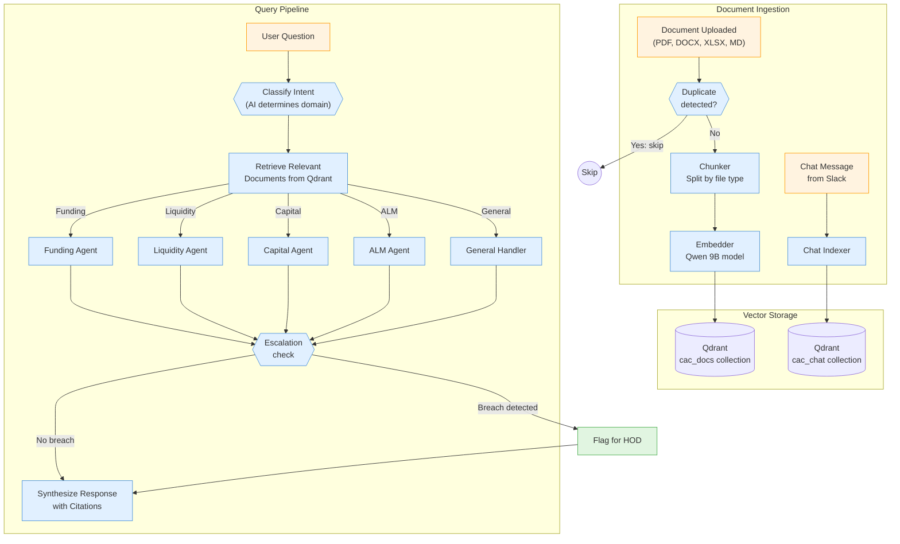
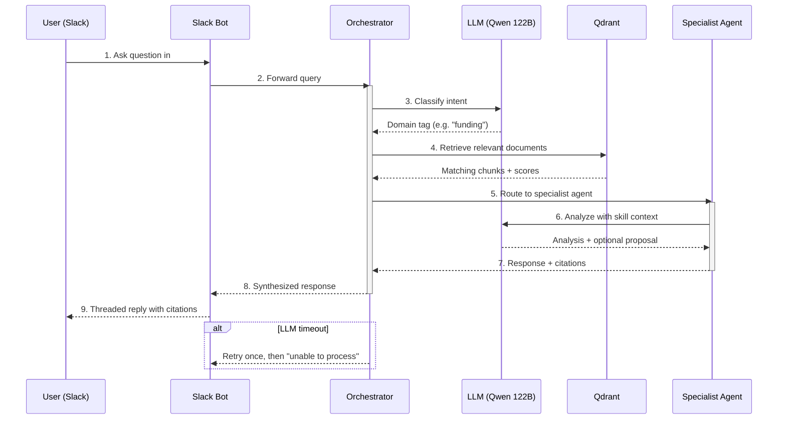

# Stage 2 (Completion) + Stage 4: RAG Ingestion & CAC Orchestrator

**Version:** 1.0
**Date:** 2026-03-30
**PRD Reference:** PRD.md v2.2
**Architecture Spec:** docs/superpowers/specs/2026-03-25-architecture-design.md
**Status:** Draft

---

## System Overview

### Document Ingestion & Query Pipeline



> **Legend:** 🔵 Blue = Automated services · 🟢 Green = Human actions · 🟠 Orange = External inputs

### End-to-End Query Flow



## Overview

This plan covers two sequential phases:

1. **Phase 1 — Stage 2 Completion:** Finish the RAG ingestion service (`services/rag-ingestion/`). Config and Pydantic models already exist. Need to build: chunker, embedder, qdrant_store, chat_indexer, vault_watcher, FastAPI main.py, Dockerfile, and tests.

2. **Phase 2 — Stage 4:** Build the CAC Orchestrator (`services/cac-orchestrator/`). LangGraph StateGraph with classify_intent → retrieve_context → specialist_agent → escalation_check → synthesise_response pipeline. PostgresSaver checkpointer. Only funding_agent is fully implemented; other 3 agents are stubs.

**Total tasks:** 41 file-level tasks (14 Stage 2 + 27 Stage 4)

**Team agents:** backend (service-builder), qa (tester)

---

## Prerequisites

- Stage 1 infrastructure running (postgres, qdrant, minio, nginx, gateway)
- Stage 3 slack-bot complete (47 tests passing)
- Python 3.11+ development environment
- No GPU/vLLM access required (all LLM calls mocked in tests)

---

## Phase 1: Stage 2 Completion — RAG Ingestion Service

### What Already Exists

| File | Status | Notes |
|------|--------|-------|
| `services/rag-ingestion/src/config.py` | Complete | RAGSettings with all env vars |
| `services/rag-ingestion/src/models.py` | Complete | 6 Pydantic models for API I/O |
| `services/rag-ingestion/requirements.txt` | Complete | 17 dependencies listed |
| `services/rag-ingestion/src/__init__.py` | Check | May need creation |

### Task List — Stage 2

#### T2.1: `services/rag-ingestion/src/chunker.py`
**Purpose:** Document chunking pipeline for PDF, DOCX, XLSX, Markdown, plain text.
**Dependencies:** None (uses config.py settings)
**Implementation:**
- `DocumentChunker` class initialized with `RAGSettings`
- Uses LlamaIndex `SentenceSplitter` with chunk_size=512, overlap=128 from config
- `async chunk_file(file_path: Path, doc_type: str) -> list[TextNode]`
- File type handlers:
  - PDF: PyMuPDF (`fitz`) → extract text per page, chunk
  - DOCX: python-docx → extract paragraphs, chunk
  - XLSX: openpyxl → extract per-sheet, preserve tab name + cell refs in metadata
  - Markdown/Text: direct text chunking
- Each `TextNode` carries metadata: `source_file`, `page_number`, `section`, `doc_type`, `department`
- Error handling: log and skip unreadable files, never crash the pipeline
**Exit criteria:** Chunker produces TextNodes with correct metadata for all 5 file types.

#### T2.2: `services/rag-ingestion/src/embedder.py`
**Purpose:** Async wrapper for vLLM embedding endpoint (Qwen 9B).
**Dependencies:** config.py (VLLM_EMBED_URL)
**Implementation:**
- `Embedder` class with `httpx.AsyncClient`
- `async embed_texts(texts: list[str]) -> list[list[float]]`
- POST to `{VLLM_EMBED_URL}/embeddings` with OpenAI-compatible payload:
  ```json
  {"model": "qwen-embed", "input": ["text1", "text2"]}
  ```
- Batch support: splits large lists into batches of 32 (configurable)
- Returns list of float vectors (dimension determined by model)
- Retry with tenacity (3 attempts, exponential backoff)
- `async get_dimension() -> int` — embed a test string, return vector length (for collection creation)
**Exit criteria:** Embeds text lists, handles batching, retries on failure.

#### T2.3: `services/rag-ingestion/src/qdrant_store.py`
**Purpose:** Async Qdrant client wrapper for CRUD operations on vector collections.
**Dependencies:** config.py (QDRANT_HOST, QDRANT_REST_PORT), embedder.py
**Implementation:**
- `QdrantStore` class with `qdrant_client.AsyncQdrantClient`
- Collections: `cac_docs`, `cac_chat`, `cac_knowledge`, `shared_policies`
- `async ensure_collections(vector_size: int)` — create collections if missing, with cosine distance
- `async upsert_chunks(collection: str, nodes: list[TextNode], vectors: list[list[float]])` — batch upsert with payload metadata
- `async search(collection: str, query_vector: list[float], limit: int = 8, score_threshold: float = 0.70, filters: dict | None = None) -> list[dict]` — filtered vector search
- `async delete_by_file(collection: str, file_path: str)` — delete all points matching source_file
- `async get_collection_info(collection: str) -> dict` — point count, status
- Filter support: department, doc_type, date range via Qdrant filter conditions
**Exit criteria:** CRUD operations work against Qdrant. Collections auto-created. Filtering works.

#### T2.4: `services/rag-ingestion/src/chat_indexer.py`
**Purpose:** Index Slack messages into `cac_chat` collection.
**Dependencies:** embedder.py, qdrant_store.py
**Implementation:**
- `ChatIndexer` class
- `async index_message(text: str, author: str, channel_id: str, timestamp: str, thread_ts: str | None, dept: str) -> str`
- Message ID = SHA-256(channel_id + timestamp) for dedup
- Before upserting: check if point with same message_id exists → skip if so
- Metadata payload: author, channel_id, timestamp, thread_ts, dept, indexed_at
- Returns message_id
**Exit criteria:** Messages indexed with dedup. Metadata preserved for retrieval filtering.

#### T2.5: `services/rag-ingestion/src/vault_watcher.py`
**Purpose:** Watches Obsidian vault directory for .md file changes, ingests into `cac_knowledge`.
**Dependencies:** chunker.py, embedder.py, qdrant_store.py, config.py
**Implementation:**
- `VaultWatcher` class using `watchdog.observers.Observer`
- Watches `RAGSettings.obsidian_vault_path` for .md file creates/modifies
- Debounce: configurable delay (default 5s) before processing — prevents rapid re-ingestion
- On file event:
  1. Check `ingested_documents` Postgres table for file hash
  2. If hash unchanged → skip (dedup)
  3. If new/changed → delete old vectors → chunk → embed → upsert to `cac_knowledge`
  4. Update `ingested_documents` table with new hash + timestamp
- `async start()` / `async stop()` lifecycle methods
- Note: Class built here; Docker mount and config wiring done in Stage 6
**Exit criteria:** Vault .md changes detected, debounced, deduped, and ingested into Qdrant.

#### T2.6: `services/rag-ingestion/src/main.py`
**Purpose:** FastAPI application with document/message ingestion endpoints.
**Dependencies:** All above modules
**Implementation:**
- FastAPI app with lifespan context manager:
  - Init: create Embedder, QdrantStore, ChatIndexer, DocumentChunker
  - Get embed dimension, ensure collections exist
  - Shutdown: close clients
- Endpoints:
  - `POST /ingest/document` — multipart file upload via FastAPI `UploadFile`
    - Note: existing `IngestDocumentRequest` model (file_path field) is for internal use; endpoint accepts multipart upload matching slack-bot's `RAGIngestionClient.upload_file()` contract
    - Save to temp file → chunk → embed → upsert to specified collection
    - Returns `IngestDocumentResponse` (status, chunks count, file_hash)
  - `POST /ingest/message` — JSON body `IngestMessageRequest`
    - Index via ChatIndexer
    - Returns `IngestMessageResponse` (indexed bool, message_id)
  - `GET /health` — checks Qdrant connectivity + vLLM embed endpoint
    - Returns `HealthResponse` with service statuses
  - `GET /collections` — lists all Qdrant collections with point counts
- Structured logging via structlog
- Error handling: return 500 with detail on ingestion failures
**Exit criteria:** All 4 endpoints work. Document upload → chunks in Qdrant. Message → indexed in cac_chat.

#### T2.7: `services/rag-ingestion/Dockerfile`
**Purpose:** Container image for rag-ingestion service.
**Implementation:**
- `FROM python:3.11-slim`
- Install system deps (for PyMuPDF, etc.)
- Copy requirements.txt, pip install
- Copy src/
- CMD: `uvicorn src.main:app --host 0.0.0.0 --port 3004`
- HEALTHCHECK: curl /health
**Exit criteria:** Docker build succeeds. Container starts and responds on port 3004.

#### T2.8: Uncomment rag-ingestion in `docker-compose.yml`
**Purpose:** Enable rag-ingestion service in Docker stack.
**Implementation:**
- Uncomment the rag-ingestion service block
- Verify volumes: mirror_data:/data/mirror:ro
- Verify env vars: VLLM_EMBED_URL, QDRANT_HOST, POSTGRES_DSN
- Verify depends_on: postgres, qdrant
- Add `extra_hosts: ["host.docker.internal:host-gateway"]` for vLLM embed access
**Exit criteria:** `docker compose up rag-ingestion` starts successfully with health check passing.

#### T2.9: `tests/unit/rag_ingestion/test_chunker.py`
**Purpose:** Unit tests for DocumentChunker.
**Implementation:**
- Test PDF chunking (mock fitz): verify chunks, metadata, page numbers
- Test DOCX chunking (mock python-docx): verify paragraph extraction
- Test XLSX chunking (mock openpyxl): verify per-sheet chunking, tab names in metadata
- Test Markdown chunking: verify section splitting
- Test unsupported file type: graceful error handling
- Test empty file: returns empty list
- Test chunk size and overlap: verify within configured bounds
**Exit criteria:** All chunker paths tested including edge cases.

#### T2.10: `tests/unit/rag_ingestion/test_embedder.py`
**Purpose:** Unit tests for Embedder.
**Implementation:**
- Mock httpx responses for /v1/embeddings endpoint
- Test single text embedding: returns correct vector
- Test batch embedding: splits into batches of 32
- Test retry on failure: tenacity retries 3x
- Test get_dimension: returns vector length
- Test timeout handling: proper error raised
**Exit criteria:** All embedder paths tested with mocked vLLM.

#### T2.11: `tests/unit/rag_ingestion/test_qdrant_store.py`
**Purpose:** Unit tests for QdrantStore.
**Implementation:**
- Mock qdrant_client.AsyncQdrantClient
- Test ensure_collections: creates missing collections
- Test upsert_chunks: correct payload structure
- Test search: returns filtered results above threshold
- Test delete_by_file: correct filter applied
- Test get_collection_info: returns point count
**Exit criteria:** All Qdrant operations tested with mocked client.

#### T2.12: `tests/unit/rag_ingestion/test_chat_indexer.py`
**Purpose:** Unit tests for ChatIndexer.
**Implementation:**
- Mock embedder and qdrant_store
- Test: message indexing with correct metadata (author, channel, timestamp)
- Test: dedup — same channel+timestamp → skipped
- Test: different channel+same timestamp → indexed (different message_id)
- Test: empty text handling
- Test: thread_ts preserved in metadata
**Exit criteria:** All chat indexer paths tested including dedup edge cases.

#### T2.13: `tests/unit/rag_ingestion/test_vault_watcher.py`
**Purpose:** Unit tests for VaultWatcher.
**Implementation:**
- Mock watchdog observer, embedder, qdrant_store, Postgres (ingested_documents table)
- Test: new .md file → chunk → embed → upsert to cac_knowledge
- Test: unchanged file hash → skipped (dedup)
- Test: modified file → delete old vectors → re-ingest
- Test: debounce — rapid file events consolidated into single ingestion
- Test: non-.md file → ignored
- Test: start/stop lifecycle
**Exit criteria:** Vault watcher logic tested including debounce and dedup.

#### T2.14: `tests/integration/test_rag_pipeline.py`
**Purpose:** Integration test for full ingestion pipeline.
**Implementation:**
- Mock vLLM embed endpoint (httpx mock)
- Mock Qdrant client
- Test: upload PDF → chunker → embedder → qdrant_store → search returns chunks
- Test: index message → chat_indexer → search returns message
- Test: duplicate message → skipped (dedup)
- Test: health endpoint returns all services status
**Exit criteria:** Full pipeline flows tested end-to-end with mocked external services.

---

## Phase 2: Stage 4 — CAC Orchestrator Service

### Architecture

```
POST /query
    │
    ▼
┌─────────────┐
│ classify_    │  Qwen 122B classifies query intent
│ intent       │  → funding|liquidity|capital|alm|general
└──────┬──────┘
       │
       ▼
┌─────────────┐
│ retrieve_    │  Qdrant search: cac_docs + cac_chat + cac_knowledge + shared_policies
│ context      │  → top-8 chunks, score ≥ 0.70
└──────┬──────┘
       │
       ▼ (conditional routing based on intent)
┌─────────────┐  ┌─────────────┐  ┌─────────────┐  ┌─────────────┐
│ funding_    │  │ liquidity_  │  │ capital_    │  │ alm_        │
│ agent       │  │ agent (stub)│  │ agent (stub)│  │ agent (stub)│
└──────┬──────┘  └──────┬──────┘  └──────┬──────┘  └──────┬──────┘
       │                │                │                │
       └────────────────┴────────────────┴────────────────┘
                                │
                                ▼
                    ┌─────────────────┐
                    │ escalation_     │  Stub: pass-through
                    │ check           │  (full in Stage 5)
                    └────────┬────────┘
                             │
                             ▼
                    ┌─────────────────┐
                    │ synthesise_     │  Format answer + citations
                    │ response        │  Qwen 122B
                    └────────┬────────┘
                             │
                             ▼
                         RETURN AgentState
```

### Task List — Stage 4

#### T4.0: Package `__init__.py` files
**Purpose:** Create all necessary `__init__.py` files for Python package imports.
**Implementation:**
- `services/cac-orchestrator/src/__init__.py`
- `services/cac-orchestrator/src/agents/__init__.py`
- `services/cac-orchestrator/src/tools/__init__.py`
- `services/cac-orchestrator/src/skills/__init__.py`
- `tests/unit/cac_orchestrator/__init__.py`
**Exit criteria:** All packages importable. pytest discovers tests.

#### T4.1: `services/cac-orchestrator/src/config.py`
**Purpose:** Orchestrator settings from environment variables.
**Dependencies:** None
**Implementation:**
- `OrchestratorSettings(BaseSettings)` with Pydantic v2:
  - `vllm_large_url: str` — default `http://nginx:8080/v1`
  - `vllm_embed_url: str` — default `http://host.docker.internal:8002/v1`
  - `vllm_model: str` — default `qwen3.5-122b`
  - `qdrant_host: str` — default `qdrant`
  - `qdrant_rest_port: int` — default `6333`
  - `postgres_dsn: str` — Postgres connection string for checkpointer
  - `rag_service_url: str` — default `http://rag-ingestion:3004`
  - `confidence_threshold: float` — default `0.85`
  - `retrieval_top_k: int` — default `8`
  - `retrieval_score_threshold: float` — default `0.70`
  - `skills_dir: str` — default `/app/skills/cac`
  - `log_level: str` — default `INFO`
- No env_prefix (matches existing pattern: RAGSettings, SyncMirrorSettings use unprefixed env vars)
**Exit criteria:** Settings load from env vars with sensible defaults.

#### T4.2: `services/cac-orchestrator/src/state.py`
**Purpose:** LangGraph AgentState TypedDict defining the graph's state schema.
**Dependencies:** None
**Implementation:**
```python
from typing import TypedDict

class Citation(TypedDict):
    source: str
    page: int | None
    section: str | None
    score: float
    snippet: str

class ProposedChange(TypedDict):
    file: str
    tab: str
    cell: str
    old_value: str | None
    new_value: str
    confidence: float
    reasoning: str

class Escalation(TypedDict):
    type: str
    severity: str
    description: str
    notify: list[str]

class AgentState(TypedDict):
    query: str
    user_id: str
    channel_id: str
    thread_ts: str | None
    intent: str
    intent_confidence: float
    context: list[dict]
    agent_response: str
    citations: list[Citation]
    proposed_changes: list[ProposedChange]
    escalations: list[Escalation]
    confidence: float
    error: str | None
```
**Exit criteria:** TypedDict importable and usable by LangGraph.

#### T4.3: `services/cac-orchestrator/src/llm_client.py`
**Purpose:** Shared async OpenAI-compatible client for Qwen 122B via vLLM.
**Dependencies:** config.py
**Implementation:**
- `LLMClient` class wrapping `openai.AsyncOpenAI(base_url=settings.vllm_large_url)`
- `async chat(messages: list[dict], temperature: float = 0.1, max_tokens: int = 2048) -> str`
- `async chat_json(messages: list[dict], temperature: float = 0.1) -> dict` — parse JSON response
- Retry with tenacity (3 attempts, exponential backoff, 30s timeout)
- Structured logging of request/response metadata (not content — too large)
- Singleton pattern: one client per app lifecycle
**Exit criteria:** Client sends requests to vLLM, handles retries and timeouts.

#### T4.4: `services/cac-orchestrator/src/tools/rag_retrieve.py`
**Purpose:** Tool for querying Qdrant vector collections.
**Dependencies:** config.py
**Implementation:**
- `RAGRetriever` class with `qdrant_client.AsyncQdrantClient`
- `async retrieve(query_vector: list[float], collections: list[str] = ["cac_docs", "cac_chat", "cac_knowledge", "shared_policies"], top_k: int = 8, score_threshold: float = 0.70, filters: dict | None = None) -> list[dict]`
- Queries multiple collections, merges results, sorts by score
- Returns list of dicts: `{text, source, page, section, score, collection}`
- Uses embedder to convert query text to vector (calls vLLM embed endpoint)
- `async retrieve_by_text(query: str, ...) -> list[dict]` — convenience method that embeds query first
**Exit criteria:** Retrieves relevant chunks from Qdrant with score filtering.

#### T4.5: `services/cac-orchestrator/src/tools/chat_search.py`
**Purpose:** Tool for searching Slack chat history in Qdrant.
**Dependencies:** rag_retrieve.py (uses same Qdrant client)
**Implementation:**
- `ChatSearcher` class
- `async search(query: str, channel_id: str | None = None, limit: int = 5) -> list[dict]`
- Searches `cac_chat` collection with optional channel filter
- Returns: `{text, author, channel_id, timestamp, thread_ts, score}`
- Distinct from rag_retrieve: focused on chat context, different metadata schema
**Exit criteria:** Chat history searchable with channel filtering.

#### T4.6: `services/cac-orchestrator/src/tools/excel_schema.py`
**Purpose:** Navigate ALCO Tracker Excel structure using config/excel_schema/alco_tracker.json.
**Dependencies:** config.py
**Implementation:**
- `ExcelSchema` class
- Loads `alco_tracker.json` at init (handles empty file gracefully)
- `get_sheets() -> list[str]` — list all sheet/tab names
- `get_columns(sheet: str) -> list[str]` — list column headers for a sheet
- `get_cell_ref(sheet: str, column: str, row_identifier: str) -> str` — resolve cell reference
- `get_schema_summary() -> str` — human-readable summary for LLM context
- Returns "Schema not yet configured" when alco_tracker.json is empty
- Stage 4: stub functionality (schema file is empty). Stage 5: full navigation with real data
**Exit criteria:** Loads schema, handles empty file, provides navigation methods.

#### T4.7: `services/cac-orchestrator/src/tools/staging_writer.py`
**Purpose:** Create staging proposal manifests in /data/staging/pending/.
**Dependencies:** config.py, state.py (ProposedChange type)
**Implementation:**
- `StagingWriter` class
- `async write_proposal(change: ProposedChange, agent: str) -> str` — writes manifest JSON
- Manifest follows schema from CLAUDE.md:
  ```json
  {
    "id": "chg_XXXX",
    "agent": "funding-agent",
    "file": "ALCO_Tracker.xlsx",
    "tab": "Funding Facilities",
    "cell": "E8",
    "old_value": null,
    "new_value": "3.15",
    "source": "...",
    "confidence": 0.91,
    "reasoning": "...",
    "status": "pending"
  }
  ```
- Writes to `/data/staging/pending/{id}.json`
- Validates manifest before writing (Pydantic model)
- Returns proposal ID
- Stage 4: stub — logs intent but does NOT write files (full in Stage 5)
- CRITICAL: Never writes to /data/mirror/ — enforced at code level + Docker :ro
**Exit criteria:** Stub logs proposal intent. Full write deferred to Stage 5.

#### T4.8: `services/cac-orchestrator/src/skills/loader.py`
**Purpose:** Load SKILL.md files from skills/cac/ directory for agent system prompts.
**Dependencies:** config.py
**Implementation:**
- `SkillLoader` class
- `load_skill(skill_name: str) -> str | None` — reads SKILL.md content
- `load_all_skills() -> dict[str, str]` — loads all available skills
- Parses SKILL.md format: extracts sections (Mandate, Domain Knowledge, etc.)
- Falls back to None when skill file doesn't exist (Stage 7 creates them)
- Caches loaded skills in memory (reload on explicit request)
**Exit criteria:** Loads SKILL.md files when available, returns None when not.

#### T4.9: `services/cac-orchestrator/src/agents/funding.py`
**Purpose:** First full specialist agent — Funding Facilities analysis.
**Dependencies:** llm_client.py, tools/rag_retrieve.py, tools/chat_search.py, skills/loader.py, state.py
**Implementation:**
- `async funding_agent(state: AgentState) -> AgentState` — LangGraph node function
- System prompt:
  1. Load funding SKILL.md via SkillLoader (if available)
  2. Fallback to hardcoded default: "You are the Funding Facilities specialist for the CAC committee. Analyze funding facility utilization, interest rate exposure, covenant compliance, and facility renewals."
- Process:
  1. Build prompt with query + context chunks + chat history
  2. Call Qwen 122B via LLMClient
  3. Parse response: extract answer text, citations, confidence score
  4. Populate state: agent_response, citations, confidence
  5. If confidence >= threshold: prepare proposed_changes (empty list in Stage 4)
- Structured output: expects JSON response from LLM with answer + citations
- Error handling: on LLM failure, set error in state and return
**Exit criteria:** Processes funding queries, returns structured response with citations.

#### T4.10: `services/cac-orchestrator/src/agents/liquidity.py`
**Purpose:** Stub agent for liquidity analysis (implemented in Stage 5).
**Dependencies:** state.py
**Implementation:**
- `async liquidity_agent(state: AgentState) -> AgentState`
- Returns state with:
  - `agent_response = "Liquidity analysis agent is not yet implemented. Available in Stage 5."`
  - `citations = []`
  - `confidence = 0.0`
**Exit criteria:** Returns stub response without error.

#### T4.11: `services/cac-orchestrator/src/agents/capital.py`
**Purpose:** Stub agent for capital allocation analysis (implemented in Stage 5).
**Implementation:** Same pattern as T4.10 with capital-specific message.

#### T4.12: `services/cac-orchestrator/src/agents/alm.py`
**Purpose:** Stub agent for ALM review (implemented in Stage 5).
**Implementation:** Same pattern as T4.10 with ALM-specific message.

#### T4.13: `services/cac-orchestrator/src/agents/escalation.py`
**Purpose:** Stub escalation check node (implemented in Stage 5).
**Dependencies:** state.py
**Implementation:**
- `async escalation_check(state: AgentState) -> AgentState`
- Pass-through: returns state unchanged
- Stage 5 implementation: checks escalation_rules.json triggers, posts to #escalations Slack channel
**Exit criteria:** Pass-through node, graph topology complete.

#### T4.14: `services/cac-orchestrator/src/router.py`
**Purpose:** classify_intent node — determines query type using Qwen 122B.
**Dependencies:** llm_client.py, state.py
**Implementation:**
- `async classify_intent(state: AgentState) -> AgentState`
- Builds classification prompt:
  ```
  Classify this query into one of: funding, liquidity, capital, alm, general.
  Return JSON: {"intent": "...", "confidence": 0.0-1.0, "reasoning": "..."}
  Query: {state["query"]}
  ```
- Calls LLMClient.chat_json()
- Parses response, sets state["intent"] and state["intent_confidence"]
- Fallback: if parsing fails, set intent="general" with confidence=0.5
- `route_by_intent(state: AgentState) -> str` — conditional edge function
  - Returns node name based on intent: "funding_agent", "liquidity_agent", etc.
  - Default: "synthesise_response" for "general" queries (skips specialist, goes direct to synthesis)
**Exit criteria:** Classifies intents correctly. Route function returns valid node names.

#### T4.15: `services/cac-orchestrator/src/synthesiser.py`
**Purpose:** synthesise_response node — formats final answer with citations.
**Dependencies:** llm_client.py, state.py
**Implementation:**
- `async synthesise_response(state: AgentState) -> AgentState`
- If state has error → format error message, return
- If agent_response is stub → pass through as-is
- Otherwise: use Qwen 122B to polish response:
  - Input: raw agent_response + citations + context
  - Output: formatted answer with inline citation markers [1], [2], etc.
  - Append citation list with sources
- Sets final state["agent_response"] with formatted text
- Preserves state["confidence"] from agent
**Exit criteria:** Produces formatted response with numbered citations.

#### T4.16: `services/cac-orchestrator/src/graph.py`
**Purpose:** Assembles the LangGraph StateGraph with all nodes and edges.
**Dependencies:** All above modules
**Implementation:**
- `build_graph(settings: OrchestratorSettings) -> CompiledGraph`
- Creates `StateGraph(AgentState)`
- Adds nodes:
  - `classify_intent` (router.classify_intent)
  - `retrieve_context` (local function using RAGRetriever)
  - `funding_agent` (agents.funding.funding_agent)
  - `liquidity_agent` (agents.liquidity.liquidity_agent)
  - `capital_agent` (agents.capital.capital_agent)
  - `alm_agent` (agents.alm.alm_agent)
  - `escalation_check` (agents.escalation.escalation_check)
  - `synthesise_response` (synthesiser.synthesise_response)
- Edges:
  - `START → classify_intent`
  - `classify_intent → retrieve_context`
  - `retrieve_context → [conditional: route_by_intent]` — routes to one of 4 agents
  - `funding_agent → escalation_check`
  - `liquidity_agent → escalation_check`
  - `capital_agent → escalation_check`
  - `alm_agent → escalation_check`
  - `escalation_check → synthesise_response`
  - `synthesise_response → END`
- `retrieve_context` node implementation (inline or separate):
  - Uses RAGRetriever.retrieve_by_text(state["query"])
  - Sets state["context"] with retrieved chunks
- PostgresSaver checkpointer:
  - `from langgraph.checkpoint.postgres.aio import AsyncPostgresSaver`
  - Connection via settings.postgres_dsn
  - State key: (user_id, channel_id) for conversation persistence
- `graph.compile(checkpointer=checkpointer)`
**Exit criteria:** Graph compiles. All nodes connected. Conditional routing works.

#### T4.17: `services/cac-orchestrator/src/main.py`
**Purpose:** FastAPI application with /query endpoint.
**Dependencies:** graph.py, config.py
**Implementation:**
- FastAPI app with lifespan:
  - Init: create OrchestratorSettings, init Postgres pool, build graph
  - Shutdown: close connections
- Endpoints:
  - `POST /query` — accepts JSON `{query, user_id, channel_id, thread_ts}`
    - Invokes compiled graph with initial state
    - Returns final AgentState as JSON response
    - Logs to `agent_interactions` Postgres table
  - `GET /health` — checks Postgres, Qdrant, vLLM connectivity
  - `GET /heartbeat` — returns `{"status": "ok"}` for Paperclip (future)
- Request validation via Pydantic models
- Structured logging via structlog
- Error handling: catch graph errors, return 500 with detail
**Exit criteria:** POST /query → graph execution → structured response. Health check works.

#### T4.18: `services/cac-orchestrator/requirements.txt`
**Purpose:** Python dependencies for orchestrator.
**Implementation:**
```
fastapi>=0.110
uvicorn>=0.27
pydantic>=2.0
pydantic-settings>=2.0
langgraph>=0.2
langgraph-checkpoint-postgres>=0.1
openai>=1.0
qdrant-client>=1.12
httpx>=0.27
psycopg[binary]>=3.1
structlog>=23.0
tenacity>=8.2
python-dotenv>=1.0
```
**Exit criteria:** All deps install cleanly. No conflicts.

#### T4.19: `services/cac-orchestrator/Dockerfile`
**Purpose:** Container image for orchestrator service.
**Implementation:**
- `FROM python:3.11-slim`
- Copy requirements.txt, pip install
- Copy src/ and skills/ (for SKILL.md loading)
- CMD: `uvicorn src.main:app --host 0.0.0.0 --port 3001`
- HEALTHCHECK: curl /health
**Exit criteria:** Docker build succeeds. Container starts on port 3001.

#### T4.20: Uncomment cac-orchestrator in `docker-compose.yml`
**Purpose:** Enable orchestrator in Docker stack.
**Implementation:**
- Uncomment cac-orchestrator service block
- Verify volumes: mirror_data:/data/mirror:ro, staging_data:/data/staging:rw
- Verify env vars: VLLM_LARGE_URL, QDRANT_HOST, POSTGRES_DSN, CAC_*
- Verify depends_on: postgres, qdrant, rag-ingestion
- Update slack-bot: set ORCHESTRATOR_ENABLED="true"
**Exit criteria:** `docker compose up cac-orchestrator` starts with health passing. Slack bot can call orchestrator.

#### T4.21: `tests/unit/cac_orchestrator/test_state.py`
**Purpose:** Unit tests for AgentState.
**Implementation:**
- Test AgentState creation with all fields
- Test default values (empty lists, None)
- Test Citation, ProposedChange, Escalation TypedDicts
**Exit criteria:** State types validated.

#### T4.22: `tests/unit/cac_orchestrator/test_router.py`
**Purpose:** Unit tests for classify_intent and route_by_intent.
**Implementation:**
- Mock LLMClient responses
- Test: funding query → intent="funding", confidence=0.95
- Test: liquidity query → intent="liquidity"
- Test: ambiguous query → intent="general", lower confidence
- Test: LLM failure → fallback to "general" with 0.5 confidence
- Test: route_by_intent returns correct node names
**Exit criteria:** All classification paths tested including fallbacks.

#### T4.23: `tests/unit/cac_orchestrator/test_retrieve_context.py`
**Purpose:** Unit tests for RAGRetriever.
**Implementation:**
- Mock Qdrant client and embedder
- Test: query returns top-k chunks above threshold
- Test: multi-collection search merges and sorts results
- Test: filters applied correctly (department, doc_type)
- Test: empty results handled gracefully
**Exit criteria:** Retrieval logic tested with mocked dependencies.

#### T4.24: `tests/unit/cac_orchestrator/test_synthesiser.py`
**Purpose:** Unit tests for synthesise_response.
**Implementation:**
- Mock LLMClient
- Test: normal response → formatted with citations
- Test: stub agent response → passed through as-is
- Test: error state → error message formatted
- Test: empty citations → response without citation markers
**Exit criteria:** All synthesiser paths tested.

#### T4.25: `tests/unit/cac_orchestrator/test_funding_agent.py`
**Purpose:** Unit tests for funding_agent.
**Implementation:**
- Mock LLMClient, RAGRetriever, ChatSearcher, SkillLoader
- Test: funding query → structured response with citations
- Test: skill loaded when available → used in system prompt
- Test: skill not available → hardcoded default used
- Test: LLM failure → error set in state
- Test: high confidence response includes proposed_changes structure
**Exit criteria:** Full funding agent logic tested.

#### T4.26: `tests/integration/test_cac_graph.py`
**Purpose:** Integration test for full graph execution.
**Implementation:**
- Mock all external services (vLLM, Qdrant, Postgres)
- Test: POST /query with funding question → full graph flow → response with citations
- Test: POST /query with liquidity question → routes to stub → stub response
- Test: Health endpoint returns service statuses
- Test: Graph checkpointer persists state (mock Postgres)
- Test: Error handling — invalid query → proper error response
**Exit criteria:** Full graph pipeline works end-to-end with mocked externals.

---

## Dependency DAG

```
Phase 1 (Stage 2):
  T2.1 (chunker) ────────── depends on config.py only
  T2.2 (embedder) ───────── depends on config.py only
  T2.3 (qdrant_store) ───── depends on config.py only (receives pre-computed vectors)
  T2.4 (chat_indexer) ───── depends on T2.2, T2.3
  T2.5 (vault_watcher) ──── depends on T2.1, T2.2, T2.3
  T2.6 (main.py) ────────── depends on T2.1-T2.5
  T2.7 (Dockerfile) ─────── depends on T2.6
  T2.8 (docker-compose) ─── depends on T2.7
  T2.9-T2.11 (unit tests) ── depends on T2.1-T2.3
  T2.12 (test_chat_indexer) ── depends on T2.4
  T2.13 (test_vault_watcher) ── depends on T2.5
  T2.14 (integration test) ── depends on T2.6

Phase 2 (Stage 4):
  T4.0 (__init__.py files) ── no dependencies
  T4.1 (config) ───────────────────────────┐
  T4.2 (state) ────────────────────────────┤
  T4.3 (llm_client) ───── depends on T4.1  ┤
  T4.4 (rag_retrieve) ──── depends on T4.1 ┤
  T4.5 (chat_search) ──── depends on T4.4  │
  T4.6 (excel_schema) ──── depends on T4.1 │
  T4.7 (staging_writer) ── depends on T4.1, T4.2
  T4.8 (skill_loader) ──── depends on T4.1 │
  T4.9 (funding_agent) ──── depends on T4.2, T4.3, T4.4, T4.5, T4.8
  T4.10-T4.12 (stub agents) ── depends on T4.2
  T4.13 (escalation stub) ── depends on T4.2
  T4.14 (router) ──────── depends on T4.2, T4.3
  T4.15 (synthesiser) ──── depends on T4.2, T4.3
  T4.16 (graph.py) ────── depends on T4.4, T4.9-T4.15
  T4.17 (main.py) ─────── depends on T4.16
  T4.18 (requirements) ─── no dependencies
  T4.19 (Dockerfile) ───── depends on T4.17, T4.18
  T4.20 (docker-compose) ── depends on T4.19
  T4.21-T4.25 (unit tests) ── depends on respective source files
  T4.26 (integration test) ── depends on T4.17
```

### Parallelizable Tasks

**Phase 1:**
- T2.1 + T2.2 + T2.3 can run in parallel (all depend only on config.py)
- T2.9 + T2.10 + T2.11 + T2.12 + T2.13 can run in parallel (independent test files)

**Phase 2:**
- T4.0 + T4.1 + T4.2 + T4.18 can run in parallel
- T4.4 + T4.6 + T4.7 + T4.8 can run in parallel (all depend only on T4.1)
- T4.10 + T4.11 + T4.12 + T4.13 can run in parallel (all depend only on T4.2)
- T4.21-T4.25 can run in parallel (independent test files)

---

## Exit Criteria

### Stage 2 Completion
- [ ] All 6 source files implemented and importable
- [ ] Dockerfile builds successfully
- [ ] `POST /ingest/document` — PDF upload → chunks in Qdrant
- [ ] `POST /ingest/message` — message → indexed in cac_chat
- [ ] `GET /health` — returns all service statuses
- [ ] Docker container starts and passes health checks
- [ ] All unit tests pass (test_chunker, test_embedder, test_qdrant_store)
- [ ] Integration test passes (test_rag_pipeline)
- [ ] ruff clean, mypy clean

### Stage 4
- [ ] All 17 source files implemented and importable
- [ ] Dockerfile builds successfully
- [ ] `POST /query` with funding question → full graph flow → response with citations
- [ ] `POST /query` with liquidity question → routes to stub → stub response
- [ ] classify_intent correctly identifies: funding, liquidity, capital, alm, general
- [ ] retrieve_context returns relevant chunks from Qdrant
- [ ] funding_agent produces structured response with citations
- [ ] PostgresSaver checkpointer configured (creates tables)
- [ ] Slack bot ORCHESTRATOR_ENABLED=true, calls orchestrator
- [ ] All unit tests pass (test_state, test_router, test_retrieve, test_synthesiser, test_funding)
- [ ] Integration test passes (test_cac_graph)
- [ ] ruff clean, mypy clean
- [ ] Docker container starts on port 3001 with health check passing

---

## Risk Mitigation

| Risk | Mitigation |
|------|------------|
| vLLM not accessible from dev PC | All tests mock LLM calls. Set VLLM_LARGE_URL env var when Spark is reachable |
| LangGraph API changes | Pin langgraph>=0.2,<0.3 in requirements.txt |
| Qdrant schema evolution | Collections auto-created with cosine distance. No manual schema needed |
| alco_tracker.json empty | ExcelSchema handles gracefully, returns "not yet configured" |
| SKILL.md files not yet created | SkillLoader returns None, agents use hardcoded defaults |
| PostgresSaver connection issues | Health check verifies Postgres before serving queries |
| Data zone violation | Docker :ro on mirror + code-level check in staging_writer + test verification |

---

## Implementation Order (Recommended)

```
Day 1: T2.1 + T2.2 + T2.3 (parallel) → T2.4
Day 2: T2.5 → T2.6 → T2.7 + T2.8
Day 3: T2.9 + T2.10 + T2.11 + T2.12 + T2.13 (parallel) → T2.14
Day 4: T4.0 + T4.1 + T4.2 + T4.18 (parallel) → T4.3
Day 5: T4.4 + T4.5 + T4.6 + T4.7 + T4.8 (parallel)
Day 6: T4.9 → T4.10 + T4.11 + T4.12 + T4.13 (parallel)
Day 7: T4.14 → T4.15 → T4.16
Day 8: T4.17 → T4.19 → T4.20
Day 9: T4.21 + T4.22 + T4.23 + T4.24 + T4.25 (parallel) → T4.26
```

---

## Pre-Implementation Fixup

- **CLAUDE.md LLM URL:** Line 51 says `http://host.docker.internal:8000/v1` but all Docker services use `http://nginx:8080/v1` (via load balancer). Update CLAUDE.md before starting implementation to avoid confusion. This was documented as a deliberate deviation in the architecture spec Section 7 but CLAUDE.md was never updated.
- **M5 requirements check:** Verify rag-ingestion/requirements.txt includes PyMuPDF (`pymupdf`), python-docx, openpyxl, watchdog — all needed by T2.1 and T2.5. (Current file appears complete but verify at implementation time.)

## Notes

- **No Stage 2 plan existed before** — Stage 2 was started ad-hoc. This plan retroactively covers the remaining work.
- **Stage 3 plan pattern:** This plan follows the same format as `2026-03-30-stage3-slack-bot.md`.
- **Funding agent is the template:** Once funding_agent works end-to-end, Stage 5 replicates the pattern for the other 3 agents.
- **Skills not required for Stage 4:** SKILL.md files are created in Stage 7. Agents use hardcoded defaults until then.
- **VaultWatcher class only:** Built in Stage 2 but not Docker-mounted until Stage 6 (Obsidian config).
