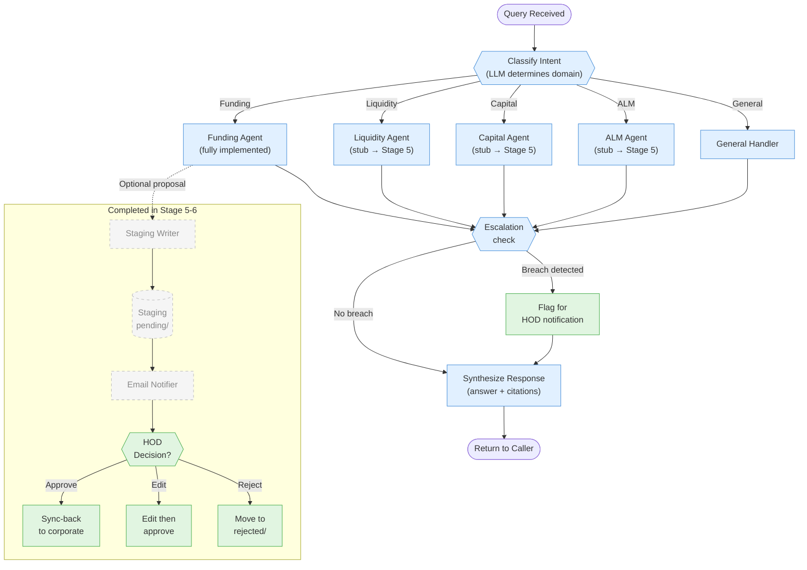
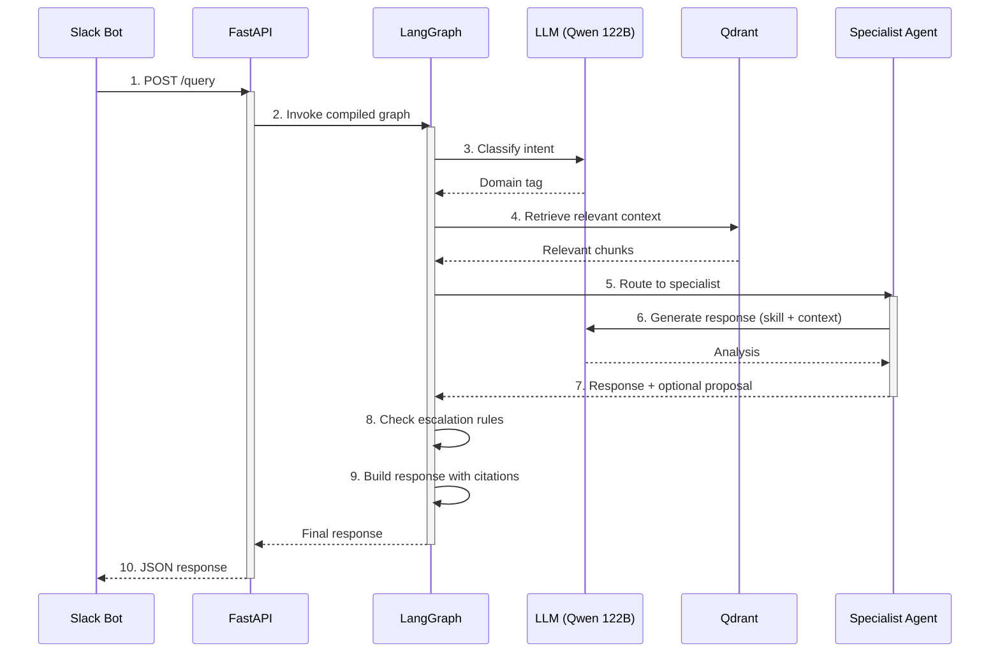

# Stage 4 — CAC Orchestrator Implementation Plan

> **For agentic workers:** REQUIRED SUB-SKILL: Use superpowers:subagent-driven-development (recommended) or superpowers:executing-plans to implement this plan task-by-task. Steps use checkbox (`- [ ]`) syntax for tracking.

**Goal:** Build the CAC Orchestrator (`services/cac-orchestrator/`) — a LangGraph StateGraph that classifies query intent, retrieves context from Qdrant, routes to specialist agents, and synthesizes responses with citations. Only funding_agent is fully implemented; other agents are stubs.

**Architecture:** LangGraph StateGraph: START → classify_intent → retrieve_context → [specialist_agent] → escalation_check → synthesise_response → END. Conditional routing based on classified intent. PostgresSaver checkpointer for conversation persistence. OpenAI-compatible client for Qwen 122B via vLLM (nginx:8080).

**Tech Stack:** Python 3.11, FastAPI, LangGraph 0.2+, langgraph-checkpoint-postgres, openai (async), qdrant-client (async), httpx, Pydantic v2, structlog, tenacity

**Design Spec:** `docs/superpowers/plans/2026-03-30-stage2-4-rag-orchestrator.md`

**Prerequisite:** Stage 2 RAG Ingestion must be complete (plan: `2026-03-30-stage2-rag-ingestion.md`)

---

## System Overview

### LangGraph Pipeline



> **Legend:** 🔵 Blue = Automated pipeline · 🟢 Green = Human actions · ⬜ Dashed = Future stages (5-6)

### Query Through the Graph



## CRITICAL Review Fixes (Apply During Implementation)

The code review identified issues that affect multiple tasks. **Agentic workers MUST apply these patterns instead of the literal code in affected tasks:**

### RF1: Dependency Injection — Use Closures, Not State Dict Keys

LangGraph 0.2+ uses channels and will drop undeclared TypedDict keys. **Do NOT inject `_llm`, `_retriever`, etc. into the state dict.** Instead:

- **Node functions** that need LLM/retriever/etc. must be **factory functions** that return closures:
  ```python
  def make_funding_agent(llm: LLMClient, chat_searcher: ChatSearcher, skill_loader: SkillLoader):
      async def funding_agent(state: AgentState) -> AgentState:
          # Use llm, chat_searcher, skill_loader from closure scope
          ...
      return funding_agent
  ```
- **`classify_intent`** and **`synthesise_response`** need `make_classify_intent(llm)` and `make_synthesise_response(llm)` factories.
- **`_retrieve_context`** needs the retriever from closure scope.
- **`build_graph()`** accepts `(settings, llm, retriever, chat_searcher, skill_loader)` and binds dependencies at graph build time.
- **`main.py`** passes instantiated dependencies to `build_graph()`.
- **Tests** create mock dependencies, pass them to the factory, and call the returned function.

**Affects:** Tasks 9, 12, 13, 14, 15, 18-22.

### RF2: Citation Schema — Use `excerpt` Not `snippet`

The slack-bot's `Citation` model uses `source, excerpt, score`. The orchestrator must match:
```python
class Citation(TypedDict):
    source: str
    excerpt: str  # NOT snippet
    score: float
```
Remove `page` and `section` from the Citation TypedDict (move to full metadata if needed). The `QueryResponse.citations` must be `list[Citation]` matching the slack-bot contract.

**Affects:** Tasks 2, 9, 15, 17, 20, 21.

### RF3: Add `context` Field to QueryRequest

Match the slack-bot's `QueryRequest` which includes `context: dict[str, Any]`:
```python
class QueryRequest(BaseModel):
    query: str
    user_id: str
    channel_id: str
    thread_ts: str | None = None
    context: dict[str, Any] = Field(default_factory=dict)
```

**Affects:** Task 15.

### RF4: Implement PostgresSaver Checkpointer

In `main.py` lifespan:
```python
from langgraph.checkpoint.postgres.aio import AsyncPostgresSaver

async with AsyncPostgresSaver.from_conn_string(settings.postgres_dsn) as checkpointer:
    await checkpointer.setup()
    compiled = graph.compile(checkpointer=checkpointer)
    app.state.graph = compiled
    yield
```
`build_graph()` returns the uncompiled `StateGraph`. `main.py` compiles it with the checkpointer.

**Affects:** Tasks 14, 15.

### RF5: ChatSearcher Must Access Qdrant Payload Directly

The `RAGRetriever.retrieve()` returns `{text, source, page, section, score, collection}` — it does NOT include chat metadata like `author`, `channel_id`, `timestamp`. The `ChatSearcher` must either:
- Query Qdrant directly (not through RAGRetriever) to get full payload, OR
- RAGRetriever must pass through all payload fields

Recommended: Add `**payload` spread to RAGRetriever results so all Qdrant payload fields are available.

**Affects:** Tasks 4, 5.

### RF6: Add `test_staging_writer.py`

Add `tests/unit/cac_orchestrator/test_staging_writer.py`:
- Test `write_proposal()` returns None in Stage 4
- Test NO file is created on disk (data safety verification)

**Affects:** Task list — add as Task 21b.

---

## File Map

### New Files — Source

| File | Responsibility |
|------|---------------|
| `services/cac-orchestrator/src/__init__.py` | Package init |
| `services/cac-orchestrator/src/agents/__init__.py` | Agents package init |
| `services/cac-orchestrator/src/tools/__init__.py` | Tools package init |
| `services/cac-orchestrator/src/skills/__init__.py` | Skills package init |
| `services/cac-orchestrator/src/config.py` | OrchestratorSettings |
| `services/cac-orchestrator/src/state.py` | AgentState TypedDict |
| `services/cac-orchestrator/src/llm_client.py` | Async OpenAI-compatible vLLM client |
| `services/cac-orchestrator/src/tools/rag_retrieve.py` | Qdrant multi-collection search |
| `services/cac-orchestrator/src/tools/chat_search.py` | Chat history search |
| `services/cac-orchestrator/src/tools/excel_schema.py` | ALCO Tracker schema navigator |
| `services/cac-orchestrator/src/tools/staging_writer.py` | Staging proposal manifest writer (stub) |
| `services/cac-orchestrator/src/skills/loader.py` | SKILL.md file loader |
| `services/cac-orchestrator/src/agents/funding.py` | Full funding facilities agent |
| `services/cac-orchestrator/src/agents/liquidity.py` | Stub agent |
| `services/cac-orchestrator/src/agents/capital.py` | Stub agent |
| `services/cac-orchestrator/src/agents/alm.py` | Stub agent |
| `services/cac-orchestrator/src/agents/escalation.py` | Stub escalation check node |
| `services/cac-orchestrator/src/router.py` | classify_intent + route_by_intent |
| `services/cac-orchestrator/src/synthesiser.py` | synthesise_response node |
| `services/cac-orchestrator/src/graph.py` | LangGraph StateGraph assembly |
| `services/cac-orchestrator/src/main.py` | FastAPI app: /query, /health |
| `services/cac-orchestrator/requirements.txt` | Dependencies |
| `services/cac-orchestrator/Dockerfile` | Container image |

### New Files — Tests

| File | Tests For |
|------|----------|
| `tests/unit/cac_orchestrator/__init__.py` | Package init |
| `tests/unit/cac_orchestrator/test_state.py` | AgentState TypedDicts |
| `tests/unit/cac_orchestrator/test_router.py` | classify_intent, route_by_intent |
| `tests/unit/cac_orchestrator/test_retrieve.py` | RAGRetriever |
| `tests/unit/cac_orchestrator/test_synthesiser.py` | synthesise_response |
| `tests/unit/cac_orchestrator/test_funding_agent.py` | funding_agent |
| `tests/integration/test_cac_graph.py` | Full graph POST /query |

### Modified Files

| File | Change |
|------|--------|
| `docker-compose.yml` | Uncomment cac-orchestrator, set ORCHESTRATOR_ENABLED=true on slack-bot |
| `docs/Implementation.md` | Check off Stage 4 items |

---

## Dependency DAG

```
Task 1 (init + config + requirements) ──┐
Task 2 (state) ──────────────────────────┤
Task 3 (llm_client) ─── depends on 1 ───┤
Task 4 (rag_retrieve) ── depends on 1 ──┤
Task 5 (chat_search) ─── depends on 4 ──┤
Task 6 (excel_schema) ── depends on 1 ──┤
Task 7 (staging_writer) ─ depends on 1,2 ┤
Task 8 (skill_loader) ── depends on 1 ──┤
Task 9 (funding_agent) ── depends on 2,3,4,5,8
Task 10 (stub agents) ── depends on 2 ──┤
Task 11 (escalation) ─── depends on 2 ──┤
Task 12 (router) ─────── depends on 2,3 ┤
Task 13 (synthesiser) ── depends on 2,3 ┤
Task 14 (graph.py) ──── depends on 4,9-13
Task 15 (main.py) ──── depends on 14 ───┤
Task 16 (Dockerfile + docker-compose) ── depends on 15
Task 17 (test_state) ──────────────────┤
Task 18 (test_router) ────────────────┤
Task 19 (test_retrieve) ──────────────┤ all tests parallel
Task 20 (test_synthesiser) ────────────┤
Task 21 (test_funding_agent) ──────────┤
Task 22 (integration test) ── depends on 15
Task 23 (final verification) ── depends on all
```

**Parallelizable:** Tasks 4-8 (tools + skills). Tasks 10-11 (stubs). Tasks 17-21 (unit tests).

---

## Task Breakdown

### Task 1: Package Init + Config + Requirements

**Files:**
- Create: `services/cac-orchestrator/src/__init__.py`
- Create: `services/cac-orchestrator/src/agents/__init__.py`
- Create: `services/cac-orchestrator/src/tools/__init__.py`
- Create: `services/cac-orchestrator/src/skills/__init__.py`
- Create: `tests/unit/cac_orchestrator/__init__.py`
- Create: `services/cac-orchestrator/requirements.txt`
- Create: `services/cac-orchestrator/src/config.py`

- [ ] **Step 1: Create all __init__.py files**

```python
# All __init__.py files are empty
```

- [ ] **Step 2: Write requirements.txt**

```
fastapi>=0.110
uvicorn>=0.27
pydantic>=2.0
pydantic-settings>=2.0
langgraph>=0.2
langgraph-checkpoint-postgres>=0.1
openai>=1.0
qdrant-client>=1.12
httpx>=0.27
psycopg[binary]>=3.1
structlog>=23.0
tenacity>=8.2
python-dotenv>=1.0
```

- [ ] **Step 3: Write config.py**

```python
# services/cac-orchestrator/src/config.py
"""cac-orchestrator service configuration."""
from __future__ import annotations

from pydantic_settings import BaseSettings


class OrchestratorSettings(BaseSettings):
    """Settings loaded from environment variables."""

    model_config = {"env_prefix": "", "case_sensitive": False}

    # vLLM endpoints
    vllm_large_url: str = "http://nginx:8080/v1"
    vllm_embed_url: str = "http://host.docker.internal:8002/v1"
    vllm_model: str = "qwen3.5-122b"

    # Qdrant
    qdrant_host: str = "qdrant"
    qdrant_rest_port: int = 6333

    # Postgres (for checkpointer + logging)
    postgres_host: str = "postgres"
    postgres_port: int = 5432
    postgres_db: str = "corporate_agents"
    postgres_user: str = "agents"
    postgres_password: str = "changeme"

    # RAG service
    rag_service_url: str = "http://rag-ingestion:3004"

    # Thresholds
    confidence_threshold: float = 0.85
    retrieval_top_k: int = 8
    retrieval_score_threshold: float = 0.70

    # Skills
    skills_dir: str = "/app/skills/cac"

    # HTTP
    http_timeout_seconds: float = 30.0

    # Logging
    log_level: str = "INFO"

    @property
    def postgres_dsn(self) -> str:
        return (
            f"postgresql://{self.postgres_user}:{self.postgres_password}"
            f"@{self.postgres_host}:{self.postgres_port}/{self.postgres_db}"
        )
```

- [ ] **Step 4: Verify imports**

Run: `cd Brooker_Corporate_Agent && python -c "from services.cac_orchestrator.src.config import OrchestratorSettings; print('OK')"`
Expected: `OK`

- [ ] **Step 5: Commit**

```bash
git add services/cac-orchestrator/src/__init__.py services/cac-orchestrator/src/agents/__init__.py services/cac-orchestrator/src/tools/__init__.py services/cac-orchestrator/src/skills/__init__.py tests/unit/cac_orchestrator/__init__.py services/cac-orchestrator/requirements.txt services/cac-orchestrator/src/config.py
git commit -m "feat(cac-orchestrator): add package init, config, and requirements"
```

---

### Task 2: AgentState TypedDict

**Files:**
- Create: `services/cac-orchestrator/src/state.py`

- [ ] **Step 1: Write state.py**

```python
# services/cac-orchestrator/src/state.py
"""LangGraph AgentState definition for the CAC orchestrator."""
from __future__ import annotations

from typing import TypedDict


class Citation(TypedDict):
    source: str
    page: int | None
    section: str | None
    score: float
    snippet: str


class ProposedChange(TypedDict):
    file: str
    tab: str
    cell: str
    old_value: str | None
    new_value: str
    confidence: float
    reasoning: str


class Escalation(TypedDict):
    type: str
    severity: str
    description: str
    notify: list[str]


class AgentState(TypedDict):
    """State schema for the LangGraph CAC orchestrator graph."""

    # Input
    query: str
    user_id: str
    channel_id: str
    thread_ts: str | None

    # Classification
    intent: str  # funding|liquidity|capital|alm|general
    intent_confidence: float

    # Retrieval
    context: list[dict]  # retrieved chunks with scores

    # Agent output
    agent_response: str
    citations: list[Citation]
    proposed_changes: list[ProposedChange]
    escalations: list[Escalation]
    confidence: float

    # Error
    error: str | None
```

- [ ] **Step 2: Verify import**

Run: `cd Brooker_Corporate_Agent && python -c "from services.cac_orchestrator.src.state import AgentState, Citation; print('OK')"`
Expected: `OK`

- [ ] **Step 3: Commit**

```bash
git add services/cac-orchestrator/src/state.py
git commit -m "feat(cac-orchestrator): add AgentState TypedDict with Citation, ProposedChange, Escalation"
```

---

### Task 3: LLM Client

**Files:**
- Create: `services/cac-orchestrator/src/llm_client.py`

- [ ] **Step 1: Write llm_client.py**

```python
# services/cac-orchestrator/src/llm_client.py
"""Shared async OpenAI-compatible client for Qwen 122B via vLLM."""
from __future__ import annotations

import json

import structlog
from openai import AsyncOpenAI
from tenacity import retry, retry_if_exception_type, stop_after_attempt, wait_exponential

from .config import OrchestratorSettings

logger = structlog.get_logger("cac-orchestrator.llm_client")


class LLMClient:
    """Async client for Qwen 122B via vLLM's OpenAI-compatible API."""

    def __init__(self, settings: OrchestratorSettings) -> None:
        self._client = AsyncOpenAI(
            base_url=settings.vllm_large_url,
            api_key="not-needed",  # vLLM doesn't require a key
            timeout=settings.http_timeout_seconds,
        )
        self._model = settings.vllm_model

    @retry(
        retry=retry_if_exception_type(Exception),
        stop=stop_after_attempt(3),
        wait=wait_exponential(multiplier=1, min=1, max=8),
        reraise=True,
    )
    async def chat(
        self,
        messages: list[dict[str, str]],
        temperature: float = 0.1,
        max_tokens: int = 2048,
    ) -> str:
        """Send chat completion request, return assistant message content."""
        resp = await self._client.chat.completions.create(
            model=self._model,
            messages=messages,  # type: ignore[arg-type]
            temperature=temperature,
            max_tokens=max_tokens,
        )
        content = resp.choices[0].message.content or ""
        logger.debug(
            "llm_client.chat_done",
            model=self._model,
            input_msgs=len(messages),
            output_len=len(content),
        )
        return content

    async def chat_json(
        self,
        messages: list[dict[str, str]],
        temperature: float = 0.1,
    ) -> dict:
        """Chat and parse the response as JSON."""
        raw = await self.chat(messages, temperature=temperature)

        # Try to extract JSON from response (may have markdown code fences)
        cleaned = raw.strip()
        if cleaned.startswith("```"):
            # Strip markdown code fences
            lines = cleaned.split("\n")
            cleaned = "\n".join(lines[1:-1]) if len(lines) > 2 else cleaned

        try:
            return json.loads(cleaned)  # type: ignore[no-any-return]
        except json.JSONDecodeError:
            logger.warning("llm_client.json_parse_failed", raw=raw[:200])
            return {"error": "Failed to parse JSON response", "raw": raw[:500]}

    async def close(self) -> None:
        await self._client.close()
```

- [ ] **Step 2: Verify import**

Run: `cd Brooker_Corporate_Agent && python -c "from services.cac_orchestrator.src.llm_client import LLMClient; print('OK')"`
Expected: `OK`

- [ ] **Step 3: Commit**

```bash
git add services/cac-orchestrator/src/llm_client.py
git commit -m "feat(cac-orchestrator): add async LLM client with JSON parsing and retry"
```

---

### Task 4: RAG Retriever Tool

**Files:**
- Create: `services/cac-orchestrator/src/tools/rag_retrieve.py`

- [ ] **Step 1: Write rag_retrieve.py**

```python
# services/cac-orchestrator/src/tools/rag_retrieve.py
"""RAG retrieval tool — queries Qdrant for relevant context."""
from __future__ import annotations

import httpx
import structlog
from qdrant_client import AsyncQdrantClient
from qdrant_client.models import FieldCondition, Filter, MatchValue

from ..config import OrchestratorSettings

logger = structlog.get_logger("cac-orchestrator.rag_retrieve")

DEFAULT_COLLECTIONS = ["cac_docs", "cac_chat", "cac_knowledge", "shared_policies"]


class RAGRetriever:
    """Retrieves relevant context from Qdrant vector collections."""

    def __init__(self, settings: OrchestratorSettings) -> None:
        self._qdrant = AsyncQdrantClient(
            host=settings.qdrant_host,
            port=settings.qdrant_rest_port,
        )
        self._embed_url = f"{settings.vllm_embed_url.rstrip('/')}/embeddings"
        self._embed_model = "qwen-embed"
        self._top_k = settings.retrieval_top_k
        self._threshold = settings.retrieval_score_threshold
        self._http: httpx.AsyncClient | None = None

    async def start(self) -> None:
        self._http = httpx.AsyncClient(timeout=30.0)

    async def close(self) -> None:
        if self._http:
            await self._http.aclose()
        await self._qdrant.close()

    async def _embed_query(self, text: str) -> list[float]:
        """Embed query text via vLLM."""
        assert self._http is not None
        resp = await self._http.post(
            self._embed_url,
            json={"model": self._embed_model, "input": [text]},
        )
        resp.raise_for_status()
        return resp.json()["data"][0]["embedding"]  # type: ignore[no-any-return]

    async def retrieve_by_text(
        self,
        query: str,
        collections: list[str] | None = None,
        top_k: int | None = None,
        score_threshold: float | None = None,
        filters: dict[str, str] | None = None,
    ) -> list[dict]:
        """Embed query and search across collections."""
        vector = await self._embed_query(query)
        return await self.retrieve(
            query_vector=vector,
            collections=collections,
            top_k=top_k,
            score_threshold=score_threshold,
            filters=filters,
        )

    async def retrieve(
        self,
        query_vector: list[float],
        collections: list[str] | None = None,
        top_k: int | None = None,
        score_threshold: float | None = None,
        filters: dict[str, str] | None = None,
    ) -> list[dict]:
        """Search multiple Qdrant collections, merge and sort results."""
        cols = collections or DEFAULT_COLLECTIONS
        k = top_k or self._top_k
        threshold = score_threshold or self._threshold

        qdrant_filter = None
        if filters:
            conditions = [
                FieldCondition(key=key, match=MatchValue(value=val))
                for key, val in filters.items()
            ]
            qdrant_filter = Filter(must=conditions)

        all_results: list[dict] = []
        for col in cols:
            try:
                hits = await self._qdrant.search(
                    collection_name=col,
                    query_vector=query_vector,
                    limit=k,
                    score_threshold=threshold,
                    query_filter=qdrant_filter,
                )
                for hit in hits:
                    payload = hit.payload or {}
                    all_results.append({
                        "text": payload.get("text", ""),
                        "source": payload.get("source_file", ""),
                        "page": payload.get("page"),
                        "section": payload.get("section"),
                        "score": hit.score,
                        "collection": col,
                    })
            except Exception as exc:
                logger.warning("rag_retrieve.collection_error", collection=col, error=str(exc))

        # Sort by score descending, take top_k overall
        all_results.sort(key=lambda x: x["score"], reverse=True)
        return all_results[:k]
```

- [ ] **Step 2: Commit**

```bash
git add services/cac-orchestrator/src/tools/rag_retrieve.py
git commit -m "feat(cac-orchestrator): add RAG retriever tool with multi-collection search"
```

---

### Task 5: Chat Search Tool

**Files:**
- Create: `services/cac-orchestrator/src/tools/chat_search.py`

- [ ] **Step 1: Write chat_search.py**

```python
# services/cac-orchestrator/src/tools/chat_search.py
"""Chat history search tool — queries cac_chat collection."""
from __future__ import annotations

import structlog

from .rag_retrieve import RAGRetriever

logger = structlog.get_logger("cac-orchestrator.chat_search")


class ChatSearcher:
    """Searches Slack chat history in the cac_chat Qdrant collection."""

    def __init__(self, retriever: RAGRetriever) -> None:
        self._retriever = retriever

    async def search(
        self,
        query: str,
        channel_id: str | None = None,
        limit: int = 5,
    ) -> list[dict]:
        """Search chat history with optional channel filter."""
        filters = {"channel_id": channel_id} if channel_id else None
        results = await self._retriever.retrieve_by_text(
            query=query,
            collections=["cac_chat"],
            top_k=limit,
            filters=filters,
        )
        return [
            {
                "text": r["text"],
                "author": r.get("author", ""),
                "channel_id": r.get("channel_id", ""),
                "timestamp": r.get("timestamp", ""),
                "thread_ts": r.get("thread_ts", ""),
                "score": r["score"],
            }
            for r in results
        ]
```

- [ ] **Step 2: Commit**

```bash
git add services/cac-orchestrator/src/tools/chat_search.py
git commit -m "feat(cac-orchestrator): add chat search tool"
```

---

### Task 6: Excel Schema Tool

**Files:**
- Create: `services/cac-orchestrator/src/tools/excel_schema.py`

- [ ] **Step 1: Write excel_schema.py**

```python
# services/cac-orchestrator/src/tools/excel_schema.py
"""Excel schema navigator — reads alco_tracker.json for ALCO Tracker structure."""
from __future__ import annotations

import json
from pathlib import Path

import structlog

logger = structlog.get_logger("cac-orchestrator.excel_schema")

DEFAULT_SCHEMA_PATH = "/app/config/excel_schema/alco_tracker.json"


class ExcelSchema:
    """Navigate ALCO Tracker Excel structure using config schema."""

    def __init__(self, schema_path: str = DEFAULT_SCHEMA_PATH) -> None:
        self._schema: dict = {}
        self._path = schema_path
        self._load()

    def _load(self) -> None:
        path = Path(self._path)
        if not path.exists():
            logger.warning("excel_schema.file_missing", path=self._path)
            return
        try:
            content = path.read_text()
            if not content.strip() or content.strip() in ("{}", ""):
                logger.info("excel_schema.empty", path=self._path)
                return
            self._schema = json.loads(content)
        except json.JSONDecodeError as exc:
            logger.error("excel_schema.parse_error", path=self._path, error=str(exc))

    @property
    def is_configured(self) -> bool:
        return bool(self._schema)

    def get_sheets(self) -> list[str]:
        if not self._schema:
            return []
        return list(self._schema.get("sheets", {}).keys())

    def get_columns(self, sheet: str) -> list[str]:
        if not self._schema:
            return []
        return list(self._schema.get("sheets", {}).get(sheet, {}).get("columns", {}).keys())

    def get_cell_ref(self, sheet: str, column: str, row_identifier: str) -> str | None:
        if not self._schema:
            return None
        sheets = self._schema.get("sheets", {})
        col_info = sheets.get(sheet, {}).get("columns", {}).get(column, {})
        col_letter = col_info.get("column_letter", "")
        if not col_letter:
            return None
        # Row identifier lookup would need row mapping — return column letter for now
        return f"{col_letter}:{row_identifier}"

    def get_schema_summary(self) -> str:
        if not self._schema:
            return "Excel schema not yet configured. Populate config/excel_schema/alco_tracker.json with real Excel structure."
        sheets = self.get_sheets()
        lines = [f"ALCO Tracker has {len(sheets)} sheets:"]
        for s in sheets:
            cols = self.get_columns(s)
            lines.append(f"  - {s}: {len(cols)} columns ({', '.join(cols[:5])}{'...' if len(cols) > 5 else ''})")
        return "\n".join(lines)
```

- [ ] **Step 2: Commit**

```bash
git add services/cac-orchestrator/src/tools/excel_schema.py
git commit -m "feat(cac-orchestrator): add Excel schema navigator (handles empty config)"
```

---

### Task 7: Staging Writer Tool (Stub)

**Files:**
- Create: `services/cac-orchestrator/src/tools/staging_writer.py`

- [ ] **Step 1: Write staging_writer.py**

```python
# services/cac-orchestrator/src/tools/staging_writer.py
"""Staging proposal manifest writer — STUB in Stage 4, full in Stage 5.

CRITICAL: Agents write ONLY to /data/staging/pending/ via this module.
Docker enforces /data/mirror/ as :ro. Never bypass this.
"""
from __future__ import annotations

import structlog

from ..state import ProposedChange

logger = structlog.get_logger("cac-orchestrator.staging_writer")


class StagingWriter:
    """Creates staging proposal manifests. STUB in Stage 4."""

    def __init__(self, staging_path: str = "/data/staging/pending") -> None:
        self._staging_path = staging_path

    async def write_proposal(self, change: ProposedChange, agent: str) -> str | None:
        """Write a staging proposal manifest.

        Stage 4: Logs intent but does NOT write files.
        Stage 5: Full implementation with JSON manifest writing.
        """
        logger.info(
            "staging_writer.stub",
            agent=agent,
            file=change["file"],
            tab=change["tab"],
            cell=change["cell"],
            message="Stage 4 stub — proposals will be written in Stage 5",
        )
        return None  # No proposal ID in Stage 4
```

- [ ] **Step 2: Commit**

```bash
git add services/cac-orchestrator/src/tools/staging_writer.py
git commit -m "feat(cac-orchestrator): add staging writer stub (full in Stage 5)"
```

---

### Task 8: Skills Loader

**Files:**
- Create: `services/cac-orchestrator/src/skills/loader.py`

- [ ] **Step 1: Write loader.py**

```python
# services/cac-orchestrator/src/skills/loader.py
"""SKILL.md file loader — reads agent skill definitions from disk."""
from __future__ import annotations

from pathlib import Path

import structlog

logger = structlog.get_logger("cac-orchestrator.skill_loader")


class SkillLoader:
    """Loads SKILL.md files from the skills directory."""

    def __init__(self, skills_dir: str) -> None:
        self._dir = Path(skills_dir)
        self._cache: dict[str, str] = {}

    def load_skill(self, skill_name: str) -> str | None:
        """Load a single SKILL.md file by name. Returns None if not found."""
        if skill_name in self._cache:
            return self._cache[skill_name]

        # Try common naming patterns
        for filename in [
            f"{skill_name}.md",
            f"{skill_name}-agent.md",
            f"SKILL-{skill_name}.md",
        ]:
            path = self._dir / filename
            if path.exists():
                content = path.read_text(encoding="utf-8")
                self._cache[skill_name] = content
                logger.info("skill_loader.loaded", skill=skill_name, path=str(path))
                return content

        logger.debug("skill_loader.not_found", skill=skill_name, dir=str(self._dir))
        return None

    def load_all_skills(self) -> dict[str, str]:
        """Load all SKILL.md files from the directory."""
        if not self._dir.exists():
            logger.warning("skill_loader.dir_missing", dir=str(self._dir))
            return {}

        skills: dict[str, str] = {}
        for path in self._dir.glob("*.md"):
            name = path.stem.removesuffix("-agent")
            content = path.read_text(encoding="utf-8")
            skills[name] = content
            self._cache[name] = content

        logger.info("skill_loader.loaded_all", count=len(skills))
        return skills

    def clear_cache(self) -> None:
        self._cache.clear()
```

- [ ] **Step 2: Commit**

```bash
git add services/cac-orchestrator/src/skills/loader.py
git commit -m "feat(cac-orchestrator): add SKILL.md loader with caching"
```

---

### Task 9: Funding Agent (Full Implementation)

**Files:**
- Create: `services/cac-orchestrator/src/agents/funding.py`

- [ ] **Step 1: Write funding.py**

```python
# services/cac-orchestrator/src/agents/funding.py
"""Funding Facilities specialist agent — first full agent implementation."""
from __future__ import annotations

import structlog

from ..llm_client import LLMClient
from ..skills.loader import SkillLoader
from ..state import AgentState, Citation
from ..tools.chat_search import ChatSearcher
from ..tools.rag_retrieve import RAGRetriever

logger = structlog.get_logger("cac-orchestrator.agents.funding")

DEFAULT_SYSTEM_PROMPT = """You are the Funding Facilities specialist for the CAC (Capital Allocation & ALCO) committee at Brooker Group.

Your expertise covers:
- Funding facility utilization and headroom analysis
- Interest rate exposure on floating-rate facilities
- Covenant compliance monitoring (debt/equity, interest coverage)
- Facility renewal timelines and counterparty risk
- Drawdown patterns and cash flow forecasting

When answering questions:
1. Cite specific sources with page numbers when available
2. Quantify your confidence (0.0 to 1.0)
3. Flag any values that are close to covenant thresholds
4. If you propose a change, explain the evidence and reasoning

Respond in JSON format:
{
    "answer": "Your detailed response here",
    "citations": [{"source": "filename", "page": 1, "section": null, "score": 0.95, "snippet": "relevant quote"}],
    "confidence": 0.92
}"""


async def funding_agent(state: AgentState) -> AgentState:
    """Process a funding-related query through Qwen 122B.

    NOTE: See RF1 in Review Fixes section. This function must be wrapped in a
    make_funding_agent() factory that binds llm, chat_searcher, skill_loader
    via closure. The code below shows the logic; the DI pattern must change.
    """
    try:
        # Dependencies come from closure scope (see RF1), NOT from state dict
        # llm: LLMClient, chat_searcher: ChatSearcher, skill_loader: SkillLoader

        # Load skill or use default
        skill_content = skill_loader.load_skill("funding") if skill_loader else None
        system_prompt = skill_content or DEFAULT_SYSTEM_PROMPT

        # Build context from retrieval results
        context_text = ""
        if state.get("context"):
            for i, chunk in enumerate(state["context"][:8], 1):
                source = chunk.get("source", "unknown")
                text = chunk.get("text", "")
                context_text += f"\n[{i}] Source: {source}\n{text}\n"

        # Search chat history for additional context
        chat_results = []
        if chat_searcher:
            try:
                chat_results = await chat_searcher.search(
                    state["query"], channel_id=state.get("channel_id"), limit=3
                )
            except Exception as exc:
                logger.warning("funding_agent.chat_search_failed", error=str(exc))

        if chat_results:
            context_text += "\n--- Recent Chat Context ---\n"
            for msg in chat_results:
                context_text += f"[{msg.get('author', '?')}]: {msg.get('text', '')}\n"

        # Build messages
        messages = [
            {"role": "system", "content": system_prompt},
            {
                "role": "user",
                "content": f"Context:\n{context_text}\n\nQuestion: {state['query']}",
            },
        ]

        # Call LLM
        result = await llm.chat_json(messages)

        if "error" in result and "raw" in result:
            # JSON parsing failed — use raw text as answer
            state["agent_response"] = result.get("raw", "Unable to process query.")
            state["citations"] = []
            state["confidence"] = 0.5
        else:
            state["agent_response"] = result.get("answer", "")
            state["citations"] = [
                Citation(
                    source=c.get("source", ""),
                    page=c.get("page"),
                    section=c.get("section"),
                    score=c.get("score", 0.0),
                    snippet=c.get("snippet", ""),
                )
                for c in result.get("citations", [])
            ]
            state["confidence"] = result.get("confidence", 0.0)

        state["proposed_changes"] = []  # Stage 5
        state["error"] = None

    except Exception as exc:
        logger.error("funding_agent.failed", error=str(exc))
        state["agent_response"] = "Sorry, I couldn't process your funding query right now."
        state["citations"] = []
        state["confidence"] = 0.0
        state["error"] = str(exc)

    return state
```

- [ ] **Step 2: Commit**

```bash
git add services/cac-orchestrator/src/agents/funding.py
git commit -m "feat(cac-orchestrator): add full funding agent with LLM, retrieval, and citations"
```

---

### Task 10: Stub Agents (Liquidity, Capital, ALM)

**Files:**
- Create: `services/cac-orchestrator/src/agents/liquidity.py`
- Create: `services/cac-orchestrator/src/agents/capital.py`
- Create: `services/cac-orchestrator/src/agents/alm.py`

- [ ] **Step 1: Write all three stub agents**

```python
# services/cac-orchestrator/src/agents/liquidity.py
"""Liquidity analysis agent — STUB, implemented in Stage 5."""
from __future__ import annotations

from ..state import AgentState


async def liquidity_agent(state: AgentState) -> AgentState:
    state["agent_response"] = "Liquidity analysis agent is not yet implemented. Available in Stage 5."
    state["citations"] = []
    state["confidence"] = 0.0
    state["proposed_changes"] = []
    state["escalations"] = []
    state["error"] = None
    return state
```

```python
# services/cac-orchestrator/src/agents/capital.py
"""Capital allocation agent — STUB, implemented in Stage 5."""
from __future__ import annotations

from ..state import AgentState


async def capital_agent(state: AgentState) -> AgentState:
    state["agent_response"] = "Capital allocation agent is not yet implemented. Available in Stage 5."
    state["citations"] = []
    state["confidence"] = 0.0
    state["proposed_changes"] = []
    state["escalations"] = []
    state["error"] = None
    return state
```

```python
# services/cac-orchestrator/src/agents/alm.py
"""ALM review agent — STUB, implemented in Stage 5."""
from __future__ import annotations

from ..state import AgentState


async def alm_agent(state: AgentState) -> AgentState:
    state["agent_response"] = "ALM review agent is not yet implemented. Available in Stage 5."
    state["citations"] = []
    state["confidence"] = 0.0
    state["proposed_changes"] = []
    state["escalations"] = []
    state["error"] = None
    return state
```

- [ ] **Step 2: Commit**

```bash
git add services/cac-orchestrator/src/agents/liquidity.py services/cac-orchestrator/src/agents/capital.py services/cac-orchestrator/src/agents/alm.py
git commit -m "feat(cac-orchestrator): add stub agents for liquidity, capital, ALM"
```

---

### Task 11: Escalation Check (Stub)

**Files:**
- Create: `services/cac-orchestrator/src/agents/escalation.py`

- [ ] **Step 1: Write escalation.py**

```python
# services/cac-orchestrator/src/agents/escalation.py
"""Escalation check node — STUB pass-through, implemented in Stage 5."""
from __future__ import annotations

from ..state import AgentState


async def escalation_check(state: AgentState) -> AgentState:
    """Pass-through in Stage 4. Stage 5 checks escalation_rules.json triggers."""
    if "escalations" not in state:
        state["escalations"] = []
    return state
```

- [ ] **Step 2: Commit**

```bash
git add services/cac-orchestrator/src/agents/escalation.py
git commit -m "feat(cac-orchestrator): add escalation check stub (pass-through)"
```

---

### Task 12: Router (classify_intent + route_by_intent)

**Files:**
- Create: `services/cac-orchestrator/src/router.py`

- [ ] **Step 1: Write router.py**

```python
# services/cac-orchestrator/src/router.py
"""Intent classification and routing for the CAC orchestrator graph."""
from __future__ import annotations

import structlog

from .llm_client import LLMClient
from .state import AgentState

logger = structlog.get_logger("cac-orchestrator.router")

CLASSIFY_PROMPT = """Classify this query into exactly one category.

Categories:
- funding: Questions about funding facilities, loans, credit lines, covenants, interest rates
- liquidity: Questions about cash positions, liquidity ratios, short-term funding
- capital: Questions about capital allocation, equity, capital adequacy, investment decisions
- alm: Questions about asset-liability management, duration gaps, interest rate risk, hedging
- general: Questions that don't fit the above or are unclear

Respond in JSON only:
{"intent": "funding|liquidity|capital|alm|general", "confidence": 0.0-1.0, "reasoning": "brief explanation"}

Query: {query}"""

VALID_INTENTS = {"funding", "liquidity", "capital", "alm", "general"}


async def classify_intent(state: AgentState) -> AgentState:
    """Classify query intent using Qwen 122B."""
    llm: LLMClient = state.get("_llm")  # type: ignore[assignment]

    try:
        messages = [
            {"role": "system", "content": "You are an intent classifier for a financial committee AI system."},
            {"role": "user", "content": CLASSIFY_PROMPT.format(query=state["query"])},
        ]
        result = await llm.chat_json(messages)

        intent = result.get("intent", "general")
        confidence = float(result.get("confidence", 0.5))

        if intent not in VALID_INTENTS:
            logger.warning("router.invalid_intent", intent=intent)
            intent = "general"
            confidence = 0.5

        state["intent"] = intent
        state["intent_confidence"] = confidence
        logger.info("router.classified", intent=intent, confidence=confidence)

    except Exception as exc:
        logger.error("router.classify_failed", error=str(exc))
        state["intent"] = "general"
        state["intent_confidence"] = 0.5
        state["error"] = f"Classification failed: {exc}"

    return state


def route_by_intent(state: AgentState) -> str:
    """Conditional edge function — returns target node name based on intent."""
    intent = state.get("intent", "general")
    route_map = {
        "funding": "funding_agent",
        "liquidity": "liquidity_agent",
        "capital": "capital_agent",
        "alm": "alm_agent",
        "general": "synthesise_response",  # Skip specialist for general queries
    }
    return route_map.get(intent, "synthesise_response")
```

- [ ] **Step 2: Commit**

```bash
git add services/cac-orchestrator/src/router.py
git commit -m "feat(cac-orchestrator): add intent classifier and conditional router"
```

---

### Task 13: Synthesiser

**Files:**
- Create: `services/cac-orchestrator/src/synthesiser.py`

- [ ] **Step 1: Write synthesiser.py**

```python
# services/cac-orchestrator/src/synthesiser.py
"""Response synthesis node — formats final answer with citations."""
from __future__ import annotations

import structlog

from .llm_client import LLMClient
from .state import AgentState

logger = structlog.get_logger("cac-orchestrator.synthesiser")

SYNTHESISE_PROMPT = """Format this response for a committee member. Add citation markers [1], [2] etc. for each source reference.

Agent response:
{agent_response}

Available sources:
{sources}

Return the formatted response with citation markers inline and a numbered citation list at the end.
Keep it professional and concise."""


async def synthesise_response(state: AgentState) -> AgentState:
    """Format the final response with citations."""
    # If error, format error message
    if state.get("error"):
        state["agent_response"] = f"I encountered an issue: {state['error']}"
        return state

    # If stub response (no LLM needed), pass through
    if state.get("confidence", 0.0) == 0.0 and "not yet implemented" in state.get("agent_response", ""):
        return state

    # If no agent response yet (general query with no specialist), use context directly
    if not state.get("agent_response"):
        context = state.get("context", [])
        if context:
            state["agent_response"] = "Based on available documents:\n" + "\n".join(
                f"- {c.get('text', '')[:200]}" for c in context[:3]
            )
            state["confidence"] = 0.6
        else:
            state["agent_response"] = "I don't have enough context to answer this question. Please provide more details."
            state["confidence"] = 0.0
        return state

    # Full synthesis with LLM
    llm: LLMClient | None = state.get("_llm")  # type: ignore[assignment]
    if not llm:
        return state

    try:
        sources_text = ""
        for i, citation in enumerate(state.get("citations", []), 1):
            sources_text += f"[{i}] {citation.get('source', 'unknown')} — {citation.get('snippet', '')[:100]}\n"

        if not sources_text:
            # No citations to format, pass through
            return state

        messages = [
            {"role": "system", "content": "You are a professional response formatter for a financial committee."},
            {
                "role": "user",
                "content": SYNTHESISE_PROMPT.format(
                    agent_response=state["agent_response"],
                    sources=sources_text,
                ),
            },
        ]
        formatted = await llm.chat(messages)
        state["agent_response"] = formatted

    except Exception as exc:
        logger.warning("synthesiser.llm_failed", error=str(exc))
        # Keep original response if synthesis fails

    return state
```

- [ ] **Step 2: Commit**

```bash
git add services/cac-orchestrator/src/synthesiser.py
git commit -m "feat(cac-orchestrator): add response synthesiser with citation formatting"
```

---

### Task 14: LangGraph StateGraph Assembly

**Files:**
- Create: `services/cac-orchestrator/src/graph.py`

- [ ] **Step 1: Write graph.py**

```python
# services/cac-orchestrator/src/graph.py
"""LangGraph StateGraph assembly for the CAC orchestrator."""
from __future__ import annotations

from functools import partial

import structlog
from langgraph.graph import END, START, StateGraph

from .agents.alm import alm_agent
from .agents.capital import capital_agent
from .agents.escalation import escalation_check
from .agents.funding import funding_agent
from .agents.liquidity import liquidity_agent
from .config import OrchestratorSettings
from .llm_client import LLMClient
from .router import classify_intent, route_by_intent
from .skills.loader import SkillLoader
from .state import AgentState
from .synthesiser import synthesise_response
from .tools.chat_search import ChatSearcher
from .tools.rag_retrieve import RAGRetriever

logger = structlog.get_logger("cac-orchestrator.graph")


async def _retrieve_context(state: AgentState) -> AgentState:
    """Retrieve relevant context from Qdrant collections."""
    retriever: RAGRetriever | None = state.get("_retriever")  # type: ignore[assignment]
    if not retriever:
        state["context"] = []
        return state

    try:
        results = await retriever.retrieve_by_text(state["query"])
        state["context"] = results
        logger.info("graph.context_retrieved", chunks=len(results))
    except Exception as exc:
        logger.error("graph.retrieve_failed", error=str(exc))
        state["context"] = []

    return state


def build_graph(settings: OrchestratorSettings) -> StateGraph:
    """Build the CAC orchestrator LangGraph StateGraph (uncompiled)."""

    graph = StateGraph(AgentState)

    # Add nodes
    graph.add_node("classify_intent", classify_intent)
    graph.add_node("retrieve_context", _retrieve_context)
    graph.add_node("funding_agent", funding_agent)
    graph.add_node("liquidity_agent", liquidity_agent)
    graph.add_node("capital_agent", capital_agent)
    graph.add_node("alm_agent", alm_agent)
    graph.add_node("escalation_check", escalation_check)
    graph.add_node("synthesise_response", synthesise_response)

    # Edges
    graph.add_edge(START, "classify_intent")
    graph.add_edge("classify_intent", "retrieve_context")

    # Conditional routing after retrieval
    graph.add_conditional_edges(
        "retrieve_context",
        route_by_intent,
        {
            "funding_agent": "funding_agent",
            "liquidity_agent": "liquidity_agent",
            "capital_agent": "capital_agent",
            "alm_agent": "alm_agent",
            "synthesise_response": "synthesise_response",
        },
    )

    # All agents → escalation → synthesise → END
    graph.add_edge("funding_agent", "escalation_check")
    graph.add_edge("liquidity_agent", "escalation_check")
    graph.add_edge("capital_agent", "escalation_check")
    graph.add_edge("alm_agent", "escalation_check")
    graph.add_edge("escalation_check", "synthesise_response")
    graph.add_edge("synthesise_response", END)

    return graph
```

- [ ] **Step 2: Verify import and graph structure**

Run: `cd Brooker_Corporate_Agent && python -c "from services.cac_orchestrator.src.graph import build_graph; print('OK')"`
Expected: `OK`

- [ ] **Step 3: Commit**

```bash
git add services/cac-orchestrator/src/graph.py
git commit -m "feat(cac-orchestrator): add LangGraph StateGraph with 8 nodes and conditional routing"
```

---

### Task 15: FastAPI Main App

**Files:**
- Create: `services/cac-orchestrator/src/main.py`

- [ ] **Step 1: Write main.py**

```python
# services/cac-orchestrator/src/main.py
"""cac-orchestrator service — FastAPI app with LangGraph graph execution."""
from __future__ import annotations

import contextlib
from datetime import UTC, datetime

import structlog
from fastapi import FastAPI, HTTPException
from pydantic import BaseModel, Field

from .config import OrchestratorSettings
from .graph import build_graph
from .llm_client import LLMClient
from .skills.loader import SkillLoader
from .state import AgentState
from .tools.chat_search import ChatSearcher
from .tools.rag_retrieve import RAGRetriever

logger = structlog.get_logger("cac-orchestrator")

settings = OrchestratorSettings()


# ── Request/Response models ───────────────────────────────────────────

class QueryRequest(BaseModel):
    query: str = Field(..., description="User question")
    user_id: str = Field(..., description="Slack user ID")
    channel_id: str = Field(..., description="Slack channel ID")
    thread_ts: str | None = Field(default=None, description="Thread timestamp")


class QueryResponse(BaseModel):
    answer: str
    citations: list[dict] = Field(default_factory=list)
    confidence: float = 0.0
    intent: str = ""
    agent_id: str = "cac-orchestrator"
    error: str | None = None


# ── Lifespan ──────────────────────────────────────────────────────────

@contextlib.asynccontextmanager
async def lifespan(app: FastAPI):
    """Initialize LLM client, retriever, graph on startup."""
    llm = LLMClient(settings)
    retriever = RAGRetriever(settings)
    await retriever.start()
    chat_searcher = ChatSearcher(retriever)
    skill_loader = SkillLoader(settings.skills_dir)

    # Build graph (uncompiled — we invoke nodes manually via compiled graph)
    graph = build_graph(settings)
    compiled = graph.compile()

    app.state.llm = llm
    app.state.retriever = retriever
    app.state.chat_searcher = chat_searcher
    app.state.skill_loader = skill_loader
    app.state.graph = compiled

    logger.info("cac-orchestrator.startup", port=3001)
    yield

    await llm.close()
    await retriever.close()
    logger.info("cac-orchestrator.shutdown")


# ── FastAPI app ───────────────────────────────────────────────────────

app = FastAPI(
    title="CAC Orchestrator",
    version="0.1.0",
    docs_url="/docs",
    lifespan=lifespan,
)


@app.post("/query", response_model=QueryResponse)
async def query(req: QueryRequest) -> QueryResponse:
    """Execute the LangGraph pipeline for a user query."""
    try:
        # Build initial state with injected dependencies
        initial_state: AgentState = {
            "query": req.query,
            "user_id": req.user_id,
            "channel_id": req.channel_id,
            "thread_ts": req.thread_ts,
            "intent": "",
            "intent_confidence": 0.0,
            "context": [],
            "agent_response": "",
            "citations": [],
            "proposed_changes": [],
            "escalations": [],
            "confidence": 0.0,
            "error": None,
            "_llm": app.state.llm,  # type: ignore[typeddict-unknown-key]
            "_retriever": app.state.retriever,  # type: ignore[typeddict-unknown-key]
            "_chat_searcher": app.state.chat_searcher,  # type: ignore[typeddict-unknown-key]
            "_skill_loader": app.state.skill_loader,  # type: ignore[typeddict-unknown-key]
        }

        # Execute graph
        result = await app.state.graph.ainvoke(initial_state)

        return QueryResponse(
            answer=result.get("agent_response", ""),
            citations=result.get("citations", []),
            confidence=result.get("confidence", 0.0),
            intent=result.get("intent", ""),
            error=result.get("error"),
        )

    except Exception as exc:
        logger.error("query.failed", error=str(exc))
        raise HTTPException(status_code=500, detail=str(exc)) from exc


@app.get("/health")
async def health() -> dict:
    """Health check endpoint."""
    return {
        "status": "healthy",
        "service": "cac-orchestrator",
        "timestamp": datetime.now(UTC).isoformat(),
    }


@app.get("/heartbeat")
async def heartbeat() -> dict:
    """Paperclip heartbeat endpoint (future)."""
    return {"status": "ok"}


if __name__ == "__main__":
    import uvicorn

    uvicorn.run(app, host="0.0.0.0", port=3001)
```

- [ ] **Step 2: Verify import**

Run: `cd Brooker_Corporate_Agent && python -c "from services.cac_orchestrator.src.main import app; print(app.title)"`
Expected: `CAC Orchestrator`

- [ ] **Step 3: Commit**

```bash
git add services/cac-orchestrator/src/main.py
git commit -m "feat(cac-orchestrator): add FastAPI app with /query, /health, /heartbeat"
```

---

### Task 16: Dockerfile + Docker Compose

**Files:**
- Create: `services/cac-orchestrator/Dockerfile`
- Modify: `docker-compose.yml`

- [ ] **Step 1: Write Dockerfile**

```dockerfile
# services/cac-orchestrator/Dockerfile
FROM python:3.11-slim

RUN apt-get update && apt-get install -y --no-install-recommends \
    curl \
    && rm -rf /var/lib/apt/lists/*

WORKDIR /app

COPY requirements.txt .
RUN pip install --no-cache-dir -r requirements.txt

COPY src/ src/

# Skills directory will be mounted or built in Stage 7
RUN mkdir -p /app/skills/cac

EXPOSE 3001

HEALTHCHECK --interval=10s --timeout=5s --retries=3 \
    CMD curl -f http://localhost:3001/health || exit 1

CMD ["uvicorn", "src.main:app", "--host", "0.0.0.0", "--port", "3001"]
```

- [ ] **Step 2: Uncomment cac-orchestrator in docker-compose.yml and enable orchestrator on slack-bot**

Replace the commented-out `cac-orchestrator` block with:

```yaml
  cac-orchestrator:
    build: ./services/cac-orchestrator
    ports: ["3001:3001"]
    restart: unless-stopped
    volumes:
      - mirror_data:/data/mirror:ro
      - staging_data:/data/staging:rw
      - ./config:/app/config:ro
      - ./skills:/app/skills:ro
    extra_hosts: ["host.docker.internal:host-gateway"]
    networks: [agent-net]
    environment:
      VLLM_LARGE_URL: http://nginx:8080/v1
      VLLM_EMBED_URL: http://host.docker.internal:8002/v1
      QDRANT_HOST: qdrant
      QDRANT_REST_PORT: "6333"
      POSTGRES_HOST: postgres
      POSTGRES_PORT: "5432"
      POSTGRES_DB: ${POSTGRES_DB:-corporate_agents}
      POSTGRES_USER: ${POSTGRES_USER:-agents}
      POSTGRES_PASSWORD: ${POSTGRES_PASSWORD:-changeme}
      RAG_SERVICE_URL: http://rag-ingestion:3004
      SKILLS_DIR: /app/skills/cac
      LOG_LEVEL: ${LOG_LEVEL:-INFO}
    depends_on:
      postgres:
        condition: service_healthy
      qdrant:
        condition: service_healthy
      nginx:
        condition: service_healthy
    healthcheck:
      test: ["CMD", "curl", "-f", "http://localhost:3001/health"]
      interval: 10s
      timeout: 5s
      retries: 3
```

Also change the slack-bot service: `ORCHESTRATOR_ENABLED: "true"` (was "false").

- [ ] **Step 3: Verify Docker build**

Run: `cd Brooker_Corporate_Agent && docker build -t cac-orchestrator-test services/cac-orchestrator/`
Expected: Build succeeds

- [ ] **Step 4: Commit**

```bash
git add services/cac-orchestrator/Dockerfile docker-compose.yml
git commit -m "feat(cac-orchestrator): add Dockerfile, uncomment docker-compose, enable orchestrator flag"
```

---

### Task 17: Unit Tests — State

**Files:**
- Create: `tests/unit/cac_orchestrator/test_state.py`

- [ ] **Step 1: Write test_state.py**

```python
# tests/unit/cac_orchestrator/test_state.py
"""Tests for AgentState TypedDict and related types."""
from __future__ import annotations

from services.cac_orchestrator.src.state import AgentState, Citation, Escalation, ProposedChange


class TestAgentState:
    def test_create_minimal(self) -> None:
        state: AgentState = {
            "query": "What is the current liquidity ratio?",
            "user_id": "U123",
            "channel_id": "C456",
            "thread_ts": None,
            "intent": "",
            "intent_confidence": 0.0,
            "context": [],
            "agent_response": "",
            "citations": [],
            "proposed_changes": [],
            "escalations": [],
            "confidence": 0.0,
            "error": None,
        }
        assert state["query"] == "What is the current liquidity ratio?"
        assert state["error"] is None

    def test_create_with_values(self) -> None:
        state: AgentState = {
            "query": "test",
            "user_id": "U1",
            "channel_id": "C1",
            "thread_ts": "123.456",
            "intent": "funding",
            "intent_confidence": 0.95,
            "context": [{"text": "chunk", "score": 0.8}],
            "agent_response": "Answer here",
            "citations": [Citation(source="doc.pdf", page=1, section=None, score=0.9, snippet="text")],
            "proposed_changes": [],
            "escalations": [],
            "confidence": 0.92,
            "error": None,
        }
        assert state["intent"] == "funding"
        assert len(state["citations"]) == 1


class TestCitation:
    def test_create(self) -> None:
        c = Citation(source="report.pdf", page=5, section="3.2", score=0.88, snippet="relevant text")
        assert c["source"] == "report.pdf"
        assert c["page"] == 5


class TestProposedChange:
    def test_create(self) -> None:
        pc = ProposedChange(
            file="ALCO_Tracker.xlsx", tab="Funding", cell="E8",
            old_value="3.10", new_value="3.15", confidence=0.91,
            reasoning="Based on latest rate update",
        )
        assert pc["cell"] == "E8"
        assert pc["confidence"] == 0.91


class TestEscalation:
    def test_create(self) -> None:
        e = Escalation(
            type="covenant_ratio", severity="high",
            description="Debt ratio exceeded 3.5", notify=["hod", "ceo"],
        )
        assert e["severity"] == "high"
        assert len(e["notify"]) == 2
```

- [ ] **Step 2: Run tests**

Run: `cd Brooker_Corporate_Agent && python -m pytest tests/unit/cac_orchestrator/test_state.py -v`
Expected: All tests PASS

- [ ] **Step 3: Commit**

```bash
git add tests/unit/cac_orchestrator/test_state.py
git commit -m "test(cac-orchestrator): add AgentState unit tests"
```

---

### Task 18: Unit Tests — Router

**Files:**
- Create: `tests/unit/cac_orchestrator/test_router.py`

- [ ] **Step 1: Write test_router.py**

```python
# tests/unit/cac_orchestrator/test_router.py
"""Tests for intent classifier and router."""
from __future__ import annotations

from unittest.mock import AsyncMock

import pytest

from services.cac_orchestrator.src.router import classify_intent, route_by_intent
from services.cac_orchestrator.src.state import AgentState


def _make_state(query: str = "test", **overrides) -> AgentState:
    base: AgentState = {
        "query": query, "user_id": "U1", "channel_id": "C1", "thread_ts": None,
        "intent": "", "intent_confidence": 0.0, "context": [],
        "agent_response": "", "citations": [], "proposed_changes": [],
        "escalations": [], "confidence": 0.0, "error": None,
    }
    base.update(overrides)  # type: ignore[typeddict-item]
    return base


class TestClassifyIntent:
    @pytest.mark.asyncio
    async def test_funding_classification(self) -> None:
        mock_llm = AsyncMock()
        mock_llm.chat_json.return_value = {"intent": "funding", "confidence": 0.95, "reasoning": "loan question"}

        state = _make_state("What is the loan facility utilization?")
        state["_llm"] = mock_llm  # type: ignore[typeddict-unknown-key]

        result = await classify_intent(state)
        assert result["intent"] == "funding"
        assert result["intent_confidence"] == 0.95

    @pytest.mark.asyncio
    async def test_invalid_intent_falls_back_to_general(self) -> None:
        mock_llm = AsyncMock()
        mock_llm.chat_json.return_value = {"intent": "invalid_category", "confidence": 0.8}

        state = _make_state("Random question")
        state["_llm"] = mock_llm  # type: ignore[typeddict-unknown-key]

        result = await classify_intent(state)
        assert result["intent"] == "general"
        assert result["intent_confidence"] == 0.5

    @pytest.mark.asyncio
    async def test_llm_failure_falls_back(self) -> None:
        mock_llm = AsyncMock()
        mock_llm.chat_json.side_effect = Exception("timeout")

        state = _make_state("test")
        state["_llm"] = mock_llm  # type: ignore[typeddict-unknown-key]

        result = await classify_intent(state)
        assert result["intent"] == "general"
        assert result["intent_confidence"] == 0.5
        assert "Classification failed" in (result.get("error") or "")


class TestRouteByIntent:
    def test_funding_routes_to_funding_agent(self) -> None:
        state = _make_state(intent="funding")
        assert route_by_intent(state) == "funding_agent"

    def test_liquidity_routes_to_liquidity_agent(self) -> None:
        state = _make_state(intent="liquidity")
        assert route_by_intent(state) == "liquidity_agent"

    def test_capital_routes_to_capital_agent(self) -> None:
        state = _make_state(intent="capital")
        assert route_by_intent(state) == "capital_agent"

    def test_alm_routes_to_alm_agent(self) -> None:
        state = _make_state(intent="alm")
        assert route_by_intent(state) == "alm_agent"

    def test_general_routes_to_synthesise(self) -> None:
        state = _make_state(intent="general")
        assert route_by_intent(state) == "synthesise_response"

    def test_unknown_routes_to_synthesise(self) -> None:
        state = _make_state(intent="unknown")
        assert route_by_intent(state) == "synthesise_response"
```

- [ ] **Step 2: Run tests**

Run: `cd Brooker_Corporate_Agent && python -m pytest tests/unit/cac_orchestrator/test_router.py -v`
Expected: All tests PASS

- [ ] **Step 3: Commit**

```bash
git add tests/unit/cac_orchestrator/test_router.py
git commit -m "test(cac-orchestrator): add router and intent classifier tests"
```

---

### Task 19: Unit Tests — RAG Retriever

**Files:**
- Create: `tests/unit/cac_orchestrator/test_retrieve.py`

- [ ] **Step 1: Write test_retrieve.py**

```python
# tests/unit/cac_orchestrator/test_retrieve.py
"""Tests for RAG retriever tool."""
from __future__ import annotations

from unittest.mock import AsyncMock, MagicMock

import pytest

from services.cac_orchestrator.src.tools.rag_retrieve import DEFAULT_COLLECTIONS, RAGRetriever


@pytest.fixture
def mock_settings() -> MagicMock:
    s = MagicMock()
    s.qdrant_host = "localhost"
    s.qdrant_rest_port = 6333
    s.vllm_embed_url = "http://localhost:8002/v1"
    s.retrieval_top_k = 8
    s.retrieval_score_threshold = 0.70
    return s


@pytest.fixture
def retriever(mock_settings: MagicMock) -> RAGRetriever:
    r = RAGRetriever(mock_settings)
    r._qdrant = AsyncMock()
    r._http = AsyncMock()
    return r


class TestRetrieve:
    @pytest.mark.asyncio
    async def test_multi_collection_search(self, retriever: RAGRetriever) -> None:
        hit = MagicMock()
        hit.payload = {"text": "result", "source_file": "doc.pdf", "page": 1, "section": None}
        hit.score = 0.85
        retriever._qdrant.search.return_value = [hit]

        results = await retriever.retrieve(query_vector=[0.1] * 4)
        assert len(results) == len(DEFAULT_COLLECTIONS)  # one hit per collection
        assert retriever._qdrant.search.call_count == len(DEFAULT_COLLECTIONS)

    @pytest.mark.asyncio
    async def test_results_sorted_by_score(self, retriever: RAGRetriever) -> None:
        hit1 = MagicMock()
        hit1.payload = {"text": "low", "source_file": "a.pdf"}
        hit1.score = 0.75

        hit2 = MagicMock()
        hit2.payload = {"text": "high", "source_file": "b.pdf"}
        hit2.score = 0.95

        retriever._qdrant.search.side_effect = [[hit1], [hit2], [], []]

        results = await retriever.retrieve(query_vector=[0.1] * 4)
        assert results[0]["score"] == 0.95
        assert results[1]["score"] == 0.75

    @pytest.mark.asyncio
    async def test_collection_error_handled(self, retriever: RAGRetriever) -> None:
        retriever._qdrant.search.side_effect = Exception("connection refused")
        results = await retriever.retrieve(query_vector=[0.1] * 4)
        assert results == []

    @pytest.mark.asyncio
    async def test_default_collections_include_shared_policies(self) -> None:
        assert "shared_policies" in DEFAULT_COLLECTIONS

    @pytest.mark.asyncio
    async def test_retrieve_by_text(self, retriever: RAGRetriever) -> None:
        embed_resp = MagicMock()
        embed_resp.status_code = 200
        embed_resp.raise_for_status = MagicMock()
        embed_resp.json.return_value = {"data": [{"embedding": [0.1] * 4, "index": 0}]}
        retriever._http.post.return_value = embed_resp
        retriever._qdrant.search.return_value = []

        results = await retriever.retrieve_by_text("test query")
        assert isinstance(results, list)
```

- [ ] **Step 2: Run tests**

Run: `cd Brooker_Corporate_Agent && python -m pytest tests/unit/cac_orchestrator/test_retrieve.py -v`
Expected: All tests PASS

- [ ] **Step 3: Commit**

```bash
git add tests/unit/cac_orchestrator/test_retrieve.py
git commit -m "test(cac-orchestrator): add RAG retriever unit tests"
```

---

### Task 20: Unit Tests — Synthesiser

**Files:**
- Create: `tests/unit/cac_orchestrator/test_synthesiser.py`

- [ ] **Step 1: Write test_synthesiser.py**

```python
# tests/unit/cac_orchestrator/test_synthesiser.py
"""Tests for response synthesiser."""
from __future__ import annotations

from unittest.mock import AsyncMock

import pytest

from services.cac_orchestrator.src.state import AgentState
from services.cac_orchestrator.src.synthesiser import synthesise_response


def _make_state(**overrides) -> AgentState:
    base: AgentState = {
        "query": "test", "user_id": "U1", "channel_id": "C1", "thread_ts": None,
        "intent": "funding", "intent_confidence": 0.9, "context": [],
        "agent_response": "", "citations": [], "proposed_changes": [],
        "escalations": [], "confidence": 0.0, "error": None,
    }
    base.update(overrides)  # type: ignore[typeddict-item]
    return base


class TestSynthesiseResponse:
    @pytest.mark.asyncio
    async def test_error_state_formatted(self) -> None:
        state = _make_state(error="Something went wrong")
        result = await synthesise_response(state)
        assert "Something went wrong" in result["agent_response"]

    @pytest.mark.asyncio
    async def test_stub_response_passed_through(self) -> None:
        state = _make_state(
            agent_response="Liquidity analysis agent is not yet implemented. Available in Stage 5.",
            confidence=0.0,
        )
        result = await synthesise_response(state)
        assert "not yet implemented" in result["agent_response"]

    @pytest.mark.asyncio
    async def test_no_agent_response_uses_context(self) -> None:
        state = _make_state(
            agent_response="",
            context=[{"text": "Some relevant context here"}],
        )
        result = await synthesise_response(state)
        assert "relevant context" in result["agent_response"]

    @pytest.mark.asyncio
    async def test_no_response_no_context(self) -> None:
        state = _make_state(agent_response="", context=[])
        result = await synthesise_response(state)
        assert "don't have enough context" in result["agent_response"]

    @pytest.mark.asyncio
    async def test_full_synthesis_with_llm(self) -> None:
        mock_llm = AsyncMock()
        mock_llm.chat.return_value = "Formatted answer with [1] citation."

        state = _make_state(
            agent_response="Raw answer about funding",
            citations=[{"source": "doc.pdf", "page": 1, "section": None, "score": 0.9, "snippet": "text"}],
            confidence=0.9,
        )
        state["_llm"] = mock_llm  # type: ignore[typeddict-unknown-key]

        result = await synthesise_response(state)
        assert result["agent_response"] == "Formatted answer with [1] citation."

    @pytest.mark.asyncio
    async def test_llm_failure_keeps_original(self) -> None:
        mock_llm = AsyncMock()
        mock_llm.chat.side_effect = Exception("timeout")

        state = _make_state(
            agent_response="Original answer",
            citations=[{"source": "doc.pdf", "page": 1, "section": None, "score": 0.9, "snippet": "text"}],
            confidence=0.9,
        )
        state["_llm"] = mock_llm  # type: ignore[typeddict-unknown-key]

        result = await synthesise_response(state)
        assert result["agent_response"] == "Original answer"
```

- [ ] **Step 2: Run tests**

Run: `cd Brooker_Corporate_Agent && python -m pytest tests/unit/cac_orchestrator/test_synthesiser.py -v`
Expected: All tests PASS

- [ ] **Step 3: Commit**

```bash
git add tests/unit/cac_orchestrator/test_synthesiser.py
git commit -m "test(cac-orchestrator): add synthesiser unit tests"
```

---

### Task 21: Unit Tests — Funding Agent

**Files:**
- Create: `tests/unit/cac_orchestrator/test_funding_agent.py`

- [ ] **Step 1: Write test_funding_agent.py**

```python
# tests/unit/cac_orchestrator/test_funding_agent.py
"""Tests for funding agent."""
from __future__ import annotations

from unittest.mock import AsyncMock, MagicMock

import pytest

from services.cac_orchestrator.src.agents.funding import funding_agent
from services.cac_orchestrator.src.state import AgentState


def _make_state(query: str = "What is the loan utilization?", **overrides) -> AgentState:
    base: AgentState = {
        "query": query, "user_id": "U1", "channel_id": "C1", "thread_ts": None,
        "intent": "funding", "intent_confidence": 0.95,
        "context": [{"text": "Facility A: 80% utilized", "source": "tracker.xlsx", "score": 0.9}],
        "agent_response": "", "citations": [], "proposed_changes": [],
        "escalations": [], "confidence": 0.0, "error": None,
    }
    base.update(overrides)  # type: ignore[typeddict-item]
    return base


class TestFundingAgent:
    @pytest.mark.asyncio
    async def test_successful_response(self) -> None:
        mock_llm = AsyncMock()
        mock_llm.chat_json.return_value = {
            "answer": "Facility A is 80% utilized.",
            "citations": [{"source": "tracker.xlsx", "page": 1, "section": None, "score": 0.9, "snippet": "80%"}],
            "confidence": 0.92,
        }

        mock_chat = AsyncMock()
        mock_chat.search.return_value = []

        mock_skill = MagicMock()
        mock_skill.load_skill.return_value = None

        state = _make_state()
        state["_llm"] = mock_llm  # type: ignore[typeddict-unknown-key]
        state["_retriever"] = AsyncMock()  # type: ignore[typeddict-unknown-key]
        state["_chat_searcher"] = mock_chat  # type: ignore[typeddict-unknown-key]
        state["_skill_loader"] = mock_skill  # type: ignore[typeddict-unknown-key]

        result = await funding_agent(state)
        assert result["agent_response"] == "Facility A is 80% utilized."
        assert result["confidence"] == 0.92
        assert len(result["citations"]) == 1
        assert result["error"] is None

    @pytest.mark.asyncio
    async def test_skill_loaded_when_available(self) -> None:
        mock_llm = AsyncMock()
        mock_llm.chat_json.return_value = {"answer": "test", "citations": [], "confidence": 0.8}

        mock_skill = MagicMock()
        mock_skill.load_skill.return_value = "Custom funding skill content"

        state = _make_state()
        state["_llm"] = mock_llm  # type: ignore[typeddict-unknown-key]
        state["_retriever"] = AsyncMock()  # type: ignore[typeddict-unknown-key]
        state["_chat_searcher"] = AsyncMock(search=AsyncMock(return_value=[]))  # type: ignore[typeddict-unknown-key]
        state["_skill_loader"] = mock_skill  # type: ignore[typeddict-unknown-key]

        await funding_agent(state)
        mock_skill.load_skill.assert_called_once_with("funding")

    @pytest.mark.asyncio
    async def test_llm_failure_sets_error(self) -> None:
        mock_llm = AsyncMock()
        mock_llm.chat_json.side_effect = Exception("vLLM timeout")

        state = _make_state()
        state["_llm"] = mock_llm  # type: ignore[typeddict-unknown-key]
        state["_retriever"] = AsyncMock()  # type: ignore[typeddict-unknown-key]
        state["_chat_searcher"] = AsyncMock(search=AsyncMock(return_value=[]))  # type: ignore[typeddict-unknown-key]
        state["_skill_loader"] = MagicMock(load_skill=MagicMock(return_value=None))  # type: ignore[typeddict-unknown-key]

        result = await funding_agent(state)
        assert result["error"] is not None
        assert "vLLM timeout" in result["error"]
        assert result["confidence"] == 0.0

    @pytest.mark.asyncio
    async def test_json_parse_failure_uses_raw(self) -> None:
        mock_llm = AsyncMock()
        mock_llm.chat_json.return_value = {"error": "Failed to parse JSON response", "raw": "Plain text answer"}

        state = _make_state()
        state["_llm"] = mock_llm  # type: ignore[typeddict-unknown-key]
        state["_retriever"] = AsyncMock()  # type: ignore[typeddict-unknown-key]
        state["_chat_searcher"] = AsyncMock(search=AsyncMock(return_value=[]))  # type: ignore[typeddict-unknown-key]
        state["_skill_loader"] = MagicMock(load_skill=MagicMock(return_value=None))  # type: ignore[typeddict-unknown-key]

        result = await funding_agent(state)
        assert result["agent_response"] == "Plain text answer"
        assert result["confidence"] == 0.5
```

- [ ] **Step 2: Run tests**

Run: `cd Brooker_Corporate_Agent && python -m pytest tests/unit/cac_orchestrator/test_funding_agent.py -v`
Expected: All tests PASS

- [ ] **Step 3: Commit**

```bash
git add tests/unit/cac_orchestrator/test_funding_agent.py
git commit -m "test(cac-orchestrator): add funding agent unit tests"
```

---

### Task 22: Integration Test

**Files:**
- Create: `tests/integration/test_cac_graph.py`

- [ ] **Step 1: Write test_cac_graph.py**

```python
# tests/integration/test_cac_graph.py
"""Integration test for CAC orchestrator graph execution."""
from __future__ import annotations

from unittest.mock import AsyncMock, MagicMock

import pytest
from httpx import ASGITransport, AsyncClient

from services.cac_orchestrator.src.main import app


@pytest.fixture
def mock_llm() -> AsyncMock:
    llm = AsyncMock()
    # classify_intent response
    llm.chat_json.return_value = {"intent": "funding", "confidence": 0.95, "reasoning": "loan question"}
    # funding_agent response (second call to chat_json)
    llm.chat_json.side_effect = [
        {"intent": "funding", "confidence": 0.95, "reasoning": "loan question"},
        {"answer": "Facility A: 80% utilized", "citations": [{"source": "doc.pdf", "page": 1, "section": None, "score": 0.9, "snippet": "80%"}], "confidence": 0.92},
    ]
    llm.chat.return_value = "Facility A is 80% utilized [1].\n\n[1] doc.pdf, p.1"
    return llm


@pytest.fixture
def mock_retriever() -> AsyncMock:
    r = AsyncMock()
    r.retrieve_by_text.return_value = [
        {"text": "Facility A: 80% utilized", "source": "doc.pdf", "page": 1, "section": None, "score": 0.9, "collection": "cac_docs"},
    ]
    return r


@pytest.fixture
def mock_chat_searcher() -> AsyncMock:
    cs = AsyncMock()
    cs.search.return_value = []
    return cs


@pytest.fixture
def mock_skill_loader() -> MagicMock:
    sl = MagicMock()
    sl.load_skill.return_value = None
    return sl


@pytest.fixture
def setup_app(mock_llm, mock_retriever, mock_chat_searcher, mock_skill_loader):
    """Inject mocked dependencies into app state."""
    from services.cac_orchestrator.src.graph import build_graph
    from services.cac_orchestrator.src.config import OrchestratorSettings

    settings = MagicMock(spec=OrchestratorSettings)
    graph = build_graph(settings)
    compiled = graph.compile()

    app.state.llm = mock_llm
    app.state.retriever = mock_retriever
    app.state.chat_searcher = mock_chat_searcher
    app.state.skill_loader = mock_skill_loader
    app.state.graph = compiled


@pytest.fixture
async def client(setup_app) -> AsyncClient:
    transport = ASGITransport(app=app)
    async with AsyncClient(transport=transport, base_url="http://test") as c:
        yield c


class TestQueryEndpoint:
    @pytest.mark.asyncio
    async def test_funding_query_full_flow(self, client: AsyncClient) -> None:
        resp = await client.post("/query", json={
            "query": "What is the loan facility utilization?",
            "user_id": "U123",
            "channel_id": "C456",
        })
        assert resp.status_code == 200
        data = resp.json()
        assert data["intent"] == "funding"
        assert data["confidence"] > 0
        assert len(data["answer"]) > 0

    @pytest.mark.asyncio
    async def test_stub_agent_response(self, client: AsyncClient, mock_llm: AsyncMock) -> None:
        mock_llm.chat_json.side_effect = [
            {"intent": "liquidity", "confidence": 0.9, "reasoning": "liquidity question"},
        ]
        resp = await client.post("/query", json={
            "query": "What is the liquidity ratio?",
            "user_id": "U123",
            "channel_id": "C456",
        })
        assert resp.status_code == 200
        data = resp.json()
        assert "not yet implemented" in data["answer"]


class TestHealthEndpoint:
    @pytest.mark.asyncio
    async def test_health(self, client: AsyncClient) -> None:
        resp = await client.get("/health")
        assert resp.status_code == 200
        assert resp.json()["service"] == "cac-orchestrator"


class TestHeartbeatEndpoint:
    @pytest.mark.asyncio
    async def test_heartbeat(self, client: AsyncClient) -> None:
        resp = await client.get("/heartbeat")
        assert resp.status_code == 200
        assert resp.json()["status"] == "ok"
```

- [ ] **Step 2: Run tests**

Run: `cd Brooker_Corporate_Agent && python -m pytest tests/integration/test_cac_graph.py -v`
Expected: All tests PASS

- [ ] **Step 3: Commit**

```bash
git add tests/integration/test_cac_graph.py
git commit -m "test(cac-orchestrator): add integration test for full graph flow"
```

---

### Task 23: Final Verification

- [ ] **Step 1: Run full orchestrator test suite**

Run: `cd Brooker_Corporate_Agent && python -m pytest tests/unit/cac_orchestrator/ tests/integration/test_cac_graph.py -v --tb=short`
Expected: All tests PASS

- [ ] **Step 2: Run ruff**

Run: `cd Brooker_Corporate_Agent && ruff check services/cac-orchestrator/src/ tests/unit/cac_orchestrator/ tests/integration/test_cac_graph.py`
Expected: Clean

- [ ] **Step 3: Run full project test suite**

Run: `cd Brooker_Corporate_Agent && python -m pytest tests/ -v --tb=short`
Expected: All tests PASS (existing slack-bot + rag-ingestion + orchestrator)

- [ ] **Step 4: Update Implementation.md**

Check off Stage 4 items in `docs/Implementation.md`.

- [ ] **Step 5: Commit**

```bash
git add docs/Implementation.md
git commit -m "docs: mark Stage 4 (CAC Orchestrator) complete"
```
