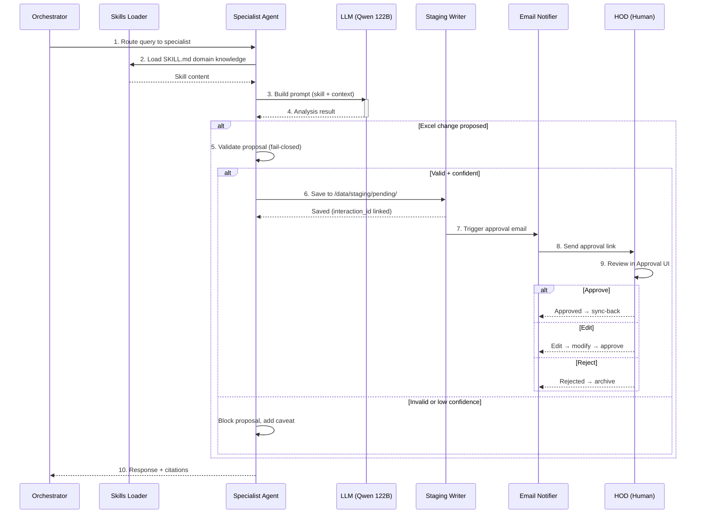
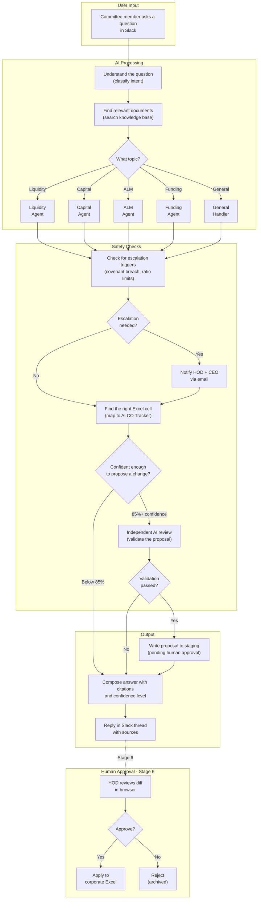

# Stage 5 — All Agents + Staging Writer Implementation Plan

> **For agentic workers:** REQUIRED SUB-SKILL: Use superpowers:subagent-driven-development (recommended) or superpowers:executing-plans to implement this plan task-by-task. Steps use checkbox (`- [ ]`) syntax for tracking.

**Goal:** Replace smart stub agents with real prompt-based reasoning chains powered by SKILL.md domain knowledge, wire AsyncPostgresSaver for multi-turn conversations, build email-notifier stub, harden validation, and add audit trail linking.

**Architecture:** Bottom-up approach: SKILL.md content first → SkillsLoader → refactored BaseAgent with DI → 4 specialist agents using LLM + skills → checkpointer for multi-turn → audit trail FK → email-notifier stub → escalation wiring → validation hardening → integration tests.

**Tech Stack:** Python 3.11, FastAPI, LangGraph 0.2+, langgraph-checkpoint-postgres, psycopg, httpx, Pydantic v2, structlog, pytest-asyncio

**Design Spec:** `docs/superpowers/specs/2026-03-31-stage5-agents-staging-design.md`

**Team Agents:** Backend (infrastructure, agent code, graph wiring) + QA (skills content, tests, validation)

---

## System Overview

### Specialist Agents & Staging Pipeline

```mermaid
flowchart TD
    subgraph SKILLS["Skill Loading"]
        SL["Skills Loader<br/>reads SKILL.md files"]
        SK_F["funding-facilities.md"]
        SK_L["liquidity-analysis.md"]
        SK_C["capital-allocation.md"]
        SK_A["alm-review.md"]
    end

    subgraph AGENTS["Agent Processing"]
        BA["Base Agent<br/>(loads domain knowledge)"]
        FUND["Funding Agent"]
        LIQ["Liquidity Agent"]
        CAP["Capital Agent"]
        ALM_A["ALM Agent"]
        ANALYZE["Analyze with<br/>LLM + skill context"]
        PROPOSE{{"Proposes Excel<br/>change?"}}
    end

    subgraph VALIDATE["Proposal Validation"]
        CONF{{"Confidence ><br/>threshold?"}}
        VALID{{"Validation<br/>passes?"}}
        WRITE["Write to<br/>/data/staging/pending/"]
        BLOCK(("Block proposal<br/>(fail-closed)"))
        CAVEAT["Include caveat<br/>in response"]
    end

    subgraph ESCALATION["Escalation"]
        ESC_CHK{{"Breach<br/>detected?"}}
        NOTIFY["Notify HOD<br/>via email-notifier"]
    end

    subgraph APPROVAL["Approval (Stage 6)"]
        EMAIL["Email HOD<br/>with approval link"]
        HOD_UI["HOD opens<br/>Approval UI"]
        DECIDE{{"HOD<br/>Decision?"}}
        SYNC["Sync-back<br/>to corporate"]
        EDIT["Edit then<br/>approve"]
        REJ["Move to<br/>rejected/"]
    end

    RESP(["Return response<br/>with citations"])

    SL --> SK_F & SK_L & SK_C & SK_A
    SK_F --> FUND
    SK_L --> LIQ
    SK_C --> CAP
    SK_A --> ALM_A
    BA --> FUND & LIQ & CAP & ALM_A
    FUND & LIQ & CAP & ALM_A --> ANALYZE
    ANALYZE --> PROPOSE
    PROPOSE -->|"No"| RESP
    PROPOSE -->|"Yes"| CONF
    CONF -->|"Low"| CAVEAT --> RESP
    CONF -->|"High"| VALID
    VALID -->|"Fail"| BLOCK
    VALID -->|"Pass"| WRITE

    WRITE --> EMAIL --> HOD_UI --> DECIDE
    DECIDE -->|"Approve"| SYNC
    DECIDE -->|"Edit"| EDIT
    DECIDE -->|"Reject"| REJ

    ANALYZE --> ESC_CHK
    ESC_CHK -->|"No"| RESP
    ESC_CHK -->|"Yes"| NOTIFY --> RESP

    classDef automated fill:#e1f0ff,stroke:#4a90d9,color:#333
    classDef human fill:#e1f5e1,stroke:#4caf50,color:#333
    classDef external fill:#fff3e0,stroke:#ff9800,color:#333

    class SL,SK_F,SK_L,SK_C,SK_A,BA,FUND,LIQ,CAP,ALM_A,ANALYZE,CONF,VALID,WRITE automated
    class PROPOSE,ESC_CHK automated
    class NOTIFY,EMAIL,HOD_UI,DECIDE,SYNC,EDIT,REJ human
```



> **Legend:** 🔵 Blue = Automated processing · 🟢 Green = Human actions / approval gates

### Agent Skill Loading → Proposal → Approval



## File Structure

### New Files
| File | Responsibility |
|------|---------------|
| `migrations/002_add_interaction_fk.sql` | SQL migration: add interaction_id FK + index to staging_proposals |
| `services/cac-orchestrator/src/nodes/notify_escalation.py` | Fire-and-forget POST to email-notifier on escalation |
| `services/email-notifier/Dockerfile` | Container build for email-notifier stub |
| `services/email-notifier/requirements.txt` | FastAPI + uvicorn + structlog + pydantic |
| `services/email-notifier/src/__init__.py` | Package init |
| `services/email-notifier/src/main.py` | FastAPI app with /health + 4 /notify/* stubs |
| `services/email-notifier/src/models.py` | Pydantic models for notification payloads |
| `skills/shared/cfo-agent.md` | Shared skill: CFO Agent domain content (agent wired in Stage 7) |
| `tests/unit/cac_orchestrator/test_notify_escalation.py` | Tests for escalation notification node |
| `tests/unit/email_notifier/__init__.py` | Package init |
| `tests/unit/email_notifier/test_main.py` | Email-notifier endpoint tests |
| `tests/integration/test_staging_flow.py` | E2E: query → proposal with audit trail |
| `tests/integration/test_escalation_flow.py` | E2E: query → escalation → email notification |
| `skills/shared/rag-retrieval.md` | Shared skill: RAG context interpretation |
| `skills/shared/excel-navigation.md` | Shared skill: ALCO Tracker cell mapping |
| `skills/cac/covenant-monitoring.md` | CAC skill: covenant breach detection |

### Modified Files
| File | Changes |
|------|---------|
| `services/cac-orchestrator/src/skills/loader.py` | Replace module-level functions with `SkillsLoader` class (frontmatter stripping, agent skill loading) |
| `services/cac-orchestrator/src/agents/base.py` | Add DI (llm_client, skills_loader), implement `analyze()` with LLM calls |
| `services/cac-orchestrator/src/agents/liquidity.py` | Replace stub with skill-based prompt chain |
| `services/cac-orchestrator/src/agents/capital.py` | Replace stub with skill-based prompt chain |
| `services/cac-orchestrator/src/agents/alm.py` | Replace stub with skill-based prompt chain |
| `services/cac-orchestrator/src/agents/funding.py` | Replace stub with skill-based prompt chain |
| `services/cac-orchestrator/src/graph.py` | Add notify_escalation node, pass skills_loader + checkpointer |
| `services/cac-orchestrator/src/main.py` | Two-phase interaction logging, checkpointer setup, thread_id change |
| `services/cac-orchestrator/src/state.py` | Add `interaction_id`, `proposed_tab` fields |
| `services/cac-orchestrator/src/nodes/validate_proposal.py` | Fail-closed on parse error |
| `services/cac-orchestrator/src/nodes/staging_writer.py` | Pass interaction_id to log_proposal |
| `services/cac-orchestrator/src/tools/db_client.py` | Add `create_interaction()` and `update_interaction()` methods |
| `services/cac-orchestrator/src/config.py` | Add `email_notifier_url` setting |
| `services/cac-orchestrator/requirements.txt` | Add `psycopg[binary]` |
| `skills/shared/escalation-protocol.md` | Flesh out all 9 sections |
| `skills/shared/citation-format.md` | Flesh out all 9 sections |
| `skills/cac/liquidity-analysis.md` | Flesh out all 9 sections |
| `skills/cac/capital-allocation.md` | Flesh out all 9 sections |
| `skills/cac/alm-review.md` | Flesh out all 9 sections |
| `skills/cac/funding-facilities.md` | Flesh out all 9 sections |
| `docker-compose.yml` | Add email-notifier service entry |

---

## Mermaid Dataflow Diagram (Non-Technical)



### How to Read This Diagram

**Start at the top:** A committee member asks a question in Slack (e.g., "What's our current LCR?")

**AI Processing:** The system figures out the topic, searches the knowledge base for relevant documents, then routes to the right specialist agent (Liquidity, Capital, ALM, or Funding).

**Safety Checks:** Every response is checked for escalation triggers (e.g., covenant breach → email to HOD/CEO). If the agent proposes an Excel change, it must be 85%+ confident, and an independent AI review validates it.

**Output:** Approved proposals go to a staging area (NOT directly to the spreadsheet). The answer with citations is posted back to the Slack thread.

**Human Approval (Stage 6):** A human (HOD) reviews the proposed change in a browser. Only after approval does the change get applied.

---

## Task 1: Flesh Out Shared SKILL.md Files (QA Agent)

**Files:**
- Modify: `Brooker_Corporate_Agent/skills/shared/escalation-protocol.md`
- Modify: `Brooker_Corporate_Agent/skills/shared/citation-format.md`
- Create: `Brooker_Corporate_Agent/skills/shared/rag-retrieval.md`
- Create: `Brooker_Corporate_Agent/skills/shared/excel-navigation.md`

- [ ] **Step 1: Write `escalation-protocol.md`**

Replace the existing placeholder content with full 9-section content:

```markdown
---
name: escalation-protocol
agent: all
dept: shared
version: 1.0
---

## Mandate
Define when and how agents must escalate issues to human decision-makers. This protocol applies to ALL specialist agents and overrides agent-specific thresholds when conflicts arise.

## Tone & Style
- Use formal financial language: "breach", "threshold", "notification required"
- Be precise with numbers: always include the exact metric value and threshold
- Never soften language for escalation events: state facts directly

## Domain Knowledge
Escalation tiers:
- **Critical (Immediate):** Covenant breach, regulatory non-compliance, liquidity ratio below minimum
- **High (24h):** Approaching threshold (within 10% of limit), significant deviation from forecast
- **Medium (7d):** Trend warnings, repeated near-misses, unusual patterns
- **Low (30d):** Minor deviations, informational alerts

Key thresholds (from escalation_rules.json):
- Covenant ratio breach: net debt/EBITDA > 4.0x
- Liquidity coverage ratio (LCR) < 100%
- Capital adequacy ratio (CAR) < 12.5%
- Interest rate sensitivity gap > 15% of total assets

## Retrieval Instructions
- Always check escalation_rules.json for current thresholds
- Search cac_docs collection for recent board-approved threshold changes
- Cross-reference with cac_chat for any temporary waivers or exemptions

## Staging Proposal Rules
- Escalation events NEVER generate staging proposals
- Escalation is informational only — no Excel changes
- Always log to escalations table with severity and detail

## Excel Navigation
Not applicable — escalation protocol does not modify Excel.

## Escalation Triggers
See Domain Knowledge section above for all triggers and tiers.

## Output Format
When escalation is triggered, include in response:
```
⚠️ ESCALATION: [severity] — [trigger_type]
Detail: [specific metric and threshold]
Action: HOD and CEO notified via email
```

## Hard Rules
- NEVER suppress or delay a Critical escalation
- NEVER modify escalation thresholds without board approval
- ALWAYS include the exact numeric value that triggered escalation
- Escalation notifications are fire-and-forget — pipeline continues regardless of email delivery
```

- [ ] **Step 2: Write `citation-format.md`**

```markdown
---
name: citation-format
agent: all
dept: shared
version: 1.0
---

## Mandate
Define the standard citation format for all agent responses. Every factual claim must be traceable to a specific source document or message.

## Tone & Style
- Citations are inline, enclosed in square brackets
- Format: [Source: filename, page X] or [Source: Slack #channel | Author | date]
- Multiple sources separated by semicolons

## Domain Knowledge
Source types:
- **Documents:** [Source: ALCO_Tracker.xlsx, Liquidity tab]
- **Chat messages:** [Source: Slack #cac-committee | Jane Doe | 2026-03-24]
- **Knowledge base:** [Source: KB: liquidity-policy-2026.md]
- **Multiple:** [Sources: ALCO_Tracker.xlsx, Liquidity tab; Slack #cac-committee | CEO]

## Retrieval Instructions
- Every claim must map to at least one retrieved source
- If no source supports a claim, prefix with "Based on general financial principles: "
- Never fabricate or hallucinate source references

## Staging Proposal Rules
- Every staging proposal MUST include a source citation in the reasoning field
- The source_excerpt field must contain the actual text from the source
- Proposals without citations are automatically blocked

## Excel Navigation
Not applicable — citation format is cross-cutting.

## Escalation Triggers
Not applicable — citation format does not trigger escalation.

## Output Format
Inline citations: "The current LCR stands at 125% [Source: ALCO_Tracker.xlsx, Liquidity tab], which exceeds the regulatory minimum of 100%."

## Hard Rules
- NEVER present information without a citation
- NEVER fabricate source references
- ALWAYS use the exact filename from the retrieved sources
- If confidence in source mapping is below 0.70, state "Source uncertain" explicitly
```

- [ ] **Step 3: Write `rag-retrieval.md`**

```markdown
---
name: rag-retrieval
agent: all
dept: shared
version: 1.0
---

## Mandate
Guide agents on how to interpret and use retrieved context from the Qdrant vector store. Defines relevance thresholds, multi-source synthesis rules, and context quality assessment.

## Tone & Style
- Treat retrieved context as evidence, not as absolute truth
- Always assess relevance and recency before incorporating
- Explicitly note when retrieved context is stale or contradictory

## Domain Knowledge
Qdrant collections:
- **cac_docs:** Uploaded documents (Excel trackers, PDFs, reports)
- **cac_chat:** Indexed Slack messages from committee channels
- **cac_knowledge:** Obsidian vault knowledge base entries
- **shared_policies:** Cross-department policy documents

Relevance scoring:
- **0.90+:** High confidence — use as primary evidence
- **0.80-0.89:** Good — use with light verification
- **0.70-0.79:** Marginal — use only if no better sources
- **Below 0.70:** Filtered out by retrieval pipeline

## Retrieval Instructions
- Top-8 results returned per query (configurable)
- Minimum relevance threshold: 0.70
- Prioritize cac_docs over cac_chat for financial data
- Prioritize cac_chat over cac_docs for recent discussions and decisions
- Synthesize across collections — do not rely on a single collection

## Staging Proposal Rules
- Proposals require at least one source with relevance >= 0.80
- Source excerpt must be included verbatim (first 200 chars)
- If only marginal sources available, do not propose — provide analysis only

## Excel Navigation
Not applicable — retrieval is cross-cutting.

## Escalation Triggers
Not applicable — retrieval does not trigger escalation.

## Output Format
When citing retrieved context:
- Include relevance score in internal reasoning (not in user-facing response)
- User-facing: use citation format from citation-format.md
- Internal: log source quality metrics for audit

## Hard Rules
- NEVER use context below 0.70 relevance
- NEVER present a single low-relevance source as definitive
- ALWAYS disclose when context may be outdated (check date metadata)
- If no relevant context found, say "I don't have sufficient information" — never hallucinate
```

- [ ] **Step 4: Write `excel-navigation.md`**

```markdown
---
name: excel-navigation
agent: all
dept: shared
version: 1.0
---

## Mandate
Define how agents map proposed values to specific cells in the ALCO Tracker Excel workbook. All cell references must be validated against the alco_tracker.json schema.

## Tone & Style
- Cell references use A1 notation: "E8", "D12", "B3"
- Tab names match Excel exactly (case-sensitive): "Liquidity", "Capital", "ALM", "Funding Facilities"
- Always include tab + cell in proposals

## Domain Knowledge
ALCO Tracker structure (from alco_tracker.json):
- **Liquidity tab:** Current ratio (D8), Quick ratio (D9), LCR (D10), NSFR (D11), Cash position (D12)
- **Capital tab:** CAR (D8), CET1 (D9), Tier 1 (D10), RWA (D11), Leverage ratio (D12)
- **ALM tab:** Duration gap (D8), NII sensitivity (D9), EVE sensitivity (D10), Repricing gap (D11)
- **Funding Facilities tab:** Total drawn (D8), Total available (D9), Utilization % (D10), Covenant ratio (E8)

Note: These are indicative mappings. Always verify against alco_tracker.json for current cell positions.

## Retrieval Instructions
- Load alco_tracker.json schema at agent startup
- Map proposed values to cells using the schema's row/column definitions
- If the target cell cannot be identified, do not propose — provide analysis only

## Staging Proposal Rules
- Every proposal MUST include: file, tab, cell, old_value (if known), new_value
- Cell references must exist in alco_tracker.json
- If schema doesn't cover the target metric, flag as "unmapped" and do not propose

## Excel Navigation
This IS the excel navigation skill — defines the master rules for all agents.

## Escalation Triggers
Not applicable — navigation itself does not trigger escalation.

## Output Format
When proposing changes, include in reasoning:
"Mapped to: ALCO_Tracker.xlsx → [Tab Name] → Cell [XX] (column: [description], row: [description])"

## Hard Rules
- NEVER propose a cell update without validating against alco_tracker.json
- NEVER guess cell references — if unsure, provide analysis only
- ALWAYS include the tab name with every cell reference
- old_value should be populated from the most recent known value (from retrieval)
```

- [ ] **Step 5: Write `cfo-agent.md` (5th shared skill per PRD)**

```markdown
---
name: cfo-agent
agent: cfo-agent
dept: shared
version: 1.0
---

## Mandate
CFO oversight agent providing whole-of-firm view across all CAC domains. Synthesizes inputs from Liquidity, Capital, ALM, and Funding agents for board-level reporting and strategic allocation decisions.

Note: This skill file defines domain content for Stage 7 (Paperclip integration). The CFO Agent is NOT wired into the graph until Stage 7.

## Tone & Style
- Board-level executive language: concise, strategic, decision-oriented
- Summarize across domains: "Liquidity is adequate, capital buffers are strong, funding utilization is within limits"
- Always lead with the overall risk posture before drilling into specifics

## Domain Knowledge
Cross-domain synthesis:
- **Liquidity + Funding:** Cash position adequacy relative to facility commitments
- **Capital + ALM:** Risk-weighted asset trends vs capital adequacy buffers
- **Funding + Capital:** Leverage implications of facility drawdowns
- **ALM + Liquidity:** Interest rate exposure impact on liquid asset values
- **Strategic allocation:** Capital deployment recommendations based on risk appetite

Board reporting metrics:
- Overall risk score (composite of all domain metrics)
- Key changes since last committee meeting
- Metrics approaching or breaching thresholds
- Recommended actions with priority ranking

## Retrieval Instructions
- Primary: cac_docs (ALCO Tracker all tabs, board papers)
- Secondary: cac_chat (committee discussions, strategic decisions)
- Tertiary: shared_policies (risk appetite statement, capital management framework)
- Synthesize across ALL collections — CFO view requires breadth

## Staging Proposal Rules
- CFO Agent does NOT propose individual cell updates (that is specialist agent work)
- CFO Agent may propose summary metrics if they exist in the ALCO Tracker
- Defer to specialist agents for specific metric proposals

## Excel Navigation
- CFO Agent reads from ALL tabs but proposes only to summary tabs (if they exist)
- Defer to specialist agents for tab-specific updates

## Escalation Triggers
- Multiple simultaneous threshold approaches across domains → Critical
- Board-level risk appetite breach → Critical (immediate to CEO)
- Year-end regulatory reporting discrepancies → High

## Output Format
```json
{
  "analysis": "Executive summary with cross-domain synthesis and [Source: ...] citations",
  "proposed_change": null,
  "confidence": 0.85,
  "escalation_flags": ["cross-domain risk: liquidity + capital approaching limits"]
}
```

## Hard Rules
- NEVER override specialist agent analysis — synthesize, do not contradict
- ALWAYS present the composite risk view before individual domain details
- NEVER propose cell updates that conflict with specialist agent proposals
- If specialist agents disagree, flag the disagreement for human resolution
```

- [ ] **Step 6: Commit shared skills**

```bash
cd Brooker_Corporate_Agent
git add skills/shared/escalation-protocol.md skills/shared/citation-format.md skills/shared/rag-retrieval.md skills/shared/excel-navigation.md skills/shared/cfo-agent.md
git commit -m "feat(skills): flesh out 5 shared SKILL.md files with full domain content"
```

---

## Task 2: Flesh Out CAC Agent SKILL.md Files (QA Agent)

**Files:**
- Modify: `Brooker_Corporate_Agent/skills/cac/liquidity-analysis.md`
- Modify: `Brooker_Corporate_Agent/skills/cac/capital-allocation.md`
- Modify: `Brooker_Corporate_Agent/skills/cac/alm-review.md`
- Modify: `Brooker_Corporate_Agent/skills/cac/funding-facilities.md`
- Create: `Brooker_Corporate_Agent/skills/cac/covenant-monitoring.md`

- [ ] **Step 1: Write `liquidity-analysis.md`**

Replace placeholder with full 9-section content:

```markdown
---
name: liquidity-analysis
agent: liquidity-agent
dept: cac
version: 1.0
---

## Mandate
Specialist liquidity analysis agent for the CAC committee. Reviews liquidity ratios, current ratio, quick ratio, LCR, NSFR, and cash flow projections against regulatory and internal thresholds. Provides analysis with citations and proposes ALCO Tracker updates when data supports it.

## Tone & Style
- Formal financial analysis language
- Always quote exact numbers with 2 decimal places for ratios
- Compare values against thresholds: "LCR of 118.50% exceeds the 100% regulatory minimum by 18.50pp"
- Use basis points (bps) for small changes, percentage points (pp) for larger

## Domain Knowledge
Key liquidity metrics:
- **Current Ratio:** Current Assets / Current Liabilities (target: > 1.20)
- **Quick Ratio:** (Current Assets - Inventory) / Current Liabilities (target: > 1.00)
- **LCR (Liquidity Coverage Ratio):** HQLA / Net Cash Outflows over 30 days (regulatory min: 100%)
- **NSFR (Net Stable Funding Ratio):** Available Stable Funding / Required Stable Funding (regulatory min: 100%)
- **Cash Position:** Total liquid assets available within 24 hours
- **HQLA (High-Quality Liquid Assets):** Level 1 (cash, govt bonds) + Level 2A + Level 2B with haircuts

Regulatory framework: Basel III liquidity requirements, local banking authority guidelines.

## Retrieval Instructions
- Primary collection: cac_docs (ALCO Tracker, liquidity reports)
- Secondary: cac_chat (committee discussions about liquidity)
- Tertiary: shared_policies (liquidity policy documents)
- Focus keywords: liquidity, LCR, NSFR, current ratio, quick ratio, cash flow, HQLA
- Prioritize most recent data — liquidity positions change frequently

## Staging Proposal Rules
- Propose updates ONLY when a specific numeric value is mentioned in a credible source
- Required confidence: >= 0.85
- Must cite the exact source excerpt containing the value
- If multiple sources conflict, do NOT propose — report the discrepancy instead
- Valid proposal targets: D8-D12 on Liquidity tab (per alco_tracker.json)

## Excel Navigation
- Tab: "Liquidity"
- Current ratio: D8
- Quick ratio: D9
- LCR: D10
- NSFR: D11
- Cash position: D12

## Escalation Triggers
- LCR < 100% → Critical (immediate)
- NSFR < 100% → Critical (immediate)
- Current ratio < 1.00 → High (24h)
- LCR < 110% → Medium (approaching threshold)
- Cash position decline > 20% month-over-month → High (24h)

## Output Format
```json
{
  "analysis": "Detailed liquidity analysis with [Source: ...] citations",
  "proposed_change": {
    "value": "1.18",
    "cell": "D10",
    "tab": "Liquidity",
    "reasoning": "CFO report states LCR at 118% [Source: Q1_Liquidity_Report.pdf, p.3]"
  },
  "confidence": 0.91,
  "escalation_flags": []
}
```

## Hard Rules
- NEVER propose a cell update without a source citation
- ALWAYS flag liquidity ratios below regulatory minimums
- NEVER average conflicting liquidity values — report the discrepancy
- If asked about non-liquidity topics, defer to the appropriate specialist agent
```

- [ ] **Step 2: Write `capital-allocation.md`**

```markdown
---
name: capital-allocation
agent: capital-agent
dept: cac
version: 1.0
---

## Mandate
Specialist capital adequacy and allocation agent. Reviews CAR, CET1, RWA, ICAAP, capital buffers, and stress testing results against regulatory and internal thresholds.

## Tone & Style
- Formal regulatory language with precise numeric citations
- Express capital ratios as percentages to 2 decimal places
- Reference Basel III/IV framework when discussing regulatory requirements
- Compare against both regulatory minimums and internal targets

## Domain Knowledge
Key capital metrics:
- **CAR (Capital Adequacy Ratio):** Total Capital / RWA (regulatory min: 8%, internal target: 12.5%)
- **CET1 (Common Equity Tier 1):** CET1 Capital / RWA (regulatory min: 4.5%, with buffers: ~10.5%)
- **Tier 1 Ratio:** Tier 1 Capital / RWA (regulatory min: 6%)
- **RWA (Risk-Weighted Assets):** Sum of credit, market, and operational risk-weighted exposures
- **Leverage Ratio:** Tier 1 Capital / Total Exposure (min: 3%)
- **Capital Buffers:** Conservation (2.5%), Countercyclical (0-2.5%), D-SIB (if applicable)
- **ICAAP:** Internal Capital Adequacy Assessment Process — annual stress testing

## Retrieval Instructions
- Primary: cac_docs (ALCO Tracker capital tab, ICAAP reports)
- Secondary: shared_policies (capital management policy)
- Focus keywords: CAR, CET1, RWA, tier 1, leverage ratio, capital buffer, ICAAP, stress test

## Staging Proposal Rules
- Propose updates when a specific capital metric value appears in credible sources
- Required confidence: >= 0.85
- Must include source excerpt with the exact value
- Valid targets: D8-D12 on Capital tab

## Excel Navigation
- Tab: "Capital"
- CAR: D8
- CET1: D9
- Tier 1 ratio: D10
- RWA: D11
- Leverage ratio: D12

## Escalation Triggers
- CAR < 12.5% → Critical (immediate)
- CET1 < 7.0% (including buffers) → Critical (immediate)
- RWA increase > 15% quarter-over-quarter → High (24h)
- Leverage ratio < 3.5% → High (24h)

## Output Format
Same JSON structure as liquidity-analysis.md.

## Hard Rules
- NEVER propose capital ratio updates without citing the source calculation
- ALWAYS flag ratios approaching regulatory minimums (within 10% buffer)
- NEVER mix up CET1 and total capital ratios
- If stress test results conflict with reported ratios, flag both values
```

- [ ] **Step 3: Write `alm-review.md`**

```markdown
---
name: alm-review
agent: alm-agent
dept: cac
version: 1.0
---

## Mandate
Specialist Asset-Liability Management agent. Reviews interest rate risk, duration gap, NII sensitivity, EVE sensitivity, and repricing gap analysis.

## Tone & Style
- Technical ALM language with precise basis point measurements
- Express duration in years (e.g., "2.35 years"), sensitivity in basis points
- Reference regulatory guidelines (IRRBB — Interest Rate Risk in the Banking Book)

## Domain Knowledge
Key ALM metrics:
- **Duration Gap:** Duration of Assets - Duration of Liabilities (target: < 2.0 years)
- **NII Sensitivity:** Change in Net Interest Income for +/- 100bps parallel shift
- **EVE Sensitivity:** Change in Economic Value of Equity for +/- 200bps shock
- **Repricing Gap:** Assets repricing minus liabilities repricing per time bucket
- **Time buckets:** Overnight, 1-30d, 31-90d, 91-180d, 181-365d, 1-2y, 2-5y, >5y

## Retrieval Instructions
- Primary: cac_docs (ALCO Tracker ALM tab, ALM reports)
- Secondary: shared_policies (ALM policy, interest rate risk framework)
- Focus keywords: duration gap, NII, EVE, repricing, interest rate risk, IRRBB

## Staging Proposal Rules
- Propose when ALM metrics are explicitly stated in credible sources
- Required confidence: >= 0.85
- Valid targets: D8-D11 on ALM tab

## Excel Navigation
- Tab: "ALM"
- Duration gap: D8
- NII sensitivity: D9
- EVE sensitivity: D10
- Repricing gap: D11

## Escalation Triggers
- Duration gap > 3.0 years → Critical (immediate)
- NII sensitivity > 15% of net income → High (24h)
- EVE sensitivity > 20% of equity → Critical (immediate)

## Output Format
Same JSON structure as liquidity-analysis.md.

## Hard Rules
- NEVER propose ALM updates without citing the source model or report
- ALWAYS express sensitivities with the scenario (e.g., "+100bps parallel shift")
- NEVER mix up NII and EVE sensitivities
- If asked about non-ALM topics, defer to the appropriate agent
```

- [ ] **Step 4: Write `funding-facilities.md`**

```markdown
---
name: funding-facilities
agent: funding-agent
dept: cac
version: 1.0
---

## Mandate
Specialist funding facilities agent. Reviews facility utilization, covenant compliance, maturity profiles, rollover risk, and borrowing costs.

## Tone & Style
- Formal credit language: "drawn", "committed", "utilization", "covenant"
- Express amounts in millions (e.g., "$150M drawn of $300M facility")
- Covenant ratios to 2 decimal places

## Domain Knowledge
Key funding metrics:
- **Total Drawn:** Sum of all drawn facility amounts
- **Total Available:** Sum of all committed facility limits
- **Utilization %:** Total Drawn / Total Available (warning if > 80%)
- **Covenant Ratio:** Net Debt / EBITDA (typical limit: < 4.0x)
- **Maturity Profile:** Distribution of facility maturities over next 12 months
- **Rollover Risk:** Facilities maturing within 90 days without confirmed renewal
- **Weighted Average Cost:** Blended cost of all drawn facilities

## Retrieval Instructions
- Primary: cac_docs (ALCO Tracker funding tab, facility agreements)
- Secondary: cac_chat (discussions about facility renewals, covenant waivers)
- Focus keywords: facility, drawn, covenant, utilization, maturity, rollover, renewal

## Staging Proposal Rules
- Propose when facility metrics are explicitly stated in credible sources
- Required confidence: >= 0.85
- Valid targets: D8-D10, E8 on Funding Facilities tab

## Excel Navigation
- Tab: "Funding Facilities"
- Total drawn: D8
- Total available: D9
- Utilization %: D10
- Covenant ratio: E8

## Escalation Triggers
- Covenant ratio > 4.0x → Critical (immediate)
- Utilization > 90% → High (24h)
- Facility maturing within 30 days without renewal → Critical (immediate)
- Covenant ratio > 3.5x → Medium (approaching threshold)

## Output Format
Same JSON structure as liquidity-analysis.md.

## Hard Rules
- NEVER propose covenant ratio updates without citing the source calculation components
- ALWAYS flag covenant ratios within 10% of the limit
- NEVER assume facility renewals — treat unconfirmed renewals as rollover risk
- If covenant cure period is active, note it explicitly
```

- [ ] **Step 5: Write `covenant-monitoring.md`**

```markdown
---
name: covenant-monitoring
agent: all
dept: cac
version: 1.0
---

## Mandate
Cross-agent skill for covenant breach detection and monitoring. All specialist agents must check covenant compliance when their analysis touches covenant-relevant metrics.

## Tone & Style
- Use precise legal/financial language: "breach", "cure period", "waiver", "notification"
- Always state both the covenant limit and the current value
- Never downplay covenant breaches — they have legal consequences

## Domain Knowledge
Common covenants:
- **Leverage ratio:** Net Debt / EBITDA (typical: < 4.0x)
- **Interest coverage:** EBITDA / Interest Expense (typical: > 3.0x)
- **Current ratio:** Current Assets / Current Liabilities (typical: > 1.20x)
- **Minimum net worth:** Total equity floor (varies by facility)
- **Capital expenditure cap:** Annual capex limit

Cure mechanisms:
- Cure periods: typically 30-60 days from breach detection
- Equity cure: injection of equity to restore compliance
- Waiver: lender agreement to temporarily ignore breach

## Retrieval Instructions
- Check escalation_rules.json for current covenant thresholds
- Search cac_docs for facility agreements containing covenant schedules
- Search cac_chat for any recent waiver discussions or cure actions

## Staging Proposal Rules
- Covenant status itself is NOT proposed to Excel
- Metrics that affect covenant compliance ARE proposed via their respective agents
- If a proposed change would cause a covenant breach, BLOCK the proposal

## Excel Navigation
Not applicable — covenant monitoring is cross-cutting. Individual metrics are managed by their respective agents.

## Escalation Triggers
- Any covenant breach → Critical (immediate)
- Within 10% of any covenant limit → Medium (approaching threshold)
- Cure period expiring within 7 days → High (24h)

## Output Format
When covenant issue detected:
```
⚠️ COVENANT ALERT: [covenant type]
Current: [value] | Limit: [threshold] | Headroom: [margin]
Status: [compliant/approaching/breached]
Cure period: [if applicable]
```

## Hard Rules
- NEVER suppress a covenant breach detection
- ALWAYS check all relevant covenants when updating financial metrics
- NEVER assume a waiver exists unless explicitly found in retrieved context
- If multiple covenants are affected, report ALL of them
```

- [ ] **Step 6: Commit CAC skills**

```bash
cd Brooker_Corporate_Agent
git add skills/cac/liquidity-analysis.md skills/cac/capital-allocation.md skills/cac/alm-review.md skills/cac/funding-facilities.md skills/cac/covenant-monitoring.md
git commit -m "feat(skills): flesh out 5 CAC SKILL.md files with full domain content"
```

---

## Task 3: Build SkillsLoader Class (Backend Agent)

> **Note:** The existing `services/cac-orchestrator/src/skills/loader.py` has module-level `load_skill()` and `clear_cache()` functions. We REPLACE this with a `SkillsLoader` class that adds frontmatter stripping and agent skill concatenation. The existing `test_skills_loader.py` tests will be rewritten.

**Files:**
- Modify: `Brooker_Corporate_Agent/services/cac-orchestrator/src/skills/loader.py` (replace module-level functions with class)
- Modify: `Brooker_Corporate_Agent/tests/unit/cac_orchestrator/test_skills_loader.py` (rewrite for class API)

- [ ] **Step 1: Write failing tests for SkillsLoader**

Update `tests/unit/cac_orchestrator/test_skills_loader.py` — add tests for the new loader:

```python
"""Tests for SkillsLoader."""
from __future__ import annotations

import os
import pytest
import tempfile

from services.cac_orchestrator.src.skills.loader import SkillsLoader


@pytest.fixture
def skills_dir(tmp_path):
    """Create a temporary skills directory with test files."""
    shared = tmp_path / "shared"
    shared.mkdir()
    cac = tmp_path / "cac"
    cac.mkdir()

    (shared / "citation-format.md").write_text(
        "---\nname: citation-format\nagent: all\n---\n\n## Mandate\nCitation rules here."
    )
    (shared / "escalation-protocol.md").write_text(
        "---\nname: escalation-protocol\nagent: all\n---\n\n## Mandate\nEscalation rules."
    )
    (cac / "liquidity-analysis.md").write_text(
        "---\nname: liquidity-analysis\nagent: liquidity-agent\n---\n\n## Mandate\nLiquidity analysis."
    )
    return str(tmp_path)


@pytest.mark.asyncio
async def test_load_skill_strips_frontmatter(skills_dir: str) -> None:
    loader = SkillsLoader(skills_dir)
    content = await loader.load_skill("shared/citation-format")
    assert "---" not in content
    assert "name: citation-format" not in content
    assert "## Mandate" in content
    assert "Citation rules here." in content


@pytest.mark.asyncio
async def test_load_skill_caches(skills_dir: str) -> None:
    loader = SkillsLoader(skills_dir)
    content1 = await loader.load_skill("shared/citation-format")
    content2 = await loader.load_skill("shared/citation-format")
    assert content1 == content2
    assert "shared/citation-format" in loader._cache


@pytest.mark.asyncio
async def test_load_skill_missing_returns_empty(skills_dir: str) -> None:
    loader = SkillsLoader(skills_dir)
    content = await loader.load_skill("cac/nonexistent")
    assert content == ""


@pytest.mark.asyncio
async def test_load_agent_skills_combines_shared_and_agent(skills_dir: str) -> None:
    loader = SkillsLoader(skills_dir)
    content = await loader.load_agent_skills("liquidity-agent", "cac/liquidity-analysis")
    assert "Citation rules here." in content
    assert "Escalation rules." in content
    assert "Liquidity analysis." in content


@pytest.mark.asyncio
async def test_clear_cache(skills_dir: str) -> None:
    loader = SkillsLoader(skills_dir)
    await loader.load_skill("shared/citation-format")
    assert len(loader._cache) > 0
    loader.clear_cache()
    assert len(loader._cache) == 0
```

- [ ] **Step 2: Run tests to verify they fail**

```bash
cd Brooker_Corporate_Agent && python -m pytest tests/unit/cac_orchestrator/test_skills_loader.py -v
```
Expected: FAIL — `ImportError: cannot import name 'SkillsLoader'`

- [ ] **Step 3: Implement SkillsLoader**

Replace `services/cac-orchestrator/src/skills/loader.py` (the existing module-level functions are replaced with a class):

```python
"""SKILL.md file loader with frontmatter stripping and caching."""
from __future__ import annotations

import os
import re

import aiofiles
import structlog

logger = structlog.get_logger("cac-orchestrator.skills")

_FRONTMATTER_RE = re.compile(r"^---\s*\n.*?\n---\s*\n", re.DOTALL)


class SkillsLoader:
    """Load and cache SKILL.md files for agent prompt injection."""

    def __init__(self, skills_dir: str) -> None:
        self._skills_dir = skills_dir
        self._cache: dict[str, str] = {}

    async def load_skill(self, skill_path: str) -> str:
        """Load a SKILL.md file, strip frontmatter, cache result.

        Args:
            skill_path: Relative path without .md extension, e.g. "cac/liquidity-analysis"

        Returns:
            Skill content with frontmatter stripped. Empty string if file not found.
        """
        if skill_path in self._cache:
            return self._cache[skill_path]

        full_path = os.path.join(self._skills_dir, f"{skill_path}.md")
        try:
            async with aiofiles.open(full_path, encoding="utf-8") as f:
                raw = await f.read()
        except FileNotFoundError:
            logger.warning("skill_not_found", path=full_path)
            self._cache[skill_path] = ""
            return ""

        content = _FRONTMATTER_RE.sub("", raw).strip()
        self._cache[skill_path] = content
        logger.info("skill_loaded", path=skill_path, chars=len(content))
        return content

    async def load_agent_skills(self, agent_name: str, agent_skill_path: str) -> str:
        """Load agent-specific skill + all shared skills, concatenated.

        Args:
            agent_name: Agent identifier (e.g. "liquidity-agent")
            agent_skill_path: Relative path to agent's skill (e.g. "cac/liquidity-analysis")

        Returns:
            Concatenated skill content: shared skills + agent skill.
        """
        parts: list[str] = []

        # Load all shared skills
        shared_dir = os.path.join(self._skills_dir, "shared")
        if os.path.isdir(shared_dir):
            for fname in sorted(os.listdir(shared_dir)):
                if fname.endswith(".md"):
                    skill_name = f"shared/{fname[:-3]}"
                    content = await self.load_skill(skill_name)
                    if content:
                        parts.append(f"# Shared Skill: {fname[:-3]}\n\n{content}")

        # Load agent-specific skill
        agent_content = await self.load_skill(agent_skill_path)
        if agent_content:
            parts.append(f"# Agent Skill: {agent_name}\n\n{agent_content}")

        return "\n\n---\n\n".join(parts)

    def clear_cache(self) -> None:
        """Clear the in-memory skill cache."""
        self._cache.clear()
```

- [ ] **Step 4: Run tests to verify they pass**

```bash
cd Brooker_Corporate_Agent && python -m pytest tests/unit/cac_orchestrator/test_skills_loader.py -v
```
Expected: All 5 tests PASS

- [ ] **Step 5: Commit**

```bash
git add services/cac-orchestrator/src/skills/loader.py tests/unit/cac_orchestrator/test_skills_loader.py
git commit -m "feat(cac-orchestrator): replace module-level skill loader with SkillsLoader class"
```

---

## Task 4: Refactor BaseAgent with Dependency Injection (Backend Agent)

**Files:**
- Modify: `Brooker_Corporate_Agent/services/cac-orchestrator/src/agents/base.py`
- Modify: `Brooker_Corporate_Agent/services/cac-orchestrator/src/state.py`

- [ ] **Step 1: Add new fields to AgentState**

Edit `services/cac-orchestrator/src/state.py` — add `interaction_id` and `proposed_tab`:

```python
    # metadata
    processing_start: float
    paperclip_ticket_id: str | None

    # Stage 5 additions
    interaction_id: int | None
    proposed_tab: str | None
```

- [ ] **Step 2: Refactor BaseAgent with DI and LLM-based analyze**

Replace `services/cac-orchestrator/src/agents/base.py`:

```python
"""Base agent ABC for specialist agents."""
from __future__ import annotations

import json
import re
import time
from abc import ABC, abstractmethod

import structlog

from ..skills.loader import SkillsLoader
from ..tools.llm_client import LLMClient

logger = structlog.get_logger("cac-orchestrator.agent")

_JSON_BLOCK_RE = re.compile(r"```(?:json)?\s*\n(.*?)\n```", re.DOTALL)


class BaseAgent(ABC):
    """Abstract base class for specialist CAC agents with LLM + skills."""

    def __init__(self, llm_client: LLMClient, skills_loader: SkillsLoader) -> None:
        self._llm = llm_client
        self._skills = skills_loader

    @property
    @abstractmethod
    def name(self) -> str:
        """Agent identifier (e.g., 'liquidity-agent')."""
        ...

    @property
    @abstractmethod
    def skill_path(self) -> str:
        """Relative path to agent's SKILL.md (e.g., 'cac/liquidity-analysis')."""
        ...

    async def analyze(self, state: dict) -> dict:
        """Analyze query using SKILL.md + RAG context + LLM.

        Returns: {"agent_response": str, "agent_name": str,
                  "proposed_value": str|None, "proposed_cell": str|None,
                  "proposed_tab": str|None, "confidence_score": float}
        """
        system_prompt = await self._build_system_prompt()
        user_prompt = self._build_user_prompt(state)

        try:
            raw = await self._llm.chat(
                [
                    {"role": "system", "content": system_prompt},
                    {"role": "user", "content": user_prompt},
                ],
                temperature=0.1,
                max_tokens=2048,
            )
            return self._parse_response(raw)
        except Exception as exc:
            logger.error("agent_llm_failed", agent=self.name, error=str(exc))
            return {
                "agent_response": f"Analysis unavailable due to processing error: {exc}",
                "agent_name": self.name,
                "proposed_value": None,
                "proposed_cell": None,
                "proposed_tab": None,
                "confidence_score": 0.0,
            }

    async def run(self, state: dict) -> dict:
        """Execute with timing and logging."""
        start = time.monotonic()
        result = await self.analyze(state)
        elapsed = (time.monotonic() - start) * 1000
        logger.info("agent_complete", agent=self.name, elapsed_ms=round(elapsed, 1))
        return result

    async def _build_system_prompt(self) -> str:
        """Load agent skill + shared skills, compose system prompt."""
        skills_content = await self._skills.load_agent_skills(self.name, self.skill_path)
        return (
            f"You are {self.name}, a specialist agent for the Capital Allocation & ALCO Committee.\n\n"
            f"Your domain knowledge and rules:\n\n{skills_content}\n\n"
            "Respond with a JSON object containing:\n"
            '- "analysis": your detailed response with [Source: ...] citations\n'
            '- "proposed_change": null OR {"value": "...", "cell": "...", "tab": "...", "reasoning": "..."}\n'
            '- "confidence": float 0.0-1.0\n'
            '- "escalation_flags": list of strings (empty if none)\n\n'
            "If you are not confident enough to propose a change, set proposed_change to null."
        )

    def _build_user_prompt(self, state: dict) -> str:
        """Compose user prompt from query + RAG context + history."""
        parts = [f"User query: {state.get('query', '')}"]

        context = state.get("context_text", "")
        if context:
            parts.append(f"\nRetrieved context:\n{context}")

        messages = state.get("messages", [])
        if messages:
            history = "\n".join(
                f"- {getattr(m, 'type', 'unknown')}: {getattr(m, 'content', str(m))}"
                for m in messages[-5:]  # Last 5 messages for context window
            )
            parts.append(f"\nConversation history:\n{history}")

        sources = state.get("sources", [])
        if sources:
            src_list = "\n".join(
                f"- {s.get('filename', 'unknown')} (relevance: {s.get('relevance_score', 0):.2f})"
                for s in sources[:5]
            )
            parts.append(f"\nAvailable sources:\n{src_list}")

        return "\n".join(parts)

    def _parse_response(self, raw: str) -> dict:
        """Parse LLM JSON response with fallback."""
        # Try to extract JSON from markdown code block
        match = _JSON_BLOCK_RE.search(raw)
        text = match.group(1) if match else raw

        try:
            data = json.loads(text)
        except json.JSONDecodeError:
            # Fallback: treat entire response as analysis text
            logger.warning("agent_json_parse_failed", agent=self.name)
            return {
                "agent_response": raw,
                "agent_name": self.name,
                "proposed_value": None,
                "proposed_cell": None,
                "proposed_tab": None,
                "confidence_score": 0.5,
            }

        proposed = data.get("proposed_change")
        return {
            "agent_response": data.get("analysis", raw),
            "agent_name": self.name,
            "proposed_value": proposed.get("value") if proposed else None,
            "proposed_cell": proposed.get("cell") if proposed else None,
            "proposed_tab": proposed.get("tab") if proposed else None,
            "confidence_score": float(data.get("confidence", 0.5)),
        }
```

- [ ] **Step 3: Run existing agent tests to see what breaks**

```bash
cd Brooker_Corporate_Agent && python -m pytest tests/unit/cac_orchestrator/test_agents.py -v
```
Expected: FAIL — agents now require `llm_client` and `skills_loader` constructor args

- [ ] **Step 4: Commit base refactor**

```bash
git add services/cac-orchestrator/src/agents/base.py services/cac-orchestrator/src/state.py
git commit -m "refactor(agents): add DI (llm_client, skills_loader) to BaseAgent"
```

---

## Task 5: Implement 4 Specialist Agents (Backend Agent)

**Files:**
- Modify: `Brooker_Corporate_Agent/services/cac-orchestrator/src/agents/liquidity.py`
- Modify: `Brooker_Corporate_Agent/services/cac-orchestrator/src/agents/capital.py`
- Modify: `Brooker_Corporate_Agent/services/cac-orchestrator/src/agents/alm.py`
- Modify: `Brooker_Corporate_Agent/services/cac-orchestrator/src/agents/funding.py`
- Modify: `Brooker_Corporate_Agent/tests/unit/cac_orchestrator/test_agents.py`

- [ ] **Step 1: Update all 4 agent files**

Each specialist agent is now thin — just defines `name` and `skill_path`. All logic lives in `BaseAgent.analyze()`.

`liquidity.py`:
```python
"""Liquidity analysis agent."""
from __future__ import annotations

from .base import BaseAgent


class LiquidityAgent(BaseAgent):
    @property
    def name(self) -> str:
        return "liquidity-agent"

    @property
    def skill_path(self) -> str:
        return "cac/liquidity-analysis"
```

`capital.py`:
```python
"""Capital allocation agent."""
from __future__ import annotations

from .base import BaseAgent


class CapitalAgent(BaseAgent):
    @property
    def name(self) -> str:
        return "capital-agent"

    @property
    def skill_path(self) -> str:
        return "cac/capital-allocation"
```

`alm.py`:
```python
"""Asset-Liability Management agent."""
from __future__ import annotations

from .base import BaseAgent


class AlmAgent(BaseAgent):
    @property
    def name(self) -> str:
        return "alm-agent"

    @property
    def skill_path(self) -> str:
        return "cac/alm-review"
```

`funding.py`:
```python
"""Funding facilities agent."""
from __future__ import annotations

from .base import BaseAgent


class FundingAgent(BaseAgent):
    @property
    def name(self) -> str:
        return "funding-agent"

    @property
    def skill_path(self) -> str:
        return "cac/funding-facilities"
```

- [ ] **Step 2: Rewrite test_agents.py for new DI pattern**

```python
"""Unit tests for specialist CAC agents."""
from __future__ import annotations

from unittest.mock import AsyncMock, MagicMock
import json
import pytest

from services.cac_orchestrator.src.agents import (
    AlmAgent, BaseAgent, CapitalAgent, FundingAgent, LiquidityAgent,
)
from services.cac_orchestrator.src.skills.loader import SkillsLoader
from services.cac_orchestrator.src.tools.llm_client import LLMClient


@pytest.fixture
def mock_llm() -> LLMClient:
    llm = MagicMock(spec=LLMClient)
    llm.chat = AsyncMock(return_value=json.dumps({
        "analysis": "Test analysis with [Source: test.xlsx]",
        "proposed_change": None,
        "confidence": 0.75,
        "escalation_flags": [],
    }))
    return llm


@pytest.fixture
def mock_skills() -> SkillsLoader:
    loader = MagicMock(spec=SkillsLoader)
    loader.load_agent_skills = AsyncMock(return_value="## Mandate\nTest skill content.")
    return loader


@pytest.fixture
def mock_llm_with_proposal() -> LLMClient:
    llm = MagicMock(spec=LLMClient)
    llm.chat = AsyncMock(return_value=json.dumps({
        "analysis": "LCR is 118% [Source: ALCO_Tracker.xlsx, Liquidity tab]",
        "proposed_change": {
            "value": "1.18",
            "cell": "D10",
            "tab": "Liquidity",
            "reasoning": "LCR updated per Q1 report",
        },
        "confidence": 0.91,
        "escalation_flags": [],
    }))
    return llm


REQUIRED_KEYS = {"agent_response", "agent_name", "proposed_value", "proposed_cell", "confidence_score"}


def test_base_agent_cannot_instantiate() -> None:
    with pytest.raises(TypeError):
        BaseAgent(MagicMock(), MagicMock())  # type: ignore[abstract]


def test_liquidity_agent_name(mock_llm, mock_skills) -> None:
    assert LiquidityAgent(mock_llm, mock_skills).name == "liquidity-agent"


def test_capital_agent_name(mock_llm, mock_skills) -> None:
    assert CapitalAgent(mock_llm, mock_skills).name == "capital-agent"


def test_alm_agent_name(mock_llm, mock_skills) -> None:
    assert AlmAgent(mock_llm, mock_skills).name == "alm-agent"


def test_funding_agent_name(mock_llm, mock_skills) -> None:
    assert FundingAgent(mock_llm, mock_skills).name == "funding-agent"


@pytest.mark.asyncio
async def test_agent_returns_valid_structure(mock_llm, mock_skills) -> None:
    agent = LiquidityAgent(mock_llm, mock_skills)
    result = await agent.analyze({"query": "test", "context_text": ""})
    assert REQUIRED_KEYS.issubset(result.keys())
    assert result["agent_name"] == "liquidity-agent"
    assert isinstance(result["confidence_score"], float)


@pytest.mark.asyncio
async def test_agent_with_proposal(mock_llm_with_proposal, mock_skills) -> None:
    agent = LiquidityAgent(mock_llm_with_proposal, mock_skills)
    result = await agent.analyze({"query": "What is the LCR?", "context_text": "LCR is 118%"})
    assert result["proposed_value"] == "1.18"
    assert result["proposed_cell"] == "D10"
    assert result["proposed_tab"] == "Liquidity"
    assert result["confidence_score"] == 0.91


@pytest.mark.asyncio
async def test_agent_handles_llm_failure(mock_skills) -> None:
    llm = MagicMock(spec=LLMClient)
    llm.chat = AsyncMock(side_effect=Exception("LLM timeout"))
    agent = LiquidityAgent(llm, mock_skills)
    result = await agent.analyze({"query": "test"})
    assert result["proposed_value"] is None
    assert result["confidence_score"] == 0.0
    assert "error" in result["agent_response"].lower()


@pytest.mark.asyncio
async def test_agent_handles_non_json_response(mock_skills) -> None:
    llm = MagicMock(spec=LLMClient)
    llm.chat = AsyncMock(return_value="This is plain text, not JSON.")
    agent = LiquidityAgent(llm, mock_skills)
    result = await agent.analyze({"query": "test"})
    assert result["agent_response"] == "This is plain text, not JSON."
    assert result["proposed_value"] is None
    assert result["confidence_score"] == 0.5


@pytest.mark.asyncio
async def test_agent_run_wraps_analyze(mock_llm, mock_skills) -> None:
    agent = LiquidityAgent(mock_llm, mock_skills)
    state = {"query": "test", "context_text": ""}
    result = await agent.run(state)
    assert REQUIRED_KEYS.issubset(result.keys())


@pytest.mark.asyncio
async def test_agent_loads_skills(mock_llm, mock_skills) -> None:
    agent = LiquidityAgent(mock_llm, mock_skills)
    await agent.analyze({"query": "test"})
    mock_skills.load_agent_skills.assert_called_once_with("liquidity-agent", "cac/liquidity-analysis")
```

- [ ] **Step 3: Run tests**

```bash
cd Brooker_Corporate_Agent && python -m pytest tests/unit/cac_orchestrator/test_agents.py -v
```
Expected: All tests PASS

- [ ] **Step 4: Commit**

```bash
git add services/cac-orchestrator/src/agents/ tests/unit/cac_orchestrator/test_agents.py
git commit -m "feat(agents): replace smart stubs with LLM-backed prompt chains using SKILL.md"
```

---

## Task 6: Wire AsyncPostgresSaver Checkpointer + Update Graph (Backend Agent)

**Files:**
- Modify: `Brooker_Corporate_Agent/services/cac-orchestrator/src/graph.py`
- Modify: `Brooker_Corporate_Agent/services/cac-orchestrator/src/main.py`
- Modify: `Brooker_Corporate_Agent/services/cac-orchestrator/src/config.py`
- Modify: `Brooker_Corporate_Agent/services/cac-orchestrator/requirements.txt`

- [ ] **Step 1: Add `psycopg[binary]` to requirements.txt**

Add after `asyncpg>=0.30.0`:
```
psycopg[binary]>=3.1.0
```

- [ ] **Step 2: Add `email_notifier_url` to config.py**

Add to `OrchestratorSettings`:
```python
    # Email notifier
    email_notifier_url: str = "http://email-notifier:3005"
```

- [ ] **Step 3: Update `graph.py` — add skills_loader DI + notify_escalation node**

The graph must now accept `skills_loader` and construct agents with DI. Also add the `notify_escalation` node between `escalation_check` and `excel_navigator`.

**IMPORTANT — Breaking changes in graph.py:**
1. **REMOVE** the module-level `_agents` dict (lines 27-32) — agents now require constructor args
2. **MOVE** `_route_to_agent()` inside `build_graph()` to capture the local `agents` variable
3. Accept `skills_loader: SkillsLoader` parameter
4. Construct agent instances with `(llm_client, skills_loader)` inside `build_graph()`
5. Add `notify_escalation` node
6. Change edge: `escalation_check → notify_escalation → excel_navigator`
7. Return **uncompiled** `StateGraph` (compiled in main.py with checkpointer)

```python
def build_graph(
    llm_client: Any,
    rag_client: Any,
    db_client: Any,
    skills_loader: Any,
    embed_fn: Any = None,
    config: Any = None,
) -> StateGraph:
    from .config import settings as default_config
    from .nodes.notify_escalation import notify_escalation

    cfg = config or default_config

    agents = {
        "liquidity": LiquidityAgent(llm_client, skills_loader),
        "capital": CapitalAgent(llm_client, skills_loader),
        "alm": AlmAgent(llm_client, skills_loader),
        "funding": FundingAgent(llm_client, skills_loader),
    }

    graph = StateGraph(AgentState)

    # ... (same node additions as before, but agents are now DI'd)

    # Add notify_escalation between escalation_check and excel_navigator
    graph.add_node(
        "notify_escalation",
        partial(notify_escalation, email_notifier_url=cfg.email_notifier_url),
    )

    # Edge change:
    graph.add_edge("escalation_check", "notify_escalation")
    graph.add_edge("notify_escalation", "excel_navigator")

    # Return UNCOMPILED — main.py compiles with checkpointer
    return graph
```

- [ ] **Step 4: Update `main.py` — checkpointer + two-phase interaction logging**

Key changes:
1. Create `AsyncPostgresSaver` in lifespan, compile graph with it
2. Create `SkillsLoader` and pass to `build_graph()`
3. Two-phase interaction: `create_interaction()` before, `update_interaction()` after
4. Change thread_id to use `thread_ts`

```python
# In lifespan():
from langgraph.checkpoint.postgres.aio import AsyncPostgresSaver

skills_loader = SkillsLoader(skills_dir=settings.skills_path)

uncompiled_graph = build_graph(
    llm_client=llm_client,
    rag_client=rag_client,
    db_client=db_client,
    skills_loader=skills_loader,
)

checkpointer = AsyncPostgresSaver.from_conn_string(settings.postgres_dsn)
await checkpointer.setup()
compiled_graph = uncompiled_graph.compile(checkpointer=checkpointer)

_state["graph"] = compiled_graph
_state["checkpointer"] = checkpointer
```

```python
# In /query endpoint:
# Phase 1: create interaction BEFORE graph
interaction_id = await db_client.create_interaction(
    user_id=req.user_id, channel=req.channel,
    thread_ts=req.thread_ts, query=req.query,
)
initial_state["interaction_id"] = interaction_id

# Thread-level state key
thread_id = f"{req.user_id}:{req.thread_ts or req.channel}"
config = {"configurable": {"thread_id": thread_id}}
result = await graph.ainvoke(initial_state, config=config)

# Phase 2: update interaction AFTER graph
# NOTE: This REPLACES the old log_interaction() call (lines 149-166).
# Do NOT call log_interaction() — it would create a duplicate row.
await db_client.update_interaction(
    interaction_id=interaction_id,
    intent=result.get("intent"),
    response=result.get("answer", ""),
    sources_count=len(sources),
    escalation=result.get("escalation_triggered", False),
    staging_proposal_id=result.get("staging_proposal_id"),
    confidence=result.get("confidence_score"),
    processing_ms=processing_ms,
    paperclip_ticket_id=result.get("paperclip_ticket_id"),
)
```

> **DEPRECATION:** Remove the existing `log_interaction()` call block (lines 149-166 in current main.py). The two-phase `create_interaction()` + `update_interaction()` replaces it entirely. Mark `log_interaction()` in `db_client.py` as deprecated with a comment.

- [ ] **Step 5: Update `tests/integration/test_cac_graph.py` for new DI pattern**

The existing graph integration test calls `build_graph()` without `skills_loader` and expects a compiled graph. Fix:
- Pass a mock `SkillsLoader` to `build_graph()`
- Call `.compile()` on the returned `StateGraph` before testing
- Update thread_id format if the test uses it

```bash
cd Brooker_Corporate_Agent && python -m pytest tests/integration/test_cac_graph.py -v
```
Expected: PASS after updates.

- [ ] **Step 6: Commit**

```bash
git add services/cac-orchestrator/src/graph.py services/cac-orchestrator/src/main.py services/cac-orchestrator/src/config.py services/cac-orchestrator/requirements.txt
git commit -m "feat(cac-orchestrator): wire AsyncPostgresSaver checkpointer and two-phase interaction logging"
```

---

## Task 7: Add Audit Trail Methods to DBClient + SQL Migration (Backend Agent)

**Files:**
- Create: `Brooker_Corporate_Agent/migrations/002_add_interaction_fk.sql`
- Modify: `Brooker_Corporate_Agent/services/cac-orchestrator/src/tools/db_client.py`
- Modify: `Brooker_Corporate_Agent/services/cac-orchestrator/src/nodes/staging_writer.py`
- Modify: `Brooker_Corporate_Agent/tests/unit/cac_orchestrator/test_db_client.py`

- [ ] **Step 0: Create SQL migration for interaction_id FK**

> **Note:** The existing schema (001_initial_schema.sql) already has `interaction_id BIGINT REFERENCES agent_interactions(id)` on `staging_proposals` (line 42). However, it does NOT have an index on it. Create migration 002 to add the index:

`migrations/002_add_interaction_fk.sql`:
```sql
-- migrations/002_add_interaction_fk.sql
-- Add index on staging_proposals.interaction_id for FK query performance

BEGIN;

CREATE INDEX IF NOT EXISTS idx_staging_proposals_interaction_id
ON staging_proposals(interaction_id);

COMMIT;
```

- [ ] **Step 1: Write tests for new DB methods**

Add to `test_db_client.py`:

```python
@pytest.mark.asyncio
async def test_create_interaction_returns_id(mock_pool) -> None:
    mock_pool.fetchrow.return_value = {"id": 42}
    client = DBClient(pool=mock_pool)
    result = await client.create_interaction(
        user_id="U123", channel="C-test", thread_ts="123.456", query="test query"
    )
    assert result == 42
    mock_pool.fetchrow.assert_called_once()


@pytest.mark.asyncio
async def test_create_interaction_no_pool() -> None:
    client = DBClient(pool=None)
    result = await client.create_interaction(
        user_id="U123", channel="C-test", thread_ts=None, query="test"
    )
    assert result is None


@pytest.mark.asyncio
async def test_update_interaction(mock_pool) -> None:
    mock_pool.execute.return_value = None
    client = DBClient(pool=mock_pool)
    await client.update_interaction(
        interaction_id=42, intent="liquidity", response="Analysis...",
        sources_count=3, escalation=False, staging_proposal_id=None,
        confidence=0.88, processing_ms=1500, paperclip_ticket_id=None,
    )
    mock_pool.execute.assert_called_once()
```

- [ ] **Step 2: Implement `create_interaction` and `update_interaction`**

Add to `DBClient`:

```python
    async def create_interaction(
        self,
        user_id: str,
        channel: str,
        thread_ts: str | None,
        query: str,
    ) -> int | None:
        """INSERT minimal interaction row (Phase 1). Returns ID."""
        if self._pool is None:
            logger.warning("db_pool_unavailable", operation="create_interaction")
            return None
        sql = """
            INSERT INTO agent_interactions (user_id, channel, thread_ts, query)
            VALUES ($1, $2, $3, $4)
            RETURNING id
        """
        row = await self._pool.fetchrow(sql, user_id, channel, thread_ts, query)
        iid = row["id"] if row else None
        logger.info("interaction_created", id=iid)
        return iid

    async def update_interaction(
        self,
        interaction_id: int | None,
        intent: str | None = None,
        response: str | None = None,
        sources_count: int | None = None,
        escalation: bool = False,
        staging_proposal_id: str | None = None,
        confidence: float | None = None,
        processing_ms: int | None = None,
        paperclip_ticket_id: str | None = None,
    ) -> None:
        """UPDATE interaction row with results (Phase 2)."""
        if self._pool is None or interaction_id is None:
            return
        sql = """
            UPDATE agent_interactions
            SET intent = $2, response = $3, sources_count = $4,
                escalation = $5, staging_proposal_id = $6,
                confidence = $7, processing_ms = $8, paperclip_ticket_id = $9
            WHERE id = $1
        """
        await self._pool.execute(
            sql, interaction_id, intent, response, sources_count,
            escalation, staging_proposal_id, confidence, processing_ms,
            paperclip_ticket_id,
        )
        logger.info("interaction_updated", id=interaction_id)
```

- [ ] **Step 3: Update staging_writer — interaction_id + proposed_tab**

Edit `services/cac-orchestrator/src/nodes/staging_writer.py`:

**Fix 1** — Line 55: Use `proposed_tab` from state (agents set `proposed_tab`, not `tab`):
```python
# Change from:
tab=state.get("tab", ""),
# To:
tab=state.get("proposed_tab", state.get("tab", "")),
```

**Fix 2** — Pass `interaction_id` to `log_proposal` call (line 89):
```python
    await db_client.log_proposal(
        proposal_id=proposal_id,
        agent=manifest.agent,
        file=manifest.file,
        tab=manifest.tab,
        cell=manifest.cell,
        old_value=manifest.old_value,
        new_value=manifest.new_value,
        source=manifest.source,
        confidence=manifest.confidence,
        reasoning=manifest.reasoning,
        interaction_id=state.get("interaction_id"),  # NEW: FK link
    )
```

- [ ] **Step 4: Run tests**

```bash
cd Brooker_Corporate_Agent && python -m pytest tests/unit/cac_orchestrator/test_db_client.py tests/unit/cac_orchestrator/test_staging_writer.py -v
```
Expected: All PASS

- [ ] **Step 5: Commit**

```bash
git add migrations/002_add_interaction_fk.sql services/cac-orchestrator/src/tools/db_client.py services/cac-orchestrator/src/nodes/staging_writer.py tests/unit/cac_orchestrator/test_db_client.py
git commit -m "feat(audit): add two-phase interaction logging, interaction_id FK, and proposed_tab flow"
```

---

## Task 8: Build Email-Notifier Stub Service (Backend Agent)

**Files:**
- Create: `Brooker_Corporate_Agent/services/email-notifier/Dockerfile`
- Create: `Brooker_Corporate_Agent/services/email-notifier/requirements.txt`
- Create: `Brooker_Corporate_Agent/services/email-notifier/src/__init__.py`
- Create: `Brooker_Corporate_Agent/services/email-notifier/src/main.py`
- Create: `Brooker_Corporate_Agent/services/email-notifier/src/models.py`
- Create: `Brooker_Corporate_Agent/tests/unit/email_notifier/__init__.py`
- Create: `Brooker_Corporate_Agent/tests/unit/email_notifier/test_main.py`
- Modify: `Brooker_Corporate_Agent/docker-compose.yml`

- [ ] **Step 1: Write tests for email-notifier endpoints**

`tests/unit/email_notifier/test_main.py`:

```python
"""Tests for email-notifier stub service."""
from __future__ import annotations

import pytest
from fastapi.testclient import TestClient

from services.email_notifier.src.main import app


@pytest.fixture
def client() -> TestClient:
    return TestClient(app)


def test_health(client: TestClient) -> None:
    resp = client.get("/health")
    assert resp.status_code == 200
    assert resp.json()["status"] == "healthy"
    assert resp.json()["service"] == "email-notifier"


def test_notify_escalation(client: TestClient) -> None:
    payload = {
        "escalation_detail": "Covenant ratio 4.2x > 4.0x threshold",
        "agent_name": "funding-agent",
        "query": "check covenants",
        "user_id": "U123",
        "channel": "C-cac",
    }
    resp = client.post("/notify/escalation", json=payload)
    assert resp.status_code == 200
    data = resp.json()
    assert data["status"] == "queued"
    assert "id" in data


def test_notify_proposal(client: TestClient) -> None:
    payload = {
        "proposal_id": "chg_0001",
        "agent_name": "liquidity-agent",
        "file": "ALCO_Tracker.xlsx",
        "tab": "Liquidity",
        "cell": "D10",
        "new_value": "1.18",
        "confidence": 0.91,
    }
    resp = client.post("/notify/proposal", json=payload)
    assert resp.status_code == 200
    assert resp.json()["status"] == "queued"


def test_notify_reminder_stub(client: TestClient) -> None:
    resp = client.post("/notify/reminder", json={"proposal_id": "chg_0001", "recipient": "hod@example.com"})
    assert resp.status_code == 200
    assert resp.json()["status"] == "queued"


def test_notify_confirmed_stub(client: TestClient) -> None:
    resp = client.post("/notify/confirmed", json={"proposal_id": "chg_0001", "decision": "approved"})
    assert resp.status_code == 200
    assert resp.json()["status"] == "queued"
```

- [ ] **Step 2: Create email-notifier service files**

`services/email-notifier/src/models.py`:
```python
"""Pydantic models for email-notifier."""
from __future__ import annotations
from pydantic import BaseModel


class EscalationNotification(BaseModel):
    escalation_detail: str
    agent_name: str
    query: str
    user_id: str
    channel: str
    severity: str = "high"


class ProposalNotification(BaseModel):
    proposal_id: str
    agent_name: str
    file: str
    tab: str
    cell: str
    new_value: str
    confidence: float


class ReminderNotification(BaseModel):
    proposal_id: str
    recipient: str


class ConfirmedNotification(BaseModel):
    proposal_id: str
    decision: str
```

`services/email-notifier/src/main.py`:
```python
"""Email-notifier stub service — Stage 5."""
from __future__ import annotations

import uuid
import structlog
from fastapi import FastAPI

from .models import (
    ConfirmedNotification,
    EscalationNotification,
    ProposalNotification,
    ReminderNotification,
)

logger = structlog.get_logger("email-notifier")

app = FastAPI(title="email-notifier", version="0.1.0", description="Email notification stub")


@app.get("/health")
async def health() -> dict:
    return {"status": "healthy", "service": "email-notifier"}


@app.post("/notify/escalation")
async def notify_escalation(payload: EscalationNotification) -> dict:
    nid = str(uuid.uuid4())[:8]
    logger.info("escalation_queued", id=nid, severity=payload.severity, agent=payload.agent_name)
    return {"status": "queued", "id": nid}


@app.post("/notify/proposal")
async def notify_proposal(payload: ProposalNotification) -> dict:
    nid = str(uuid.uuid4())[:8]
    logger.info("proposal_queued", id=nid, proposal_id=payload.proposal_id)
    return {"status": "queued", "id": nid}


@app.post("/notify/reminder")
async def notify_reminder(payload: ReminderNotification) -> dict:
    nid = str(uuid.uuid4())[:8]
    logger.info("reminder_queued", id=nid, proposal_id=payload.proposal_id)
    return {"status": "queued", "id": nid}


@app.post("/notify/confirmed")
async def notify_confirmed(payload: ConfirmedNotification) -> dict:
    nid = str(uuid.uuid4())[:8]
    logger.info("confirmed_queued", id=nid, proposal_id=payload.proposal_id)
    return {"status": "queued", "id": nid}
```

`services/email-notifier/requirements.txt`:
```
fastapi>=0.115.0
uvicorn>=0.34.0
pydantic>=2.10.0
structlog>=24.4.0
```

`services/email-notifier/Dockerfile`:
```dockerfile
FROM python:3.11-slim
WORKDIR /app
COPY requirements.txt .
RUN pip install --no-cache-dir -r requirements.txt
COPY src/ src/
EXPOSE 3005
CMD ["uvicorn", "src.main:app", "--host", "0.0.0.0", "--port", "3005"]
```

`services/email-notifier/src/__init__.py`: empty file

- [ ] **Step 3: Add email-notifier to docker-compose.yml**

Add this service entry (use `expose` not `ports`, include `networks`):
```yaml
  email-notifier:
    build: ./services/email-notifier
    expose:
      - "3005"
    networks: [agent-net]
    environment:
      - LOG_LEVEL=info
    healthcheck:
      test: ["CMD", "curl", "-f", "http://localhost:3005/health"]
      interval: 30s
      timeout: 10s
      retries: 3
```

Also add a skills volume mount to the cac-orchestrator service (if not already present):
```yaml
  # In cac-orchestrator service, add to volumes:
    - ./skills:/app/skills:ro
```

- [ ] **Step 4: Run tests**

```bash
cd Brooker_Corporate_Agent && python -m pytest tests/unit/email_notifier/test_main.py -v
```
Expected: All 5 tests PASS

- [ ] **Step 5: Commit**

```bash
git add services/email-notifier/ tests/unit/email_notifier/ docker-compose.yml
git commit -m "feat(email-notifier): add stub service with 4 /notify/* endpoints"
```

---

## Task 9: Wire Escalation → Email Notification Node (Backend Agent)

**Files:**
- Create: `Brooker_Corporate_Agent/services/cac-orchestrator/src/nodes/notify_escalation.py`
- Create: `Brooker_Corporate_Agent/tests/unit/cac_orchestrator/test_notify_escalation.py`

- [ ] **Step 1: Write failing test**

```python
"""Tests for notify_escalation node."""
from __future__ import annotations

from unittest.mock import AsyncMock, patch
import pytest

from services.cac_orchestrator.src.nodes.notify_escalation import notify_escalation


@pytest.mark.asyncio
async def test_notify_sends_when_escalation_triggered() -> None:
    state = {
        "escalation_triggered": True,
        "escalation_detail": "Covenant breach: 4.2x > 4.0x",
        "agent_name": "funding-agent",
        "query": "check covenants",
        "user_id": "U123",
        "channel": "C-cac",
    }
    with patch("services.cac_orchestrator.src.nodes.notify_escalation.httpx.AsyncClient") as mock_cls:
        mock_client = AsyncMock()
        mock_cls.return_value.__aenter__ = AsyncMock(return_value=mock_client)
        mock_cls.return_value.__aexit__ = AsyncMock(return_value=False)
        result = await notify_escalation(state, email_notifier_url="http://email-notifier:3005")
        mock_client.post.assert_called_once()
    assert result == {}


@pytest.mark.asyncio
async def test_notify_skips_when_no_escalation() -> None:
    state = {"escalation_triggered": False}
    result = await notify_escalation(state, email_notifier_url="http://email-notifier:3005")
    assert result == {}


@pytest.mark.asyncio
async def test_notify_handles_connection_error() -> None:
    state = {
        "escalation_triggered": True,
        "escalation_detail": "test",
        "agent_name": "test",
        "query": "test",
        "user_id": "U123",
        "channel": "C-test",
    }
    with patch("services.cac_orchestrator.src.nodes.notify_escalation.httpx.AsyncClient") as mock_cls:
        mock_client = AsyncMock()
        mock_client.post.side_effect = Exception("Connection refused")
        mock_cls.return_value.__aenter__ = AsyncMock(return_value=mock_client)
        mock_cls.return_value.__aexit__ = AsyncMock(return_value=False)
        result = await notify_escalation(state, email_notifier_url="http://email-notifier:3005")
    assert result == {}  # Fire-and-forget — does not raise
```

- [ ] **Step 2: Implement notify_escalation node**

`services/cac-orchestrator/src/nodes/notify_escalation.py`:

```python
"""Escalation email notification node — fire-and-forget POST to email-notifier."""
from __future__ import annotations

import httpx
import structlog

logger = structlog.get_logger("cac-orchestrator.notify")


async def notify_escalation(state: dict, *, email_notifier_url: str) -> dict:
    """POST escalation to email-notifier if triggered. Fire-and-forget."""
    if not state.get("escalation_triggered"):
        return {}

    payload = {
        "escalation_detail": state.get("escalation_detail", ""),
        "agent_name": state.get("agent_name", ""),
        "query": state.get("query", ""),
        "user_id": state.get("user_id", ""),
        "channel": state.get("channel", ""),
    }

    try:
        async with httpx.AsyncClient(timeout=5.0) as client:
            resp = await client.post(
                f"{email_notifier_url}/notify/escalation", json=payload
            )
            logger.info(
                "escalation_notified",
                status=resp.status_code,
                agent=payload["agent_name"],
            )
    except Exception as exc:
        logger.warning("escalation_notify_failed", error=str(exc))

    return {}
```

- [ ] **Step 3: Run tests**

```bash
cd Brooker_Corporate_Agent && python -m pytest tests/unit/cac_orchestrator/test_notify_escalation.py -v
```
Expected: All 3 tests PASS

- [ ] **Step 4: Commit**

```bash
git add services/cac-orchestrator/src/nodes/notify_escalation.py tests/unit/cac_orchestrator/test_notify_escalation.py
git commit -m "feat(escalation): add notify_escalation node with fire-and-forget email POST"
```

---

## Task 10: Harden validate_proposal — Fail-Closed (Backend Agent)

**Files:**
- Modify: `Brooker_Corporate_Agent/services/cac-orchestrator/src/nodes/validate_proposal.py`
- Modify: `Brooker_Corporate_Agent/tests/unit/cac_orchestrator/test_validate_proposal.py`

- [ ] **Step 1: Add test for fail-closed behavior**

Add to `test_validate_proposal.py`:

```python
@pytest.mark.asyncio
async def test_validate_blocks_on_parse_error() -> None:
    """Validation must BLOCK (not pass) when LLM returns unparseable response."""
    mock_llm = MagicMock(spec=LLMClient)
    mock_llm.chat = AsyncMock(return_value="This is not valid JSON at all")
    mock_db = MagicMock(spec=DBClient)
    mock_db.get_recent_proposals_for_cell = AsyncMock(return_value=[])

    state = {
        "proposed_value": "1.18",
        "proposed_cell": "D10",
        "confidence_score": 0.90,
        "agent_response": "test",
        "context_text": "test context",
        "excel_nav": "",
    }

    result = await validate_proposal(state, llm_client=mock_llm, db_client=mock_db)
    assert result["validation_passed"] is False
    assert any("BLOCKED" in w for w in result["validation_warnings"])
    assert result["confidence_score"] < 0.90  # Penalized
```

- [ ] **Step 2: Apply fail-closed fix**

Edit `services/cac-orchestrator/src/nodes/validate_proposal.py`, lines 110-117:

Change:
```python
    except (json.JSONDecodeError, KeyError, ValueError) as exc:
        logger.warning("validation_parse_error", error=str(exc))
        # On parse failure, pass with warning
        return {
            "validation_passed": True,
            "validation_warnings": [f"Validation response unparseable: {exc}"],
            "confidence_score": confidence_score,
        }
```

To:
```python
    except (json.JSONDecodeError, KeyError, ValueError) as exc:
        logger.error("validation_parse_error_blocking", error=str(exc))
        return {
            "validation_passed": False,
            "validation_warnings": [f"BLOCKED: Validation unparseable: {exc}"],
            "confidence_score": confidence_score * 0.5,
        }
```

- [ ] **Step 3: Run tests**

```bash
cd Brooker_Corporate_Agent && python -m pytest tests/unit/cac_orchestrator/test_validate_proposal.py -v
```
Expected: All PASS including new fail-closed test

- [ ] **Step 4: Commit**

```bash
git add services/cac-orchestrator/src/nodes/validate_proposal.py tests/unit/cac_orchestrator/test_validate_proposal.py
git commit -m "fix(validation): fail-closed on LLM parse errors — block proposals, penalize confidence"
```

---

## Task 11: Integration Test — Staging Flow (QA Agent)

**Files:**
- Create: `Brooker_Corporate_Agent/tests/integration/test_staging_flow.py`

- [ ] **Step 1: Write staging flow integration test**

```python
"""Integration test: query → classify → retrieve → agent → validate → staging."""
from __future__ import annotations

import json
import os
import tempfile
from unittest.mock import AsyncMock, MagicMock, patch

import pytest
from fastapi.testclient import TestClient

from services.cac_orchestrator.src.main import app


@pytest.fixture
def staging_dir(tmp_path):
    pending = tmp_path / "pending"
    pending.mkdir()
    return str(tmp_path)


@pytest.mark.asyncio
async def test_full_staging_flow(staging_dir: str) -> None:
    """E2E: query with liquidity context → agent proposes → staging manifest created."""
    llm_response = json.dumps({
        "analysis": "LCR is 118.50% [Source: ALCO_Tracker.xlsx, Liquidity tab]",
        "proposed_change": {
            "value": "1.185",
            "cell": "D10",
            "tab": "Liquidity",
            "reasoning": "Q1 liquidity report confirms LCR at 118.50%",
        },
        "confidence": 0.92,
        "escalation_flags": [],
    })

    # Mock LLM to return structured responses for each call
    mock_llm_chat = AsyncMock(side_effect=[
        # classify_intent call
        json.dumps({"intent": "liquidity", "confidence": 0.95}),
        # agent analyze call
        llm_response,
        # validate_proposal call
        json.dumps({"passed": True, "confidence_adjustment": 0.0, "warnings": [], "blocking_reason": None}),
        # synthesise_response call
        "Based on the Q1 report, the LCR stands at 118.50% [Source: ALCO_Tracker.xlsx].",
    ])

    # Test the individual node chain with mocked LLM
    from services.cac_orchestrator.src.nodes.classify_intent import classify_intent
    from services.cac_orchestrator.src.nodes.escalation_check import escalation_check

    mock_llm = MagicMock()
    mock_llm.chat = mock_llm_chat

    # Step 1: classify
    classify_result = await classify_intent(
        {"query": "What is the LCR?", "messages": []},
        llm_client=mock_llm,
    )
    assert classify_result.get("intent") == "liquidity"

    # Step 2: Verify the full LLM response parses correctly
    agent_data = json.loads(llm_response)
    assert agent_data["proposed_change"]["cell"] == "D10"
    assert agent_data["confidence"] >= 0.85

    # Step 3: Verify validation accepts good proposals
    validation_response = json.loads(mock_llm_chat.side_effect[2])
    assert validation_response["passed"] is True


def test_manifest_schema_valid() -> None:
    """Verify manifest.json matches the expected schema."""
    from services.cac_orchestrator.src.models import ManifestProposal

    manifest = ManifestProposal(
        id="chg_0001",
        created_at="2026-03-31T10:00:00Z",
        agent="liquidity-agent",
        triggered_by="app_mention",
        slack_user="U123",
        file="ALCO_Tracker.xlsx",
        tab="Liquidity",
        cell="D10",
        old_value=None,
        new_value="1.185",
        source="Slack #cac | U123",
        source_excerpt="LCR is 118.50%",
        confidence=0.92,
        reasoning="Q1 report confirms LCR at 118.50%",
        status="pending",
    )
    data = json.loads(manifest.model_dump_json())
    assert data["id"] == "chg_0001"
    assert data["status"] == "pending"
    assert data["confidence"] == 0.92
```

- [ ] **Step 2: Run test**

```bash
cd Brooker_Corporate_Agent && python -m pytest tests/integration/test_staging_flow.py -v
```
Expected: PASS

- [ ] **Step 3: Commit**

```bash
git add tests/integration/test_staging_flow.py
git commit -m "test(integration): add staging flow E2E test"
```

---

## Task 12: Integration Test — Escalation Flow (QA Agent)

**Files:**
- Create: `Brooker_Corporate_Agent/tests/integration/test_escalation_flow.py`

- [ ] **Step 1: Write escalation flow integration test**

```python
"""Integration test: query → agent → escalation trigger → email notification."""
from __future__ import annotations

import json
from unittest.mock import AsyncMock, MagicMock, patch

import pytest

from services.cac_orchestrator.src.nodes.escalation_check import escalation_check
from services.cac_orchestrator.src.nodes.notify_escalation import notify_escalation


@pytest.fixture
def escalation_rules(tmp_path):
    rules = {
        "triggers": [
            {
                "type": "covenant_ratio",
                "threshold": 4.0,
                "condition": ">",
                "description": "Net Debt/EBITDA covenant breach",
            }
        ]
    }
    rules_file = tmp_path / "escalation_rules.json"
    rules_file.write_text(json.dumps(rules))
    return str(rules_file)


@pytest.mark.asyncio
async def test_escalation_triggers_and_notifies(escalation_rules: str) -> None:
    """Agent response mentioning covenant_ratio 4.2 triggers escalation and email."""
    state = {
        "agent_response": "The covenant ratio has increased to 4.2x net debt/EBITDA, breaching the 4.0x limit.",
        "agent_name": "funding-agent",
        "query": "check covenants",
        "user_id": "U123",
        "channel": "C-cac",
    }

    # Step 1: escalation_check detects breach
    result = await escalation_check(state, rules_path=escalation_rules)
    assert result["escalation_triggered"] is True
    assert "4.2" in result["escalation_detail"]
    assert "4.0" in result["escalation_detail"]

    # Step 2: merge result into state
    state.update(result)

    # Step 3: notify_escalation fires POST
    with patch("services.cac_orchestrator.src.nodes.notify_escalation.httpx.AsyncClient") as mock_cls:
        mock_client = AsyncMock()
        mock_response = MagicMock()
        mock_response.status_code = 200
        mock_client.post.return_value = mock_response
        mock_cls.return_value.__aenter__ = AsyncMock(return_value=mock_client)
        mock_cls.return_value.__aexit__ = AsyncMock(return_value=False)

        notify_result = await notify_escalation(state, email_notifier_url="http://email-notifier:3005")
        assert notify_result == {}

        # Verify POST was sent with correct payload
        call_args = mock_client.post.call_args
        assert "/notify/escalation" in call_args[0][0]
        payload = call_args[1]["json"]
        assert payload["agent_name"] == "funding-agent"
        assert "4.2" in payload["escalation_detail"]


@pytest.mark.asyncio
async def test_no_escalation_when_below_threshold(escalation_rules: str) -> None:
    """Agent response with covenant_ratio 3.5 does NOT trigger escalation."""
    state = {
        "agent_response": "The covenant ratio is 3.5x, well within the 4.0x limit.",
    }
    result = await escalation_check(state, rules_path=escalation_rules)
    assert result["escalation_triggered"] is False


@pytest.mark.asyncio
async def test_escalation_does_not_block_pipeline(escalation_rules: str) -> None:
    """Escalation notification failure does not block the pipeline."""
    state = {
        "escalation_triggered": True,
        "escalation_detail": "test breach",
        "agent_name": "test",
        "query": "test",
        "user_id": "U123",
        "channel": "C-test",
    }
    with patch("services.cac_orchestrator.src.nodes.notify_escalation.httpx.AsyncClient") as mock_cls:
        mock_client = AsyncMock()
        mock_client.post.side_effect = ConnectionError("email-notifier down")
        mock_cls.return_value.__aenter__ = AsyncMock(return_value=mock_client)
        mock_cls.return_value.__aexit__ = AsyncMock(return_value=False)

        result = await notify_escalation(state, email_notifier_url="http://email-notifier:3005")
        assert result == {}  # Pipeline continues
```

- [ ] **Step 2: Run test**

```bash
cd Brooker_Corporate_Agent && python -m pytest tests/integration/test_escalation_flow.py -v
```
Expected: All 3 tests PASS

- [ ] **Step 3: Commit**

```bash
git add tests/integration/test_escalation_flow.py
git commit -m "test(integration): add escalation flow E2E test with email notification"
```

---

## Task 13: Run Full Test Suite + Lint + Type Check (QA Agent)

- [ ] **Step 1: Run all tests**

```bash
cd Brooker_Corporate_Agent && python -m pytest tests/ -v --tb=short
```
Expected: All tests PASS (existing + new)

- [ ] **Step 2: Run ruff**

```bash
cd Brooker_Corporate_Agent && python -m ruff check .
```
Expected: No errors. Fix any issues found.

- [ ] **Step 3: Run mypy**

```bash
cd Brooker_Corporate_Agent && python -m mypy services/cac-orchestrator/src/ services/email-notifier/src/ --strict
```
Expected: No errors. Fix any type issues found.

- [ ] **Step 4: Final commit if any fixes needed**

```bash
git add -A && git commit -m "fix: address lint and type-check issues from Stage 5"
```

- [ ] **Step 5: Update Implementation.md — check off Stage 5 tasks**

Update `docs/Implementation.md` to mark Stage 5 tasks as complete.

```bash
git add docs/Implementation.md
git commit -m "docs: mark Stage 5 tasks complete in Implementation.md"
```
