# Mermaid Diagrams — Implementation Plan

> **For agentic workers:** REQUIRED SUB-SKILL: Use superpowers:subagent-driven-development (recommended) or superpowers:executing-plans to implement this plan task-by-task. Steps use checkbox (`- [ ]`) syntax for tracking.

**Goal:** Add HOD-readable Mermaid flowcharts and sequence diagrams to all 5 plan documents, plus create a new system-flow-summary file with stage progression, end-to-end flow, and decision table.

**Architecture:** Pure documentation task — no code changes. Insert a `## System Overview` section (flowchart + sequence diagram) after the header block in each plan doc. Create one new summary file. All diagrams use `classDef`/`class` color coding with per-diagram legends.

**Tech Stack:** Mermaid markdown syntax (compatible with GitHub, VS Code, Obsidian)

**Spec:** `docs/superpowers/specs/2026-04-01-mermaid-diagrams-design.md`

---

## File Map

### Modified Files (insert `## System Overview` section after header `---`)

| File | Insert After Line | Content |
|------|-------------------|---------|
| `docs/superpowers/plans/2026-03-25-stage1-infrastructure.md` | Line 14 (`---`) | Infrastructure runtime flowchart + startup sequence diagram |
| `docs/superpowers/plans/2026-03-30-stage2-4-rag-orchestrator.md` | Line 9 (`---`) | RAG + query pipeline flowchart + query flow sequence diagram |
| `docs/superpowers/plans/2026-03-30-stage3-slack-bot.md` | Line 13 (`---`) | Event routing flowchart + message lifecycle sequence diagram |
| `docs/superpowers/plans/2026-03-30-stage4-cac-orchestrator.md` | Line 15 (`---`) | LangGraph pipeline flowchart + query graph sequence diagram |
| `docs/superpowers/plans/2026-03-31-stage5-agents-staging.md` | Line 15 (`---`) | Agent + staging flowchart + proposal flow sequence diagram |

### New File

| File | Content |
|------|---------|
| `docs/superpowers/system-flow-summary.md` | Stage progression flowchart + master end-to-end flowchart + decision table |

---

## Dependency DAG

```
Tasks 1-5 are fully independent (different files) → can run in parallel
Task 6 (summary file) depends on Tasks 1-5 being complete (needs all diagrams finalized)
Task 7 (verification) depends on Task 6
```

---

## Task Breakdown

### Task 1: Stage 1 — Infrastructure Diagrams

**Files:**
- Modify: `docs/superpowers/plans/2026-03-25-stage1-infrastructure.md` — insert after line 14

- [ ] **Step 1: Insert `## System Overview` section with flowchart and sequence diagram**

Insert the following block immediately after the first `---` (line 14), before `## File Map`:

````markdown

## System Overview

> *For the static architecture layout, see [Architecture Design Spec](../specs/2026-03-25-architecture-design.md).*
> *These diagrams show runtime connectivity and startup sequence.*

### Infrastructure Runtime

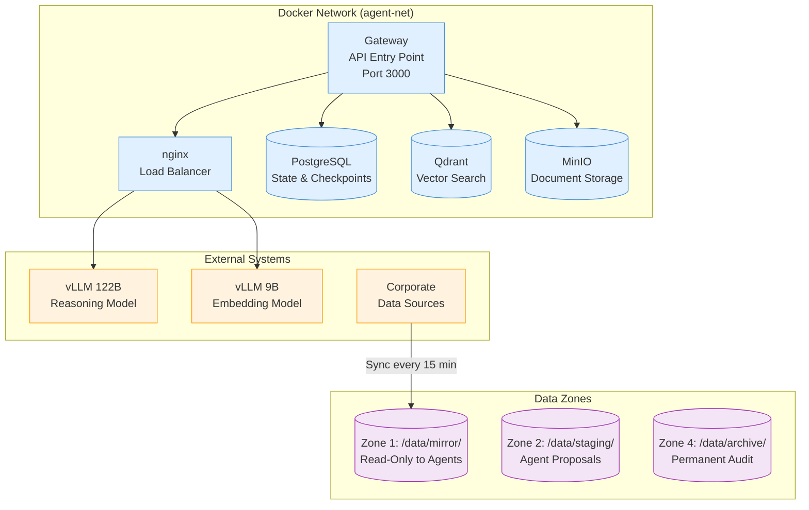

> **Legend:** 🔵 Blue = Automated services · 🟣 Purple = Data zones (storage) · 🟠 Orange = External systems

### System Startup Sequence

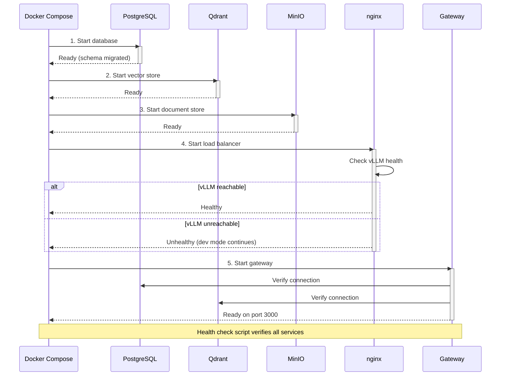

````

- [ ] **Step 2: Verify Mermaid renders correctly**

Open the file in VS Code with Mermaid preview extension or Obsidian. Verify both diagrams render without syntax errors.

- [ ] **Step 3: Commit**

```bash
git add docs/superpowers/plans/2026-03-25-stage1-infrastructure.md
git commit -m "docs: add Mermaid diagrams to Stage 1 infrastructure plan"
```

---

### Task 2: Stage 2+4 — RAG & Orchestrator Diagrams

**Files:**
- Modify: `docs/superpowers/plans/2026-03-30-stage2-4-rag-orchestrator.md` — insert after line 9

- [ ] **Step 1: Insert `## System Overview` section with flowchart and sequence diagram**

Insert the following block immediately after the first `---` (line 9), before `## Overview`:

````markdown

## System Overview

### Document Ingestion & Query Pipeline

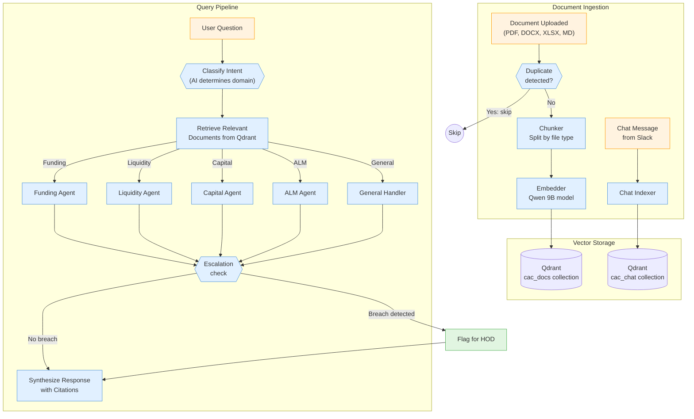

> **Legend:** 🔵 Blue = Automated services · 🟢 Green = Human actions · 🟠 Orange = External inputs

### End-to-End Query Flow

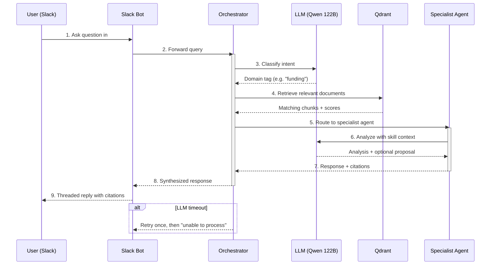

````

- [ ] **Step 2: Verify Mermaid renders correctly**

Open the file in VS Code with Mermaid preview or Obsidian. Verify both diagrams render without syntax errors.

- [ ] **Step 3: Commit**

```bash
git add docs/superpowers/plans/2026-03-30-stage2-4-rag-orchestrator.md
git commit -m "docs: add Mermaid diagrams to Stage 2+4 RAG & orchestrator plan"
```

---

### Task 3: Stage 3 — Slack Bot Diagrams

**Files:**
- Modify: `docs/superpowers/plans/2026-03-30-stage3-slack-bot.md` — insert after line 13

- [ ] **Step 1: Insert `## System Overview` section with flowchart and sequence diagram**

Insert the following block immediately after the first `---` (line 13), before `## File Map`:

````markdown

## System Overview

### Slack Event Routing

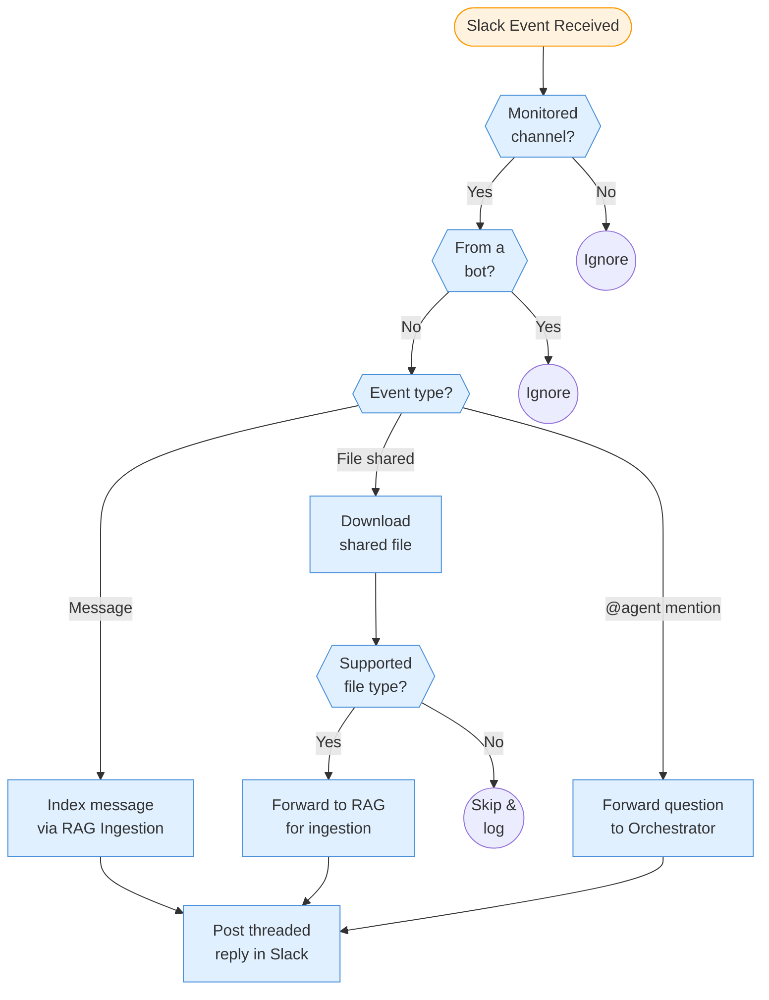

> **Legend:** 🔵 Blue = Automated processing · 🟠 Orange = External input (Slack)

### Message Processing Lifecycle

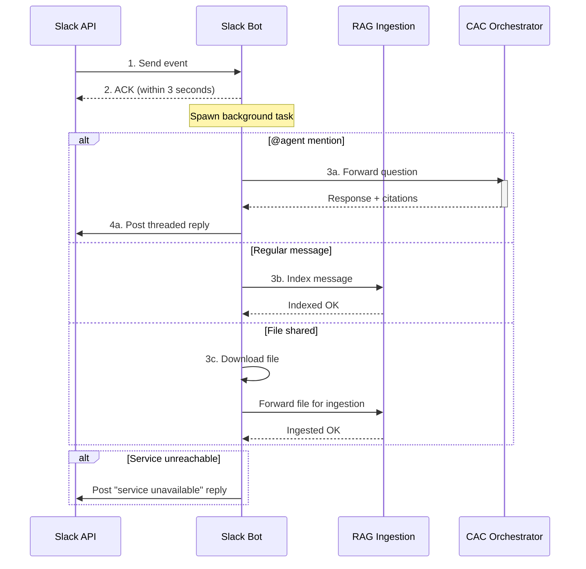

````

- [ ] **Step 2: Verify Mermaid renders correctly**

Open the file in VS Code with Mermaid preview or Obsidian. Verify both diagrams render without syntax errors.

- [ ] **Step 3: Commit**

```bash
git add docs/superpowers/plans/2026-03-30-stage3-slack-bot.md
git commit -m "docs: add Mermaid diagrams to Stage 3 slack-bot plan"
```

---

### Task 4: Stage 4 — CAC Orchestrator Diagrams

**Files:**
- Modify: `docs/superpowers/plans/2026-03-30-stage4-cac-orchestrator.md` — insert after line 15

- [ ] **Step 1: Insert `## System Overview` section with flowchart and sequence diagram**

Insert the following block immediately after the first `---` (line 15), before `## CRITICAL Review Fixes`:

````markdown

## System Overview

### LangGraph Pipeline

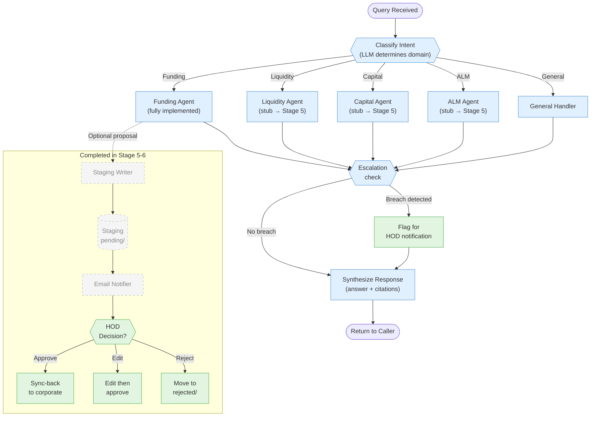

> **Legend:** 🔵 Blue = Automated pipeline · 🟢 Green = Human actions · ⬜ Dashed = Future stages (5-6)

### Query Through the Graph

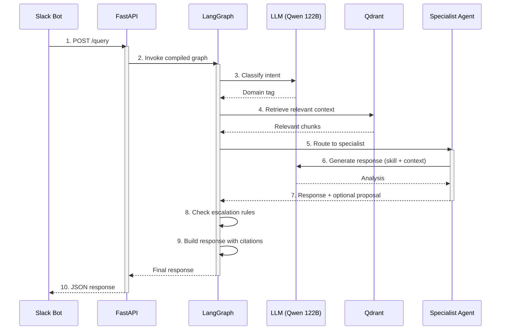

````

- [ ] **Step 2: Verify Mermaid renders correctly**

Open the file in VS Code with Mermaid preview or Obsidian. Verify both diagrams render without syntax errors.

- [ ] **Step 3: Commit**

```bash
git add docs/superpowers/plans/2026-03-30-stage4-cac-orchestrator.md
git commit -m "docs: add Mermaid diagrams to Stage 4 CAC orchestrator plan"
```

---

### Task 5: Stage 5 — Agents & Staging Diagrams

**Files:**
- Modify: `docs/superpowers/plans/2026-03-31-stage5-agents-staging.md` — insert after line 15

- [ ] **Step 1: Insert `## System Overview` section with flowchart and sequence diagram**

Insert the following block immediately after the first `---` (line 15), before `## File Structure`:

````markdown

## System Overview

### Specialist Agents & Staging Pipeline

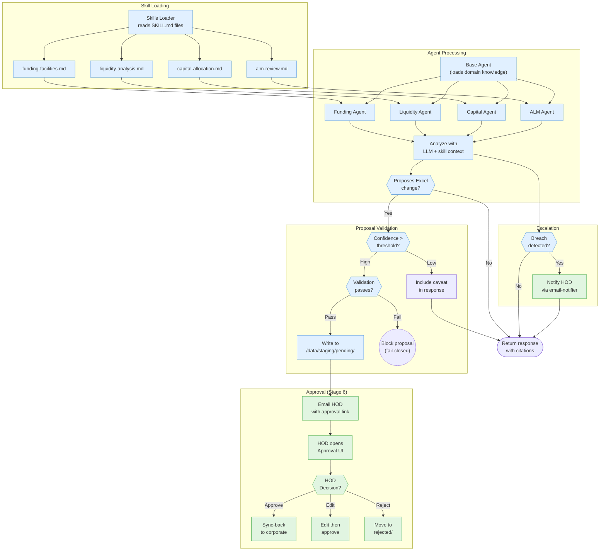

> **Legend:** 🔵 Blue = Automated processing · 🟢 Green = Human actions / approval gates

### Agent Skill Loading → Proposal → Approval

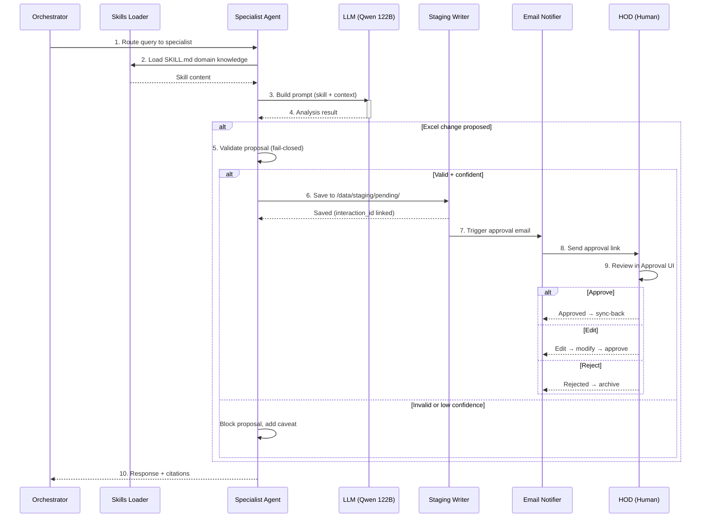

````

- [ ] **Step 2: Verify Mermaid renders correctly**

Open the file in VS Code with Mermaid preview or Obsidian. Verify both diagrams render without syntax errors.

- [ ] **Step 3: Commit**

```bash
git add docs/superpowers/plans/2026-03-31-stage5-agents-staging.md
git commit -m "docs: add Mermaid diagrams to Stage 5 agents & staging plan"
```

---

### Task 6: System Flow Summary (New File)

**Files:**
- Create: `docs/superpowers/system-flow-summary.md`

- [ ] **Step 1: Create the summary file with all 3 sections**

Create the file with the following content:

````markdown
# System Flow Summary — Corporate AI Agent

> **Audience:** Department Heads (HODs) — non-technical overview of system logic, data flow, and decision points.
> **Last updated:** 2026-04-01

---

## Stage Build Progression

Each stage builds on the previous one. This shows what each stage produces and what the next stage needs from it.

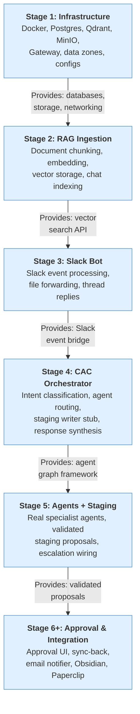

---

## Master End-to-End System Flow

This shows how data moves through the entire system — from corporate data sources to final approved changes.

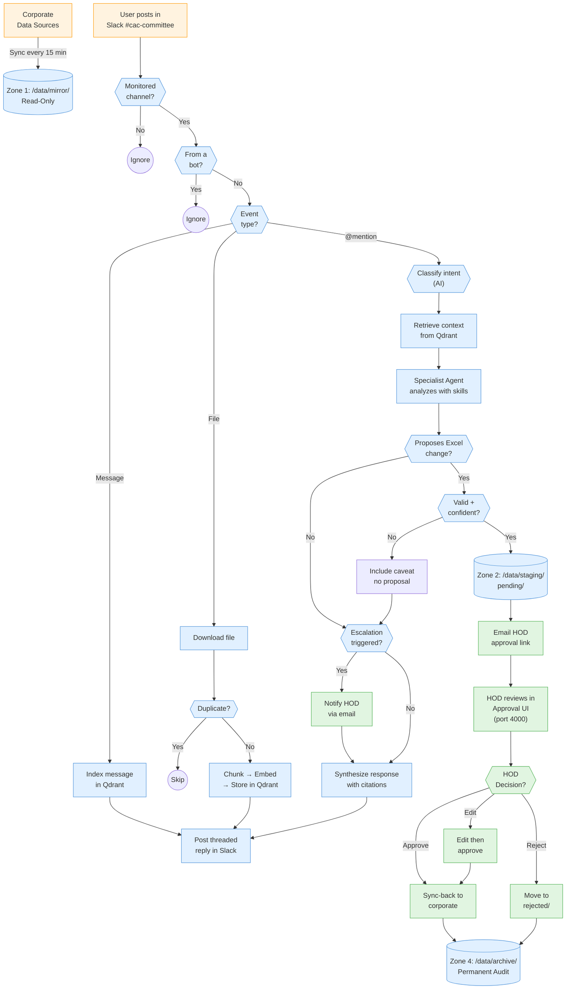

> **Legend:** 🔵 Blue = Automated processing · 🟢 Green = Human actions / approval gates · 🟠 Orange = External systems

---

## Decision Table

Every point where the system makes a choice or requires human input:

| # | Decision Point | Who Decides | Inputs | Possible Outcomes |
|---|---------------|-------------|--------|-------------------|
| 1 | **Channel monitoring** | Slack Bot (rule-based) | Channel ID vs. `dept_channels.json` | Monitored → process / Unmonitored → ignore |
| 2 | **Bot message filtering** | Slack Bot (rule-based) | Event sender | Human → process / Bot → ignore (prevent loops) |
| 3 | **Event type routing** | Slack Bot (rule-based) | Slack event type | Message / File / @mention |
| 4 | **File type validation** | Slack Bot (rule-based) | File extension | Supported → ingest / Unsupported → skip |
| 5 | **Duplicate check** | RAG Ingestion (hash-based) | Document content hash | New → ingest / Duplicate → skip |
| 6 | **Intent classification** | AI (Qwen 122B LLM) | User question text | Funding / Liquidity / Capital / ALM / General |
| 7 | **Agent routing** | Orchestrator (rule-based) | Classified intent | Route to matched specialist agent |
| 8 | **Staging proposal** | AI (specialist agent) | Query + context + skill knowledge | Propose Excel change / Response only |
| 9 | **Confidence threshold** | AI (specialist agent) | Evidence quality score | High → propose / Low → caveat in response |
| 10 | **Proposal validation** | Rule engine (fail-closed) | Proposal schema + cell reference | Valid → stage / Invalid → block |
| 11 | **Escalation check** | Rule engine | Breach rules from `escalation_rules.json` | Escalate to HOD / Continue normally |
| 12 | **Change approval** | **Human (HOD)** | Diff view in Approval UI | **Approve** / **Edit** / **Reject** |
````

- [ ] **Step 2: Verify Mermaid renders correctly**

Open the file in VS Code with Mermaid preview or Obsidian. Verify all 3 diagrams render without syntax errors.

- [ ] **Step 3: Commit**

```bash
git add docs/superpowers/system-flow-summary.md
git commit -m "docs: create system flow summary with Mermaid diagrams and decision table"
```

---

### Task 7: Final Verification

- [ ] **Step 1: Verify all 6 files have correct diagrams**

```bash
# Count mermaid code blocks in each file
grep -c '```mermaid' docs/superpowers/plans/2026-03-25-stage1-infrastructure.md
# Expected: 2

grep -c '```mermaid' docs/superpowers/plans/2026-03-30-stage2-4-rag-orchestrator.md
# Expected: 2

grep -c '```mermaid' docs/superpowers/plans/2026-03-30-stage3-slack-bot.md
# Expected: 2

grep -c '```mermaid' docs/superpowers/plans/2026-03-30-stage4-cac-orchestrator.md
# Expected: 2

grep -c '```mermaid' docs/superpowers/plans/2026-03-31-stage5-agents-staging.md
# Expected: 2

grep -c '```mermaid' docs/superpowers/system-flow-summary.md
# Expected: 3
```

- [ ] **Step 2: Verify no code-level labels leaked into diagrams**

```bash
# Should return 0 results — no function names in mermaid blocks
grep -A 100 '```mermaid' docs/superpowers/plans/*.md docs/superpowers/system-flow-summary.md | grep -E '\.(py|js|ts)|def |class |import |async '
# Expected: no matches
```

- [ ] **Step 3: Verify existing plan content unchanged**

```bash
# Check that only the System Overview section was added — no other lines modified
git diff --stat docs/superpowers/plans/
# Expected: 5 files changed, only insertions (no deletions)
```

---

## Summary

| Task | File | Diagrams | Parallelizable |
|------|------|----------|----------------|
| 1 | Stage 1 infrastructure plan | Flowchart + Sequence | Yes (with 2-5) |
| 2 | Stage 2+4 RAG & orchestrator plan | Flowchart + Sequence | Yes (with 1,3-5) |
| 3 | Stage 3 slack-bot plan | Flowchart + Sequence | Yes (with 1-2,4-5) |
| 4 | Stage 4 CAC orchestrator plan | Flowchart + Sequence | Yes (with 1-3,5) |
| 5 | Stage 5 agents & staging plan | Flowchart + Sequence | Yes (with 1-4) |
| 6 | System flow summary (new) | 2 Flowcharts + Decision table | After 1-5 |
| 7 | Final verification | — | After 6 |
