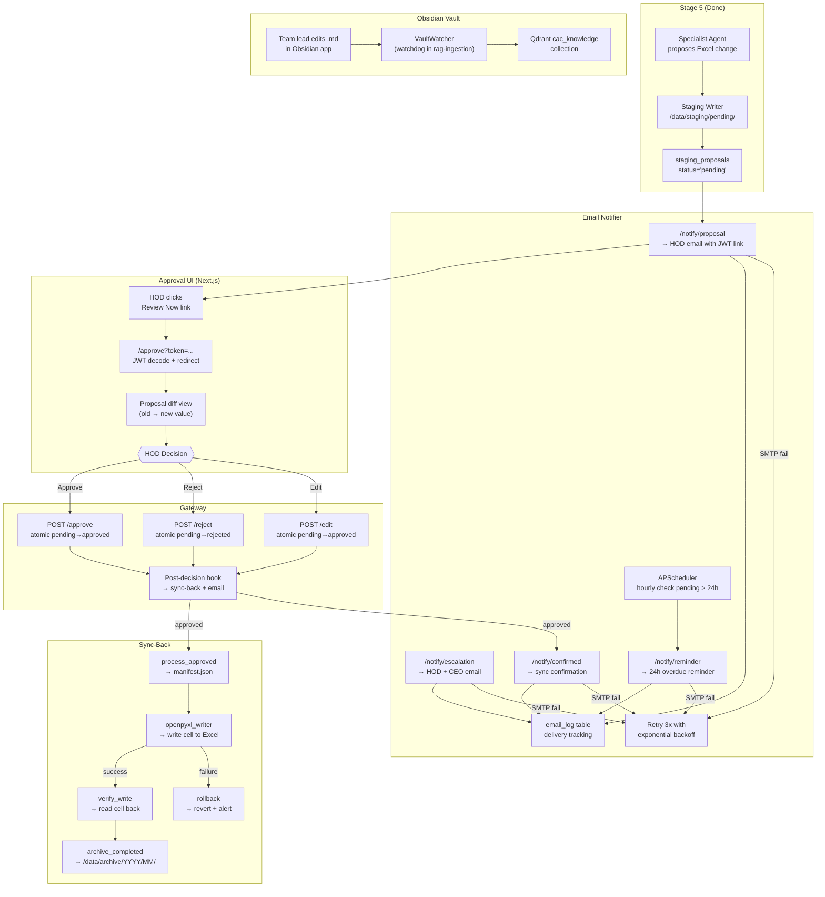
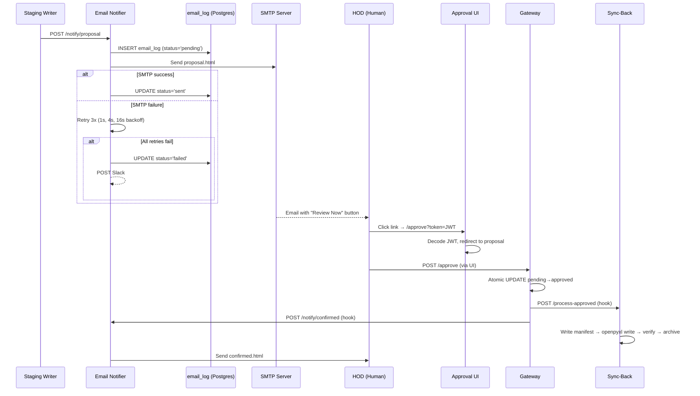
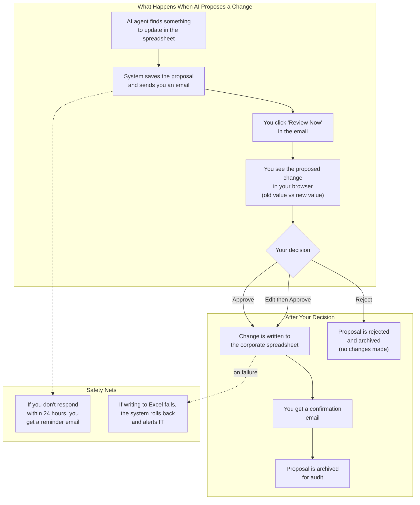
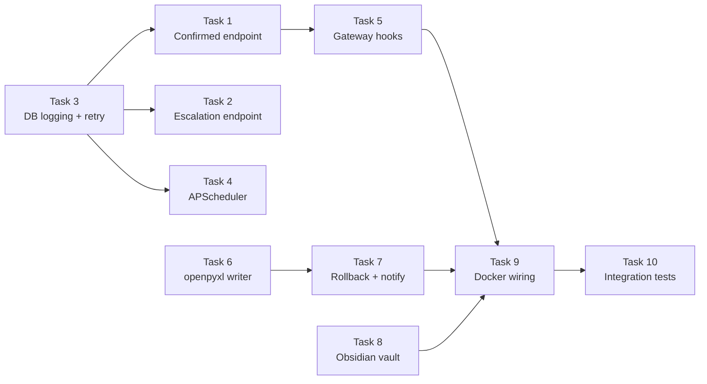

# Stage 6 — Approval Gate + Email Notifier + Sync-Back + Obsidian Vault

## Context

Stage 6 closes the human approval loop in the Brooker Corporate Agent system. The previous stages built the AI agent pipeline (propose changes to Excel), but no human can yet approve, reject, or receive email notifications. Without Stage 6, all proposals sit in `/data/staging/pending/` forever. This plan addresses every gap found during a thorough audit of the existing code.

**Goal:** HOD receives email → clicks link → reviews diff in browser → approves/rejects → Excel updated (or not) → confirmation email sent → proposal archived.

**PRD:** v2.2 Sections 8.5–8.7, 13 (Week 6), 14 (Tests), 16 (Obsidian)
**Design Spec:** `docs/superpowers/specs/2026-04-02-stage6-approval-email-obsidian-design.md`
**Plan saved to:** `docs/superpowers/plans/2026-04-02-stage6-approval-email-obsidian.md`

### Team Agents
| Agent | Tasks | Superpower Skill |
|-------|-------|-----------------|
| service-builder | Tasks 1–7, 9 | superpowers:test-driven-development |
| rag-specialist | Task 8 | superpowers:brainstorming |
| tester | Task 10 | superpowers:verification-before-completion |

---

## System Overview

### End-to-End Approval Flow (Technical)



> **Legend:** Green = already built. Yellow = needs building in Stage 6. Purple = human interaction.

### Email Notification Sequence (Technical)



### Simplified Dataflow (For Non-Technical Stakeholders)



#### How to Read This Diagram

1. **Start at the top:** An AI agent proposes a change to the ALCO Tracker. The system does NOT make the change directly.
2. **Email notification:** You receive an email showing the proposed change with a "Review Now" button. No Slack needed.
3. **Review in browser:** Clicking the link opens a secure page showing old value vs new value, the AI's reasoning, and confidence level.
4. **Your decision:** Approve (applies change), Edit then Approve (modify value first), or Reject (nothing changes). Every decision is logged with your name and timestamp.
5. **Safety nets:** 24-hour reminder if you forget. Automatic rollback + IT alert if Excel write fails.

---

## What's Already Built vs What's Missing

| Component | Built | Missing |
|-----------|-------|---------|
| approval-ui (Next.js) | Full app: pages, diff view, auth, API client, tests | Activity page stub (deferred) |
| gateway proposal endpoints | All CRUD + approve/reject/edit with RBAC | **Post-decision hooks** (no downstream triggers) |
| email-notifier /notify/proposal | Working: SMTP + JWT + template | — |
| email-notifier /notify/reminder | Working: SMTP + JWT + template | — |
| email-notifier /notify/confirmed | **Stub** (logs only) | **HOD resolution + send confirmed.html** |
| email-notifier /notify/escalation | **Stub** (logs only) | **Send escalation.html to HOD+CEO** |
| email-notifier escalation.html | — | **Template missing entirely** |
| email-notifier retry/logging | — | **Retry logic, email_log DB, Slack alert** |
| email-notifier APScheduler | — | **24h reminder job** |
| sync-back process_approved | Working: manifest to staging/approved/ | — |
| sync-back archive_completed | Working: move to /data/archive/ | — |
| sync-back openpyxl writer | — | **Excel cell write + verify** |
| sync-back rollback | — | **Revert + alert on failure** |
| Obsidian vault content | Empty .gitkeep placeholders | **index.md, templates, config** |
| Docker Compose | All 3 services configured | **Cross-service env vars** |

---

## New Files

| File | Responsibility |
|------|---------------|
| `services/sync-back/src/openpyxl_writer.py` | Read manifest, write cell to Excel copy, verify |
| `services/sync-back/src/rollback.py` | Revert DB status, cleanup staging dir, Slack alert |
| `services/sync-back/src/notifier_client.py` | httpx POST to email-notifier /notify/confirmed |
| `services/email-notifier/src/scheduler.py` | APScheduler 24h reminder — hourly DB check |
| `services/email-notifier/src/db_logger.py` | Insert/update email_log table per send attempt |
| `services/email-notifier/src/slack_alert.py` | POST Slack webhook on SMTP exhaustion |
| `services/email-notifier/src/templates/escalation.html` | Escalation email (HOD + CEO) |
| `services/gateway/src/hooks.py` | Fire-and-forget downstream triggers after approve/reject |
| `config/obsidian_watch.json` | VaultWatcher folder/collection mapping |
| `obsidian-vault/index.md` | Vault home page with `[[links]]` |
| `obsidian-vault/meeting-notes/templates/meeting-note.md` | Meeting note template (PRD spec) |
| `obsidian-vault/decisions/templates/decision-log.md` | Decision log template (PRD spec) |
| `tests/unit/email_notifier/test_email_db_logger.py` | DB logging tests |
| `tests/unit/email_notifier/test_email_recipients.py` | HOD/CEO resolution tests |
| `tests/unit/email_notifier/test_email_retry.py` | Retry + backoff tests |
| `tests/unit/sync_back/__init__.py` | Package init |
| `tests/unit/sync_back/test_openpyxl_writer.py` | Excel write + verify tests |
| `tests/unit/sync_back/test_rollback.py` | Rollback + alert tests |
| `tests/integration/test_email_proposal.py` | Proposal → email within 60s |
| `tests/integration/test_email_approval.py` | Email link → approve → sync → confirm |
| `tests/integration/test_sync_loop.py` | Full loop: propose → approve → Excel → archive |
| `tests/integration/test_vault_ingest.py` | .md in vault → Qdrant within 60s |

## Modified Files

| File | Changes |
|------|---------|
| `services/email-notifier/src/main.py` | Implement /notify/confirmed + /notify/escalation, add lifespan for asyncpg pool + APScheduler |
| `services/email-notifier/src/email_sender.py` | Add retry wrapper, call db_logger + slack_alert |
| `services/email-notifier/src/models.py` | Add `dept` to ConfirmedNotification + EscalationNotification |
| `services/email-notifier/requirements.txt` | Add apscheduler, asyncpg, httpx |
| `services/sync-back/src/processor.py` | After manifest write → openpyxl write → update synced_at |
| `services/sync-back/src/config.py` | Add MIRROR_PATH, EMAIL_NOTIFIER_URL, SLACK_WEBHOOK_URL |
| `services/gateway/src/proposals.py` | Call hooks.py after approve/reject/edit |
| `docker-compose.yml` | Add cross-service env vars, Obsidian vault volume |

---

## Task 1: Email-Notifier — Implement /notify/confirmed

**Agent:** service-builder | **Skill:** superpowers:test-driven-development

**Current state:** `/notify/confirmed` at `email-notifier/src/main.py:131` accepts `ConfirmedNotification(proposal_id, decision)` but only logs. The `send_confirmed()` function in `email_sender.py` exists and works. Gap: main.py never calls it, model lacks `dept` field.

- [ ] Add `dept: str` and `recipient: str | None = None` to `ConfirmedNotification` in `models.py`
- [ ] Update `/notify/confirmed` in `main.py`: resolve recipient via `_resolve_hod_email(payload.dept)` if not provided, call `send_confirmed()`, return `{"status": "sent"}`
- [ ] Write `test_email_recipients.py`: test HOD resolution from dept, explicit recipient, missing dept returns 422

---

## Task 2: Email-Notifier — Implement /notify/escalation

**Agent:** service-builder | **Skill:** superpowers:test-driven-development

**Current state:** `/notify/escalation` at `main.py:66` only logs. No `escalation.html` template exists. `EscalationNotification` model lacks `dept` field.

- [ ] Add `dept: str` to `EscalationNotification` in `models.py`
- [ ] Create `templates/escalation.html` (red header for critical, orange for high severity, matching existing template style)
- [ ] Add `send_escalation(payload, recipients)` to `email_sender.py`
- [ ] Implement `/notify/escalation`: resolve HOD + CEO emails, send to both recipients
- [ ] Write test: `test_escalation_sends_to_hod_and_ceo` in `test_email_recipients.py`

---

## Task 3: Email-Notifier — DB Logging + Retry + Slack Alert

**Agent:** service-builder | **Skill:** superpowers:test-driven-development

**Current state:** `send_email()` in `email_sender.py` has no retry, no DB logging, no failure alerting. The `email_log` table exists in migrations with columns: recipient, event_type, proposal_id, dept, subject, delivery_status, error, retry_count.

- [ ] Create `db_logger.py`: `log_email_attempt()` and `update_email_status()` using asyncpg
- [ ] Add asyncpg pool to email-notifier startup via lifespan handler (pattern from sync-back `main.py`)
- [ ] Wrap `send_email()` with retry: 3 attempts, exponential backoff (1s, 4s, 16s), log each attempt
- [ ] Create `slack_alert.py`: `alert_smtp_failure()` — POST to Slack webhook (fire-and-forget, graceful if unconfigured)
- [ ] Add `asyncpg>=0.29`, `httpx>=0.27` to `requirements.txt`
- [ ] Write `test_email_retry.py`: success on 2nd attempt, exhaustion logs failure, Slack alert on exhaustion

---

## Task 4: Email-Notifier — APScheduler 24h Reminder Job

**Agent:** service-builder | **Skill:** superpowers:test-driven-development

**Current state:** No scheduler. `/notify/reminder` works but nothing triggers it. PRD 8.7: hourly check, no duplicate same-day reminders.

- [ ] Add `apscheduler>=3.10` to `requirements.txt`
- [ ] Create `scheduler.py`: `check_overdue_proposals()` — query staging_proposals WHERE status='pending' AND created_at < NOW() - 24h, cross-check email_log for same-day reminders, call `send_reminder()` for each
- [ ] Start APScheduler with `IntervalTrigger(hours=1)` in `main.py` lifespan
- [ ] Write test: insert overdue proposal, run `check_overdue_proposals()`, verify reminder sent

---

## Task 5: Gateway — Post-Decision Hooks (CRITICAL WIRING)

**Agent:** service-builder | **Skill:** superpowers:test-driven-development

**Current state:** `proposals.py` approve/reject/edit endpoints do atomic DB updates but trigger NOTHING downstream. This is the critical missing link — without this, approving a proposal has no effect beyond changing a DB row.

- [ ] Create `hooks.py`: `on_proposal_approved(proposal_id, dept)` → POST sync-back + email-notifier; `on_proposal_rejected(proposal_id, dept, reason)` → POST email-notifier only. Fire-and-forget with httpx, 10s timeout, log errors but don't raise.
- [ ] Add env vars to gateway in docker-compose: `SYNC_BACK_URL`, `EMAIL_NOTIFIER_URL`
- [ ] Wire hooks into `proposals.py`: call after each successful approve/reject/edit returns 200
- [ ] Write test: `test_approve_triggers_hooks` — mock httpx, approve, verify both services called

---

## Task 6: Sync-Back — openpyxl Excel Writer

**Agent:** service-builder | **Skill:** superpowers:test-driven-development

**Current state:** `processor.py` writes manifest.json but never touches Excel. `requirements.txt` already has `openpyxl>=3.1`. The manifest contains `file`, `tab`, `cell`, `new_value`.

- [ ] Add `MIRROR_PATH` to `config.py` (default: `/data/mirror`)
- [ ] Create `openpyxl_writer.py`: `write_cell(manifest, mirror_path, staging_path)` — copy Excel from mirror to staging/approved/, open with openpyxl, write cell, save, verify read-back. **NEVER write to /data/mirror (read-only zone).**
- [ ] Wire into `processor.py`: after manifest write → `write_cell()` → on success update DB `synced_at + status='synced'` → on failure call `rollback.handle_failure()`
- [ ] Write `test_openpyxl_writer.py`: write cell updates value, nonexistent file handled, wrong tab handled

---

## Task 7: Sync-Back — Rollback + Notification Client

**Agent:** service-builder | **Skill:** superpowers:test-driven-development

- [ ] Create `rollback.py`: `handle_failure(proposal, pool, error)` — delete staging/approved/{id}/, revert DB status to 'pending', log to sync_log, POST Slack webhook
- [ ] Create `notifier_client.py`: `notify_confirmed(proposal_id, decision, dept)` — POST email-notifier /notify/confirmed, fire-and-forget
- [ ] Add `SLACK_WEBHOOK_URL`, `EMAIL_NOTIFIER_URL` to `config.py`
- [ ] Wire into `processor.py`: on success call `notify_confirmed()`, on failure call `handle_failure()`
- [ ] Write `test_rollback.py`: reverts DB status, alerts Slack, cleans staging dir

---

## Task 8: Obsidian Vault Content + Config

**Agent:** rag-specialist | **Skill:** superpowers:brainstorming

**Current state:** Only `.gitkeep` files. VaultWatcher is fully built in rag-ingestion Stage 2.

- [ ] Create `obsidian-vault/index.md` — vault home page with `[[links]]` to skill areas, meeting notes, decisions
- [ ] Create `obsidian-vault/meeting-notes/templates/meeting-note.md` — per PRD Section 16 template (YAML frontmatter + Agenda/Decisions/Actions sections)
- [ ] Create `obsidian-vault/decisions/templates/decision-log.md` — per PRD Section 16 template (YAML frontmatter + Context/Decision/Rationale sections)
- [ ] Create `config/obsidian_watch.json` — watched folders (skills/, meeting-notes/, decisions/, policies/), ignore (.obsidian, templates), debounce 5s, chunk_size 512
- [ ] Update `docker-compose.yml` rag-ingestion: add `./obsidian-vault:/mnt/obsidian-vault:ro` volume + env vars

---

## Task 9: Docker Compose Wiring

**Agent:** service-builder

- [ ] email-notifier: add `DATABASE_URL`, SMTP vars, `DASHBOARD_URL`, `CEO_EMAIL`, `SLACK_ESCALATIONS_WEBHOOK_URL`, `EMAIL_DRY_RUN=true`, postgres dependency, departments.json volume
- [ ] gateway: add `SYNC_BACK_URL=http://sync-back:3006`, `EMAIL_NOTIFIER_URL=http://email-notifier:3005`
- [ ] sync-back: add `EMAIL_NOTIFIER_URL`, `SLACK_WEBHOOK_URL`, `mirror_data:/data/mirror:ro` volume
- [ ] rag-ingestion: add `./obsidian-vault:/mnt/obsidian-vault:ro`, `OBSIDIAN_VAULT_PATH`, `OBSIDIAN_WATCH_ENABLED`

---

## Task 10: Integration Tests

**Agent:** tester | **Skill:** superpowers:verification-before-completion

- [ ] `test_email_proposal.py` — insert staging proposal → POST /notify/proposal → assert email_log row created within 60s
- [ ] `test_email_approval.py` — create pending → approve via gateway → assert sync-back triggered + email confirmed sent
- [ ] `test_sync_loop.py` — propose → approve → process-approved → verify Excel written → archive → verify archive dir
- [ ] `test_vault_ingest.py` — write .md to vault path → wait for VaultWatcher → query Qdrant cac_knowledge

---

## Implementation Order



**Critical path:** T3 → T1 → T5 → T9 → T10

**Parallel tracks:**
- Track A (email): T3 → T1 → T2 → T4
- Track B (sync): T6 → T7
- Track C (vault): T8 (independent)
- Join: T5 (needs T1) → T9 (needs all) → T10

---

## Quality Gates

| # | Gate | Verification |
|---|------|-------------|
| Q1 | Email delivery within 60s | `test_email_proposal.py` |
| Q2 | Retry 3x + Slack alert on exhaustion | `test_email_retry.py` |
| Q3 | Gateway approve triggers sync-back + email | `test_email_approval.py` |
| Q4 | openpyxl writes correct cell + verify | `test_openpyxl_writer.py` |
| Q5 | Rollback reverts DB + alerts Slack | `test_rollback.py` |
| Q6 | Archive with decision.json | `test_sync_loop.py` |
| Q7 | 24h reminder (no same-day duplicates) | `test_scheduler_fires_reminder` |
| Q8 | Vault .md → Qdrant within 60s | `test_vault_ingest.py` |
| Q9 | JWT deep-link opens correct proposal | Manual |
| Q10 | `ruff check` + `pytest` exit 0 | CI gate |

---

## Verification Commands

```bash
# Unit tests
pytest tests/unit/email_notifier/ tests/unit/sync_back/ tests/unit/gateway/ -v

# Approval-UI tests
cd services/approval-ui && npx vitest run && cd ../..

# Integration tests (requires docker compose up -d)
pytest tests/integration/test_email_proposal.py \
       tests/integration/test_email_approval.py \
       tests/integration/test_sync_loop.py \
       tests/integration/test_vault_ingest.py -v

# Lint
ruff check services/email-notifier/ services/sync-back/ services/gateway/

# Full suite
pytest tests/ -v --tb=short
```
