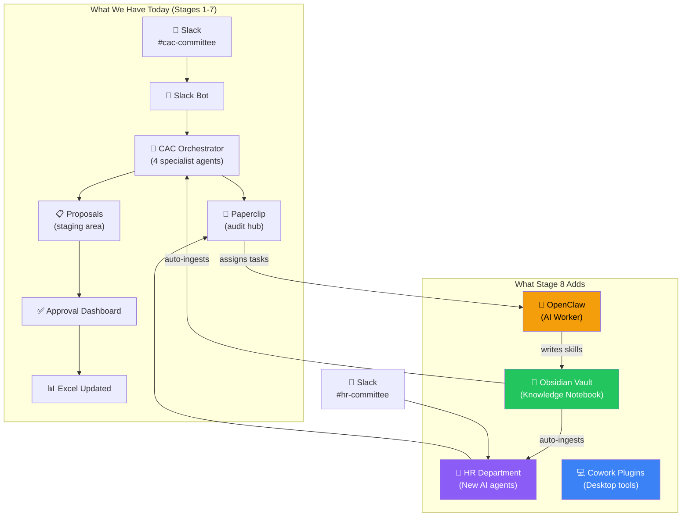
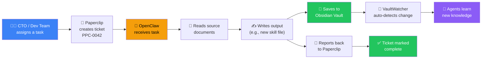
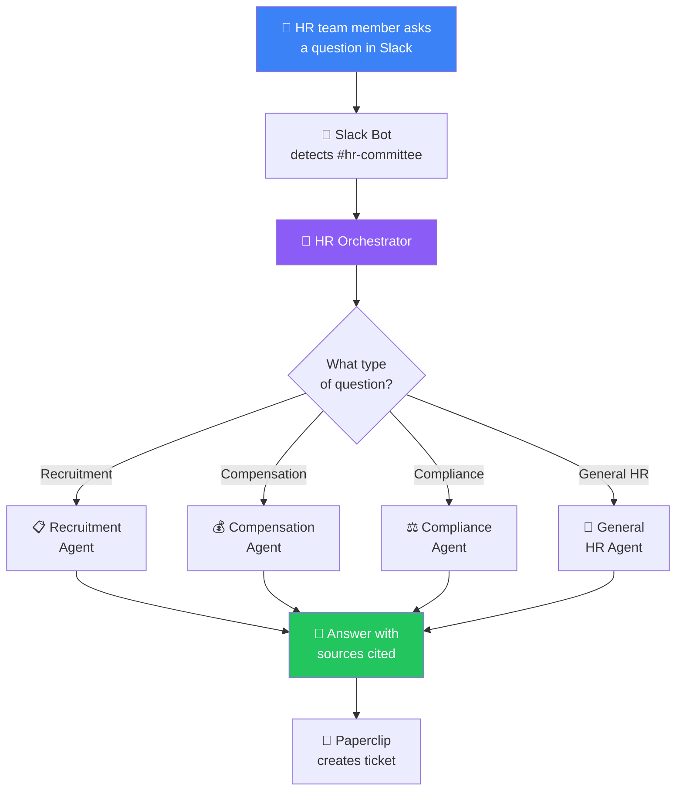
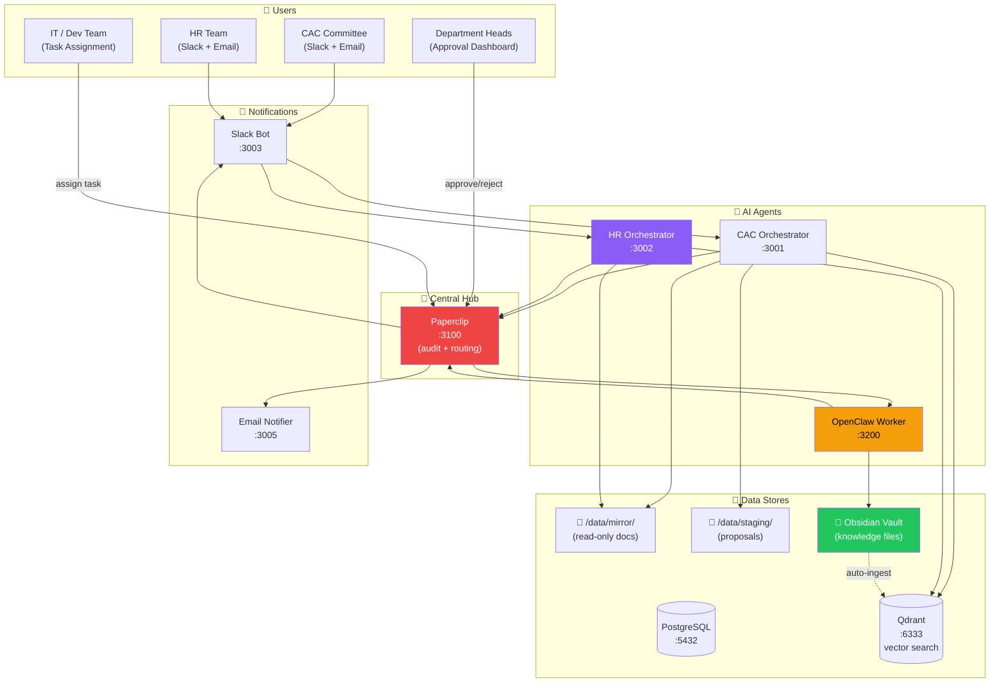
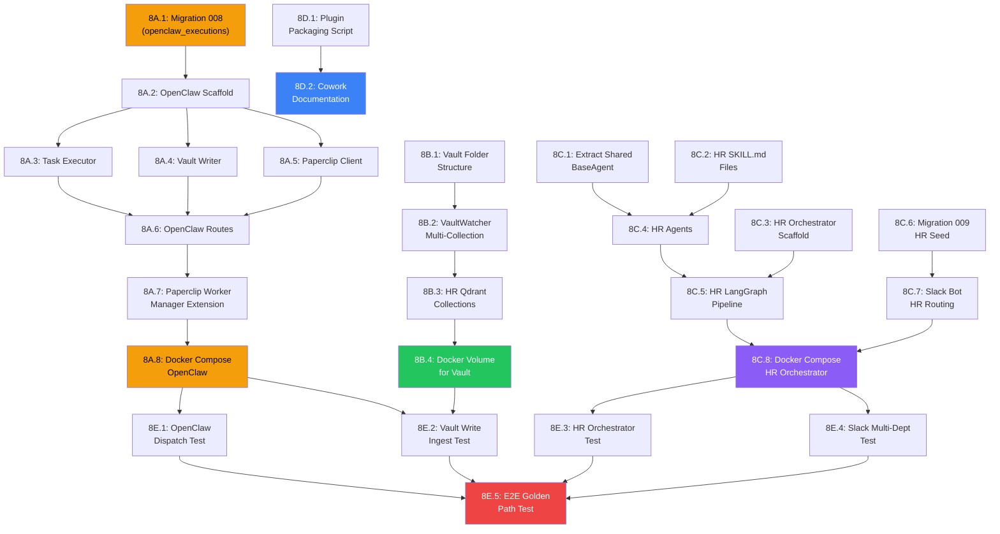

# Stage 8: Worker Dispatch + Obsidian + HR Department

> **For agentic workers:** REQUIRED SUB-SKILL: Use superpowers:subagent-driven-development (recommended) or superpowers:executing-plans to implement this plan task-by-task. Steps use checkbox (`- [ ]`) syntax for tracking.

**Goal:** Wire OpenClaw as a real worker service (Claude Agent SDK), integrate Obsidian vault with write access, expand to the first Phase 2 department (HR), and package Cowork plugins.

**Architecture:** OpenClaw runs as a new Docker container (port 3200) receiving task assignments from Paperclip's worker manager. HR department follows the CAC copy-and-customize pattern with its own orchestrator (port 3002), SKILL.md files, and Qdrant collections. VaultWatcher gets multi-department collection routing.

**Tech Stack:** Python 3.11, FastAPI, Claude Agent SDK, asyncpg, httpx, structlog, LangGraph 0.2+, Docker

**Spec:** `docs/superpowers/specs/2026-04-03-stage8-worker-dispatch-hr-design.md`

> **CRITICAL: Working Directory**
> All paths are relative to the project root: `Brooker_Corporate_Agent/`

---

## How It Works — For Non-Technical Readers

### What Is Stage 8?

Stage 8 adds three major capabilities to the Brooker Corporate Agent system:

1. **OpenClaw** — An AI worker that can be assigned tasks (like writing skill files or scaffolding new departments). Think of it as the system's "handyman" that can build things when asked.

2. **Obsidian Vault** — A knowledge notebook where the team can view and edit agent skills, meeting notes, and decision logs. When someone saves a note, agents automatically learn from it.

3. **HR Department** — The first expansion beyond the CAC committee. HR gets its own AI agents that understand recruitment, compensation, and compliance.

### The Big Picture



### How OpenClaw Works — The Worker Loop



### How HR Department Works



### Data Flow — How Everything Connects



---

## Architecture Decision Records (ADRs)

### ADR-8.1: OpenClaw as Docker Container

**Decision:** Run OpenClaw as a Docker container on agent-net, despite PRD saying "not a Docker service."

**Why:** Docker provides consistent networking (direct access to Paperclip, Qdrant, Postgres on agent-net), volume mount management for vault writes, health monitoring, and deployment parity with all 12 existing services. Running on host would require separate process management, networking config, and monitoring.

**Trade-off:** Slightly more resource overhead (~200MB), but the DGX Spark has 128GB unified memory.

### ADR-8.2: Direct File I/O for Vault Writes (Not MCP)

**Decision:** OpenClaw writes to Obsidian vault via direct file I/O (Docker volume mount) rather than MCP protocol.

**Why:** MCP requires an Obsidian plugin running on the desktop app, which may not always be open. Direct file writes via volume mount are simpler, more reliable, and work headlessly. The VaultWatcher already monitors the filesystem — it doesn't care how files arrive.

**Trade-off:** Loses Obsidian MCP plugin features (live preview, link resolution). Acceptable because OpenClaw is IT/dev-only and writes are batch operations.

### ADR-8.3: HR as Query-Only (No Staging/Proposals in Phase 1)

**Decision:** HR orchestrator returns answers with citations but does NOT create staging proposals or Excel changes in Phase 1.

**Why:** HR data (salaries, performance reviews) is highly sensitive. The staging → approval → sync-back pipeline needs additional PII safeguards before handling HR data. Phase 1 HR is information-only: ask questions, get answers with sources.

**Trade-off:** Less automation for HR, but safer. Staging can be added in Phase 2 when PII controls are validated.

### ADR-8.4: Shared BaseAgent for HR

**Decision:** Extract BaseAgent from cac-orchestrator into a shared package, reuse for HR agents.

**Why:** The BaseAgent ABC (skill loading, LLM calling, response parsing) is department-agnostic. Duplicating it would create maintenance burden. A shared package (`services/shared/base_agent.py`) keeps both orchestrators aligned.

### ADR-8.5: VaultWatcher Multi-Collection Routing

**Decision:** VaultWatcher routes ingested files to Qdrant collections based on path prefix mapping in `config/obsidian_watch.json`.

**Why:** With HR added, vault files under `skills/hr/` must go to `hr_knowledge`, not `cac_knowledge`. A config-driven path→collection mapping is extensible for future departments without code changes.

---

## File Structure

### New Files

```
services/openclaw/
  Dockerfile                         # Python 3.11-slim
  requirements.txt                   # claude-agent-sdk, fastapi, httpx, structlog
  src/
    main.py                          # FastAPI app, /health, lifespan
    config.py                        # Settings from env
    models.py                        # TaskRequest, TaskResult Pydantic models
    task_executor.py                 # Claude Agent SDK wrapper
    vault_writer.py                  # File I/O to Obsidian vault
    paperclip_client.py              # httpx client to report results back
    routes/
      tasks.py                       # POST /tasks/execute, GET /tasks/{id}/status
      health.py                      # GET /health

services/hr-orchestrator/
  Dockerfile                         # Python 3.11-slim (same pattern as cac-orchestrator)
  requirements.txt                   # langgraph, httpx, asyncpg, structlog
  src/
    main.py                          # FastAPI app, /health, /query
    config.py                        # HR-specific settings
    graph.py                         # LangGraph StateGraph (simplified: no staging)
    state.py                         # HRAgentState TypedDict
    agents/
      base.py                        # -> imports from services/shared/base_agent.py
      recruitment.py                 # RecruitmentAgent(BaseAgent)
      compensation.py                # CompensationAgent(BaseAgent)
      compliance.py                  # ComplianceAgent(BaseAgent)
      general.py                     # GeneralHRAgent(BaseAgent)
    nodes/
      classify_intent.py             # HR intent classification
      retrieve_context.py            # Qdrant search (hr_docs, hr_chat, hr_knowledge)
      escalation_check.py            # HR escalation rules
      synthesise.py                  # Response with citations
      paperclip_ticket.py            # Create Paperclip ticket
    tools/
      llm_client.py                  # -> reuse from shared or cac-orchestrator
      rag_client.py                  # HR collection targeting
      db_client.py                   # asyncpg pool
    skills/
      loader.py                      # -> reuse SkillsLoader

services/shared/
  base_agent.py                      # Extracted BaseAgent ABC (from cac-orchestrator)
  skills_loader.py                   # Extracted SkillsLoader (from cac-orchestrator)

skills/hr/
  hr-agent.md                        # General HR agent persona
  recruitment.md                     # Recruitment pipeline skill
  compensation.md                    # Compensation analysis skill
  compliance.md                      # HR compliance skill

config/
  obsidian_watch.json                # Path → Qdrant collection mapping
  excel_schema/hr_tracker.json       # HR tracker structure (placeholder)

migrations/
  008_openclaw_executions.sql        # Worker execution audit trail table
  009_hr_department_seed.sql         # HR department + agents in Paperclip

obsidian-vault/
  index.md                           # Vault home page
  skills/
    hr/                              # HR skill files (symlinked)
  meeting-notes/
    templates/
      meeting-note.md                # Meeting note template
  decisions/
    templates/
      decision-log.md                # Decision log template

scripts/
  package-cowork-plugins.sh          # SKILL.md → Cowork plugin export

tests/
  unit/
    openclaw/
      test_task_executor.py          # Task execution tests
      test_vault_writer.py           # Vault write tests
      test_paperclip_client.py       # Result reporting tests
    hr_orchestrator/
      test_classify_intent.py        # HR intent classification
      test_agents.py                 # HR agent response tests
      test_graph.py                  # HR graph flow tests
  integration/
    test_openclaw_dispatch.py        # Paperclip → OpenClaw → result loop
    test_hr_orchestrator.py          # HR query → response → ticket
    test_vault_multi_dept.py         # VaultWatcher routes to correct collection
```

### Modified Files

```
services/paperclip/src/services/worker_manager.py   # Extend dispatch for claude_sdk type
services/paperclip/src/routes/tickets.py             # Wire worker assignment routes
services/rag-ingestion/src/vault_watcher.py          # Multi-collection routing
services/slack-bot/src/events.py                     # Route #hr-committee to hr-orchestrator
services/slack-bot/src/clients.py                    # Add hr-orchestrator HTTP client
config/departments.json                              # Add HR department config
docker-compose.yml                                   # Add openclaw + hr-orchestrator services
docker-compose.dev.yml                               # Dev overrides for new services
docker-compose.test.yml                              # Test overrides for new services
.env.example                                         # Add OPENCLAW_*, HR_* env vars
migrations/007_paperclip_tables.sql                  # Update openclaw seed (stub → claude_sdk)
```

---

## Sub-Stage 8A: OpenClaw Worker Service (8 tasks)

### Task 8A.1: Database Migration — Worker Execution Audit Trail

**Files:**
- Create: `migrations/008_openclaw_executions.sql`
- Test: `tests/unit/openclaw/test_migration_008.py`

- [ ] **Step 1: Write migration SQL**

```sql
-- migrations/008_openclaw_executions.sql
-- OpenClaw worker execution audit trail

BEGIN;

CREATE TABLE IF NOT EXISTS openclaw_executions (
    id UUID PRIMARY KEY DEFAULT gen_random_uuid(),
    ticket_id VARCHAR(20) NOT NULL REFERENCES paperclip_tickets(ticket_id),
    worker_name VARCHAR(100) NOT NULL,
    task_type VARCHAR(50) NOT NULL,
    input_payload JSONB NOT NULL,
    output_payload JSONB,
    status VARCHAR(20) DEFAULT 'queued' CHECK (status IN (
        'queued', 'running', 'completed', 'failed', 'cancelled'
    )),
    started_at TIMESTAMPTZ,
    completed_at TIMESTAMPTZ,
    error_message TEXT,
    created_at TIMESTAMPTZ DEFAULT NOW()
);

CREATE INDEX idx_executions_ticket ON openclaw_executions(ticket_id);
CREATE INDEX idx_executions_status ON openclaw_executions(status);
CREATE INDEX idx_executions_worker ON openclaw_executions(worker_name, status);

-- Update OpenClaw from stub to claude_sdk
UPDATE paperclip_agents
SET worker_type = 'claude_sdk',
    endpoint_url = 'http://openclaw:3200/health',
    skills = '["shared/escalation-protocol", "shared/citation-format", "shared/rag-retrieval"]'
WHERE agent_name = 'openclaw';

COMMIT;
```

- [ ] **Step 2: Write migration test**

---

### Task 8A.2: OpenClaw Service Scaffold

**Files:**
- Create: `services/openclaw/Dockerfile`
- Create: `services/openclaw/requirements.txt`
- Create: `services/openclaw/src/main.py`
- Create: `services/openclaw/src/config.py`
- Create: `services/openclaw/src/models.py`

- [ ] **Step 1: Create Dockerfile** (Python 3.11-slim, same pattern as other services)
- [ ] **Step 2: Create requirements.txt** (fastapi, uvicorn, httpx, structlog, asyncpg, claude-agent-sdk or anthropic)
- [ ] **Step 3: Create main.py** with FastAPI app, lifespan (Paperclip heartbeat registration), /health endpoint
- [ ] **Step 4: Create config.py** with Settings (PAPERCLIP_URL, VAULT_PATH, ANTHROPIC_API_KEY, etc.)
- [ ] **Step 5: Create models.py** with TaskRequest, TaskResult, TaskStatus Pydantic models

---

### Task 8A.3: Task Executor — Claude Agent SDK Integration

**Files:**
- Create: `services/openclaw/src/task_executor.py`
- Test: `tests/unit/openclaw/test_task_executor.py`

- [ ] **Step 1: Implement TaskExecutor class**
  - `async execute(task: TaskRequest) -> TaskResult`
  - Supports task types: `skill_draft`, `code_scaffold`, `document_generate`
  - Uses Claude Agent SDK (or Anthropic API) to process tasks
  - Reads source documents from `/data/mirror/` (read-only volume)
  - Returns structured result with output files, status, error
- [ ] **Step 2: Implement SKILL.md-specific task handler**
  - Loads SKILL.md format standard from skills/shared/
  - Generates new skill files following 9-section format
  - Validates output against format requirements
- [ ] **Step 3: Write unit tests** (mock Claude API responses)

---

### Task 8A.4: Vault Writer — File I/O to Obsidian

**Files:**
- Create: `services/openclaw/src/vault_writer.py`
- Test: `tests/unit/openclaw/test_vault_writer.py`

- [ ] **Step 1: Implement VaultWriter class**
  - `async write_skill(dept: str, filename: str, content: str) -> Path`
  - `async write_document(path: str, content: str) -> Path`
  - Writes to `/mnt/obsidian-vault/` (Docker volume mount)
  - Path traversal protection (must stay within vault root)
  - Creates parent directories if needed
  - Logs all writes for audit trail
- [ ] **Step 2: Write unit tests** (tmp_path fixture)

---

### Task 8A.5: Paperclip Client — Result Reporting

**Files:**
- Create: `services/openclaw/src/paperclip_client.py`
- Test: `tests/unit/openclaw/test_paperclip_client.py`

- [ ] **Step 1: Implement PaperclipClient class**
  - `async report_result(ticket_id: str, result: TaskResult) -> None`
  - PATCH `/tickets/{ticket_id}` with status + result payload
  - Retry with exponential backoff (3 attempts)
  - Log execution to `openclaw_executions` table
- [ ] **Step 2: Write unit tests** (mock httpx responses)

---

### Task 8A.6: OpenClaw Routes — Task API

**Files:**
- Create: `services/openclaw/src/routes/tasks.py`
- Create: `services/openclaw/src/routes/health.py`

- [ ] **Step 1: Implement POST /tasks/execute**
  - Receives TaskRequest from Paperclip worker manager
  - Validates API key auth
  - Spawns async task execution
  - Returns task ID immediately (async processing)
- [ ] **Step 2: Implement GET /tasks/{id}/status**
  - Returns current execution status, progress, result
- [ ] **Step 3: Wire routes in main.py**

---

### Task 8A.7: Extend Paperclip Worker Manager

**Files:**
- Modify: `services/paperclip/src/services/worker_manager.py`
- Modify: `services/paperclip/src/routes/tickets.py`
- Test: `tests/unit/paperclip/test_worker_dispatch.py`

- [ ] **Step 1: Extend WorkerManager.assign_ticket()** to dispatch HTTP calls
  - For `worker_type == "claude_sdk"`: POST to `{endpoint_url}/tasks/execute`
  - For `worker_type == "claude_code"`: POST to `{endpoint_url}/tasks/execute`
  - For `worker_type == "human"`: set status to `pending_human` (existing behavior)
  - For `worker_type == "stub"`: set status to `pending_human` (existing behavior)
- [ ] **Step 2: Wire worker routes in tickets.py**
  - `POST /workers/{agent}/assign` — assign ticket to named worker
  - `GET /workers/{agent}/status` — get worker status + assigned tickets
- [ ] **Step 3: Write dispatch tests** (mock httpx)

---

### Task 8A.8: Docker Compose — OpenClaw Service

**Files:**
- Modify: `docker-compose.yml`
- Modify: `docker-compose.dev.yml`
- Modify: `docker-compose.test.yml`
- Modify: `.env.example`

- [ ] **Step 1: Add openclaw service to docker-compose.yml**
  ```yaml
  openclaw:
    build: ./services/openclaw
    container_name: cac-openclaw
    ports: ["3200:3200"]
    environment:
      - PAPERCLIP_URL=http://paperclip:3100
      - PAPERCLIP_API_KEY=${PAPERCLIP_API_KEY}
      - ANTHROPIC_API_KEY=${ANTHROPIC_API_KEY}
      - VAULT_PATH=/mnt/obsidian-vault
      - MIRROR_PATH=/data/mirror
    volumes:
      - mirror_data:/data/mirror:ro
      - obsidian_vault:/mnt/obsidian-vault:rw
    networks: [agent-net]
    depends_on:
      paperclip: { condition: service_healthy }
    healthcheck:
      test: curl -f http://localhost:3200/health
      interval: 30s
      timeout: 10s
      retries: 3
  ```
- [ ] **Step 2: Add obsidian_vault volume definition**
- [ ] **Step 3: Add OPENCLAW_URL, ANTHROPIC_API_KEY to .env.example**
- [ ] **Step 4: Add dev/test overrides**

---

## Sub-Stage 8B: Obsidian Vault Integration (4 tasks)

### Task 8B.1: Vault Folder Structure

**Files:**
- Create: `obsidian-vault/index.md`
- Create: `obsidian-vault/meeting-notes/templates/meeting-note.md`
- Create: `obsidian-vault/decisions/templates/decision-log.md`
- Create: `obsidian-vault/skills/` (symlink or copy structure)

- [ ] **Step 1: Create vault home page** (index.md with links to all areas)
- [ ] **Step 2: Create meeting note template**
- [ ] **Step 3: Create decision log template**
- [ ] **Step 4: Set up skills/ directory** (symlink from repo skills/)

---

### Task 8B.2: VaultWatcher Multi-Collection Routing

**Files:**
- Create: `config/obsidian_watch.json`
- Modify: `services/rag-ingestion/src/vault_watcher.py`
- Test: `tests/unit/rag_ingestion/test_vault_routing.py`

- [ ] **Step 1: Create obsidian_watch.json** config
  ```json
  {
    "path_collection_map": {
      "skills/cac/": "cac_knowledge",
      "skills/hr/": "hr_knowledge",
      "skills/shared/": "shared_policies",
      "meeting-notes/": "cac_knowledge",
      "decisions/": "cac_knowledge",
      "policies/": "shared_policies"
    },
    "default_collection": "cac_knowledge",
    "ignore_patterns": [".obsidian/", "templates/", "index.md"]
  }
  ```
- [ ] **Step 2: Modify VaultWatcher._resolve_collection()**
  - Read path_collection_map from config
  - Match file path prefix to determine target collection
  - Fall back to default_collection if no match
- [ ] **Step 3: Write routing tests** (verify correct collection per path)

---

### Task 8B.3: Create HR Qdrant Collections

**Files:**
- Modify: `services/rag-ingestion/src/main.py` (or startup script)

- [ ] **Step 1: Add collection creation on startup** for hr_docs, hr_chat, hr_knowledge
  - Same vector config as cac_* collections (dimension from embed model)
- [ ] **Step 2: Verify via Qdrant REST API**

---

### Task 8B.4: Docker Volume for Vault

**Files:**
- Modify: `docker-compose.yml`

- [ ] **Step 1: Add obsidian_vault volume** (bind mount to host path or named volume)
- [ ] **Step 2: Mount in rag-ingestion** (read-only for watching)
- [ ] **Step 3: Mount in openclaw** (read-write for writing)

---

## Sub-Stage 8C: HR Department (8 tasks)

### Task 8C.1: Extract Shared BaseAgent Package

**Files:**
- Create: `services/shared/base_agent.py`
- Create: `services/shared/skills_loader.py`
- Create: `services/shared/__init__.py`
- Modify: `services/cac-orchestrator/src/agents/base.py` (import from shared)

- [ ] **Step 1: Copy BaseAgent ABC to services/shared/base_agent.py**
- [ ] **Step 2: Copy SkillsLoader to services/shared/skills_loader.py**
- [ ] **Step 3: Update cac-orchestrator imports to use shared package**
- [ ] **Step 4: Verify existing CAC tests still pass**

---

### Task 8C.2: HR SKILL.md Files

**Files:**
- Create: `skills/hr/hr-agent.md`
- Create: `skills/hr/recruitment.md`
- Create: `skills/hr/compensation.md`
- Create: `skills/hr/compliance.md`

- [ ] **Step 1: Write hr-agent.md** (general HR persona, tone, mandate)
- [ ] **Step 2: Write recruitment.md** (job posting, candidate tracking, interview process)
- [ ] **Step 3: Write compensation.md** (salary analysis, benefits, market benchmarking)
- [ ] **Step 4: Write compliance.md** (labor law, policy adherence, audit trails)
- [ ] **Step 5: Follow 9-section SKILL.md format** from PRD Section 11

---

### Task 8C.3: HR Orchestrator Scaffold

**Files:**
- Create: `services/hr-orchestrator/Dockerfile`
- Create: `services/hr-orchestrator/requirements.txt`
- Create: `services/hr-orchestrator/src/main.py`
- Create: `services/hr-orchestrator/src/config.py`
- Create: `services/hr-orchestrator/src/state.py`

- [ ] **Step 1: Create Dockerfile** (same pattern as cac-orchestrator)
- [ ] **Step 2: Create requirements.txt** (langgraph, httpx, asyncpg, structlog, qdrant-client)
- [ ] **Step 3: Create main.py** with /health, /query endpoints
- [ ] **Step 4: Create config.py** with HR-specific settings
- [ ] **Step 5: Create HRAgentState TypedDict** (simplified — no staging fields)

---

### Task 8C.4: HR Agents Implementation

**Files:**
- Create: `services/hr-orchestrator/src/agents/recruitment.py`
- Create: `services/hr-orchestrator/src/agents/compensation.py`
- Create: `services/hr-orchestrator/src/agents/compliance.py`
- Create: `services/hr-orchestrator/src/agents/general.py`
- Test: `tests/unit/hr_orchestrator/test_agents.py`

- [ ] **Step 1: Implement RecruitmentAgent(BaseAgent)**
- [ ] **Step 2: Implement CompensationAgent(BaseAgent)**
- [ ] **Step 3: Implement ComplianceAgent(BaseAgent)**
- [ ] **Step 4: Implement GeneralHRAgent(BaseAgent)**
- [ ] **Step 5: Write unit tests** (mock LLM responses)

---

### Task 8C.5: HR LangGraph Pipeline

**Files:**
- Create: `services/hr-orchestrator/src/graph.py`
- Create: `services/hr-orchestrator/src/nodes/classify_intent.py`
- Create: `services/hr-orchestrator/src/nodes/retrieve_context.py`
- Create: `services/hr-orchestrator/src/nodes/escalation_check.py`
- Create: `services/hr-orchestrator/src/nodes/synthesise.py`
- Create: `services/hr-orchestrator/src/nodes/paperclip_ticket.py`
- Test: `tests/unit/hr_orchestrator/test_graph.py`

- [ ] **Step 1: Build simplified graph** (no staging_writer, no excel_navigator)
  ```
  classify_intent → retrieve_context → [specialist routing] → escalation_check → synthesise → paperclip_ticket → END
  ```
- [ ] **Step 2: HR intent classification** (recruitment, compensation, compliance, general)
- [ ] **Step 3: HR retrieval** targeting hr_docs, hr_chat, hr_knowledge, shared_policies
- [ ] **Step 4: HR escalation rules** (compliance deadlines, termination approvals, salary band violations)
- [ ] **Step 5: Write graph flow tests**

---

### Task 8C.6: Database Migration — HR Department Seed

**Files:**
- Create: `migrations/009_hr_department_seed.sql`

- [ ] **Step 1: Seed HR department in paperclip_departments**
- [ ] **Step 2: Seed HR agents** (hr-agent orchestrator + 3 specialists)
- [ ] **Step 3: Create HR escalation rules config**

---

### Task 8C.7: Slack Bot — HR Channel Routing

**Files:**
- Modify: `services/slack-bot/src/events.py`
- Modify: `services/slack-bot/src/clients.py`
- Test: `tests/unit/slack_bot/test_hr_routing.py`

- [ ] **Step 1: Add HR_CHANNEL_ID to config**
- [ ] **Step 2: Route messages from #hr-committee to hr-orchestrator:3002/query**
- [ ] **Step 3: Add HROrchestratorClient** (same pattern as CACOrchestratorClient)
- [ ] **Step 4: Write routing tests**

---

### Task 8C.8: Docker Compose — HR Orchestrator

**Files:**
- Modify: `docker-compose.yml`
- Modify: `docker-compose.dev.yml`
- Modify: `config/departments.json`
- Modify: `.env.example`

- [ ] **Step 1: Add hr-orchestrator service**
  ```yaml
  hr-orchestrator:
    build: ./services/hr-orchestrator
    container_name: cac-hr-orchestrator
    ports: ["3002:3002"]
    environment:
      - VLLM_LARGE_URL=http://nginx:8080/v1
      - VLLM_EMBED_URL=http://host.docker.internal:8002/v1
      - QDRANT_HOST=qdrant
      - POSTGRES_HOST=postgres
      - PAPERCLIP_URL=http://paperclip:3100
    extra_hosts: ["host.docker.internal:host-gateway"]
    volumes:
      - mirror_data:/data/mirror:ro
      - ./skills:/app/skills:ro
      - ./config:/app/config:ro
    networks: [agent-net]
    depends_on:
      postgres: { condition: service_healthy }
      qdrant: { condition: service_healthy }
      paperclip: { condition: service_healthy }
  ```
- [ ] **Step 2: Add HR to departments.json**
- [ ] **Step 3: Add HR env vars** (HR_CHANNEL_ID, HR_HOD_EMAIL)

---

## Sub-Stage 8D: Cowork Plugin Packaging (2 tasks)

### Task 8D.1: Plugin Packaging Script

**Files:**
- Create: `scripts/package-cowork-plugins.sh`
- Create: `scripts/cowork-plugin-template.json`

- [ ] **Step 1: Create packaging script** that:
  - Reads each SKILL.md from skills/{dept}/*.md
  - Strips YAML frontmatter
  - Generates plugin manifest (name, version, department, content)
  - Outputs to `dist/cowork-plugins/{dept}/`
- [ ] **Step 2: Create plugin template** (JSON format for Cowork import)

---

### Task 8D.2: Cowork Documentation

**Files:**
- Create: `docs/cowork-setup.md`

- [ ] **Step 1: Write setup guide** for committee member laptops
  - Installation steps for Claude Cowork desktop app
  - How to import SKILL.md plugins
  - How to use CAC/HR skills in desktop app

---

## Sub-Stage 8E: Integration Testing (5 tasks)

### Task 8E.1: OpenClaw Dispatch Integration Test

**Files:**
- Create: `tests/integration/test_openclaw_dispatch.py`

- [ ] **Step 1: Test full dispatch loop**
  - Create Paperclip ticket (type: skill_task)
  - Assign to OpenClaw worker
  - Verify OpenClaw receives task
  - Verify execution creates output
  - Verify Paperclip ticket updated to completed
- [ ] **Step 2: Test failure handling** (OpenClaw down → retry → ticket marked failed)

---

### Task 8E.2: Vault Write → Ingest Integration Test

**Files:**
- Create: `tests/integration/test_vault_multi_dept.py`

- [ ] **Step 1: Write skill file to vault via OpenClaw**
- [ ] **Step 2: Verify VaultWatcher detects change within 10s**
- [ ] **Step 3: Verify correct Qdrant collection receives chunks**
- [ ] **Step 4: Verify HR skill goes to hr_knowledge, CAC skill goes to cac_knowledge**

---

### Task 8E.3: HR Orchestrator Integration Test

**Files:**
- Create: `tests/integration/test_hr_orchestrator.py`

- [ ] **Step 1: POST /query with HR recruitment question**
- [ ] **Step 2: Verify intent classification → recruitment-agent**
- [ ] **Step 3: Verify Qdrant search targets hr_* collections**
- [ ] **Step 4: Verify Paperclip ticket created**
- [ ] **Step 5: Verify response has citations**

---

### Task 8E.4: Slack Bot Multi-Department Routing Test

**Files:**
- Create: `tests/integration/test_slack_multi_dept.py`

- [ ] **Step 1: Simulate message in #cac-committee → routed to cac-orchestrator**
- [ ] **Step 2: Simulate message in #hr-committee → routed to hr-orchestrator**
- [ ] **Step 3: Verify department isolation** (HR query doesn't hit CAC collections)

---

### Task 8E.5: End-to-End Golden Path Test

**Files:**
- Create: `tests/e2e/test_stage8_golden_path.py`

- [ ] **Step 1: CTO assigns skill task → OpenClaw writes to vault → ingested → queryable**
- [ ] **Step 2: HR team asks question → HR orchestrator answers → ticket created**
- [ ] **Step 3: CAC team asks question → still works as before (regression)**

---

## Task Summary

| Sub-Stage | Tasks | Description |
|-----------|-------|-------------|
| **8A** | 8 | OpenClaw Worker Service |
| **8B** | 4 | Obsidian Vault Integration |
| **8C** | 8 | HR Department |
| **8D** | 2 | Cowork Plugin Packaging |
| **8E** | 5 | Integration Testing |
| **Total** | **27** | |

## Dependency Order



## Parallelization Opportunities

These groups can be worked on **simultaneously**:
- **Group 1:** 8A.1-8A.8 (OpenClaw) + 8B.1 (Vault structure) + 8D.1-8D.2 (Cowork)
- **Group 2:** 8C.1-8C.2 (Shared extraction + HR skills) — can start once 8A.2 proves the service pattern
- **Group 3:** 8B.2-8B.4 (Vault routing) + 8C.3-8C.8 (HR orchestrator) — after Group 2
- **Group 4:** 8E.1-8E.5 (Integration tests) — after all services are running

## Verification

### How to Test End-to-End

1. **Start all services:**
   ```bash
   docker compose up -d
   ```

2. **Verify OpenClaw dispatch:**
   ```bash
   # Create a skill_task ticket
   curl -X POST http://localhost:3100/tickets \
     -H "X-API-Key: $PAPERCLIP_API_KEY" \
     -d '{"type": "skill_task", "department": "cac", "agent": "cto-agent", "payload": {"task": "draft skill", "target": "test-skill.md"}}'

   # Assign to OpenClaw
   curl -X POST http://localhost:3100/workers/openclaw/assign \
     -H "X-API-Key: $PAPERCLIP_API_KEY" \
     -d '{"ticket_id": "PPC-XXXX"}'

   # Check result
   curl http://localhost:3100/tickets/PPC-XXXX -H "X-API-Key: $PAPERCLIP_API_KEY"
   ```

3. **Verify HR query:**
   ```bash
   curl -X POST http://localhost:3002/query \
     -d '{"query": "What is our current hiring pipeline for engineering roles?", "user_id": "test", "channel": "hr-committee"}'
   ```

4. **Verify vault routing:**
   ```bash
   # Write a file to vault HR skills area
   echo "# Test Skill" > /mnt/obsidian-vault/skills/hr/test-skill.md
   # Wait 10s for VaultWatcher
   sleep 10
   # Query Qdrant hr_knowledge collection
   curl http://localhost:6333/collections/hr_knowledge/points/count
   ```

5. **Run tests:**
   ```bash
   pytest tests/ -v --tb=short
   ```

## Risk Assessment

| Risk | Impact | Mitigation |
|------|--------|------------|
| Claude Agent SDK rate limits | High | Implement task queue with backoff in OpenClaw |
| HR data sensitivity (PII) | Critical | HR is query-only in Phase 1, no staging/proposals |
| VaultWatcher race conditions | Medium | Existing 5s debounce; add file lock for writes |
| Shared BaseAgent breaking CAC | High | Extract as copy first, verify CAC tests pass before HR uses it |
| Anthropic API key exposure | Critical | Docker secret, never in env directly, .env excluded from git |
