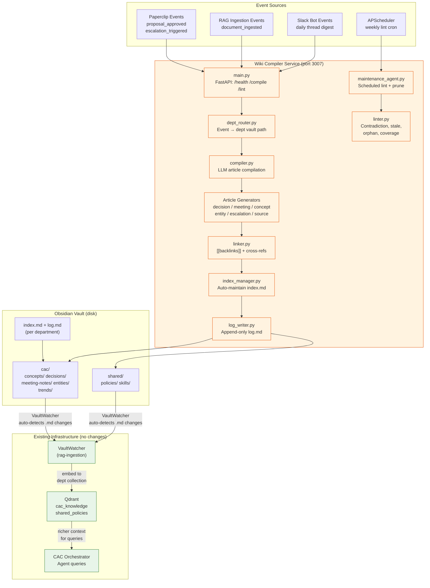
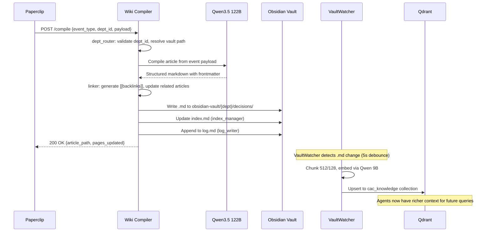
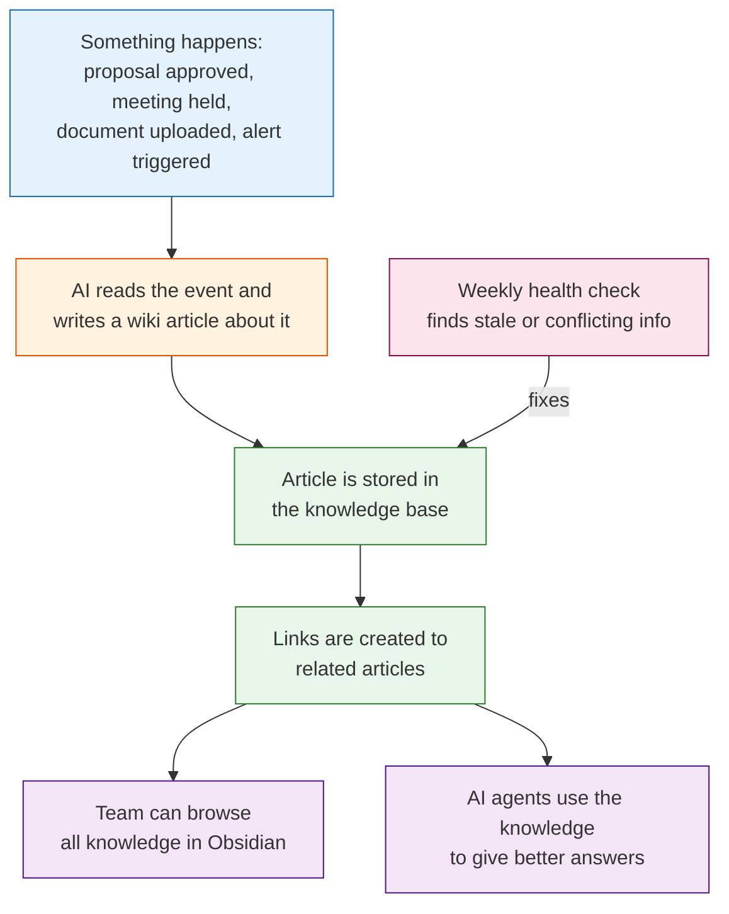
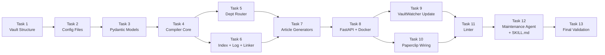

# Stage 9 — Wiki RAG Knowledge Base

> **For agentic workers:** REQUIRED SUB-SKILL: Use superpowers:subagent-driven-development (recommended) or superpowers:executing-plans to implement this plan task-by-task. Steps use checkbox (`- [ ]`) syntax for tracking.

**Goal:** Build an LLM-powered Wiki Compiler service that transforms raw events (approved proposals, Slack discussions, uploaded documents, escalations) into structured Obsidian wiki articles with backlinks, auto-maintained indices, and periodic health checks — shifting from pure query-time RAG to ingestion-time knowledge compilation. Agents get smarter automatically as committee history accumulates in department-scoped vault directories.

**Architecture:** Bottom-up approach: vault structure & config → Pydantic models → compiler core → article generators → department routing → Paperclip wiring → maintenance agent → lint workflow → integration tests → validation

**Tech Stack:** Python 3.11, FastAPI, Pydantic v2, langchain-openai, httpx, structlog, APScheduler, pytest-asyncio, Docker Compose

**Design Spec:** `docs/superpowers/specs/2026-04-07-stage9-wiki-rag-design.md`

**PRD Reference:** PRD.md v2.2, Section 16 (Obsidian Vault Integration), FR-12

**Pattern:** [Karpathy LLM Knowledge Bases](https://gist.github.com/karpathy/442a6bf555914893e9891c11519de94f) — ingestion-time compilation with 3-layer architecture (raw/wiki/schema)

### Team Agents

| Agent | Tasks | Superpower Skill |
|-------|-------|-----------------|
| service-builder | Tasks 1–8, 10–11 | superpowers:test-driven-development |
| rag-specialist | Task 9 | superpowers:brainstorming |
| skill-writer | Task 12 | superpowers:test-driven-development |
| tester | Task 13 | superpowers:verification-before-completion |

---

## System Overview



### Compilation Sequence



### Non-Technical Overview



### How to Read This Diagram

- **Orange** boxes = new components built in Stage 9 (Wiki Compiler service)
- **Green** boxes = existing infrastructure that requires no changes (VaultWatcher, Qdrant, Orchestrator)
- **Purple** boxes = human-facing outputs (Obsidian browsing, better agent answers)
- **Dashed arrows** = automatic flows (VaultWatcher detects changes without explicit wiring)

---

## What's Already Built vs What's Missing

| Component | Built | Missing |
|-----------|-------|---------|
| Obsidian vault directory | Shell: `index.md`, 2 templates, empty `policies/` | **Department subdirectories**, auto-maintained indices, log.md |
| VaultWatcher | Watches `/mnt/obsidian-vault`, embeds to `cac_knowledge` | **Updated obsidian_watch.json** for dept-scoped folder mapping |
| Qdrant collections | `cac_docs`, `cac_chat`, `cac_knowledge`, `shared_policies` | No changes needed |
| Paperclip event router | Routes `proposal_approved`, `escalation_triggered` | **New event type: `wiki_compile`** |
| SKILL.md files | 11 files in `skills/cac/` and `skills/shared/` | **wiki-maintenance.md** skill for maintenance agent |
| departments.json | `cac` department with dataAccess, escalation, channels | **`vaultPath` and `wikiCollection` fields** |
| Docker Compose | All 12 services running | **wiki-compiler service entry** |

---

## File Structure

### New Files (`services/wiki-compiler/`)

| File | Responsibility |
|------|---------------|
| `services/wiki-compiler/Dockerfile` | Container image (Python 3.11-slim) |
| `services/wiki-compiler/requirements.txt` | Dependencies |
| `services/wiki-compiler/src/__init__.py` | Package init |
| `services/wiki-compiler/src/main.py` | FastAPI app: `/health`, `/compile`, `/lint` |
| `services/wiki-compiler/src/config.py` | Settings, LLM client, vault path, dept config |
| `services/wiki-compiler/src/models.py` | Pydantic v2: CompileEvent, WikiArticle, LintResult, LintReport |
| `services/wiki-compiler/src/compiler.py` | Core LLM compilation: event → structured markdown |
| `services/wiki-compiler/src/dept_router.py` | Department routing + vault path resolution + boundary enforcement |
| `services/wiki-compiler/src/generators/__init__.py` | Generator package init |
| `services/wiki-compiler/src/generators/decision.py` | Approved proposal → decision article |
| `services/wiki-compiler/src/generators/meeting.py` | Slack digest → meeting-note article |
| `services/wiki-compiler/src/generators/concept.py` | Multi-source topic → concept article |
| `services/wiki-compiler/src/generators/entity.py` | Facility/person → entity page |
| `services/wiki-compiler/src/generators/escalation.py` | Escalation event → escalation article |
| `services/wiki-compiler/src/generators/source_summary.py` | New document → source summary |
| `services/wiki-compiler/src/index_manager.py` | Auto-maintain per-department index.md |
| `services/wiki-compiler/src/log_writer.py` | Append-only per-department log.md |
| `services/wiki-compiler/src/linker.py` | [[backlink]] generation + cross-reference updates |
| `services/wiki-compiler/src/linter.py` | Health checks: contradiction, stale, orphan, coverage |
| `services/wiki-compiler/src/maintenance_agent.py` | Scheduled lint + prune + gap report |

### New Config Files

| File | Responsibility |
|------|---------------|
| `config/wiki_schema.json` | Article conventions, frontmatter schema, lint schedule, department rules |
| `skills/shared/wiki-maintenance.md` | SKILL.md for Wiki Maintenance Agent |

### New Test Files

| File | What It Tests |
|------|--------------|
| `tests/unit/wiki_compiler/test_models.py` | Pydantic model validation, serialization |
| `tests/unit/wiki_compiler/test_compiler.py` | LLM compilation with mocked vLLM |
| `tests/unit/wiki_compiler/test_dept_router.py` | Department routing, boundary enforcement |
| `tests/unit/wiki_compiler/test_decision_generator.py` | Decision article from proposal |
| `tests/unit/wiki_compiler/test_meeting_generator.py` | Meeting note from Slack digest |
| `tests/unit/wiki_compiler/test_concept_generator.py` | Concept article from multi-source |
| `tests/unit/wiki_compiler/test_entity_generator.py` | Entity page generation |
| `tests/unit/wiki_compiler/test_index_manager.py` | Index.md auto-maintenance |
| `tests/unit/wiki_compiler/test_log_writer.py` | Log.md append-only entries |
| `tests/unit/wiki_compiler/test_linker.py` | Backlink generation, cross-refs |
| `tests/unit/wiki_compiler/test_linter.py` | Contradiction, stale, orphan, coverage detection |
| `tests/unit/wiki_compiler/test_maintenance.py` | Scheduled maintenance workflows |
| `tests/unit/wiki_compiler/test_main.py` | FastAPI endpoints |
| `tests/integration/test_wiki_compile.py` | Proposal → article → VaultWatcher → Qdrant |
| `tests/integration/test_wiki_lint.py` | Lint detects seeded issues |
| `tests/integration/test_wiki_boundary.py` | Department boundary enforcement E2E |

### Modified Files

| File | Changes |
|------|---------|
| `docker-compose.yml` | Add wiki-compiler service block |
| `config/obsidian_watch.json` | Department-scoped folder→collection mapping |
| `config/departments.json` | Add `vaultPath`, `wikiCollection` to DataAccess |
| `config/departments.schema.json` | Schema update for new fields |
| `services/paperclip/src/services/event_router.py` | Add `wiki_compile` event type routing |
| `services/rag-ingestion/src/main.py` | POST to wiki-compiler after document ingestion |
| `obsidian-vault/` | Restructure into `shared/`, `cac/` subdirectories |

---

## Implementation Order



**Critical path:** T1 → T2 → T3 → T4 → T7 → T8 → T10 → T11 → T12 → T13

**Parallel tracks:**
- Track A (core): T1 → T2 → T3 → T4 → T7 → T8
- Track B (routing): T5 (needs T3)
- Track C (file management): T6 (needs T3)
- Track D (wiring): T9 (needs T8) ‖ T10 (needs T8)
- Join: T11 (needs T9, T10) → T12 → T13

---

## Task 1: Vault Directory Restructure

**Agent:** service-builder | **Skill:** superpowers:test-driven-development

**Current state:** `obsidian-vault/` has flat structure with `index.md`, `decisions/templates/`, `meeting-notes/templates/`, `policies/`. Needs department-scoped subdirectories.

**Files:**
- Restructure: `obsidian-vault/` → `obsidian-vault/shared/`, `obsidian-vault/cac/`
- Create: `obsidian-vault/shared/index.md`, `obsidian-vault/shared/log.md`
- Create: `obsidian-vault/cac/index.md`, `obsidian-vault/cac/log.md`
- Create: `obsidian-vault/templates/` (article templates)

- [ ] **Step 1: Create department directory structure**

```
obsidian-vault/
├── shared/
│   ├── index.md
│   ├── log.md
│   ├── skills/              (symlink → ../../skills/shared/)
│   ├── policies/
│   └── escalation-protocols/
├── cac/
│   ├── index.md
│   ├── log.md
│   ├── skills/              (symlink → ../../skills/cac/)
│   ├── concepts/
│   ├── decisions/
│   ├── meeting-notes/
│   ├── entities/
│   └── trends/
└── templates/
    ├── concept.md
    ├── decision.md
    ├── meeting-note.md
    ├── entity.md
    └── escalation.md
```

- [ ] **Step 2: Move existing vault files to new structure**

Move `decisions/templates/decision-log.md` → `templates/decision.md`, move `meeting-notes/templates/meeting-note.md` → `templates/meeting-note.md`, move `policies/` → `shared/policies/`. Update `index.md` content to reflect new paths.

- [ ] **Step 3: Create seed index.md files with Dataview-compatible frontmatter**

Each department `index.md` follows this format:
```yaml
---
title: CAC Knowledge Base
type: index
department: cac
updated: 2026-04-07
---
```

- [ ] **Step 4: Create log.md files with initial entry**

```markdown
## [2026-04-07] init | Wiki knowledge base initialized for CAC department
```

- [ ] **Step 5: Create article templates with standard frontmatter**

Each template must include:
```yaml
---
title: ""
type: concept | decision | meeting-note | entity | escalation
department: ""
sources: []
related: []
created: ""
updated: ""
confidence: low | medium | high
coverage: low | medium | high
tags: []
---
```

- [ ] **Step 6: Symlink skill files into vault**

```bash
cd obsidian-vault/shared && ln -s ../../skills/shared skills
cd obsidian-vault/cac && ln -s ../../skills/cac skills
```

- [ ] **Step 7: Commit**

```bash
git add obsidian-vault/
git commit -m "feat(wiki): restructure obsidian vault with department-scoped directories"
```

---

## Task 2: Configuration Files

**Agent:** service-builder | **Skill:** superpowers:test-driven-development

**Current state:** `obsidian_watch.json` maps flat folders to `cac_knowledge`. `departments.json` lacks vault/wiki fields.

**Files:**
- Create: `config/wiki_schema.json`
- Modify: `config/obsidian_watch.json`
- Modify: `config/departments.json`
- Modify: `config/departments.schema.json`

- [ ] **Step 1: Create config/wiki_schema.json**

Define article conventions, frontmatter requirements, generator templates, lint schedule, and department rules. Reference the Karpathy pattern schema layer.

- [ ] **Step 2: Update obsidian_watch.json with department-scoped mappings**

Replace flat `skills/`, `meeting-notes/`, `decisions/`, `policies/` entries with `cac/concepts/`, `cac/decisions/`, `cac/meeting-notes/`, `cac/entities/`, `cac/trends/`, `shared/skills/`, `shared/policies/` entries — each mapped to the correct Qdrant collection.

- [ ] **Step 3: Update departments.json — add vaultPath and wikiCollection**

Add to `dataAccess`:
```json
"vaultPath": "/mnt/obsidian-vault/cac",
"wikiCollection": "cac_knowledge"
```

- [ ] **Step 4: Update departments.schema.json — add new fields**

Add `vaultPath` (string) and `wikiCollection` (string) to `DataAccess` definition.

- [ ] **Step 5: Commit**

```bash
git add config/
git commit -m "feat(wiki): add wiki_schema.json, update obsidian_watch and departments config"
```

---

## Task 3: Pydantic Models

**Agent:** service-builder | **Skill:** superpowers:test-driven-development

**Current state:** No wiki-compiler service exists. Need Pydantic v2 models for all data structures.

**Files:**
- Create: `services/wiki-compiler/src/models.py`
- Test: `tests/unit/wiki_compiler/test_models.py`

- [ ] **Step 1: Write failing tests for all models**

Test: CompileEvent (event_type enum, dept_id, payload), WikiArticle (frontmatter fields, body, path), LintResult (issue_type enum, article_path, description, severity), LintReport (dept_id, results list, timestamp), ArticleFrontmatter (title, type, department, sources, related, created, updated, confidence, coverage, tags).

- [ ] **Step 2: Run tests to verify they fail**

Run: `python -m pytest tests/unit/wiki_compiler/test_models.py -v`
Expected: All tests FAIL (ImportError — module doesn't exist)

- [ ] **Step 3: Implement models.py**

All models use Pydantic v2 `BaseModel`. CompileEvent.event_type is a `Literal["proposal_approved", "document_ingested", "slack_digest", "escalation_triggered", "lint_request"]`. WikiArticle includes `to_markdown()` method that renders frontmatter + body.

- [ ] **Step 4: Run tests to verify they pass**

Run: `python -m pytest tests/unit/wiki_compiler/test_models.py -v`
Expected: All tests PASS

- [ ] **Step 5: Commit**

```bash
git add services/wiki-compiler/src/models.py tests/unit/wiki_compiler/
git commit -m "feat(wiki): add Pydantic v2 models for wiki compiler"
```

---

## Task 4: Compiler Core

**Agent:** service-builder | **Skill:** superpowers:test-driven-development

**Current state:** No compilation logic exists. Need core LLM interaction that transforms events into structured markdown.

**Files:**
- Create: `services/wiki-compiler/src/config.py`
- Create: `services/wiki-compiler/src/compiler.py`
- Test: `tests/unit/wiki_compiler/test_compiler.py`

- [ ] **Step 1: Write failing tests for compiler**

Test: `compile_event()` with mocked LLM returns WikiArticle, frontmatter is valid YAML, body contains `[[backlinks]]`, source citations included, confidence level set. Mock vLLM at `host.docker.internal:8000`.

- [ ] **Step 2: Run tests to verify they fail**

Run: `python -m pytest tests/unit/wiki_compiler/test_compiler.py -v`
Expected: All tests FAIL

- [ ] **Step 3: Implement config.py**

Settings class with: `VLLM_BASE_URL`, `VAULT_PATH`, `WIKI_SCHEMA_PATH`, `DEPARTMENTS_CONFIG_PATH`, model name, temperature, max_tokens. Load from env with `python-dotenv`.

- [ ] **Step 4: Implement compiler.py**

`WikiCompiler` class with:
- `compile_event(event: CompileEvent) -> WikiArticle` — routes to appropriate generator
- `_build_system_prompt(event_type: str) -> str` — loads from wiki_schema.json
- `_call_llm(system: str, user: str) -> str` — async httpx POST to vLLM
- `_parse_article(raw: str, event: CompileEvent) -> WikiArticle` — extract frontmatter + body

Use `langchain-openai` ChatOpenAI with OpenAI-compatible API.

- [ ] **Step 5: Run tests to verify they pass**

Run: `python -m pytest tests/unit/wiki_compiler/test_compiler.py -v`
Expected: All tests PASS

- [ ] **Step 6: Commit**

```bash
git add services/wiki-compiler/src/config.py services/wiki-compiler/src/compiler.py tests/unit/wiki_compiler/test_compiler.py
git commit -m "feat(wiki): implement compiler core with LLM article compilation"
```

---

## Task 5: Department Router

**Agent:** service-builder | **Skill:** superpowers:test-driven-development

**Current state:** No department routing for wiki writes. Need to enforce that events write only to their department's vault subdirectory.

**Files:**
- Create: `services/wiki-compiler/src/dept_router.py`
- Test: `tests/unit/wiki_compiler/test_dept_router.py`

- [ ] **Step 1: Write failing tests**

Test: `resolve_vault_path(dept_id, article_type)` returns correct path, rejects invalid dept_id, rejects writes outside department directory (path traversal guard), loads department config from `departments.json`, resolves shared/ for cross-department content.

- [ ] **Step 2: Run tests to verify they fail**

- [ ] **Step 3: Implement dept_router.py**

`DeptRouter` class:
- `resolve_vault_path(dept_id: str, article_type: str) -> Path` — maps (dept, type) → vault subdirectory
- `validate_write_path(path: Path, dept_id: str) -> bool` — ensures path is within allowed directory
- `get_collection_for_dept(dept_id: str) -> str` — returns Qdrant collection name
- Loads department config at init, caches it

Path traversal guard: resolved path MUST be a child of `VAULT_PATH/{dept_id}/` or `VAULT_PATH/shared/`.

- [ ] **Step 4: Run tests to verify they pass**

- [ ] **Step 5: Commit**

```bash
git add services/wiki-compiler/src/dept_router.py tests/unit/wiki_compiler/test_dept_router.py
git commit -m "feat(wiki): implement department router with boundary enforcement"
```

---

## Task 6: Index Manager, Log Writer, Linker

**Agent:** service-builder | **Skill:** superpowers:test-driven-development

**Current state:** No auto-maintenance of index.md, log.md, or backlinks.

**Files:**
- Create: `services/wiki-compiler/src/index_manager.py`
- Create: `services/wiki-compiler/src/log_writer.py`
- Create: `services/wiki-compiler/src/linker.py`
- Test: `tests/unit/wiki_compiler/test_index_manager.py`
- Test: `tests/unit/wiki_compiler/test_log_writer.py`
- Test: `tests/unit/wiki_compiler/test_linker.py`

- [ ] **Step 1: Write failing tests for all three modules**

index_manager: `update_index(dept_id, article)` adds entry to correct category, removes duplicates, sorts by date. log_writer: `append_entry(dept_id, operation, description)` writes parseable `## [DATE] op | desc` line. linker: `update_backlinks(article, vault_path)` scans for `[[page-name]]` references, updates related articles' `related:` frontmatter.

- [ ] **Step 2: Run tests to verify they fail**

- [ ] **Step 3: Implement index_manager.py**

`IndexManager`:
- `update_index(dept_id: str, article: WikiArticle)` — reads index.md, finds category section, upserts entry, writes back
- `rebuild_index(dept_id: str)` — full regeneration from all articles in dept vault
- Index entries follow: `- [[article-name]] — summary (N sources) [YYYY-MM-DD]`

- [ ] **Step 4: Implement log_writer.py**

`LogWriter`:
- `append_entry(dept_id: str, operation: str, description: str, pages_affected: list[str] | None = None)`
- Format: `## [YYYY-MM-DD] {operation} | {description}`
- Followed by optional `Pages: [list]` and `Notes: [text]`

- [ ] **Step 5: Implement linker.py**

`Linker`:
- `update_backlinks(article: WikiArticle, vault_path: Path)` — scan article body for `[[page]]` references, update each referenced page's `related:` frontmatter to include the new article
- `find_broken_links(vault_path: Path) -> list[str]` — find `[[page]]` references with no matching file
- Intra-department links: `[[concept-name]]`; cross-department: `[[shared/policy-name]]`

- [ ] **Step 6: Run tests to verify they pass**

- [ ] **Step 7: Commit**

```bash
git add services/wiki-compiler/src/index_manager.py services/wiki-compiler/src/log_writer.py services/wiki-compiler/src/linker.py tests/unit/wiki_compiler/
git commit -m "feat(wiki): implement index manager, log writer, and backlink linker"
```

---

## Task 7: Article Generators

**Agent:** service-builder | **Skill:** superpowers:test-driven-development

**Current state:** No article generation logic. Need 6 generators that transform different event types into structured wiki articles.

**Files:**
- Create: `services/wiki-compiler/src/generators/__init__.py`
- Create: `services/wiki-compiler/src/generators/decision.py`
- Create: `services/wiki-compiler/src/generators/meeting.py`
- Create: `services/wiki-compiler/src/generators/concept.py`
- Create: `services/wiki-compiler/src/generators/entity.py`
- Create: `services/wiki-compiler/src/generators/escalation.py`
- Create: `services/wiki-compiler/src/generators/source_summary.py`
- Test: `tests/unit/wiki_compiler/test_decision_generator.py`
- Test: `tests/unit/wiki_compiler/test_meeting_generator.py`
- Test: `tests/unit/wiki_compiler/test_concept_generator.py`
- Test: `tests/unit/wiki_compiler/test_entity_generator.py`

- [ ] **Step 1: Write failing tests for decision and meeting generators**

Decision: from staging proposal manifest (agent, file, tab, cell, old_value, new_value, source, confidence, reasoning) → decision article with rationale section, cell change table, source citations, Paperclip ticket reference.

Meeting: from Slack thread digest (channel, messages, participants, date) → meeting-note article with attendees, topics discussed, action items, decisions made.

- [ ] **Step 2: Run tests to verify they fail**

- [ ] **Step 3: Implement decision.py**

`DecisionGenerator`:
- `generate(event: CompileEvent, compiler: WikiCompiler) -> WikiArticle`
- Extracts proposal manifest from event payload
- LLM prompt includes: proposal details, source context, template from wiki_schema.json
- Output article type: `decision`, confidence from proposal manifest

- [ ] **Step 4: Implement meeting.py**

`MeetingGenerator`:
- `generate(event: CompileEvent, compiler: WikiCompiler) -> WikiArticle`
- Extracts Slack message batch from event payload
- LLM prompt: summarize discussion, extract decisions, identify action items
- Output article type: `meeting-note`

- [ ] **Step 5: Implement concept.py, entity.py, escalation.py, source_summary.py**

Each follows the same pattern: extract payload → build LLM prompt with template → parse response into WikiArticle.

Concept: auto-detect topics spanning 3+ sources, write encyclopedia-style article.
Entity: facility/instrument/person page with key facts and references.
Escalation: event context, severity, resolution tracking.
Source summary: document overview with key findings and relevance tags.

- [ ] **Step 6: Write tests for concept and entity generators**

- [ ] **Step 7: Run all generator tests**

Run: `python -m pytest tests/unit/wiki_compiler/test_*_generator.py -v`
Expected: All tests PASS

- [ ] **Step 8: Commit**

```bash
git add services/wiki-compiler/src/generators/ tests/unit/wiki_compiler/test_*_generator.py
git commit -m "feat(wiki): implement 6 article generators (decision, meeting, concept, entity, escalation, source)"
```

---

## Task 8: FastAPI Service + Dockerfile + Docker Compose

**Agent:** service-builder | **Skill:** superpowers:test-driven-development

**Current state:** No wiki-compiler service exists in Docker Compose.

**Files:**
- Create: `services/wiki-compiler/src/__init__.py`
- Create: `services/wiki-compiler/src/main.py`
- Create: `services/wiki-compiler/Dockerfile`
- Create: `services/wiki-compiler/requirements.txt`
- Modify: `docker-compose.yml`
- Test: `tests/unit/wiki_compiler/test_main.py`

- [ ] **Step 1: Write failing tests for FastAPI endpoints**

Test: `/health` returns 200 with service info, `POST /compile` accepts CompileEvent and returns article path, `POST /lint` accepts dept_id and returns LintReport, auth middleware validates API key.

- [ ] **Step 2: Run tests to verify they fail**

- [ ] **Step 3: Implement main.py**

FastAPI app with lifespan (init compiler, router, index_manager, log_writer, linker on startup). Endpoints:
- `GET /health` — service name, version, uptime
- `POST /compile` — accepts CompileEvent, routes through compiler, returns `{article_path, pages_updated}`
- `POST /lint` — accepts `{dept_id}`, runs linter, returns LintReport
- `POST /lint/all` — runs lint on all departments

- [ ] **Step 4: Create Dockerfile**

Standard Python 3.11-slim pattern matching other services. COPY requirements.txt, pip install, COPY src/, CMD uvicorn.

- [ ] **Step 5: Create requirements.txt**

```
fastapi>=0.115
uvicorn>=0.34
pydantic>=2.10
pydantic-settings>=2.7
langchain-openai>=0.3
httpx>=0.28
structlog>=24.4
apscheduler>=3.10
python-dotenv>=1.0
pyyaml>=6.0
```

- [ ] **Step 6: Add wiki-compiler to docker-compose.yml**

```yaml
wiki-compiler:
  build: ./services/wiki-compiler
  ports:
    - "3007:3007"
  volumes:
    - ./obsidian-vault:/mnt/obsidian-vault:rw
    - ./config:/app/config:ro
    - ./skills:/app/skills:ro
  environment:
    - VLLM_BASE_URL=http://host.docker.internal:8000/v1
    - VAULT_PATH=/mnt/obsidian-vault
    - WIKI_SCHEMA_PATH=/app/config/wiki_schema.json
    - DEPARTMENTS_CONFIG=/app/config/departments.json
    - WIKI_COMPILER_PORT=3007
  extra_hosts:
    - "host.docker.internal:host-gateway"
  networks:
    - agent-net
  depends_on:
    postgres:
      condition: service_healthy
  restart: unless-stopped
```

Note: vault mount is `:rw` (not `:ro`) — this is the only service besides sync-mirror that writes to the vault. This does NOT violate the data safety rule — the vault is knowledge, not corporate data (`/data/mirror/` remains `:ro`).

- [ ] **Step 7: Run tests to verify they pass**

- [ ] **Step 8: Commit**

```bash
git add services/wiki-compiler/ docker-compose.yml tests/unit/wiki_compiler/test_main.py
git commit -m "feat(wiki): scaffold wiki-compiler FastAPI service with Dockerfile and compose entry"
```

---

## Task 9: VaultWatcher Config Update

**Agent:** rag-specialist | **Skill:** superpowers:brainstorming

**Current state:** VaultWatcher watches flat `skills/`, `meeting-notes/`, `decisions/`, `policies/` folders. Needs to watch department-scoped `cac/concepts/`, `cac/decisions/`, etc.

**Files:**
- Modify: `config/obsidian_watch.json` (already done in Task 2, verify VaultWatcher handles it)
- Modify: `services/rag-ingestion/src/vault_watcher.py` (if path parsing needs update)

- [ ] **Step 1: Verify VaultWatcher handles nested department paths**

Read `vault_watcher.py` and confirm the watchdog handler resolves relative paths correctly when `watch_folders` entries use `cac/concepts/` instead of flat `concepts/`. If it uses the `path` field as a prefix filter on the vault root, it should work without code changes.

- [ ] **Step 2: Test VaultWatcher with new config**

Create a test article in `obsidian-vault/cac/concepts/test-article.md` and verify VaultWatcher picks it up, chunks it, and embeds to `cac_knowledge`.

- [ ] **Step 3: Update VaultWatcher if needed**

If the path prefix logic doesn't handle nested department folders, update the file event handler to strip the department prefix correctly when determining collection routing.

- [ ] **Step 4: Verify doc_type metadata is preserved**

Ensure the `doc_type` field from `obsidian_watch.json` (concept, decision_log, meeting_note, entity, trend) is stored in the Qdrant payload for filtering.

- [ ] **Step 5: Commit**

```bash
git add config/obsidian_watch.json services/rag-ingestion/src/vault_watcher.py
git commit -m "feat(wiki): update VaultWatcher config for department-scoped vault paths"
```

---

## Task 10: Paperclip Event Router Wiring

**Agent:** service-builder | **Skill:** superpowers:test-driven-development

**Current state:** Paperclip event router handles `proposal_approved` (→ sync-back + email-notifier) and `escalation_triggered` (→ email + Slack). Needs new `wiki_compile` event type.

**Files:**
- Modify: `services/paperclip/src/services/event_router.py`
- Modify: `services/rag-ingestion/src/main.py` (POST to wiki-compiler after document ingestion)

- [ ] **Step 1: Read current event_router.py to understand routing pattern**

- [ ] **Step 2: Add wiki_compile event routing**

After `proposal_approved` routing (sync-back + email-notifier), add a non-blocking POST to wiki-compiler `/compile` with the proposal manifest as payload. Use httpx with timeout and retry (same pattern as existing event routing). Failure to compile wiki article should NOT block the approval flow — log warning and continue.

- [ ] **Step 3: Add document_ingested event to rag-ingestion**

After successful document ingestion in `services/rag-ingestion/src/main.py`, POST to wiki-compiler `/compile` with `event_type: "document_ingested"` and document metadata. Non-blocking, fire-and-forget with error logging.

- [ ] **Step 4: Add WIKI_COMPILER_URL env var to Paperclip and rag-ingestion**

Default: `http://wiki-compiler:3007`

- [ ] **Step 5: Commit**

```bash
git add services/paperclip/src/services/event_router.py services/rag-ingestion/src/main.py
git commit -m "feat(wiki): wire Paperclip and RAG ingestion to wiki-compiler compile endpoint"
```

---

## Task 11: Linter

**Agent:** service-builder | **Skill:** superpowers:test-driven-development

**Current state:** No health check or lint workflow exists for wiki content.

**Files:**
- Create: `services/wiki-compiler/src/linter.py`
- Test: `tests/unit/wiki_compiler/test_linter.py`

- [ ] **Step 1: Write failing tests for linter**

Test: `lint_department(dept_id)` returns LintReport with detected issues. Seed test vault with: two contradicting articles (contradiction detection), an article with outdated `updated` date (stale detection), an article with no inbound `[[backlinks]]` (orphan detection), a `[[missing-page]]` reference (missing concept detection), articles with varying source counts (coverage scoring).

- [ ] **Step 2: Run tests to verify they fail**

- [ ] **Step 3: Implement linter.py**

`WikiLinter` class:
- `lint_department(dept_id: str) -> LintReport` — runs all checks, returns aggregated report
- `_check_contradictions(articles: list[WikiArticle]) -> list[LintResult]` — use LLM to compare claims across articles
- `_check_stale(articles: list[WikiArticle]) -> list[LintResult]` — compare `updated` dates with source data timestamps
- `_check_orphans(articles: list[WikiArticle]) -> list[LintResult]` — find articles with no inbound references
- `_check_missing_concepts(articles: list[WikiArticle]) -> list[LintResult]` — find `[[page]]` references with no matching file
- `_score_coverage(articles: list[WikiArticle]) -> list[LintResult]` — tag high (5+), medium (2-4), low (0-1) based on sources count
- `write_lint_report(dept_id: str, report: LintReport)` — write `lint-report.md` to department vault

- [ ] **Step 4: Run tests to verify they pass**

- [ ] **Step 5: Commit**

```bash
git add services/wiki-compiler/src/linter.py tests/unit/wiki_compiler/test_linter.py
git commit -m "feat(wiki): implement linter with contradiction, stale, orphan, coverage checks"
```

---

## Task 12: Maintenance Agent + SKILL.md

**Agent:** skill-writer | **Skill:** superpowers:test-driven-development

**Current state:** No maintenance agent exists. Need SKILL.md and scheduled maintenance workflow.

**Files:**
- Create: `skills/shared/wiki-maintenance.md`
- Create: `services/wiki-compiler/src/maintenance_agent.py`
- Test: `tests/unit/wiki_compiler/test_maintenance.py`

- [ ] **Step 1: Write wiki-maintenance.md SKILL.md**

Follow PRD Section 11 format (9 mandatory sections). The maintenance agent:
- **Mandate:** Maintain wiki knowledge base integrity, detect inconsistencies, prune stale content
- **Tone & Style:** Internal-facing, concise, action-oriented lint reports
- **Domain Knowledge:** Understands all department vaults, article types, frontmatter schema
- **Retrieval Instructions:** Reads all articles in target department vault, cross-references with source data timestamps
- **Staging Proposal Rules:** NEVER generates staging proposals — knowledge maintenance only
- **Excel Navigation:** N/A — does not interact with Excel trackers
- **Escalation Triggers:** Contradiction between wiki and approved proposal data → alert to HOD
- **Output Format:** `lint-report.md` per department, `log.md` entries, updated article frontmatter
- **Hard Rules:** Never delete articles (only archive), never modify article body (only frontmatter metadata)

- [ ] **Step 2: Write failing tests for maintenance_agent.py**

Test: `run_maintenance(dept_id)` calls linter, writes lint-report.md, appends log entry, triggers pruning for old articles, generates gap report.

- [ ] **Step 3: Implement maintenance_agent.py**

`MaintenanceAgent` class:
- `run_maintenance(dept_id: str)` — orchestrates full maintenance cycle
- `_prune_old_articles(dept_id: str, max_age_days: int = 365)` — move articles older than threshold to `archive/`
- `_generate_gap_report(dept_id: str)` — LLM analysis of what topics are missing
- `_register_heartbeat()` — POST to Paperclip heartbeat endpoint
- APScheduler job: weekly cron (configurable in wiki_schema.json)

- [ ] **Step 4: Register wiki-maintenance-agent in Paperclip**

Add to DB seed (like existing agents): department=shared, agent_name=wiki-maintenance-agent, agent_role=knowledge maintenance, worker_type=internal.

- [ ] **Step 5: Run tests to verify they pass**

- [ ] **Step 6: Commit**

```bash
git add skills/shared/wiki-maintenance.md services/wiki-compiler/src/maintenance_agent.py tests/unit/wiki_compiler/test_maintenance.py
git commit -m "feat(wiki): add maintenance agent with SKILL.md, scheduled lint, and gap reports"
```

---

## Task 13: Final Validation & Ruff Check

**Agent:** tester | **Skill:** superpowers:verification-before-completion

- [ ] **Step 1: Run all wiki-compiler unit tests**

```bash
python -m pytest tests/unit/wiki_compiler/ -v --tb=short
```
Expected: All tests PASS (target: ~60 tests)

- [ ] **Step 2: Run ruff linter on all new code**

```bash
ruff check services/wiki-compiler/ tests/unit/wiki_compiler/
```
Expected: Clean (0 issues)

- [ ] **Step 3: Fix any ruff issues**

- [ ] **Step 4: Run integration tests (requires Docker)**

```bash
python -m pytest tests/integration/test_wiki_compile.py tests/integration/test_wiki_lint.py tests/integration/test_wiki_boundary.py -v
```

Integration test scenarios:
1. **Golden path:** POST proposal_approved event → decision article created in `cac/decisions/` → VaultWatcher embeds to `cac_knowledge` → agent query returns article content
2. **Lint detection:** Seed contradicting articles → POST `/lint` → LintReport contains contradiction
3. **Department boundary:** POST event with `dept_id=cac` → verify no files created in `shared/` or `risk/`

- [ ] **Step 5: Verify Docker Compose stack**

```bash
docker compose up -d wiki-compiler
docker compose exec wiki-compiler curl -s localhost:3007/health | jq .
```
Expected: `{"service": "wiki-compiler", "status": "healthy", ...}`

- [ ] **Step 6: Run full test suite**

```bash
python -m pytest tests/ -v --tb=short
```
Expected: All existing tests still pass + new wiki tests

- [ ] **Step 7: Update Implementation.md — mark Stage 9 tasks complete**

- [ ] **Step 8: Final commit**

```bash
git add -A
git commit -m "feat(wiki): Stage 9 complete — wiki RAG knowledge base with maintenance agent"
```

---

## Quality Gates

| # | Gate | Verification |
|---|------|-------------|
| Q1 | Article compilation < 30s | `test_compiler.py` latency assertion |
| Q2 | Department boundary enforcement | `test_wiki_boundary.py` |
| Q3 | Index.md auto-updated after compilation | `test_index_manager.py` |
| Q4 | Log.md appended with parseable format | `test_log_writer.py` |
| Q5 | Backlinks generated correctly | `test_linker.py` |
| Q6 | Lint detects seeded contradiction | `test_wiki_lint.py` |
| Q7 | VaultWatcher picks up new articles | `test_wiki_compile.py` integration |
| Q8 | Paperclip event routes to wiki-compiler | `test_wiki_compile.py` integration |
| Q9 | Maintenance agent writes lint-report.md | `test_maintenance.py` |
| Q10 | Ruff clean on all new code | `ruff check` |
| Q11 | wiki-compiler /health returns 200 | Docker Compose manual check |
| Q12 | No existing tests broken | Full `pytest` suite |

---

## Verification Commands

```bash
# Unit tests (wiki-compiler only)
python -m pytest tests/unit/wiki_compiler/ -v --tb=short

# Integration tests (requires Docker stack)
python -m pytest tests/integration/test_wiki_compile.py tests/integration/test_wiki_lint.py tests/integration/test_wiki_boundary.py -v

# Ruff lint
ruff check services/wiki-compiler/ tests/unit/wiki_compiler/

# Full test suite (all stages)
python -m pytest tests/ -v --tb=short

# Docker health check
docker compose up -d wiki-compiler && docker compose exec wiki-compiler curl -s localhost:3007/health
```

---

## Task Summary

| # | Task | Agent | Files | Tests |
|---|------|-------|-------|-------|
| 1 | Vault Directory Restructure | service-builder | ~15 vault files | 0 |
| 2 | Configuration Files | service-builder | 4 config files | 0 |
| 3 | Pydantic Models | service-builder | 1 source, 1 test | ~10 |
| 4 | Compiler Core | service-builder | 2 source, 1 test | ~8 |
| 5 | Department Router | service-builder | 1 source, 1 test | ~8 |
| 6 | Index + Log + Linker | service-builder | 3 source, 3 test | ~15 |
| 7 | Article Generators | service-builder | 7 source, 4 test | ~12 |
| 8 | FastAPI + Docker | service-builder | 4 source, 1 test | ~6 |
| 9 | VaultWatcher Update | rag-specialist | 1-2 modified | ~2 |
| 10 | Paperclip Wiring | service-builder | 2 modified | 0 |
| 11 | Linter | service-builder | 1 source, 1 test | ~8 |
| 12 | Maintenance Agent + SKILL.md | skill-writer | 2 source, 1 test, 1 skill | ~6 |
| 13 | Final Validation | tester | 0 new, 3 integration | ~8 |

**Total: ~22 new source files, ~7 modified files, ~16 test files, ~83 tests**
