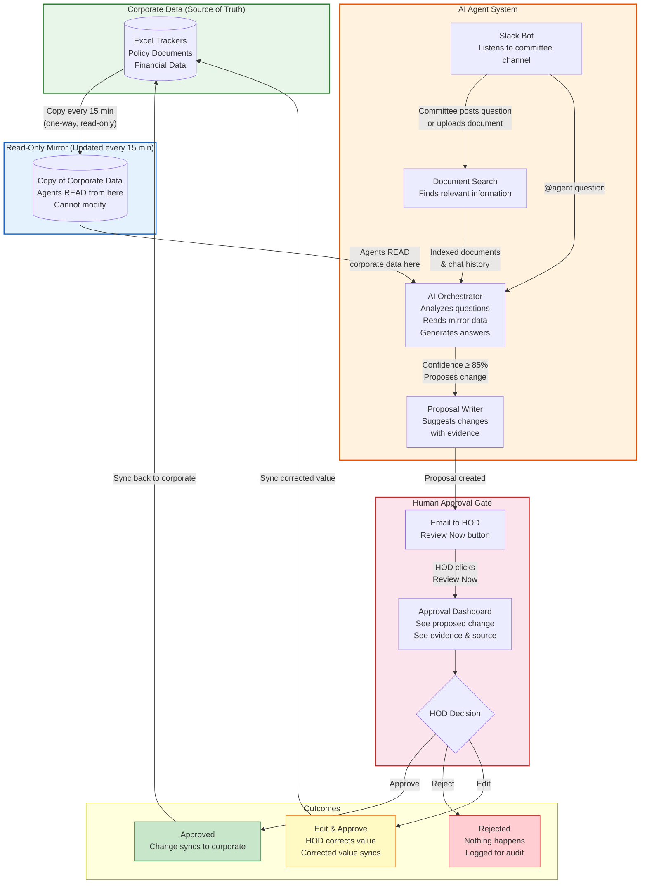
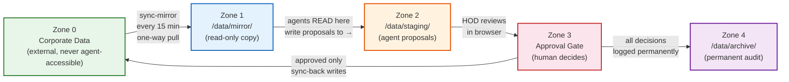
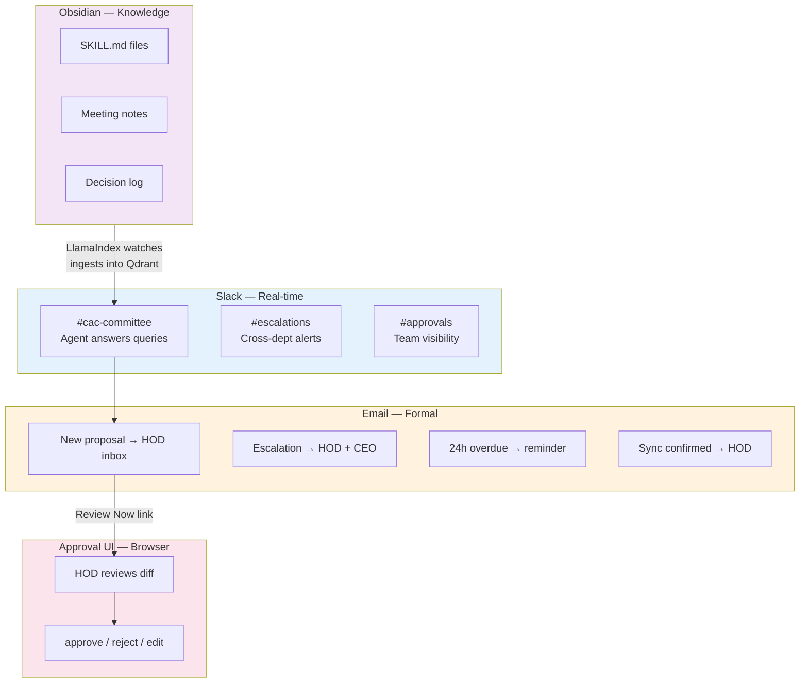
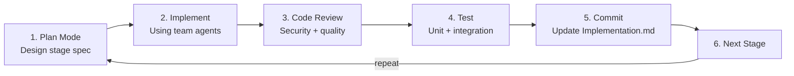

# Corporate AI Agent System — Architecture Design Spec

**Version:** 1.0
**Date:** 2026-03-25
**PRD Reference:** PRD.md v2.2
**Status:** Draft

---

## 1. Overview

A multi-agent AI system for Brooker Group's Capital Allocation & ALCO Committee (Phase 1). The system reads committee Slack channels and uploaded documents, answers questions with source citations, proposes changes to Excel trackers, and requires human approval before touching live corporate data.

**Core principle:** Agents work on a read-only mirror of corporate data. They can never modify the original. All proposed changes go through a human approval gate before syncing back.

---

## 2. System Architecture — Management View

### How the System Works (Non-Technical)



### Key Safety Guarantees

1. **Agents NEVER touch corporate data directly** — they read a copy (mirror) and propose changes
2. **Every change requires human approval** — HOD reviews in browser, no Slack needed
3. **Full audit trail** — every proposal, decision, and sync is logged permanently
4. **HODs only need email + browser** — no Slack account required
5. **Confidence threshold** — agents only propose changes when ≥ 85% confident with evidence

---

## 3. Technical Architecture

### 3.1 Infrastructure

**Two DGX Sparks** (128GB unified memory each):
- Both run Qwen3.5 122B Q8 for reasoning
- Spark A also runs Qwen3.5 9B for embeddings
- nginx load balancer distributes requests across both Sparks
- All Docker services run on Spark A

```
┌──────────────────────────────────────────────────────────┐
│  DGX Spark A (Primary)                                    │
│                                                           │
│  [HOST] vLLM · Qwen3.5 122B Q8          ~110GB           │
│  [HOST] vLLM · Qwen3.5 9B (embedding)    ~10GB           │
│                                                           │
│  [DOCKER] nginx (LB)        :8080    → Spark A + B       │
│  [DOCKER] slack-bot          :3003                        │
│  [DOCKER] rag-ingestion      :3004                        │
│  [DOCKER] cac-orchestrator   :3001                        │
│  [DOCKER] sync-mirror        internal                     │
│  [DOCKER] sync-back          internal                     │
│  [DOCKER] approval-ui        :4000                        │
│  [DOCKER] email-notifier     internal                     │
│  [DOCKER] paperclip          :3100                        │
│  [DOCKER] postgres           :5432                        │
│  [DOCKER] qdrant             :6333/:6334                  │
│  [DOCKER] minio              :9000                        │
│  [DOCKER] gateway            :3000                        │
└──────────────────────────────────────────────────────────┘

┌──────────────────────────────────────────────────────────┐
│  DGX Spark B (Secondary)                                  │
│                                                           │
│  [HOST] vLLM · Qwen3.5 122B Q8          ~110GB           │
│  (nginx on Spark A load-balances to this Spark)           │
└──────────────────────────────────────────────────────────┘
```

### 3.2 Data Zones



**Docker enforces Zone 1 as read-only** at the OS level:
```yaml
cac-orchestrator:
  volumes:
    - mirror_data:/data/mirror:ro    # :ro = read-only, Docker-enforced
    - staging_data:/data/staging:rw
```

### 3.3 Service Map

| Service | Port | Role | Reads | Writes |
|---------|------|------|-------|--------|
| gateway | 3000 | API gateway, auth | — | — |
| cac-orchestrator | 3001 | LangGraph agent graph | mirror (ro), Qdrant, Postgres | staging/pending/ |
| slack-bot | 3003 | Slack Events API listener | Slack API | rag-ingestion API |
| rag-ingestion | 3004 | Document + message ingestion | uploaded files, vault | Qdrant |
| sync-mirror | internal | Pulls corporate data | Corporate (SharePoint/SMB) | mirror/ |
| sync-back | internal | Writes approved changes | staging/approved/ | Corporate, archive/ |
| approval-ui | 4000 | Human review dashboard | staging/ | staging/ (move files) |
| email-notifier | internal | HOD email notifications | Postgres | SMTP/SendGrid |
| paperclip | 3100 | Agent orchestration shell | Postgres | Postgres |
| nginx | 8080 | vLLM load balancer → Spark A:8000 + B:8000 | — | — |
| postgres | 5432 | Database | — | — |
| qdrant | 6333 | Vector store (REST), 6334 (gRPC) | — | — |
| minio | 9000 | Document store | — | — |

### 3.4 LLM Access Pattern

```
All Docker services
    │
    │  VLLM_LARGE_URL=http://nginx:8080/v1
    ▼
nginx :8080 (load balancer, Docker internal)
    │
    ├──▶ Spark A vLLM :8000 (Qwen 122B) via host.docker.internal
    └──▶ Spark B vLLM :8000 (Qwen 122B) via spark-b-ip

Embedding only:
    VLLM_EMBED_URL=http://host.docker.internal:8002/v1
    Services → Spark A vLLM :8002 (Qwen 9B embed)
```

**Port assignment:** nginx listens on Docker port 8080 (not 8000) to avoid conflict with vLLM on the host which uses port 8000. Services use `http://nginx:8080/v1` for LLM calls within the Docker network.

- nginx uses least-connections algorithm
- Health checks: `/v1/models` endpoint
- Failover: if one Spark is down, all traffic routes to the other
- Embedding runs only on Spark A (lightweight, single instance sufficient)

### 3.5 Communication Layers



---

## 4. Stage Breakdown

### Stage 1: Infrastructure
**Goal:** Scaffold repo, Docker infrastructure, database schema, dual-Spark LB config.

**Deliverables:**
- Repository directory structure (all folders from PRD §4)
- `.gitignore`, `.env.example`, `README.md`, `AGENTS.md`
- `docker-compose.yml` (postgres, qdrant, minio, nginx, gateway)
- `docker-compose.dev.yml` (local dev overrides)
- `infra/vllm/start-122b.sh`, `start-embed.sh`
- `infra/nginx/nginx.conf` (dual-Spark load balancer)
- `migrations/001_initial_schema.sql` (7 Postgres tables: agent_interactions, staging_proposals, approval_decisions, sync_log, ingested_documents, escalations, email_log)
- `config/` skeleton files (excel_schema/alco_tracker.json, dept_channels.json, hod_emails.json, escalation_rules.json, obsidian_watch.json)
- Data directory setup script
- Health check verification

**Exit criteria:** `docker compose up` starts postgres, qdrant, minio, nginx. All health checks pass. Postgres has all 7 tables.

### Stage 2: Mirror + RAG
**Goal:** Corporate data mirror service + RAG ingestion pipeline.

**Deliverables:**
- `services/sync-mirror/` (SharePoint/SMB/SFTP connectors, hash check, APScheduler)
- `services/rag-ingestion/` (chunker, embedder, qdrant_store, chat_indexer, VaultWatcher class)
- Note: VaultWatcher class built here but Obsidian-specific configuration done in Stage 6
- Unit tests: test_chunker, test_embedder, test_hash_check
- Integration test: test_rag_pipeline, test_mirror_sync

**Exit criteria:** PDF ingested → searchable in Qdrant. Mirror sync populates /data/mirror/. Container cannot write to mirror (:ro verified).

### Stage 3: Slack Bot
**Goal:** Slack Events API listener, file handler, message indexer.

**Deliverables:**
- `services/slack-bot/` (events.py, file_handler.py, responder.py)
- Slack App config documentation
- Unit tests: message handling, file shared events
- Integration test: test_slack_bot

**Exit criteria:** Post message → indexed in Qdrant. Share file → ingested. @agent → threaded reply (stubbed response).

### Stage 4: CAC Orchestrator
**Goal:** LangGraph StateGraph with agent stubs.

**Deliverables:**
- `services/cac-orchestrator/` (graph.py, state.py, router.py, synthesiser.py)
- Agent stubs: liquidity.py, capital.py, alm.py, funding.py, escalation.py, excel_nav.py
- Tools: rag_retrieve.py, chat_search.py, excel_schema.py, staging_writer.py
- Skills loader: skills/loader.py
- PostgresSaver checkpointer with `langgraph-checkpoint-postgres`
- Unit tests: test_router
- Integration test: test_cac_graph (POST /query → structured response)

**Exit criteria:** POST /query → classify intent → retrieve context → synthesize response with citations.

### Stage 5: Agents + Staging Writer
**Goal:** All specialist agents operational, staging proposal pipeline.

**Deliverables:**
- Implement all 4 specialist agents (liquidity, capital, ALM, funding)
- Escalation check + Slack #escalations posting
- Excel navigator with alco_tracker.json schema
- staging_writer.py with manifest validation
- Unit tests: test_escalation, test_staging_writer, test_excel_nav
- Integration tests: test_staging_flow, test_escalation_flow

**Exit criteria:** Query triggers correct specialist. High-confidence answer produces staging proposal. Escalation triggers fire for breach conditions.

### Stage 6: Approval + Sync + Email + Obsidian
**Goal:** Complete approval pipeline, email notifications, vault integration.

**Deliverables:**
- `services/approval-ui/` (FastAPI + index.html diff view, responsive for mobile)
- `services/sync-back/` (watchdog, openpyxl writer, archiver, rollback)
- `services/email-notifier/` (sender.py, 4 HTML templates, APScheduler reminder)
- Obsidian vault structure + VaultWatcher in rag-ingestion
- Unit tests: test_approval_queue, test_sync_back, test_rollback, test_email_sender, test_email_recipients, test_email_reminder, test_email_deeplink, test_vault_watcher, test_vault_debounce, test_vault_dedup
- Integration tests: test_email_proposal, test_email_approval, test_email_retry, test_vault_ingest, test_sync_loop

**Exit criteria:** Full loop: propose → HOD email → click link → approve → Excel updated → archived. Rejection blocks sync. Vault .md save → Qdrant within 60s.

### Stage 7: Skills + Integration
**Goal:** All 11 SKILL.md files, Paperclip, end-to-end integration.

**Tools:** Skill Creator plugin + NotebookLM MCP for domain research.

**Deliverables:**
- 5 shared skills: escalation-protocol, citation-format, excel-navigation, rag-retrieval, chat-ingestion
- 6 CAC skills: cfo-agent, covenant-monitoring, liquidity-analysis, capital-allocation, alm-review, funding-facilities
- Paperclip installation + CFO Agent + OpenClaw registration
- Full integration tests
- End-to-end: @agent → answer → staging → email → approve → sync → archive

**Exit criteria:** All 11 SKILL.md files loaded. Paperclip tickets created. Full pipeline works end-to-end with real skills.

### Stage 8: UAT + Go-Live
**Goal:** User acceptance testing, real data, production deployment.

**Deliverables:**
- UAT with committee members (Slack side)
- UAT with HOD (email + browser side)
- Populate alco_tracker.json with real Excel structure
- Populate hod_emails.json with real HOD addresses
- Load test: 10 concurrent queries
- Cowork plugins from SKILL.md files
- OpenClaw configuration in Paperclip
- Production deployment on DGX Spark

**Exit criteria:** All UAT checklist items from PRD §14 pass. Production stable for 1 week.

---

## 5. Tech Stack

| Component | Technology | Version |
|-----------|-----------|---------|
| LLM inference | vLLM (host) | 0.7+ |
| LLM model (reasoning) | Qwen3.5 122B-A10B Q8 | latest |
| LLM model (embedding) | Qwen3.5 9B | latest |
| LLM load balancer | nginx | 1.25+ |
| Agent framework | LangGraph | 0.2+ |
| Agent checkpointer | langgraph-checkpoint-postgres | 0.1+ |
| RAG framework | LlamaIndex | 0.11+ |
| Vector store | Qdrant | 1.12+ |
| Chat platform | Slack Bolt (Python) | 1.18+ |
| API services | FastAPI + Uvicorn | 0.111+ |
| Email | smtplib / SendGrid / MS Graph | — |
| Knowledge UI | Obsidian (desktop) | — |
| Vault watcher | watchdog | 4.0+ |
| Excel | openpyxl | 3.1+ |
| Database | PostgreSQL | 16 |
| Document store | MinIO | latest |
| Containers | Docker Compose | 3.9 |
| Orchestration shell | Paperclip (Node.js) | 20+ |
| Python | 3.11+ | — |
| Validation | Pydantic | 2.0+ |
| Testing | pytest | 8.0+ |
| Linting | ruff | latest |

---

## 6. Development Workflow Per Stage



**Per-stage tools:**
- **Plan:** `EnterPlanMode` + architect agent + superpowers:writing-plans
- **Implement:** service-builder, rag-specialist, langgraph-builder agents + superpowers:executing-plans
- **Review:** security-auditor agent + superpowers:requesting-code-review
- **Test:** tester agent + superpowers:verification-before-completion
- **Commit:** superpowers:finishing-a-development-branch
- **Skills (Stage 7):** Skill Creator plugin + NotebookLM MCP

---

## 7. Differences from PRD

| PRD Says | This Spec | Reason |
|----------|-----------|--------|
| Single DGX Spark, 2nd in Phase 3 | Dual-Spark from Stage 1 with nginx LB | User preference: both Sparks available now |
| Qwen 35B on Spark B | Qwen 122B on both, load-balanced | User preference: same model, better utilization |
| No load balancer mentioned | nginx on port 8080 in docker-compose | Required for dual-Spark distribution. Port 8080 avoids conflict with vLLM on host port 8000 |
| VLLM_LARGE_URL points to host:8000 | VLLM_LARGE_URL points to nginx:8080 | Services use nginx for load-balanced LLM access. Embedding still direct to host:8002 |
| Weeks 1-8 | Stages 1-8 | Better alignment with plan-mode workflow |
| Chroma as vector store | Qdrant as vector store | Better production scalability, filtering, gRPC support |
| AGENTS.md pasted manually | CLAUDE.md auto-loaded + AGENTS.md at root | Modern Claude Code convention |

All other PRD requirements are unchanged.
