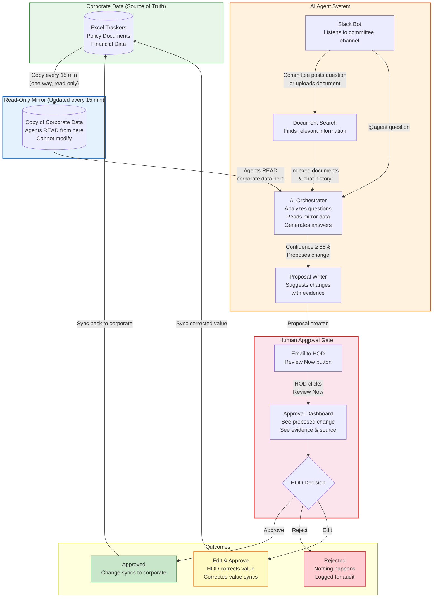
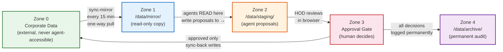
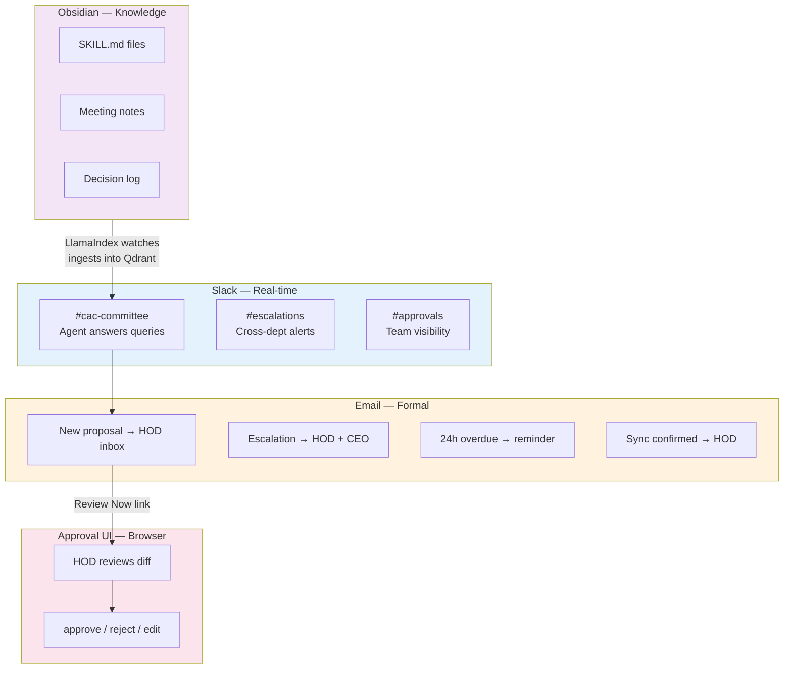
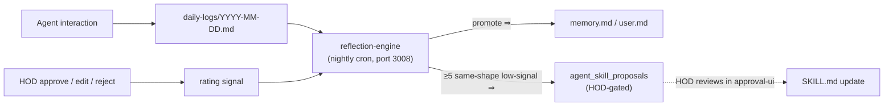
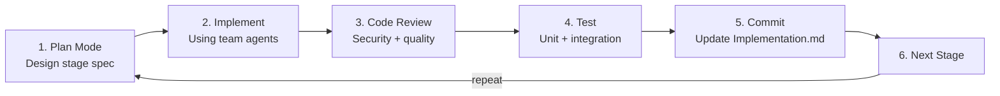

# Corporate AI Agent System — Architecture Design Spec

**Version:** 2.0
**Originally created:** 2026-03-25
**Last refreshed:** 2026-05-13
**PRD Reference:** PRD.md v2.2
**Status:** Living document — refreshed at end of each stage cluster

**Current build state (per `docs/Implementation.md`):**

| Phase | Status | What's live |
|-------|--------|-------------|
| **Phase 1** — CAC Committee | Stages 1–9 ✅ | Mirror, RAG, Slack, CAC Orchestrator, all 4 CAC specialist agents, staging→approval→sync-back loop, email, Obsidian vault, Paperclip, OpenClaw worker, HR Department (first multi-dept), Wiki RAG compiler |
| **Phase 1 closeout** | ⏳ pending | UAT with committee + HOD, populate real configs, load test, production deploy |
| **Phase 2 framework** — Department onboarding infrastructure | Stage 10 ✅ | Catalog (departments.json + document_inventory.json), reflection-engine (3008), heartbeat (3009), shared library, per-skill permission registry, agent_performance view |
| **Phase 2 expansion** — 9 more departments | Stages 11–19 📋 | Scaffolded (Finance, Risk, Legal, IT, Comms, IC, CIO, VCC, IB). Each ~1.5 days using framework's 12-step checklist |

---

## 1. Overview

A multi-agent AI system for Brooker Group committee operations.

- **Phase 1** delivers the Capital Allocation & ALCO Committee (CAC) end-to-end loop and adds HR as the first Phase 2 expansion department.
- **Phase 2** introduces a department-onboarding framework so each of the remaining 9 departments lands in roughly a day and a half. Stages 11–19 each onboard one department (Finance, Risk, Legal, IT, Communications, IC, CIO, VCC, IB).

The system reads committee Slack channels and uploaded documents, answers questions with source citations, proposes changes to Excel trackers, and requires human approval before touching live corporate data. Phase 2 adds: department-scoped knowledge boundaries, nightly reflection that promotes daily logs into long-term memory and proposes skill updates, and an optional proactive (heartbeat) layer.

**Core principle:** Agents work on a read-only mirror of corporate data. They can never modify the original. All proposed changes go through a human approval gate before syncing back.

---

## 2. System Architecture — Management View

### How the System Works (Non-Technical)



### Key Safety Guarantees

1. **Agents NEVER touch corporate data directly** — they read a copy (mirror) and propose changes
2. **Every change requires human approval** — HOD reviews in browser, no Slack needed
3. **Full audit trail** — every proposal, decision, and sync is logged permanently
4. **HODs only need email + browser** — no Slack account required
5. **Confidence threshold** — agents only propose changes when ≥ 85% confident with evidence

---

## 3. Technical Architecture

### 3.1 Infrastructure

**Two DGX Sparks** (128GB unified memory each):
- Both run Qwen3.5 122B Q8 for reasoning
- Spark A also runs Qwen3.5 9B for embeddings
- nginx load balancer distributes requests across both Sparks
- All Docker services run on Spark A

```
┌────────────────────────────────────────────────────────────────────┐
│  DGX Spark A (Primary)                                              │
│                                                                     │
│  [HOST]   vLLM · Qwen3.5 122B Q8                       ~110GB      │
│  [HOST]   vLLM · Qwen3.5 9B (embedding)                 ~10GB      │
│                                                                     │
│  --- Edge / API ---                                                 │
│  [DOCKER] nginx (LB)              :8080  → Spark A + B vLLM        │
│  [DOCKER] gateway                 :3000  API gateway                │
│                                                                     │
│  --- Front-end / ingestion ---                                      │
│  [DOCKER] slack-bot               :3003                             │
│  [DOCKER] rag-ingestion           :3004                             │
│                                                                     │
│  --- Orchestrators (per-dept LangGraph) ---                         │
│  [DOCKER] cac-orchestrator        :3001  (Phase 1 CAC)              │
│  [DOCKER] hr-orchestrator         :3002  (Phase 1, write-disabled)  │
│  [DOCKER] read-only-orchestrator  :3020  (template for read depts)  │
│                                                                     │
│  --- Data movement ---                                              │
│  [DOCKER] sync-mirror             internal  (15-min pull)           │
│  [DOCKER] sync-back               internal  (approved → Zone 0)     │
│                                                                     │
│  --- Human-in-the-loop ---                                          │
│  [DOCKER] approval-ui             :4000                             │
│  [DOCKER] email-notifier          internal                          │
│                                                                     │
│  --- Phase 2 framework ---                                          │
│  [DOCKER] paperclip               :3100  agent shell                │
│  [DOCKER] wiki-compiler           :3007  Karpathy-style knowledge   │
│  [DOCKER] reflection-engine       :3008  nightly memory promotion   │
│  [DOCKER] heartbeat               :3009  proactive layer (opt-in)   │
│  [DOCKER] eval-framework          :3030  golden-path regression     │
│                                                                     │
│  --- Storage / observability ---                                    │
│  [DOCKER] postgres                :5432                             │
│  [DOCKER] qdrant                  :6333/:6334                       │
│  [DOCKER] minio                   :9000                             │
│  [DOCKER] prometheus              :9090                             │
│  [DOCKER] grafana                 :3050                             │
└────────────────────────────────────────────────────────────────────┘

┌────────────────────────────────────────────────────────────────────┐
│  DGX Spark B (Secondary)                                            │
│                                                                     │
│  [HOST]   vLLM · Qwen3.5 122B Q8                       ~110GB      │
│  (nginx on Spark A load-balances to this Spark)                     │
└────────────────────────────────────────────────────────────────────┘
```

> **Phase 2 expansion**: Stages 11–19 each add one orchestrator (ports 3010–3018). Most reuse `read-only-orchestrator` as a template; write-capable departments (Finance, CIO, VCC) use the `_template-orchestrator` skeleton derived from CAC/HR.

### 3.2 Data Zones



**Docker enforces Zone 1 as read-only** at the OS level:
```yaml
cac-orchestrator:
  volumes:
    - mirror_data:/data/mirror:ro    # :ro = read-only, Docker-enforced
    - staging_data:/data/staging:rw
```

### 3.3 Service Map

#### Edge / API
| Service | Port | Role | Reads | Writes |
|---------|------|------|-------|--------|
| gateway | 3000 | API gateway, auth | — | — |
| nginx | 8080 | vLLM load balancer → Spark A:8000 + B:8000 | — | — |

#### Front-end / ingestion
| Service | Port | Role | Reads | Writes |
|---------|------|------|-------|--------|
| slack-bot | 3003 | Slack Events API listener; multi-dept channel routing | Slack API | rag-ingestion API |
| rag-ingestion | 3004 | Document + message + vault ingestion (chunk → embed → Qdrant) | uploaded files, vault, Slack messages | Qdrant |

#### Orchestrators (LangGraph per department)
| Service | Port | Role | Reads | Writes |
|---------|------|------|-------|--------|
| cac-orchestrator | 3001 | CAC agent graph (4 specialists: liquidity, capital, ALM, funding) | mirror (ro), Qdrant, Postgres | staging/pending/ |
| hr-orchestrator | 3002 | HR agent graph (recruitment, compensation, compliance, general) — query-only | mirror (ro), Qdrant, Postgres | — (no staging in Phase 1) |
| read-only-orchestrator | 3020 | Template for read-only Phase 2 depts (used by Risk, Legal, IT, Comms, IC, IB) | mirror (ro), Qdrant | — |
| _template-orchestrator | — | Copy-and-fill skeleton for write-capable Phase 2 depts (Finance, CIO, VCC) | — | — |

#### Data movement
| Service | Port | Role | Reads | Writes |
|---------|------|------|-------|--------|
| sync-mirror | internal | Pulls corporate data every 15 min (SharePoint/SMB/SFTP connectors) | Corporate Zone 0 | mirror/ |
| sync-back | internal | Writes approved changes back to corporate; archives | staging/approved/ | Corporate Zone 0, archive/ |

#### Human-in-the-loop
| Service | Port | Role | Reads | Writes |
|---------|------|------|-------|--------|
| approval-ui | 4000 | HOD diff review dashboard (mobile-responsive) | staging/ | staging/ (move pending → approved/rejected) |
| email-notifier | internal | HOD email notifications + 24 h reminders + escalation alerts | Postgres | SMTP / SendGrid / MS Graph |

#### Phase 2 framework
| Service | Port | Role | Reads | Writes |
|---------|------|------|-------|--------|
| paperclip | 3100 | Agent orchestration shell (Node.js); registers workers, dispatches tasks | Postgres | Postgres |
| wiki-compiler | 3007 | Karpathy-style: raw events → structured Obsidian articles per dept | Postgres, Slack threads, approved proposals | obsidian-vault/{dept}/ |
| reflection-engine | 3008 | Nightly cron: daily logs → memory promotion + skill update proposals (HOD-gated) | daily-logs, approval decisions | memory.md, agent_skill_proposals |
| heartbeat | 3009 | Proactive agent invocation (default disabled, opt-in per dept) | departments.json (heartbeat.enabled) | orchestrator /proactive |
| eval-framework | 3030 | Golden-path regression suite for departments | repo fixtures | Postgres (eval_runs) |

#### Storage / observability
| Service | Port | Role |
|---------|------|------|
| postgres | 5432 | Database (10 migrations to date — agent_interactions, staging_proposals, approval_decisions, sync_log, ingested_documents, escalations, email_log, openclaw_executions, hr seeds, agent_knowledge_gaps + agent_skill_proposals + reflection_runs + agent_performance) |
| qdrant | 6333 / 6334 | Vector store. Per-dept collections: `cac_docs`, `cac_chat`, `cac_knowledge`, `hr_docs`, `hr_chat`, `hr_knowledge`, `shared_policies`, future per-dept `{dept}_docs/_chat/_knowledge` |
| minio | 9000 | Document store (raw uploaded files) |
| prometheus | 9090 | Metrics scraping |
| grafana | 3050 | Dashboards |

### 3.4 LLM Access Pattern

```
All Docker services
    │
    │  VLLM_LARGE_URL=http://nginx:8080/v1
    ▼
nginx :8080 (load balancer, Docker internal)
    │
    ├──▶ Spark A vLLM :8000 (Qwen 122B) via host.docker.internal
    └──▶ Spark B vLLM :8000 (Qwen 122B) via spark-b-ip

Embedding only:
    VLLM_EMBED_URL=http://host.docker.internal:8002/v1
    Services → Spark A vLLM :8002 (Qwen 9B embed)
```

**Port assignment:** nginx listens on Docker port 8080 (not 8000) to avoid conflict with vLLM on the host which uses port 8000. Services use `http://nginx:8080/v1` for LLM calls within the Docker network.

- nginx uses least-connections algorithm
- Health checks: `/v1/models` endpoint
- Failover: if one Spark is down, all traffic routes to the other
- Embedding runs only on Spark A (lightweight, single instance sufficient)

### 3.5 Communication Layers



---

## 4. Stage Breakdown

> Detailed per-stage execution plans (Stages 1–10) lived in `docs/superpowers/plans/` during build. They were removed on 2026-05-13 once the work shipped — the canonical record now lives in `docs/Implementation.md`. Per-department plans for Stages 11–19 remain under `docs/superpowers/plans/`.

### Phase 1 — CAC Committee end-to-end loop (Stages 1–9 ✅)

| Stage | Title | Date completed | What it added |
|-------|-------|----------------|---------------|
| 1 | Infrastructure | 2026-03-25 | Repo skeleton, docker-compose, dual-Spark vLLM + nginx LB, Postgres schema (7 tables), Qdrant, MinIO, configs scaffolding |
| 2 | Mirror + RAG | 2026-03-30 | sync-mirror connectors + scheduler, rag-ingestion (chunker, embedder, qdrant_store, chat_indexer, VaultWatcher) |
| 3 | Slack Bot | 2026-03-30 | Slack Bolt events handler, file forwarding, ACK-then-process pattern |
| 4 | CAC Orchestrator | 2026-03-31 | LangGraph StateGraph (10 nodes), classify→retrieve→specialist→escalation→excel_nav→validate→staging→synthesise→paperclip |
| 5 | Agents + Staging Writer | 2026-03-31 | 4 specialist agents wired (liquidity, capital, ALM, funding); staging_writer with manifest schema; escalation Slack posting |
| 6 | Approval + Sync + Email + Obsidian | 2026-04-02 | approval-ui (mobile diff view), sync-back, email-notifier (4 templates + reminders), Obsidian vault + VaultWatcher |
| 7 | Paperclip + Integration | 2026-04-02 | Paperclip Node.js shell, worker registration, full E2E loop with real skills |
| 8 | Worker Dispatch + Obsidian + HR | 2026-04-07 | OpenClaw worker (Claude SDK), shared BaseAgent extracted to `services/shared/`, HR Department (4 agents, query-only), Slack multi-dept routing, Cowork plugin packaging |
| 9 | Wiki RAG Knowledge Base | 2026-04-07 | wiki-compiler service, per-dept vault directories, article generators (decision, meeting, concept, entity, escalation, source-summary), linter, maintenance agent |

**Phase 1 closeout (post-Stage 9, pending):** UAT with committee + HOD, populate `alco_tracker.json`/`departments.json`/`escalation_rules.json` with real values, load test, OpenClaw + Anthropic API key, production deploy. Tracked in `docs/Implementation.md` under "Phase 1 Closeout".

### Phase 2 — Department onboarding framework + 9 dept stages

#### Stage 10 — Phase 2 Framework Infrastructure ✅ (2026-04-28)

The framework is what makes Stages 11–19 a ~1.5-day exercise per department instead of a multi-week build.

**Components shipped:**
- **Catalog:** `config/departments.json` (12 depts with capabilityTier, crossReadAccess, agentTopology, heartbeat) + `config/document_inventory.json` (53 corporate documents mapped to depts/tiers/Qdrant collections) + JSON schemas + validators
- **Migration 010:** `agent_knowledge_gaps`, `agent_skill_proposals`, `reflection_runs`, `agent_performance` view
- **Shared library** (`services/shared/`): `load_memory.py` (soul.md/user.md/memory.md triad), `retrieve_context_crossread.py` (cross-dept read with graceful degradation), `knowledge_gaps.py`, `daily_log.py`, `permission_enforcement.py`, `models_phase2.py`
- **Reflection Engine** (port 3008): nightly APScheduler cron → daily logs + approval decisions → LLM reflection → memory promotion + skill update proposals (HOD-gated)
- **Heartbeat** (port 3009, default disabled): per-dept APScheduler, opt-in proactive layer
- **Templates:** `services/_template-orchestrator/`, `skills/_template/` (orchestrator + 3 specialists)
- **Vault scaffolds:** 9 per-dept folders in `obsidian-vault/`

**Patterns adopted:**
- *Second brain* (Cole Medin) — `soul.md` / `user.md` / `memory.md` per agent + daily logs
- *Self-improving loop* (Luuk Alleman) — HOD approve/edit/reject → rating signal → reflection engine → SKILL.md proposals (HOD-gated)

#### Stages 11–19 — Per-department rollout 📋 (scaffolded 2026-04-28)

Each stage onboards one department using the framework's 12-step checklist. Plans + specs live in `docs/superpowers/plans/2026-04-28-stage{N}-{dept}.md` and `…/specs/2026-04-28-stage{N}-{dept}-design.md`.

| Stage | Department | Posture | Cross-reads | Port | Depends on |
|-------|-----------|---------|-------------|------|-----------|
| 11 | Finance | write | (read INTO by others) | 3010 | Stage 10 |
| 12 | Risk Committee | read_only | cac, cio, finance, legal | 3011 | Stage 10 + 11 |
| 13 | Legal | read_only | `["*"]` (all depts) | 3012 | Stage 10 + 11 |
| 14 | IT | read_only | own + shared | 3013 | Stage 10 + identity-continuity migration (reuses CTO Agent from Stage 8) |
| 15 | Communications (IR/PR) | read_only | own + shared | 3014 | Stage 10 |
| 16 | IC Committee | read_only | finance, cio, vcc, legal | 3015 | Stages 11 + 13 |
| 17 | CIO Office | write | finance, vcc, ic | 3016 | Stage 11 (must), 16 (recommended) |
| 18 | VCC | write | cio, ic | 3017 | Stage 17 (must), 16 (recommended) |
| 19 | Investment Banking | read_only | own + shared | 3018 | Stage 10 |

**Phase 2 closeout (post-Stage 19):** all-dept E2E test, lethal-trifecta permissions audit, retrospective, Phase 3 planning (Voyager-style novel skills, cross-agent learning, RL loop — deferred per framework spec §4.11).

**Estimated total Phase 2 effort:** ~13.5 days code + ~3 days hardening = ~16.5 focused days.

---

## 5. Tech Stack

| Component | Technology | Version |
|-----------|-----------|---------|
| LLM inference | vLLM (host) | 0.7+ |
| LLM model (reasoning) | Qwen3.5 122B-A10B Q8 | latest |
| LLM model (embedding) | Qwen3.5 9B | latest |
| LLM load balancer | nginx | 1.25+ |
| Agent framework | LangGraph | 0.2+ |
| Agent checkpointer | langgraph-checkpoint-postgres | 0.1+ |
| RAG framework | LlamaIndex | 0.11+ |
| Vector store | Qdrant | 1.12+ |
| Chat platform | Slack Bolt (Python) | 1.18+ |
| API services | FastAPI + Uvicorn | 0.111+ |
| Email | smtplib / SendGrid / MS Graph | — |
| Knowledge UI | Obsidian (desktop) | — |
| Vault watcher | watchdog | 4.0+ |
| Excel | openpyxl | 3.1+ |
| Database | PostgreSQL | 16 |
| Document store | MinIO | latest |
| Containers | Docker Compose | 3.9 |
| Orchestration shell | Paperclip (Node.js) | 20+ |
| Python | 3.11+ | — |
| Validation | Pydantic | 2.0+ |
| Testing | pytest | 8.0+ |
| Linting | ruff | latest |

---

## 6. Phase 2 — Department Onboarding Framework

Stage 10 makes per-department rollout cheap. The framework has four pillars:

### 6.1 Catalog
Single source of truth in `config/`:
- `departments.json` — every department's HOD email, Slack channel, capability tier (read_only / staging / write), cross-read access list, agent topology, heartbeat opt-in
- `document_inventory.json` — 53 corporate documents mapped to dept owners, sensitivity tiers, and Qdrant collections
- `*.schema.json` — Pydantic-validated; `scripts/validate_config.py` enforces in CI

### 6.2 Templates
- `services/_template-orchestrator/` — copy-and-fill skeleton for write-capable depts (CAC/HR pattern)
- `services/read-only-orchestrator/` — shared image used by all read-only depts (config-driven, one container per dept via env vars)
- `skills/_template/` — orchestrator + 3 specialist placeholder SKILL.md files

### 6.3 Shared library (`services/shared/`)
Cross-department primitives used by every orchestrator:
- `load_memory.py` — LangGraph node loading the second-brain triad (`soul.md`, `user.md`, `memory.md`)
- `retrieve_context_crossread.py` — Qdrant search across allowed depts with graceful degradation when target collection is offline
- `daily_log.py` — append every interaction to `obsidian-vault/{dept}/daily-logs/YYYY-MM-DD.md`
- `knowledge_gaps.py` — LLM self-reports phrases like "I don't know X" → `agent_knowledge_gaps` table
- `permission_enforcement.py` — runtime check against `SkillPermissions` registry (lethal-trifecta defence)
- `models_phase2.py` — `SkillPermissions`, `SkillMeta` Pydantic v2 models

### 6.4 Self-improving loop



The agent gets smarter automatically as committee history accumulates, but skill changes still require HOD approval.

---

## 7. Development Workflow Per Stage



**Per-stage tools:**
- **Plan:** `EnterPlanMode` + architect agent + superpowers:writing-plans (use `_per-dept-plan-template.md` for Stages 11–19)
- **Implement:** service-builder, rag-specialist, langgraph-builder agents + superpowers:executing-plans
- **Review:** security-auditor agent + superpowers:requesting-code-review
- **Test:** tester agent + superpowers:verification-before-completion
- **Commit:** superpowers:finishing-a-development-branch

**Phase 2 dept stages additionally use the framework's 12-step checklist** (defined in `docs/superpowers/specs/2026-04-28-stage10-phase2-framework-design.md` §7): catalog entry → vault skeleton → template instantiation → SKILL.md authoring → orchestrator config → cross-read wiring → reflection registration → heartbeat opt-in → tests → docs → migration → deploy.

---

## 8. Differences from PRD

| PRD Says | This Spec | Reason |
|----------|-----------|--------|
| Single DGX Spark, 2nd in Phase 3 | Dual-Spark from Stage 1 with nginx LB | User preference: both Sparks available now |
| Qwen 35B on Spark B | Qwen 122B on both, load-balanced | User preference: same model, better utilization |
| No load balancer mentioned | nginx on port 8080 in docker-compose | Required for dual-Spark distribution. Port 8080 avoids conflict with vLLM on host port 8000 |
| VLLM_LARGE_URL points to host:8000 | VLLM_LARGE_URL points to nginx:8080 | Services use nginx for load-balanced LLM access. Embedding still direct to host:8002 |
| Weeks 1-8 | Stages 1-19 (Phase 1 + Phase 2) | Phase 1 = Stages 1-9, then Phase 2 framework (Stage 10) + 9 dept stages (11-19) |
| Chroma as vector store | Qdrant as vector store | Better production scalability, filtering, gRPC support |
| AGENTS.md pasted manually | CLAUDE.md auto-loaded + AGENTS.md at root | Modern Claude Code convention |
| CAC only in Phase 1 | CAC + HR in Phase 1, full org in Phase 2 | HR added at Stage 8 to validate multi-dept routing before Phase 2 framework. Phase 2 rolls out remaining 9 depts |
| Validation = single agent confidence | Independent LLM cross-check + 7-day history contradiction detection | Added in Stage 4 beyond PRD spec |
| Static SKILL.md files | Reflection engine proposes SKILL.md updates from HOD decisions (HOD-gated) | Adopted Luuk Alleman self-improving loop pattern in Stage 10 |
| Query-time RAG only | Query-time RAG + ingestion-time wiki compilation (Karpathy pattern) | Stage 9: raw events → structured Obsidian articles → Qdrant. Compounds institutional memory over time |

All other PRD requirements are unchanged.
