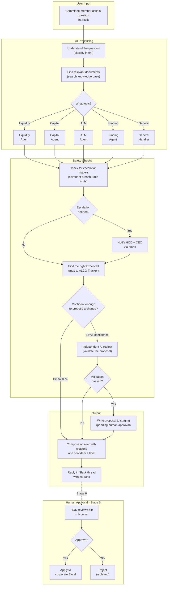

# Stage 5 Design Spec: All Agents + Staging Writer

**Date:** 2026-03-31
**Status:** Approved
**Scope:** Wire real agent logic, checkpointer, audit trail, email stub, validation hardening, SKILL.md content
**Approach:** Bottom-Up (Skills First) with backend + QA agent delegation

---

## 1. Overview

Stage 5 transforms the CAC Orchestrator from smart stubs into a fully functional multi-agent system. The four specialist agents (Liquidity, Capital, ALM, Funding) become prompt-based reasoning chains powered by SKILL.md domain knowledge and RAG context. Multi-turn conversations are enabled via AsyncPostgresSaver. The staging pipeline gains audit trail linking and fail-closed validation.

### Success Criteria
- All 4 specialist agents produce domain-specific analysis using SKILL.md + RAG context
- Multi-turn conversations work across Slack threads (same thread = same conversation)
- Staging proposals link back to the originating interaction via FK
- Escalation triggers fire POST to email-notifier stub
- Validation blocks proposals when LLM response is unparseable (fail-closed)
- 10 SKILL.md files fully populated with domain content (5 shared + 5 CAC per PRD)
- 2 integration tests validate end-to-end flows

---

## 2. SKILL.md Content Architecture

### 2.1 Shared Skills (5 files) -- `skills/shared/`

| File | Purpose |
|------|---------|
| `escalation-protocol.md` | When/how to escalate, notification rules, severity levels, cure periods |
| `citation-format.md` | Standard citation format: `[Source: filename, page X]`, inline vs footnote rules |
| `rag-retrieval.md` | How to interpret retrieved context, relevance thresholds, multi-source synthesis |
| `excel-navigation.md` | General rules for mapping values to ALCO Tracker cells, tab conventions |

> **Note:** PRD Section 11 lists `cfo-agent.md` as item 3 in the build priority. This is the 5th shared skill file. However, the CFO Agent is a Stage 7 component (Paperclip integration). We create the shared skill file now with domain content, but the CFO Agent itself is not wired until Stage 7.

### 2.2 CAC Agent Skills (5 files) -- `skills/cac/`

| File | Agent | Domain Knowledge |
|------|-------|-----------------|
| `liquidity-analysis.md` | LiquidityAgent | Current ratio, quick ratio, LCR, NSFR, cash flow projections, HQLA |
| `capital-allocation.md` | CapitalAgent | CAR, CET1, RWA, ICAAP, capital buffers, stress testing |
| `alm-review.md` | AlmAgent | Interest rate risk, duration gap, NII sensitivity, repricing buckets |
| `funding-facilities.md` | FundingAgent | Facility utilization, covenant ratios, maturity profiles, rollover risk |
| `covenant-monitoring.md` | (cross-agent) | Covenant breach detection, cure periods, notification rules |

**Total: 10 files** (5 shared + 5 CAC) per PRD Section 11.

### 2.3 SKILL.md Format (PRD Section 11)

Each file follows this structure:
```yaml
---
name: <skill-name>
agent: <agent-name>
dept: cac
version: 1.0
---
```

**9 Mandatory Sections:**
1. **Mandate** -- Agent role and responsibility scope
2. **Tone & Style** -- Formal financial language, precision requirements
3. **Domain Knowledge** -- Key metrics, formulas, regulatory references
4. **Retrieval Instructions** -- Which Qdrant collections to prioritize, query strategies
5. **Staging Proposal Rules** -- When to propose changes, confidence thresholds, required evidence
6. **Excel Navigation** -- Tab names, cell ranges, column meanings for ALCO Tracker
7. **Escalation Triggers** -- Specific thresholds that require HOD/CEO notification
8. **Output Format** -- Structured response template with citations
9. **Hard Rules** -- Non-negotiable constraints (e.g., never propose without source)

### 2.4 Skills Loader

New module: `services/cac-orchestrator/src/skills_loader.py`

```python
class SkillsLoader:
    def __init__(self, skills_dir: str):
        self._skills_dir = skills_dir
        self._cache: dict[str, str] = {}

    async def load_skill(self, skill_name: str) -> str:
        """Load and cache a SKILL.md file, stripping frontmatter."""

    async def load_agent_skills(self, agent_name: str) -> str:
        """Load agent-specific skill + all shared skills, concatenated."""

    def clear_cache(self) -> None:
        """Clear the in-memory cache."""
```

- Skills loaded once per agent invocation, cached for the session
- Graceful degradation: missing skill file logs warning, returns empty string
- Frontmatter (YAML between `---` markers) stripped before injection

---

## 3. Agent Logic Design

### 3.1 BaseAgent Changes

The existing `BaseAgent` ABC gains dependency injection:

```python
class BaseAgent(ABC):
    def __init__(self, llm_client: LLMClient, skills_loader: SkillsLoader):
        self._llm = llm_client
        self._skills = skills_loader

    @property
    @abstractmethod
    def name(self) -> str: ...

    @abstractmethod
    def _agent_skill_name(self) -> str:
        """Return the primary SKILL.md filename for this agent."""

    async def analyze(self, state: dict) -> dict:
        """Full implementation using skills + LLM."""

    async def run(self, state: dict) -> dict:
        """Execute with timing and logging (unchanged)."""

    async def _build_system_prompt(self) -> str:
        """Load agent skill + shared skills, compose system prompt."""

    async def _build_user_prompt(self, state: dict) -> str:
        """Compose user prompt from query + RAG context + conversation history."""
```

### 3.2 Agent Execution Flow

Each specialist agent follows the same pattern:

1. **Load skills**: `_build_system_prompt()` loads agent-specific SKILL.md + shared skills
2. **Build prompt**: `_build_user_prompt()` composes from:
   - `state["query"]` -- the user's question
   - `state["context_text"]` -- RAG-retrieved documents
   - `state["messages"]` -- conversation history (from checkpointer)
   - `state["sources"]` -- source metadata for citation building
3. **LLM call**: Single call to Qwen 122B with structured JSON output request
4. **Parse response**: Extract from LLM output:
   - `agent_response`: str -- the analysis text with citations
   - `proposed_value`: str | None -- value to propose for Excel update
   - `proposed_cell`: str | None -- cell reference (e.g., "D8")
   - `confidence_score`: float -- 0.0-1.0 confidence in the proposal
5. **Fallback**: If JSON parsing fails, return analysis text with no proposal (safe default)

### 3.3 LLM Response Schema

Agents request this JSON structure from the LLM:

```json
{
  "analysis": "Detailed response with [Source: filename, page X] citations...",
  "proposed_change": {
    "value": "3.15",
    "cell": "E8",
    "tab": "Funding Facilities",
    "reasoning": "CFO update states ratio at 3.15x [Source: Slack #cac | Jane Doe]"
  },
  "confidence": 0.91,
  "escalation_flags": ["covenant_ratio approaching threshold"]
}
```

If `proposed_change` is null, the agent provides analysis only (no staging proposal).

### 3.4 Graph Changes

In `graph.py`:
- Agent instances constructed with `LLMClient` and `SkillsLoader`
- `build_graph()` accepts `skills_loader` parameter
- Agent `.run()` called via `partial()` (same pattern as existing nodes)

---

## 4. AsyncPostgresSaver Checkpointer

### 4.1 Multi-Turn State Persistence

LangGraph's `AsyncPostgresSaver` stores graph state in Postgres between invocations.

**State key**: `thread_id = f"{user_id}:{thread_ts or channel}"`

- Each Slack thread gets its own conversation state
- Top-level messages (no thread_ts) fall back to `(user_id, channel)`
- Enables follow-up questions: "what about the quick ratio?" after "show me liquidity"

> **BEHAVIORAL CHANGE from Stage 4:** The current `main.py` uses `thread_id = f"{req.user_id}:{req.channel}"` (channel-level). Stage 5 changes to `f"{req.user_id}:{req.thread_ts or req.channel}"` (thread-level). This means existing checkpoints (if any from testing) will not carry over. This is intentional -- thread-level granularity is required for concurrent conversations.

### 4.2 Implementation

```python
# In lifespan():
from langgraph.checkpoint.postgres.aio import AsyncPostgresSaver
checkpointer = AsyncPostgresSaver(conn_string=settings.postgres_dsn)
await checkpointer.setup()  # creates checkpoint tables

# In build_graph():
return graph.compile(checkpointer=checkpointer)

# In /query endpoint:
thread_id = f"{req.user_id}:{req.thread_ts or req.channel}"
config = {"configurable": {"thread_id": thread_id}}
result = await graph.ainvoke(initial_state, config=config)
```

### 4.3 Dependencies

New pip dependencies:
- `langgraph-checkpoint-postgres` -- provides `AsyncPostgresSaver`
- `psycopg[binary]` -- required by `langgraph.checkpoint.postgres.aio` (uses psycopg async driver, NOT asyncpg)

> **Note:** The existing codebase uses `asyncpg` for the connection pool in `main.py`. This is fine -- the checkpointer manages its own connection via psycopg. Two Postgres drivers coexist without conflict.

---

## 5. Audit Trail (interaction_id FK)

### 5.1 Linking Chain

```
agent_interactions.id (PK)
    --> staging_proposals.interaction_id (FK)
        --> approval_decisions.proposal_id (FK)
            --> sync_log.proposal_id (FK)
```

### 5.2 Implementation (Two-Phase Approach)

**BEHAVIORAL CHANGE:** The current `main.py` calls `log_interaction()` AFTER graph execution (lines 149-166) with full results. Stage 5 switches to a two-phase approach:

**Phase 1 (BEFORE graph invocation):**
1. New method: `db_client.create_interaction(user_id, channel, thread_ts, query)`
2. Inserts minimal row with status="processing", returns generated `interaction_id`
3. `interaction_id` injected into `initial_state`

**Phase 2 (AFTER graph invocation):**
1. Existing `db_client.log_interaction()` becomes `db_client.update_interaction(interaction_id, ...)`
2. Updates the row with: response, intent, confidence, sources_count, etc.

**staging_writer change:**
```python
# In staging_writer(), extract interaction_id from state and pass to log_proposal:
interaction_id = state.get("interaction_id")
await db_client.log_proposal(
    ...,
    interaction_id=interaction_id,  # FK link
)
```

**New column:** `staging_proposals.interaction_id INTEGER REFERENCES agent_interactions(id)`

### 5.3 New AgentState Fields

```python
interaction_id: int | None  # Set before graph invocation via create_interaction()
proposed_tab: str | None    # Tab name from agent response (flows to staging_writer)
```

### 5.4 Migration

New migration file: `migrations/002_add_interaction_fk.sql`

```sql
ALTER TABLE staging_proposals
ADD COLUMN interaction_id INTEGER REFERENCES agent_interactions(id);

CREATE INDEX idx_staging_proposals_interaction_id
ON staging_proposals(interaction_id);
```

---

## 6. Email-Notifier Stub Service

### 6.1 Service Specification

| Property | Value |
|----------|-------|
| Location | `services/email-notifier/` |
| Port | 3005 (internal) |
| Framework | FastAPI + Uvicorn |
| Docker | New entry in docker-compose.yml |

### 6.2 Endpoints

All 4 `/notify/*` routes from PRD Section 8.7 are defined as stubs to establish the contract. Only escalation and proposal are wired in Stage 5; reminder and confirmed are wired in Stage 6.

| Method | Path | Stage 5 Behavior |
|--------|------|-----------------|
| GET | `/health` | Return `{"status": "healthy", "service": "email-notifier"}` |
| POST | `/notify/escalation` | Log payload, return `{"status": "queued", "id": "..."}` |
| POST | `/notify/proposal` | Log payload, return `{"status": "queued", "id": "..."}` |
| POST | `/notify/reminder` | Log payload, return `{"status": "queued", "id": "..."}` (stub only) |
| POST | `/notify/confirmed` | Log payload, return `{"status": "queued", "id": "..."}` (stub only) |

### 6.3 Request Schema

```python
class EscalationNotification(BaseModel):
    escalation_detail: str
    agent_name: str
    query: str
    user_id: str
    channel: str
    severity: str = "high"

class ProposalNotification(BaseModel):
    proposal_id: str
    agent_name: str
    file: str
    tab: str
    cell: str
    new_value: str
    confidence: float
```

### 6.4 Docker-Compose Entry

```yaml
email-notifier:
  build: ./services/email-notifier
  expose:
    - "3005"  # Internal only per PRD -- no external port mapping
  environment:
    - LOG_LEVEL=info
  healthcheck:
    test: ["CMD", "curl", "-f", "http://localhost:3005/health"]
    interval: 30s
    timeout: 10s
    retries: 3
  # No depends_on: postgres -- stub phase only logs, no DB connection
  # Add depends_on in Stage 6 when real SMTP/Graph sending + DB logging is added
```

---

## 7. Escalation -> Email Wiring

### 7.1 New Graph Node: `notify_escalation`

Placed between `escalation_check` and `excel_navigator`:

```python
async def notify_escalation(state: dict, *, email_notifier_url: str) -> dict:
    """POST escalation to email-notifier if triggered. Fire-and-forget."""
    if not state.get("escalation_triggered"):
        return {}

    payload = {
        "escalation_detail": state.get("escalation_detail", ""),
        "agent_name": state.get("agent_name", ""),
        "query": state.get("query", ""),
        "user_id": state.get("user_id", ""),
        "channel": state.get("channel", ""),
    }

    try:
        async with httpx.AsyncClient(timeout=5.0) as client:
            await client.post(f"{email_notifier_url}/notify/escalation", json=payload)
    except Exception as exc:
        logger.warning("escalation_notify_failed", error=str(exc))

    return {}  # No state changes
```

### 7.2 Graph Edge Changes

```
escalation_check -> notify_escalation -> excel_navigator
```

(replaces current direct `escalation_check -> excel_navigator` edge)

---

## 8. Validation Hardening (Fail-Closed)

### 8.1 Current Behavior (DANGEROUS)

```python
# validate_proposal.py line 111-117
except (json.JSONDecodeError, KeyError, ValueError) as exc:
    return {
        "validation_passed": True,  # PASSES on parse error!
        "validation_warnings": [...],
    }
```

### 8.2 Stage 5 Behavior (SAFE)

```python
except (json.JSONDecodeError, KeyError, ValueError) as exc:
    logger.error("validation_parse_error_blocking", error=str(exc))
    return {
        "validation_passed": False,  # BLOCKS on parse error
        "validation_warnings": [f"BLOCKED: Validation unparseable: {exc}"],
        "confidence_score": confidence_score * 0.5,  # Penalize
    }
```

**Rationale:** A hallucinated or malformed LLM validation response could let a bad proposal through to staging. Fail-closed ensures human review catches anything the AI can't validate.

---

## 9. Integration Tests

### 9.1 test_staging_flow.py

End-to-end: query -> classify -> retrieve -> agent -> validate -> staging

1. Mock vLLM to return structured JSON responses
2. Use real Postgres (test database) + real filesystem (tmp staging dir)
3. POST to `/query` with liquidity context
4. Assert: intent = "liquidity", agent_name = "liquidity-agent"
5. Assert: staging proposal created in filesystem
6. Assert: `staging_proposals` row has FK to `agent_interactions`
7. Assert: manifest.json matches expected schema

### 9.2 test_escalation_flow.py

End-to-end: query -> classify -> retrieve -> agent -> escalation -> notify

1. Mock vLLM to return response that triggers escalation rule
2. Mock email-notifier endpoint (httpx mock or local server)
3. POST to `/query`
4. Assert: `escalation_triggered = True`
5. Assert: POST sent to email-notifier `/notify/escalation`
6. Assert: pipeline completes (escalation doesn't block answer)
7. Assert: answer still returned in Slack response

---

## 10. Dataflow Diagram (Non-Technical)



### How to Read This Diagram

**Start at the top:** A committee member asks a question in Slack (e.g., "What's our current LCR?")

**AI Processing (blue zone):**
- The system first figures out what topic the question is about
- It searches the knowledge base for relevant documents
- It routes to the right specialist agent (Liquidity, Capital, ALM, or Funding)

**Safety Checks (yellow zone):**
- Every response is checked for escalation triggers (e.g., covenant breach)
- If escalation needed, HOD and CEO are notified by email immediately
- If the agent wants to propose an Excel change, it must be 85%+ confident
- An independent AI review double-checks the proposal

**Output (green zone):**
- Approved proposals go to a staging area (NOT directly to the spreadsheet)
- The answer with citations is posted back to the Slack thread

**Human Approval (Stage 6):**
- A human (HOD) reviews the proposed change in a browser
- Only after human approval does the change get applied to the corporate Excel

---

## 11. Delivery Order

| Phase | Tasks | Agent |
|-------|-------|-------|
| 1 | Write all 10 SKILL.md files | QA (domain content review) |
| 2 | Build SkillsLoader + refactor BaseAgent | Backend |
| 3 | Implement 4 specialist agents (real logic) | Backend |
| 4 | Wire AsyncPostgresSaver checkpointer | Backend |
| 5 | Add interaction_id audit trail (migration + code) | Backend |
| 6 | Build email-notifier stub service | Backend |
| 7 | Wire escalation -> email notification node | Backend |
| 8 | Harden validate_proposal (fail-closed) | Backend |
| 9 | Write integration tests | QA |
| 10 | Run full test suite + lint + type check | QA |

---

## 12. New Dependencies

| Package | Purpose |
|---------|---------|
| `langgraph-checkpoint-postgres` | AsyncPostgresSaver for multi-turn state |
| `psycopg[binary]` | Async Postgres driver required by checkpointer |
| `httpx` | Already in use -- for email-notifier calls |

---

## 13. Files Changed/Created

### New Files
- `services/cac-orchestrator/src/skills_loader.py`
- `services/cac-orchestrator/src/nodes/notify_escalation.py`
- `services/email-notifier/Dockerfile`
- `services/email-notifier/requirements.txt`
- `services/email-notifier/src/__init__.py`
- `services/email-notifier/src/main.py`
- `services/email-notifier/src/models.py`
- `migrations/002_add_interaction_fk.sql`
- `tests/integration/test_staging_flow.py`
- `tests/integration/test_escalation_flow.py`
- `skills/shared/rag-retrieval.md`
- `skills/shared/excel-navigation.md`
- `skills/cac/covenant-monitoring.md`

### Modified Files
- `services/cac-orchestrator/src/agents/base.py` (add DI, implement analyze)
- `services/cac-orchestrator/src/agents/liquidity.py` (replace stub)
- `services/cac-orchestrator/src/agents/capital.py` (replace stub)
- `services/cac-orchestrator/src/agents/alm.py` (replace stub)
- `services/cac-orchestrator/src/agents/funding.py` (replace stub)
- `services/cac-orchestrator/src/graph.py` (checkpointer, notify_escalation node, DI)
- `services/cac-orchestrator/src/main.py` (checkpointer setup, interaction_id)
- `services/cac-orchestrator/src/state.py` (add interaction_id field)
- `services/cac-orchestrator/src/nodes/validate_proposal.py` (fail-closed)
- `services/cac-orchestrator/src/nodes/staging_writer.py` (interaction_id FK)
- `services/cac-orchestrator/src/tools/db_client.py` (log_interaction returns id, log_proposal takes interaction_id)
- `services/cac-orchestrator/requirements.txt` (add langgraph-checkpoint-postgres)
- `skills/shared/escalation-protocol.md` (flesh out from placeholder)
- `skills/shared/citation-format.md` (flesh out from placeholder)
- `skills/cac/liquidity-analysis.md` (flesh out from placeholder)
- `skills/cac/capital-allocation.md` (flesh out from placeholder)
- `skills/cac/alm-review.md` (flesh out from placeholder)
- `skills/cac/funding-facilities.md` (flesh out from placeholder)
- `docker-compose.yml` (add email-notifier service)
- `docs/Implementation.md` (check off Stage 5 tasks)
