# Stage 9 Design Spec: Wiki RAG Knowledge Base

**Date:** 2026-04-07
**Stage:** 9 (Post Go-Live — Week 9+)
**Status:** Approved design, pending implementation
**PRD Reference:** PRD.md v2.2, Section 16 (Obsidian Vault Integration), FR-12
**Pattern:** [Karpathy LLM Knowledge Bases](https://gist.github.com/karpathy/442a6bf555914893e9891c11519de94f)
**Plan:** `docs/superpowers/plans/2026-04-07-stage9-wiki-rag.md`

---

## Visual Overview

### How the LLM Wiki Pattern Works (Big Picture)

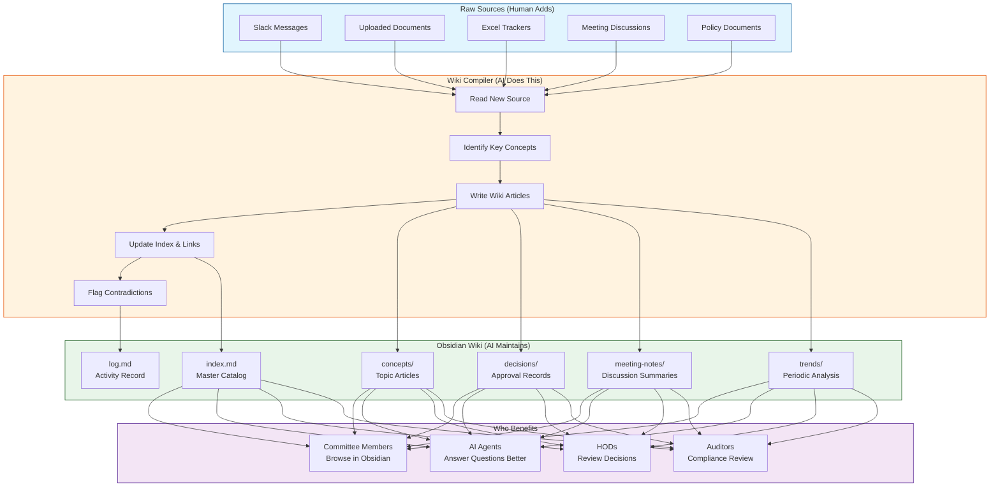

### RAG (Current) vs. Wiki Pattern (Proposed)

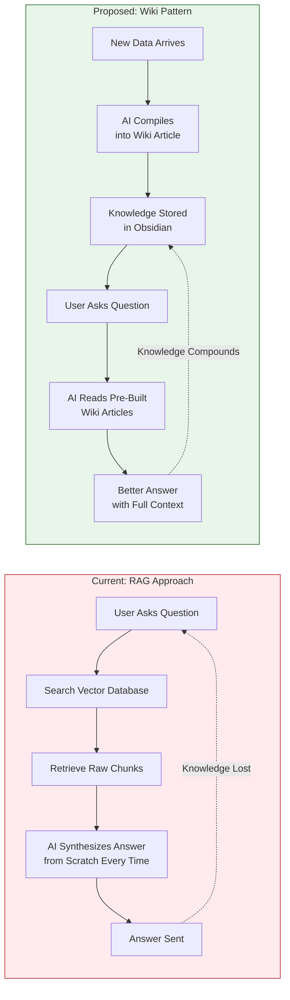

### Three-Layer Architecture

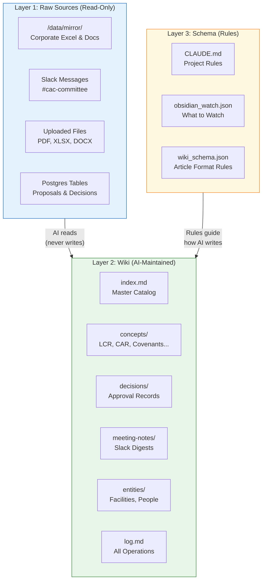

### How Knowledge Compounds Over Time

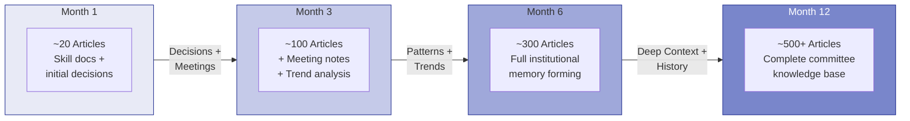

### Integration with Existing Brooker System

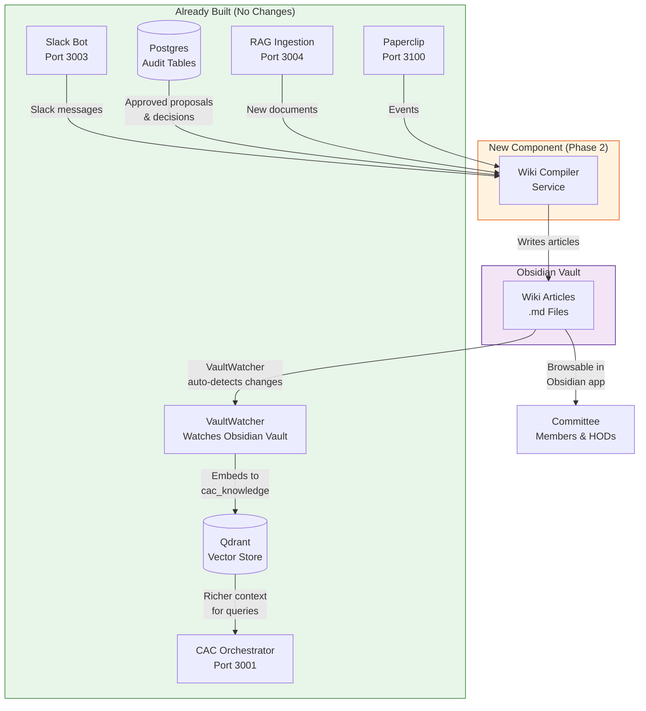

### Event-to-Article Flow

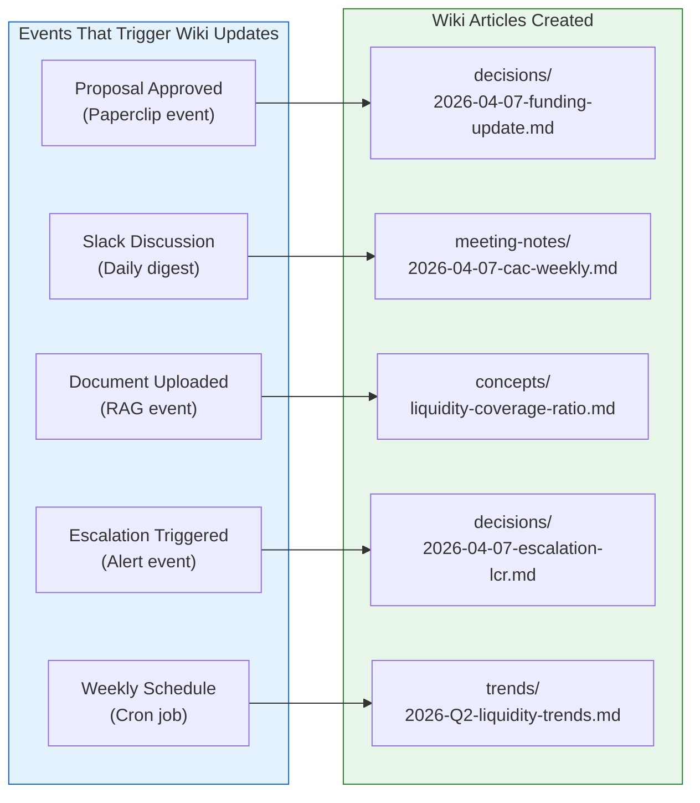

### Phased Implementation Plan

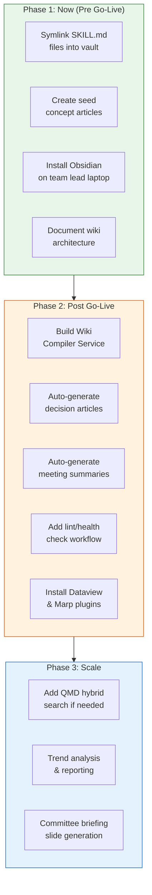

### Department Boundary Architecture

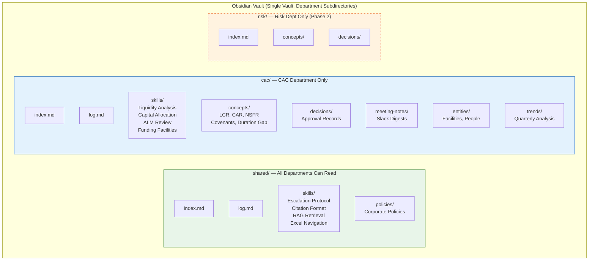

### 4-Layer Department Boundary Enforcement

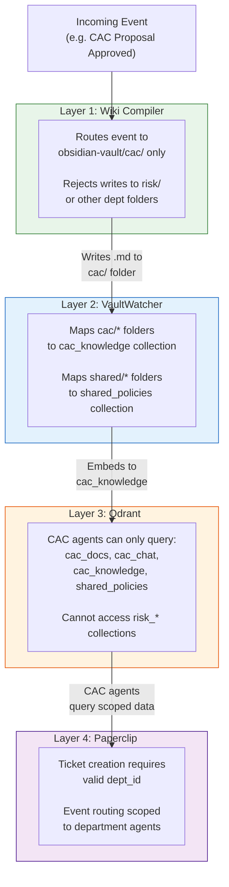

### Data Flow with Department Scoping

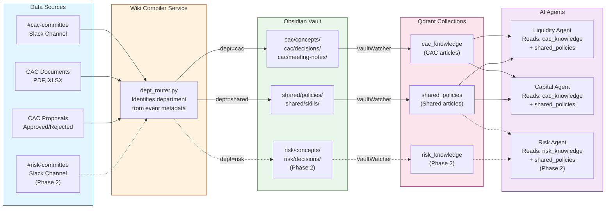

### Wiki Maintenance Agent Workflow

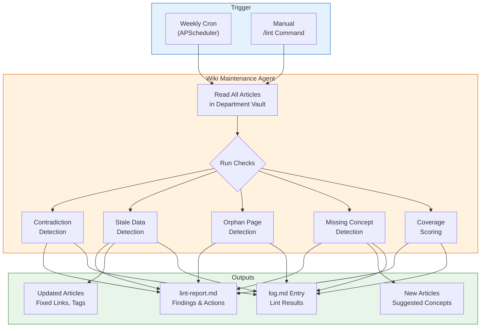

### Adding a New Department (Phase 2+)

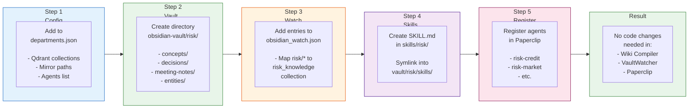

### Confidentiality: Everything Stays On-Premise

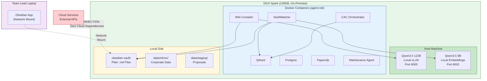

### Design Decision: Shared Vault with Department Subdirectories

**Why one vault with subdirectories (not separate vaults per department)?**
- Obsidian graph view, global search, and `[[backlinks]]` all work **within a single vault**
- Cross-department backlinks work naturally (e.g., CAC decision referencing a shared policy)
- Department isolation is enforced at the service level (Wiki Compiler, VaultWatcher, Qdrant, Paperclip) — not at the filesystem level
- Simpler operations: one vault to mount, backup, and version-control

**Vault Directory Structure:**
```
obsidian-vault/
├── shared/                          ← Cross-department (all agents can read)
│   ├── index.md                     ← Shared knowledge catalog
│   ├── log.md                       ← Shared operations log
│   ├── skills/                      ← Symlink → skills/shared/
│   ├── policies/                    ← Shared corporate policies
│   └── escalation-protocols/        ← Cross-dept escalation articles
│
├── cac/                             ← CAC department only
│   ├── index.md                     ← CAC knowledge catalog
│   ├── log.md                       ← CAC operations log
│   ├── skills/                      ← Symlink → skills/cac/
│   ├── concepts/                    ← LCR, CAR, covenants, ALM...
│   ├── decisions/                   ← Approved proposal records
│   ├── meeting-notes/               ← Slack #cac-committee digests
│   ├── entities/                    ← Facilities, instruments, people
│   └── trends/                      ← Periodic analysis
│
├── risk/                            ← (Phase 2) Risk department
│   ├── index.md
│   ├── concepts/
│   └── ...
│
└── templates/                       ← Shared article templates (ignored by VaultWatcher)
```

**4-Layer Department Boundary Enforcement:**

| Layer | Mechanism | Config File | What It Prevents |
|---|---|---|---|
| Wiki Compiler | `dept_router.py` routes events to `obsidian-vault/{dept_id}/` only | `wiki_schema.json` | CAC event writing to risk/ vault |
| VaultWatcher | Maps `cac/*` folders → `cac_knowledge` collection | `obsidian_watch.json` | CAC articles polluting shared_policies |
| Qdrant | Department-scoped collections | `departments.json` | CAC agent retrieving risk department articles |
| Paperclip | Department boundary checks on tickets and events | `departments.json` | Cross-department data leakage via API |

**Updated obsidian_watch.json (multi-department):**
```json
{
  "vault_path": "${OBSIDIAN_VAULT_PATH}",
  "watch_folders": [
    {"path": "shared/skills/",     "collection": "shared_policies", "doc_type": "skill"},
    {"path": "shared/policies/",   "collection": "shared_policies", "doc_type": "policy_note"},
    {"path": "cac/skills/",        "collection": "cac_knowledge",   "doc_type": "skill"},
    {"path": "cac/concepts/",      "collection": "cac_knowledge",   "doc_type": "concept"},
    {"path": "cac/decisions/",     "collection": "cac_knowledge",   "doc_type": "decision_log"},
    {"path": "cac/meeting-notes/", "collection": "cac_knowledge",   "doc_type": "meeting_note"},
    {"path": "cac/entities/",      "collection": "cac_knowledge",   "doc_type": "entity"},
    {"path": "cac/trends/",        "collection": "cac_knowledge",   "doc_type": "trend"}
  ],
  "ignore_folders": [".obsidian", "templates"],
  "ignore_files": ["index.md", "log.md", "lint-report.md"],
  "debounce_seconds": 5,
  "chunk_size": 512,
  "chunk_overlap": 128
}
```

**Adding a new department (Phase 2+, config-only):**
1. Add department to `departments.json` (Qdrant collections, mirror paths, agents)
2. Create `obsidian-vault/{dept}/` directory structure
3. Add `watch_folders` entries to `obsidian_watch.json` mapping to new collections
4. Create SKILL.md files in `skills/{dept}/` and symlink into vault
5. Register department agents in Paperclip
6. **No code changes needed** — `dept_router.py` reads from `departments.json`

**Wiki Maintenance Agent:**
- Registered in Paperclip as `wiki-maintenance-agent` (department: shared)
- Runs weekly lint passes per department vault
- Detects: contradictions, stale data, orphan pages, missing concepts, broken links
- Outputs: `lint-report.md` per department, updated articles, suggested new articles
- Prunes articles older than configurable threshold (default: 12 months)
- Scores coverage: high (5+ sources) / medium (2-4) / low (0-1)
- APScheduler weekly cron, configurable per department in `wiki_schema.json`

**Confidentiality guarantee:**
Everything runs on-premise on DGX Spark (128GB). No data leaves the network. The wiki is
plain markdown files on local disk. LLM inference is local (Qwen3.5 on vLLM). Qdrant,
Postgres, and all services run in Docker on the same machine. Zero cloud dependencies.
Department data boundaries enforced at 4 layers. Obsidian connects via network mount only.

---

## 1. The Pattern (Karpathy, April 2026)

Source: [Karpathy's llm-wiki gist](https://gist.github.com/karpathy/442a6bf555914893e9891c11519de94f)

### Three-Layer Architecture

**Layer 1: Raw Sources** (`raw/`)
- Immutable source documents: articles, papers, repos, datasets, images
- Organized by type: `raw/articles/`, `raw/papers/`, `raw/repos/`, `raw/data/`, `raw/images/`
- LLM reads but NEVER writes to this layer
- Sources added by human (via Obsidian Web Clipper, manual download, etc.)

**Layer 2: Wiki** (`wiki/`)
- LLM-generated and maintained markdown structure
- Key files:
  - `wiki/index.md` — content catalog with page links, summaries, metadata by category
  - `wiki/log.md` — append-only chronological record of ingests, queries, and maintenance
  - `wiki/overview.md` — high-level synthesis of all material
- Key directories:
  - `wiki/concepts/` — topic pages (e.g., attention mechanisms, scaling laws)
  - `wiki/entities/` — organization/person pages
  - `wiki/sources/` — individual source summaries
  - `wiki/comparisons/` — comparative analyses filed from queries

**Layer 3: Schema** (CLAUDE.md / AGENTS.md)
- Configuration specifying wiki structure, conventions, workflows
- Humans and LLMs co-evolve this over time
- Contains: project structure rules, page conventions, ingest/query/lint workflows

### Page Format Convention

Every wiki page requires YAML frontmatter:
```yaml
---
title: Page Title
type: concept | entity | source-summary | comparison
sources: [list of raw/ files referenced]
related: [list of wiki pages linked]
created: YYYY-MM-DD
updated: YYYY-MM-DD
confidence: high | medium | low
---
```

### Core Operations

**Ingest** (adding new source):
1. Read source file in raw/
2. Discuss key takeaways with user
3. Create/update summary page in wiki/sources/
4. Update wiki/index.md
5. Update all relevant concept and entity pages
6. Flag contradictions where new data conflicts with existing claims
7. Add/update cross-reference links throughout wiki
8. Append entry to wiki/log.md

A single source can touch 10-15 wiki pages as knowledge propagates.

**Query** (answering questions):
1. Read wiki/index.md to find relevant pages
2. Read identified pages in full
3. Synthesize answer with `[[wiki-link]]` citations
4. Optionally file valuable results as new wiki pages (compounding loop)

**Lint** (periodic health checks):
- Contradiction detection between pages
- Stale/superseded claims identification
- Orphan pages with no inbound links
- Missing pages for frequently mentioned concepts
- Cross-reference quality (broken/incomplete links)
- Investigation suggestions for new questions

### Log.md Format

```markdown
## [YYYY-MM-DD] ingest | Source Title
Source: raw/path/to/file.md
Pages created: wiki/sources/summary-name.md
Pages updated: wiki/concepts/topic.md, wiki/entities/org.md
Notes: Key findings, contradictions flagged

## [YYYY-MM-DD] query | Question Asked
Question: What did users ask?
Pages read: list of pages consulted
Output: Filed as wiki/path/new-page.md OR chat response

## [YYYY-MM-DD] lint | Health Check
Contradictions found: N
Orphan pages: N
Missing pages suggested: N
```

### Scale Considerations

| Scale | Sources | Navigation | Notes |
|-------|---------|-----------|-------|
| Small | 10-30 | index.md alone | Sufficient for navigation |
| Medium | 50-200 | qmd search useful | Add hybrid search |
| Large | 500+ | Requires taxonomy + linting | Careful organization needed |

Karpathy's own wiki: ~100 articles, ~400K words on one research topic. LLM writes and maintains everything; human rarely touches directly.

### Key Insight

Shifts work from **query-time retrieval** (RAG) to **ingestion-time compilation**. Knowledge accumulates incrementally; cross-references and synthesis are pre-built rather than re-derived on each question.

---

## 2. QMD — Local Search Engine

Source: [github.com/tobi/qmd](https://github.com/tobi/qmd)

Created by Tobi Lutke. Local search engine for markdown files.

### Architecture
Combines three search techniques, all running locally via node-llama-cpp with GGUF models:
1. **BM25 Full-Text Search** — keyword-based ranking
2. **Vector Semantic Search** — embedding-based meaning matching
3. **LLM Re-ranking** — language model ordering of results

### Search Modes
| Mode | Command | Description |
|------|---------|-------------|
| Keyword | `qmd search` | Fast BM25 only, no model needed |
| Semantic | `qmd vsearch` | Vector similarity, conceptual matching |
| Hybrid | `qmd query` | Both + LLM re-ranking, highest quality |

### Integration Options
- CLI for direct querying
- **MCP server** for AI agent integration (relevant for our project)
- JavaScript/TypeScript SDK
- HTTP transport for long-lived server instances

### Installation
```bash
npm install -g @tobilu/qmd
```

### Relevance to Our Project
- Could replace or supplement Qdrant for wiki-specific search
- MCP server mode means agents could use it as a tool
- Runs entirely local — fits our DGX Spark single-machine architecture
- However, we already have Qdrant with vector search — may be redundant

---

## 3. LLM Wiki Compiler — Existing Implementation

Source: [github.com/ussumant/llm-wiki-compiler](https://github.com/ussumant/llm-wiki-compiler)

A Claude Code plugin implementing the Karpathy pattern.

### Article Structure
Each topic article has standardized sections:
- Summary (2-3 paragraphs)
- Timeline with dated events
- Current state snapshot
- Key decisions with rationale and source links
- Experiments & results status table
- Gotchas and known issues
- Open questions
- Source backlinks to raw files

### Coverage Indicators
Sections tagged `[coverage: high/medium/low]`:
- **High (5+ sources)**: Trust wiki section directly
- **Medium (2-4 sources)**: Good overview, verify details in raw files
- **Low (0-1 sources)**: Consult original sources

### Concept Articles
Auto-detects patterns spanning 3+ topics and generates interpretive articles.

### Commands
| Command | Purpose |
|---------|---------|
| `/wiki-init` | Auto-detect directories, create config |
| `/wiki-compile` | Incremental topic compilation |
| `/wiki-lint` | Health checks (staleness, orphans, gaps) |
| `/wiki-query` | Q&A with optional answer filing |

### Adoption Modes
1. **Staging**: Wiki as reference only
2. **Recommended**: Prioritize wiki before raw files
3. **Primary**: Wiki is authoritative source

### Verified Performance
Testing on 383 markdown files (13.1 MB):
- Context reduction: 84% (47K to 7.7K tokens at startup)
- Compression: 81x files, 503x for meeting transcripts
- Break-even: First session

### Relevance to Our Project
- Validates the pattern works at scale
- The staging/recommended/primary adoption modes map well to our phased approach
- Coverage indicators would work well for committee knowledge (high-confidence vs. preliminary data)

---

## 4. CodeWiki — Codebase Variant

Source: [muhammadraza.me/2026/building-codewiki](https://muhammadraza.me/2026/building-codewiki-compiling-codebases-into-living-wikis/)

Applies the wiki pattern to codebases rather than research.

### Architecture
- Lives at `~/.codewiki/<project>/`
- Master index + architecture overview
- Module articles (one per code module)
- Concept articles (cross-cutting concerns)
- Decisions and learnings directories

### Freshness Tracking
- Tracks which git commit the wiki was compiled against
- Changed files trigger targeted updates (not full rewrites)
- Articles include `source_files` metadata

### Relevance
- The freshness tracking pattern is relevant for our wiki — we could track which Slack messages / proposals have been compiled
- Targeted updates vs. full rewrites is important for efficiency

---

## 5. Enterprise / Corporate Considerations

Source: [modemguides.com/local-llm-knowledge-base-obsidian-setup-guide](https://www.modemguides.com/blogs/ai-infrastructure/local-llm-knowledge-base-obsidian-setup-guide)

### Contamination Mitigation
Community pattern: separate "clean vault" from "messy vault" used by agents. Promotion into core vault is a controlled step — mirrors production data staging.

**Directly maps to our data zones:**
- Zone 1 (mirror) = raw/ layer (immutable corporate data)
- Zone 2 (staging) = wiki compilation staging
- Zone 3 (approval) = human review of wiki articles before promotion
- Zone 4 (archive) = finalized wiki content

### Data Sovereignty
All files remain as plain markdown on disk. No proprietary database, no vendor lock-in. Fits our on-premise DGX Spark architecture perfectly.

### Hardware Requirements
| Level | RAM | Model Size | Wiki Scale |
|-------|-----|-----------|-----------|
| Entry | 16GB | 7-8B | <50 sources |
| Mid | 32GB | 14-32B | Medium wikis |
| Power | 24GB VRAM | 70B+ | 100+ sources |

We have 128GB unified memory on DGX Spark + Qwen3.5 122B — well beyond "Power" tier.

---

## 6. Obsidian Plugin Ecosystem (Relevant)

### Dataview Plugin
- Query frontmatter metadata across all pages
- Create dynamic tables, lists, task views
- Example: "Show all decisions with confidence: low from last 30 days"
- Essential for the health-check / lint workflow

### Obsidian Web Clipper
- Browser extension converting web articles to markdown
- Adds YAML frontmatter automatically
- Downloads images locally
- Relevant for ingesting external documents

### obsidian-qmd Plugin
Source: [github.com/thirteen37/obsidian-qmd](https://github.com/thirteen37/obsidian-qmd)
- Integrates QMD hybrid search directly into Obsidian
- BM25 + vector + LLM re-ranking inside the editor

### Marp Plugin
- Renders markdown as slide presentations
- Useful for generating committee briefing slides from wiki content

---

## 7. Mapping to Brooker Corporate Agent

### What We Already Have (from current project)

| Karpathy Component | Our Equivalent | Status |
|---|---|---|
| Raw/ layer | `/data/mirror/` + Slack messages + uploaded docs | Built (Zone 1) |
| Wiki/ layer | `obsidian-vault/` | Shell only (templates, no content) |
| Schema layer | `CLAUDE.md` + `obsidian_watch.json` | Partial |
| Ingest workflow | VaultWatcher + Qdrant pipeline | Built (watches vault, embeds to cac_knowledge) |
| Query workflow | RAG retrieval in cac-orchestrator | Built (agents query Qdrant) |
| Lint workflow | None | Not built |
| index.md | Exists but static | Needs auto-maintenance |
| log.md | Not present | Needed |
| Search engine | Qdrant vector search | Built (could add qmd for BM25 hybrid) |
| Viewer | Obsidian planned, not installed | Stage 8 blocker |

### What's Missing (the gap)

1. **Wiki Compiler Service** — the component that turns events into wiki articles
2. **Structured frontmatter** on all vault files
3. **log.md** for tracking wiki operations
4. **Auto-maintained index.md**
5. **Concept / entity / decision articles** auto-generated from data
6. **Lint workflow** for health checks
7. **Obsidian plugins** (Dataview, possibly qmd)

### Natural Integration Points

| Event | Wiki Action |
|---|---|
| Staging proposal approved | Auto-generate decision article with rationale, source, cell change |
| Slack thread discussing CAC topic | Daily digest compiled into meeting-note article |
| New document uploaded | Source summary article + concept/entity updates |
| Escalation triggered | Escalation article with context and resolution tracking |
| Agent interaction with high confidence | File response as knowledge article if novel |
| Periodic (weekly) | Lint pass: contradictions, stale data, missing concepts |

### The Compounding Effect

Month 1: Wiki has ~20 articles (skill docs + initial decisions)
Month 3: Wiki has ~100 articles (decisions, meeting notes, trends)
Month 6: Wiki has ~300 articles (full institutional memory)
Month 12: Wiki has ~500+ articles (committee fully documented)

Each article makes every future agent query more informed. The liquidity agent in Month 12 knows 12 months of committee context, not just static SKILL.md content.

---

## 8. Benefit Analysis: Current RAG vs. Wiki + RAG

### Current RAG (What We Have)

**How it works**: User asks question → search Qdrant for relevant chunks → retrieve raw text fragments → LLM synthesizes answer from scratch → answer returned → knowledge forgotten.

**Pros**:
- Already built and working (VaultWatcher, Qdrant, RAG pipeline)
- Simple architecture — fewer moving parts
- No LLM cost at ingestion time (embedding is cheap)
- No risk of LLM hallucination in stored knowledge
- Raw source text preserved exactly as-is

**Cons**:
- Re-derives understanding from scratch on every query (wasteful)
- No cross-document connections — only finds chunks that happen to be retrieved together
- No contradiction detection — conflicting data can both be retrieved and confuse the LLM
- Knowledge doesn't compound — agent is equally uninformed on Day 1 and Day 365
- Qdrant is a black box — nobody browses vector embeddings
- Context window wasted re-reading raw chunks instead of pre-built summaries
- No institutional memory — decisions and rationale live only in Postgres logs

### Proposed Wiki + RAG (What We'd Add)

**How it works**: New data arrives → LLM compiles it into structured wiki articles with backlinks → VaultWatcher auto-embeds to Qdrant → User asks question → LLM reads pre-built articles → better answer with full context → valuable answers filed back into wiki.

**Pros**:
- Knowledge compounds over time (20 articles Month 1 → 500+ Month 12)
- Pre-built cross-references between concepts, decisions, and meetings
- Contradictions flagged at ingestion time, not missed at query time
- Human-browsable in Obsidian (HODs, committee members, auditors can all read it)
- Context window efficiency — compact articles vs. raw chunks (verified 84% reduction)
- Self-documenting audit trail in plain English
- Lint/health checks catch stale or inconsistent knowledge proactively
- Agents get smarter automatically as committee history accumulates

**Cons**:
- New service to build and maintain (Wiki Compiler)
- LLM cost at ingestion time (each event → LLM call to compile article)
- Risk of LLM hallucination in wiki articles (mitigated by source citations + confidence levels)
- Vault mount needs write access (currently :ro — needs architectural change)
- Circular dependency risk: wiki feeds Qdrant feeds agents feeds wiki (need loop-breaking rules)
- Not a replacement for RAG — it's an enhancement layer on top

### Comparison Table

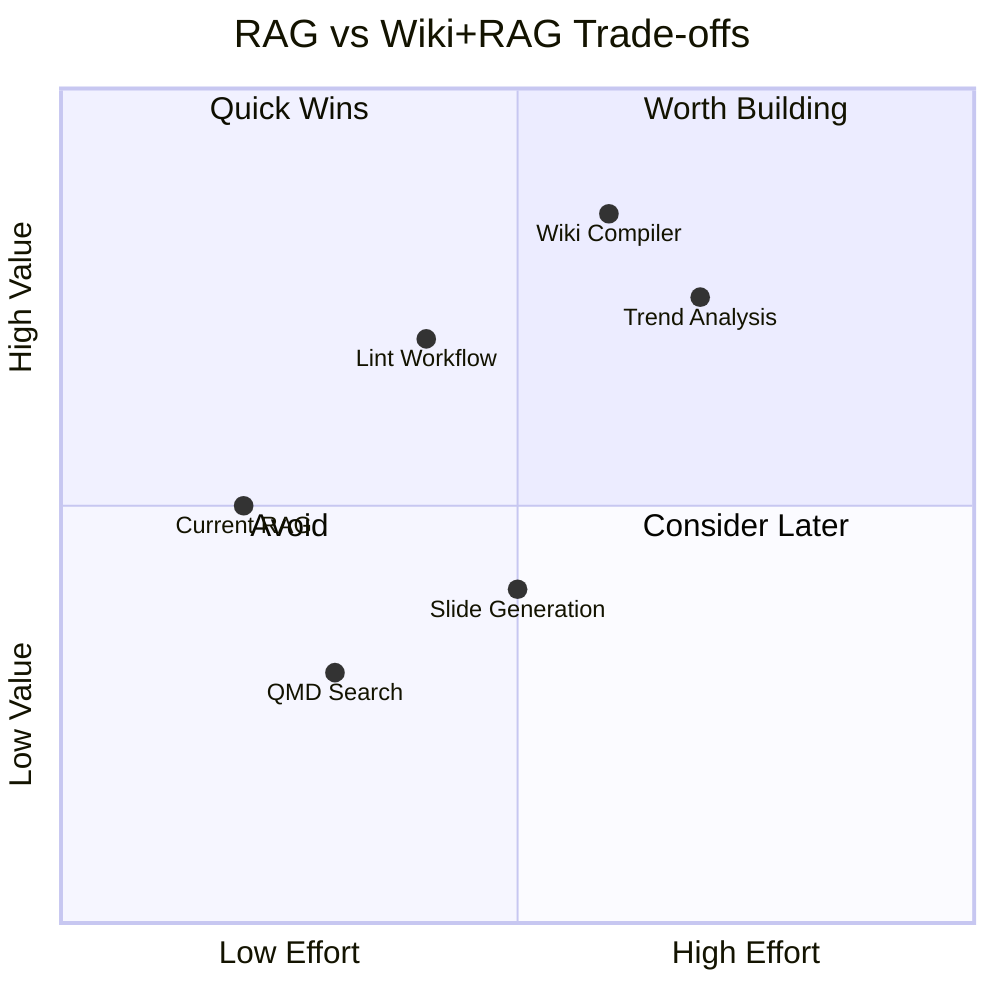

| Dimension | RAG Only | Wiki + RAG |
|---|---|---|
| Setup cost | Already done | New service needed |
| Day 1 quality | Good | Same (wiki is empty) |
| Day 365 quality | Same as Day 1 | Much better (compounded) |
| Human visibility | None (black box) | Full (Obsidian browsable) |
| Cross-document links | Ad-hoc | Pre-built |
| Contradiction handling | Missed | Detected and flagged |
| Audit/compliance | Postgres logs | Readable wiki + logs |
| Context efficiency | Raw chunks (~47K tokens) | Compiled articles (~7.7K) |
| Operational complexity | Low | Medium |
| Agent improvement | Static | Continuous |

### Key Insight

The wiki doesn't replace RAG — it makes RAG better by feeding higher-quality, pre-synthesized content into the same Qdrant pipeline. The VaultWatcher and cac_knowledge collection remain unchanged. The wiki compiler is a new data source that produces better input.

---

## 9. Summary of Sources

- [Karpathy's llm-wiki gist](https://gist.github.com/karpathy/442a6bf555914893e9891c11519de94f) — original pattern definition
- [VentureBeat: Karpathy LLM Knowledge Base](https://venturebeat.com/data/karpathy-shares-llm-knowledge-base-architecture-that-bypasses-rag-with-an) — analysis and context
- [AntiGravity: Karpathy's LLM Wiki Guide](https://antigravity.codes/blog/karpathy-llm-wiki-idea-file) — complete implementation details
- [AntiGravity: LLM Knowledge Bases](https://antigravity.codes/blog/karpathy-llm-knowledge-bases) — workflow analysis
- [GitHub: tobi/qmd](https://github.com/tobi/qmd) — local hybrid search engine
- [GitHub: ussumant/llm-wiki-compiler](https://github.com/ussumant/llm-wiki-compiler) — Claude Code plugin implementation
- [CodeWiki: Compiling Codebases](https://muhammadraza.me/2026/building-codewiki-compiling-codebases-into-living-wikis/) — codebase variant
- [ModemGuides: Local LLM KB with Obsidian](https://www.modemguides.com/blogs/ai-infrastructure/local-llm-knowledge-base-obsidian-setup-guide) — setup guide
- [MindStudio: Karpathy LLM Wiki Guide](https://www.mindstudio.ai/blog/andrej-karpathy-llm-wiki-knowledge-base-claude-code) — Claude Code implementation
- [DAIR.AI: LLM Knowledge Bases](https://academy.dair.ai/blog/llm-knowledge-bases-karpathy) — academic analysis
- [GitHub: obsidian-qmd](https://github.com/thirteen37/obsidian-qmd) — Obsidian QMD plugin
- [a2a-mcp.org: Obsidian Wiki Guide](https://a2a-mcp.org/blog/andrej-karpathy-llm-knowledge-bases-obsidian-wiki) — implementation guide
