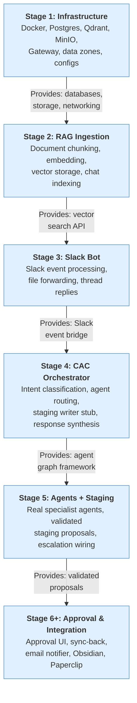
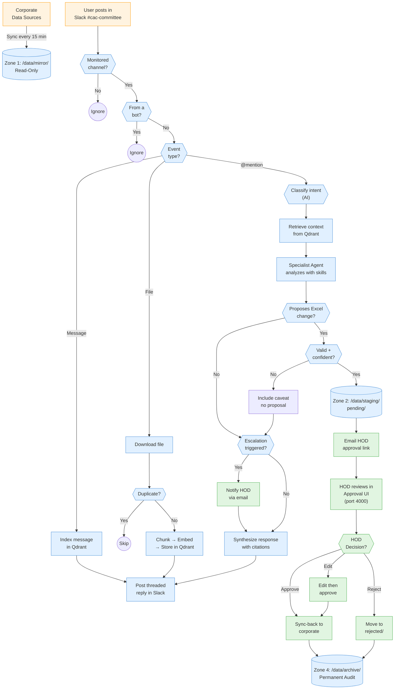

# System Flow Summary — Corporate AI Agent

> **Audience:** Department Heads (HODs) — non-technical overview of system logic, data flow, and decision points.
> **Last updated:** 2026-04-01

---

## Stage Build Progression

Each stage builds on the previous one. This shows what each stage produces and what the next stage needs from it.

---

## Master End-to-End System Flow

This shows how data moves through the entire system — from corporate data sources to final approved changes.

> **Legend:** 🔵 Blue = Automated processing · 🟢 Green = Human actions / approval gates · 🟠 Orange = External systems

---

## Decision Table

Every point where the system makes a choice or requires human input:

| # | Decision Point | Who Decides | Inputs | Possible Outcomes |
|---|---------------|-------------|--------|-------------------|
| 1 | **Channel monitoring** | Slack Bot (rule-based) | Channel ID vs. `dept_channels.json` | Monitored → process / Unmonitored → ignore |
| 2 | **Bot message filtering** | Slack Bot (rule-based) | Event sender | Human → process / Bot → ignore (prevent loops) |
| 3 | **Event type routing** | Slack Bot (rule-based) | Slack event type | Message / File / @mention |
| 4 | **File type validation** | Slack Bot (rule-based) | File extension | Supported → ingest / Unsupported → skip |
| 5 | **Duplicate check** | RAG Ingestion (hash-based) | Document content hash | New → ingest / Duplicate → skip |
| 6 | **Intent classification** | AI (Qwen 122B LLM) | User question text | Funding / Liquidity / Capital / ALM / General |
| 7 | **Agent routing** | Orchestrator (rule-based) | Classified intent | Route to matched specialist agent |
| 8 | **Staging proposal** | AI (specialist agent) | Query + context + skill knowledge | Propose Excel change / Response only |
| 9 | **Confidence threshold** | AI (specialist agent) | Evidence quality score | High → propose / Low → caveat in response |
| 10 | **Proposal validation** | Rule engine (fail-closed) | Proposal schema + cell reference | Valid → stage / Invalid → block |
| 11 | **Escalation check** | Rule engine | Breach rules from `escalation_rules.json` | Escalate to HOD / Continue normally |
| 12 | **Change approval** | **Human (HOD)** | Diff view in Approval UI | **Approve** / **Edit** / **Reject** |
